# **一、基础知识**

1.js的组成：ECMAScript（JS的基础）,Web APIs(分为Dom页面文档对象模型和Bom浏览器对象模型)

# **二、vscode必备内容**

1.标签有双标签和单标签:双标签＜html＞＜/html＞两者是成对存在的，分为开始标签和结束标签。单标签:＜br /＞

2.使用vscode中，基本结构不用在一个一个的输入，可以！，然后Tab，快速自动生成基本结构

3.vscode预览页面，右键选择Open In Default Browser，需要安装插件open in browser

Live Server实时预览插件，在修改标签后看网页界面时，不需要手动刷新就可以实现自动刷新

Live Server必须在vscode打开的文件夹中的文件程序中才能使用

4.缩放视图ctrl+可实现代码增加

ctrl-可实现代码减小

5.vscode新建文件快捷键为ctrl+N

保存快捷键为ctrl+S,将文本保存为.html的文件

6.vscode中Auto Rename Tag双击前标签，改动之后，稍后标签都会改

7.vscode-icons可以实现不懂后缀的图表的显示，方便快速查看为什么需要

8.Easy LESS插件可以编译less文件，我们写的less不能直接引入到html文件中，通过这个插件可以自动帮助我们生成css文件

9.会了吧插件，可以展示代码中的英语单词的意思

10.vscode常用快捷键

①快速复制:shift+alt+下箭头(上箭头）或者ctrl+C然后ctrl+V

②选定多个相同的单词:ctrl+D

③添加多个光标:ctrl+Alt+上箭头(下箭头）

④全局替换某些单词:ctrl+h

⑤快速定位到某一行:ctrl+g

⑥选择某一区块:按住Shift+alt然后拖动鼠标

# **三、HTML基本语法知识**

对于有头有尾的是容器标签；没有结束标签的就是自闭合标签

### 1.标题标签

<h1>我是一级标签</h1> h为head的缩写，是头部、标题，作为标题使用，以此类推

<h1>我是一级标签</h1>

在</h>后写的内容是不会在这一行就行展现的，他会在下一行来进行展现

### 2.段落标签

....

### 3.换行标签

 

具有强制换行的作用

单标签

### 4.文本格式化标签

提供粗体、斜体和下划线等效果

加粗:<strong>...</strong>或<b>.....</b> 前者相对后者在语义上更加的强烈

斜体：<em>...</em>或<i>...</i> 前者相对后者在语义上更加的强烈

删除线：<del>...</del>或<s>...</s> 前者相对后者在语义上更加的强烈

下划线：<ins>...</ins>或<u>...</u> 前者相对后者在语义上更加的强烈

### 5.
和标签

和是没有语义的，他们就是一个盒子，用来装内容的，是用来布局网页的

这是头部

今日价格

两者特点：①
标签用来布局，但是现在一行只能放一个
。可以理解为一个大盒子,一个人独占一行，在
后再写内容，界面中是不会在这行显示内容的，在下一行显示内容

②标签用来布局，一行可以多个。小盒子

### 6.图像标签

（1）标签

`` 单标签

src是``标签的必须属性，他用于指定图像文件的路径和文件名，所属属性：简单理解为就是属于这个图像标签的特性

alt:文本，替换文本。图像不能显示的文字 ``

title:文本，提示文本。鼠标放在图像上，显示的文字 ``

width:像素，设置图像的宽度

height:像素，设置图像的高度

border：像素，设置图像的边框粗细

（2）图像标签属性的注意点：

①图像标签可以拥有多个属性，必须写在标签名的后面

②属性前后不分前后顺序，标签名与属性、属性与属性之间均以空格分开

③属性采取键值对的格式，即key=“value”的格式，属性=“属性值”

### 7.路径注意要点：

（1）目录文件夹：就是普通的文件夹，里边存放着我们做页面所需的相关材料，比如图片、CSS、JS、HTML等

（2）根目录：就是打开文件夹的第一层根目录

（3）相对路径：以引用文件所在位置为参考基础，而建立出的目录路径，简单来说就是图片相对于Html页面的位置

①同一级路径：图像文件位于HTML文件同一级，如``

②下一级路径：/ 图像位于HTML文件下一级，如``

③上一级路径： ../ 图像位于HTML文件上一级，如``

（4）绝对路径：指目录下的绝对地址，直接到达目标位置，通常是从盘符开始的路径。例如："D:\\web\\img\\logo.gif"或者完整的网络地址"http://www.itcast.cn/images/logo.gif"

### 8.超链接标签

<a>标签用于定义超链接，作用是从一个页面链接到另一个页面

①语法格式：<a herf="跳转目标"target="目标窗口的弹出方式">文本或图像</a>

②属性：href：用于指定链接目标的url地址，（必须属性）当标签应用herf属性时，它就具有了超链接的功能

target：用于指定链接页面的打开方式，其中\_self为默认值，\_blank为在新窗口的打开方式

③链接分类：外部链接:<a herf="http://www.baidu.com">百度</a>

内部链接：网站内部页面之间的相互链接，直接链接内部页面名称即可，例如

空链接：如果当时没有确定链接目标时，<href="#">首页</a>

下载链接：如果href里面地址是一个文件或者压缩包，会下载这个文件

网页元素链接：在网页中的各种网页元素，如文本、图像、表格、音频、视频等都可添加超链接

### 9.锚点链接

点我们点击链接，可以快速定位到页面中的某个位置

①在链接文本的href属性中，设置属性值为#名字的形式，如<a href="#two">第二级</a>

②找到目标位置标签，里边添加一个id属性，如<h3 id="two">第二集</h3>

### 10.注释标签

<!--"开头"--> 快捷键为ctrl+/

### 11.特殊字符

可以实现添加多个空格

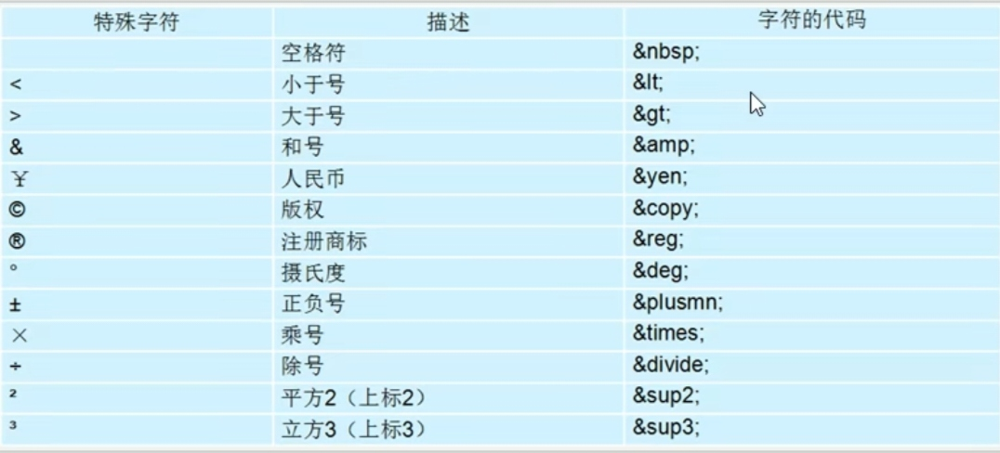

### 12.表格标签

①表格的作用：表格主要是用于显示、展示数据，因为它可以使数据显示的非常的规整，可读性非常好。

特别是后台展示数据的时候，能够熟练运用表格就显得很重要。一个清爽简约的表格能够把繁杂的数据处理的很有条理。

②表格基本语法：

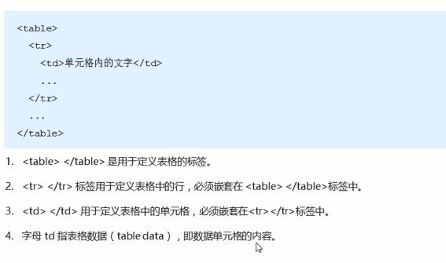

③表头单元格标签：一般表头单元格位于第一行或者第一列，表头单元格里面的文本内容加粗居中显示

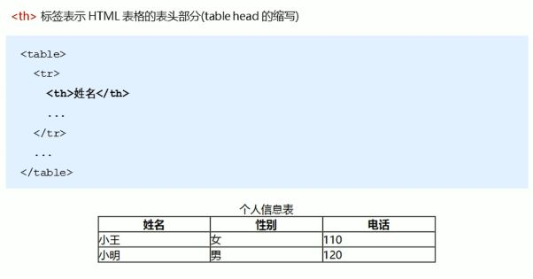

④表格属性：表格属性实际在开发中不常用，基本都是用css来实现的

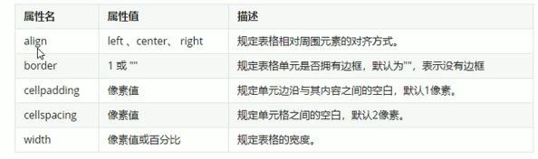

⑤表格结构标签：解决表格过长问题，将表格分割成表格头部和表格主体

<thead>标签表格的头部区域，用于定义表格的头部，<thead>内部必须拥有<tr>标签，一般位于第一行，<thead>比<th>范围广

<tbody>标签表格的主体区域，用于定义表格的主体，用于放数据文本

### 13.合并单元格

（1）合并单元格方式：

①跨行合并：rowspan="合并单元格的个数"

②跨列合并：colspan="合并单元格的个数"

（2）目标单元格：

①跨行：最上侧单元格为目标单元格，写合并单元格

②跨列：最左侧单元格为目标单元格，写合并单元格

### 14.列表标签

（1）分类：无序列表、有序列表、自定义列表

①无序列表：

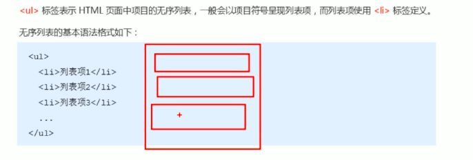

无序列表的各个列表项之间顺序级别之分，是并列的

<ul></ul>中只能嵌套<li></li>，直接在<ul></ul>中输入其他标签或文字是不对的

<li></li>之间相当于一个容器，可以容纳所有元素

无序列表会带有自己的样式属性，但实际还是用css来设置

在css中去除前边的小圆点采用如下代码:

暂时无法在飞书文档外展示此内容

②有序列表：

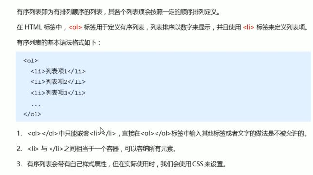

③自定义列表：

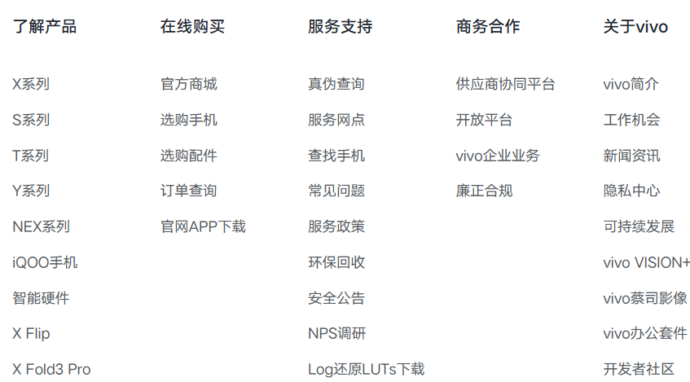

  

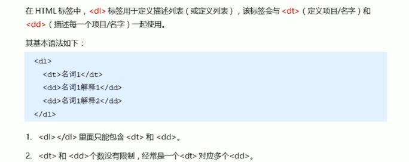

### 15.表单标签

一个完整表单通常由表单域、表单控件（也称表单元素）和提示信息3个部分组成

（1）表单域：包含单元素的区域，<form>标签可以实现信息的收集和传递。

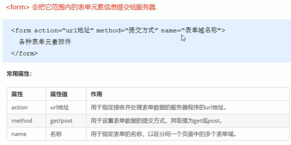

autocomplete属性是历史记录，记录表单输入信息，有两个值，一个off，一个on，为true时过几天点击表单，获得焦点时会显示前几天输入的信息

  

表单元素提交必须有name属性

注意点：①写表单元素前，应该有表单域把他们进行包含；②表单域是form标签

(2)表单控件：可以定义各种表单元素，这些表单元素就是允许用户在表单中输入或选择的内容控件

①<input>输入表单元素

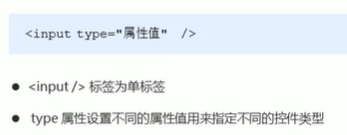

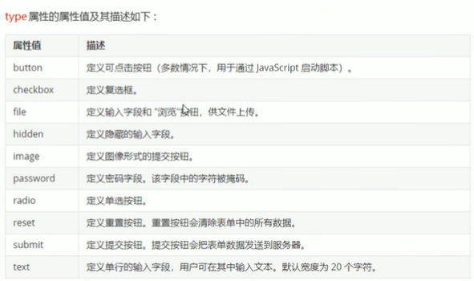

单选按钮：<input type="radio" name="danxuan">

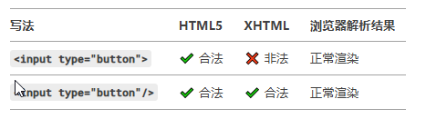

写法差异源于不同版本的 HTML 或 XHTML 规范

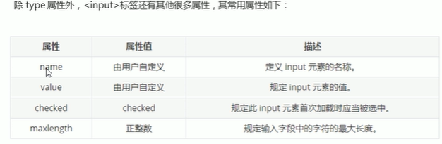

**注意点** ：name和value是每个表单元素都有的属性值，主要给后台人员使用；name表单元素的名字，要求单选按钮和复选按钮有相同的name值；checked属性主要针对于单选按钮和复选框，主要作用一打开页面，就要可以默认选中某个表单元素；maxlength是用户可以在表单输入的最大字符数

②select下拉表单元素：可以节约页面控件

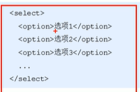

**注意点：** <select>中至少包含一对<option>；在<option>中定义selected="selected"时，当前项即为默认中选项

③<textarea>:适用于输入内容较多的场景

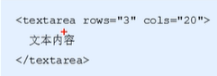

3行20列

### 16.<lable>标签

它不是表单标签，但常常与表单标签搭配使用，<lable>标签用于绑定一个表单标签，当点击<lable>标签内的文本

时，浏览器就会自动将焦点（光标）转到或者选择对应的表单元素上，以增加用户体验

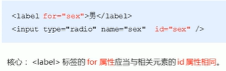

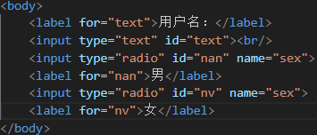

### 17.实例

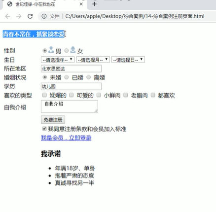

# 四、css基础知识

css是层叠样式表的简称，有时也称css样式表或级联样式表

css也是标记语言

css主要用于设置HTML页面中的文本内容（字体 大小 对齐方式等）、图片的外形（宽高、边框样式、边距等）以及版面的布局和外观显示样式

### 1.css语法规范

由两部分组成，选择器及一条或多条声明

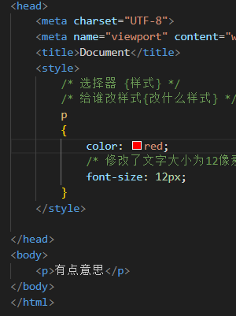

**注意点：**

①选择器是用于指定css样式的HTML标签，花括号是对该对象设置的具体样式

②属性与属性值以“键值对”的形式出现

③属性是对指定的对象设置的样式属性，例如字体大小、文本颜色等

④属性和属性值之间用英文“;”分开

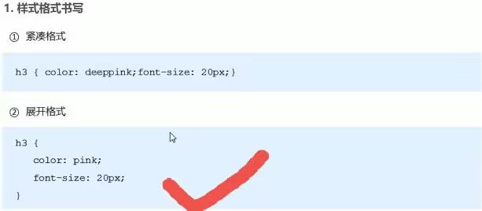

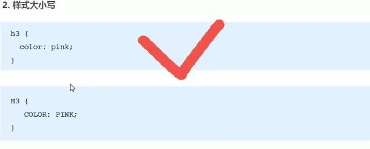

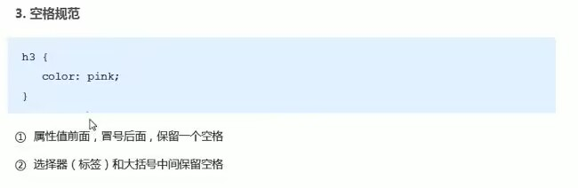

### 2.css选择器

可以分为基础选择器和复合选择器：①基础选择器由单个选择器组成；②基础选择器包括：标签选择器、类选择器、id选择器和通配符选择器

###### 2.1.标签选择器

①优点：能快速为页面中同类型的标签统一设置样式

②缺点：不能设计差异化样式，只能选择全部的当前标签

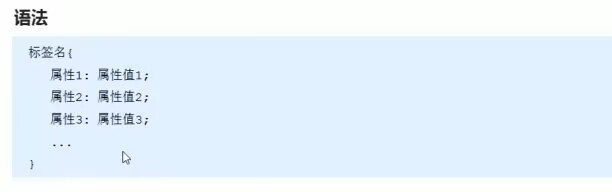

###### 2.2.类选择器

①类选择器口诀：样式点定义 结构类（class）调用 一个或多个 开发最常用

②样例

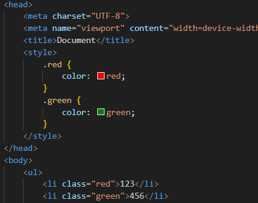

③ **注意点** ：类选择器用"."进行标识，后面紧跟类名（自己命名的）；

可以理解为给这个标签起了个名字，来表示；

长名称或词组可以使用横线来为选择器命名；

不要使用纯数字、中文等命名，尽量使用英文字母来表示；

命名要有意义；

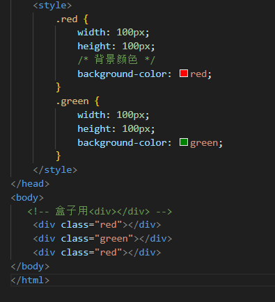

类选择器也可以指定特殊的元素p.center{}

p.center和.center都对

暂时无法在飞书文档外展示此内容

###### 2.3.多类名使用

①使用方式：在标签class属性中写多个类名；多个类名中间必须用空格分开；这个标签就可以分别具有这些类名的样式

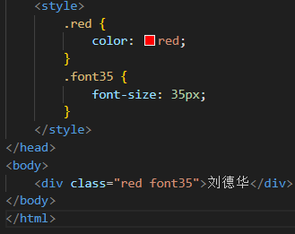

②多类名开发使用场景：可以把一些标签元素相同的样式（共同的部分）放到一个类里面；这些标签都可以调用这个公共的类，然后再调用自己独有的类；可以节省CSS代码，统一修改也非常方便；开发中要多使用

###### 2.4.id选择器

id选择器可以为标有特定id的HTML元素指定特定的样式

HTML元素以id属性来设置id选择器，css中id选择器以"#"来定义

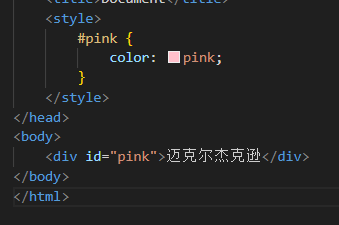

①口诀：样式#定义，结构id调用，只能给一个标签调用，别人切勿使用

②区别：类选择器可以调用多次；id选择器不能重复调用；类选择器在修改样式中用的最多，id选择器一般用于页面唯一性的元素上，经常和js搭配使用

###### 2.5.通配符选择器

定义用"\*"，他表示选取页面中所有元素（标签）

\* {

color="red"}

###### 2.6.总结

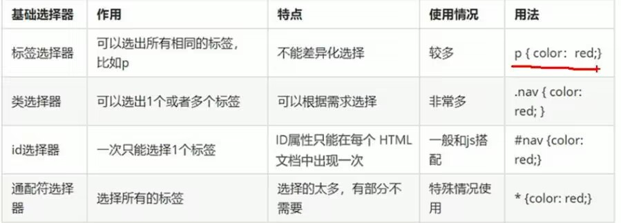

### 3.css字体属性

Fonts字体用于定义字体系列、大小、粗细、和文字样式（如斜体）

###### 3.1.字体系列

font-family: '宋体';

**注意点：** 各种字体之间必须使用英文状态下的逗号隔开；一般情况，如果有空格隔开的多个单词组成的字体，加引号；尽量使用系统默认自带的字体，保证任何用户浏览器中都能正确使用

###### 3.2.字体大小

font-size: 20px

**注意点** ：

①px（像素）大小是网页的最常用单位

②谷歌浏览器默认为16px

③不同浏览器默认显示的字号大小不一致，尽量给定明确值，不要默认

④可以给body指定整个页面的大小：会自动引用

暂时无法在飞书文档外展示此内容

⑤标题标签比较特殊，需要单独指定大小

###### 3.3.字体粗细

font-weight: bold;

font-weight: 100；

**注意点：** ①粗体文字变细：尽量别用normal，多用数字

font-weight= 400;

②属性值100-700，400等同于normal，而700等同于bold，后面不需要跟单位

###### 3.4.文字样式

font-style: normal；

**属性值** ：

①normal：默认值，浏览器会显示标准的字体样式 font-style：normal；

②italic：浏览器会显示斜体的字体样式

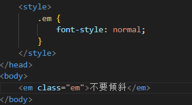

###### 3.5.字体符合属性

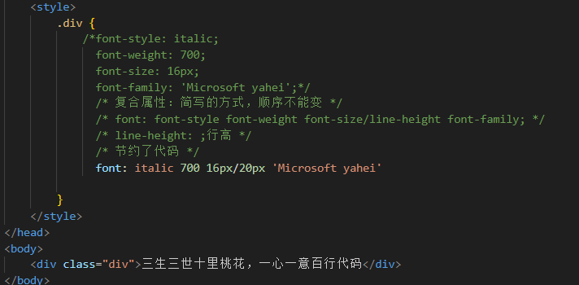

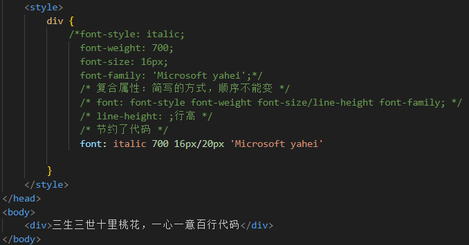

以上都对√，第一个用的是类选择器，第二个用的是标签选择器

**注意点** ：

①样式font-style 粗细font-weight 大小/行高font-size/line-height 字体font-family

②使用font属性时，必须按照语法格式书写，不能更换顺序，并且各个属性以空格隔开

③不需要设置大的属性可以省略（取默认值），但必须保留font-size和font-family属性，否则font属性将不起作用

### 4.css test文本属性

###### 4.1.文本颜色

定义文本的外观，比如文本的颜色、对齐文本、装饰文本、文本缩进、行间距等

暂时无法在飞书文档外展示此内容

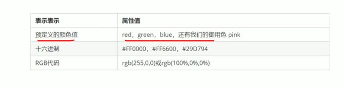

###### 4.2.对齐文本

text-align属于用于设置元素内文本内容的 **水平对齐** 方式

属性值：left：左对齐（默认值）；right：右对齐；center：居中对齐

###### 4.3.装饰文本

text-decoration属性规定添加到文本的修饰，可以给文本添加下划线、删除线、上划线等

暂时无法在飞书文档外展示此内容

###### 4.4.文本缩进

实现文本的第一行首行缩进自己指定的距离

20px往右边走；-20px往左边走

em是一个相对单位，就是当前元素（font-size）1个文字的大小，如果当前元素没有设置大小，则会按照父元素的1个文字大小，如果此时写了2em则是当前元素2个文字大小的距离

暂时无法在飞书文档外展示此内容

###### 4.5.行间距

行间距可以理解为由上间距、下间距和文字高度组成，实际代码改变的是上下间距的大小实现行间距改变的

暂时无法在飞书文档外展示此内容

### 5.css引入方式

###### 5.1.内部样式表（嵌入式）

暂时无法在飞书文档外展示此内容

**注意点** ：

①<style>理论上可以放在HTML文档的任意位置，但一般会放在<head>标签中

②通过这种方式可以方便控制整个页面的元素样式设置

③代码结构清晰，但是并没有实现结构与样式的完全分离

###### 5.2.行内样式表（行内式）

暂时无法在飞书文档外展示此内容

**注意点** ：

①style其实就是标签的属性

②在双引号中间，写法要符合css规范

③可以控制当前的标签设置样式

④书写繁琐，简单时才用

⑤使用行内样式表设定css，通常也被称为行内式引入

###### 5.3.外部样式表（链接式）

使用最多，单独建一个css文件，然后html引用

①css文件部分： style.css

暂时无法在飞书文档外展示此内容

②html部分

暂时无法在飞书文档外展示此内容

水平线标签（但是不常用！）

ctrl+0回到页面原来大小

### 6.Emmet语法 可以实现快速生成HTML结构语法和快速生成CSS样式语法

###### 6.1.快速生成html

①生成标签直接输入标签名按tab键即可比如div然后tab键，就可以生成

②如果想要生成多个相同标签加上\*就可以了比如div\*3就可以快速生成3个div

③如果有父子级关系的标签，可以用>比如ul>li就可以了

④如果有兄弟关系的标签，用+就可以了比如div+p

⑤如果生成带有类名或者id名字的，直接写.demo或者#twotab键就可以了

⑥如果生成的div类名是有顺序的，可以用自增符号$

⑦如果想要在生成的标签内部写内容可以用{}表示

暂时无法在飞书文档外展示此内容

###### 6.2.快速生成css

简写开头

①比如w200按tab可以生成width:200px; ②比如lh26px按tab可以生成line-height:26px;

### 7.css复合选择器

###### 7.1.后代选择器

暂时无法在飞书文档外展示此内容

元素1 元素2 {样式声明}

**注意点:**

①元素1和元素2中间用空格隔开

②元素1是父级，元素2是子级，最终选择的是元素2

③元素2可以是儿子，也可以是孙子等，只要是元素1的后代即可

④元素1和元素2可以是任意基础选择器

###### 7.2.子选择器 元素1 > 元素2 {样式声明}

**注意点:**

①元素1和元素2中间用大于号隔开

②元素1是父级，元素2是子级，最终选择的是元素2

③元素2必须是亲儿子，其孙子、重孙之类都不归他管.你也可以叫他亲儿子选择器

###### 7.3.并集选择器

元素1，元素2 {样式声明}

**注意点:**

①元素1和元素2中间用逗号隔开

②逗号可以理解为和的意思

③并集选择器通常用于集体声明

###### 7.4.链接伪类选择器

**注意点:**

①为了确保生效，请按照 LVHA 的循顺序声明 :link－:visited－:hover－:active。

②伪类选择器书写最大的特点是用冒号（:）表示，比如 :hover 、 :first-child 。

③ 因为 a 链接在浏览器中具有默认样式，所以我们实际工作中都需要给链接单独指定样式

link对没访问的进行设置

vistied对已访问的进行改变

hover鼠标经过就会变

active常按(点)就会变

暂时无法在飞书文档外展示此内容

###### 7.5.:focus伪类选择器

:focus 伪类选择器用于选取获得焦点的表单元素。 焦点就是光标，一般情况 <input> 类表单元素才能获取，因此这个选择器也主要针对于表单元素来说。

暂时无法在飞书文档外展示此内容

### 8.css元素显示模式

显示模式的作用是更好布局页面，元素显示模式就是元素（标签）以什么方式进行显示，比如
自己占一行，比如一行可以放多个，HTML 元素一般分为块元素和行内元素两种类型

###### 8.1.块元素

常见的块元素有<h1>~<h6>、
、
、<ul>、<ol>、<li>等，其中 
 标签是最典型的块元素

**块级元素的特点：**

① 比较霸道，自己独占一行。

② 高度，宽度、外边距以及内边距都可以控制。

③ 宽度默认是容器（父级宽度）的100%。

④ 是一个容器及盒子，里面可以放行内或者块级元素。

**注意点：**

①文字类的元素内不能使用块级元素

②
 标签主要用于存放文字，因此 
 里面不能放块级元素，特别是不能放

⑥同理， <h1>~<h6>等都是文字类块级标签，里面也不能放其他块级元素

###### 8.2.行内元素

常见的行内元素有 <a>、<strong>、<b>、<em>、<i>、<del>、<s>、<ins>、<u>、等，其中  标签是最典型的行内元素。有的地方也将行内元素称为内联元素。

**特点：**

① 相邻行内元素在一行上，一行可以显示多个。

② 高、宽直接设置是无效的。

③ 默认宽度就是它本身内容的宽度。

④ 行内元素只能容纳文本或其他行内元素。

**注意点：**

① 链接里面不能再放链接，也就是a里面不能再放a

②特殊情况链接 <a> 里面可以放块级元素，但是给 <a> 转换一下块级模式最安全

###### 8.3.行内块元素

在行内元素中有几个特殊的标签 —— ``、`<input />`、`<td>`，它们同时具有块元素和行内元素的特点。有些资料称它们为行内块元素

**行内块元素的特点：**

① 和相邻行内元素（行内块）在一行上，但是他们之间会有空白缝隙。一行可以显示多个（行内元素特点）

② 默认宽度就是它本身内容的宽度（行内元素特点）

③ 高度，行高、外边距以及内边距都可以控制（块级元素特点）

###### 8.4.总结

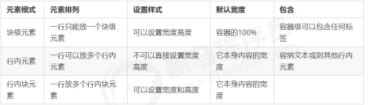

###### 8.5.元素显示模式的转换

①转换为块元素：display:block;

暂时无法在飞书文档外展示此内容

②转换为行内元素：display:inline;

暂时无法在飞书文档外展示此内容

③转换为行内块：display:inline-block;

暂时无法在飞书文档外展示此内容

###### 8.6.小米侧边栏

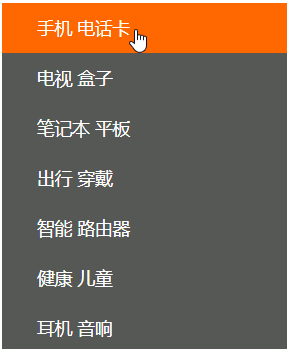

  

暂时无法在飞书文档外展示此内容

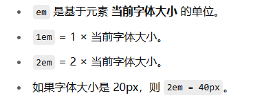

行高=盒子高度：实现文字的垂直居中

原理讲解：

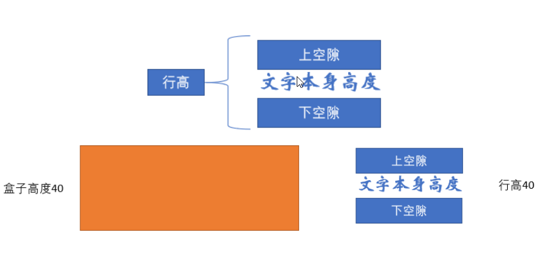

### 9.css背景

背景属性可以设置背景颜色、背景图片、背景平铺、背景图片位置、背景图像固定等

###### 9.1. **背景颜色**

background-color:颜色值;

一般情况下元素背景颜色默认值是 transparent（透明）

###### 9.2.背景图片

用于logo 或者一些装饰性的小图片或者是超大的背景图片, 优点是非常便于控制位置. (精灵图也是一种运用场景)

暂时无法在飞书文档外展示此内容

| 参数值 | 作用 |
|:---|:---|
| none | 无背景图（默认的） |
| url | 使用绝对或相对地址指定背景图像 |

暂时无法在飞书文档外展示此内容

注意：背景图片后面的地址，不能忘记加url,也不能加引号

###### 9.3.背景平铺

暂时无法在飞书文档外展示此内容

| 参数值 | 作用 |
|:---|:---|
| repeat | 背景图像在纵向和横向上平铺（默认的） |
| no-repeat | 背景图像不平铺 |
| repeat-x | 背景图像在横向上平铺 |
| repeat-y | 背景图像在纵向平铺 |

###### 9.4.背景图片位置

暂时无法在飞书文档外展示此内容

参数代表的意思是：x 坐标和 y 坐标。 可以使用 方位名词 或者 精确单位

| 参数值 | 说明 |
|:---|:---|
| length | 百分数\|由浮点数和单位标识符组成的长度值 |
| position | top\|center\|bottom\|left\|center\|right 方位名词 |

其他说明：

①参数是方位名词

如果指定的两个值都是方位名词，则两个值前后顺序无关，比如 left top 和 top left 效果一致

如果只指定了一个方位名词，另一个值省略，则第二个值默认居中对齐

②参数是精确单位

如果参数值是精确坐标，那么第一个肯定是 x 坐标，第二个一定是 y 坐标

如果只指定一个数值，那该数值一定是 x 坐标，另一个默认垂直居中

③参数是混合单位

如果指定的两个值是精确单位和方位名词混合使用，则第一个值是 x 坐标，第二个值是 y 坐标

###### 9.5.背景图片固定

暂时无法在飞书文档外展示此内容

| 参数 | 作用 |
|:---|:---|
| scroll | 背景图像是随对象内容滚动 |
| fixed | 背景图像固定 |

###### 9.6.背景样式合写

暂时无法在飞书文档外展示此内容

###### 9.7.背景色半透明

暂时无法在飞书文档外展示此内容

解释：

①最后一个参数是 alpha 透明度，取值范围在 0~1之间

②我们习惯把 0.3 的 0 省略掉，写为 background: rgba(0, 0, 0, .3);

③背景半透明是指盒子背景半透明，盒子里面的内容不受影响

④CSS3 新增属性，是 IE9+ 版本浏览器才支持的，但是现在实际开发,我们不太关注兼容性写法了,可以放心使用

###### 9.8.总结

| 属性 | 作用 | 值 |
|:---|:---|:---|
| background-color | 背景颜色 | 预定义的颜色值/十六进制/RGB代码 |
| background-image | 背景图片 | url(图片路径) |
| background-repeat | 是否平铺 | repeat/no-repeat/repeat-x/repeat-y |
| background-position | 背景位置 | length/position 分别是x和y坐标 |
| background-attachment | 背景附着 | scroll(背景滚动) /fixed (背景固定) |
| 背景简写 | 书写更简单 | 背景颜色 背景图片地址 背景平铺 背景滚动 背景位置； |
| 背景半透明 | 背景颜色半透明 | background: rgba(0,0,0.3); 后面必须是4个值 |

颜色渐变：

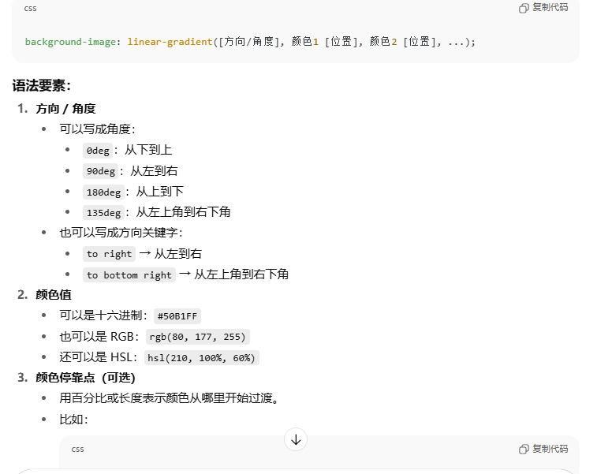

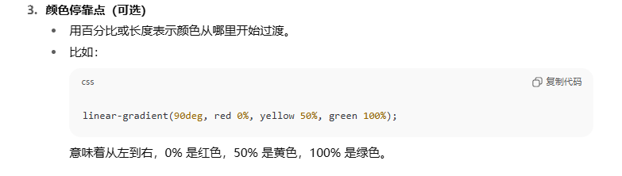

###### 9.9.案例-五彩导航栏

暂时无法在飞书文档外展示此内容

### 10.css三大特性

###### 10.1.层叠性

为了解决样式冲突问题

原则：①样式冲突，遵循的原则是就近原则，哪个样式离结构近，就执行哪个样式

   ②样式不冲突，不会层叠

###### 10.2.继承性

子标签会继承父标签的某些样式，如文本颜色和字号。恰当地使用继承可以简化代码，降低 CSS 样式的复杂性

子元素可以继承父元素的样式：text-, font-, line-和color属性

暂时无法在飞书文档外展示此内容

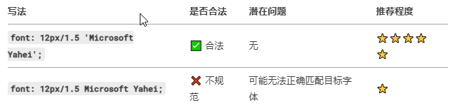

解释：①行高可以跟单位也可以不跟单位

②如果子元素没有设置行高，则会继承父元素的行高为 1.5

③此时子元素的行高是：当前子元素的文字大小 \* 1.5

④body 行高 1.5 这样写法最大的优势就是里面子元素可以根据自己文字大小自动调整行高

###### 10.3.优先级

1.  选择器相同，则执行层叠性
    
2.  选择器不同，则根据选择器权重执行
    

| 选择器 | 选择器权重 |
|:---|:---|
| 继承 或者* | 0，0，0，0 |
| 标签选择器 | 0，0，0，1 |
| 类选择器，伪类选择器 | 0，0，1，0 |
| ID选择器 | 0，1，0，0 |
| 行内样式 | 1，0，0，0 |
| ！important | 无穷大 |

! important用法：

暂时无法在飞书文档外展示此内容

优先级注意点：

①权重是有4组数字组成,但是不会有进位

②可以理解为类选择器永远大于元素选择器, id选择器永远大于类选择器,以此类推..

③等级判断从左向右，如果某一位数值相同，则判断下一位数值

④可以简单记忆法: 通配符和继承权重为0, 标签选择器为1,类(伪类)选择器为 10, id选择器 100, 行内样式表为 1000, !important 无穷大.

⑤继承的权重是0， 如果该元素没有直接选中，不管父元素权重多高，子元素得到的权重都是 0

⑥复合选择器

| div ul li | 0,0,0,3 |
|:---|:---|
| .nav ul li | 0,0,1,1这是个带有类选择器的后代选择器，有继承关系，实际最后权重就是一个类选择器加上一个标签选择器 |
| a:hover | 0,0,1,1 |
| .nav a | 0,0,1,1 |

### 11.盒子模型

利用盒子来设计网页

盒子包含：边框、外边距、内边距、实际内容

网页布局设置：

①先准备相关的网页元素，网页元素基本都是盒子box

②利用css设置好盒子样式，然后摆放到相应位置

③往盒子里装内容

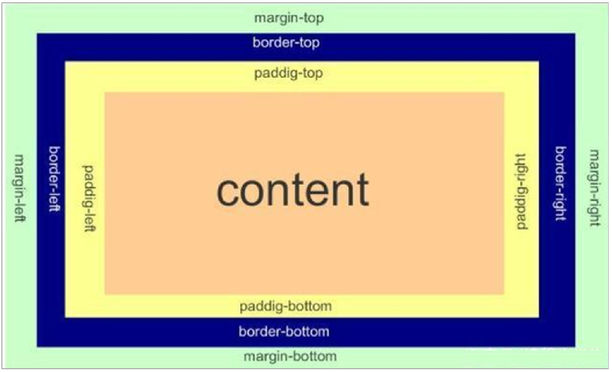

###### 11.1.边框（border）

1.  border可以设置元素的边框。边框有三部分组成：边框宽度(粗细) 边框样式 边框颜色；
    
2.  语法
    

暂时无法在飞书文档外展示此内容

| 属性 | 作用 |
|:---|:---|
| border-width | 定义边框粗细，单位是px |
| border-style | 边框的样式 |
| border-color | 边框的颜色 |

边框样式 border-style 可以设置如下值：

*   none：没有边框即忽略所有边框的宽度（默认值）
    
*   solid：边框为单实线(最为常用的)
    
*   dashed：边框为虚线
    
*   dotted：边框为点线
    

3.  边框的合写分写
    

暂时无法在飞书文档外展示此内容

边框分开写法：

暂时无法在飞书文档外展示此内容

4.  表格的细线边框
    

border-collapse 属性控制浏览器绘制表格边框的方式。它控制相邻单元格的边框

暂时无法在飞书文档外展示此内容

要知道如果不进行合并的话，单元格之间边框如果原来每个边框1像素，现在就变成了1+1=2像素，边框就会变宽了，所以此时非常合并单元格，保持1像素 border-collapse:collapse

5.  解决边框额外增加盒子的实际大小的方法：
    

*   测量盒子大小的时候,不量边框
    
*   如果测量的时候包含了边框,则需要 width/height 减去边框宽度
    

###### 11.2.内边距

1.  padding 属性用于设置内边距，即边框与内容之间的距离
    
2.  语法
    

| 值的个数 | 表达意思 |
|:---|:---|
| padding: 5px; | 1个值，代表上下左右都有5个元素 |
| padding: 5px 10px; | 2个值，代表上下内边距为5像素，左右内边距为10像素 |
| padding: 5px 10px 20px; | 3个值，代表上内边距5像素，左右内边距为10像素，下内边距为20像素 |
| padding: 5px 10px 20px 30px; | 4个值，上是5像素，右是10像素，下是20像素，左是30像素，顺时针 |

| 属性 | 作用 |
|:---|:---|
| padding-left | 左内边距 |
| padding-right | 右内边距 |
| padding-top | 上内边距 |
| padding-bottom | 下内边距 |

3.  内边距会影响盒子的实际大小
    

当我们给盒子指定 padding 值之后，发生了 2 件事情：

①内容和边框有了距离，添加了内边距

②padding影响了盒子实际大小

内边距对盒子大小的影响：

①如果盒子已经有了宽度和高度，此时再指定内边框，会影响盒子的实际大小，会撑大盒子

②如何盒子本身没有指定width/height属性, 则此时padding不会撑开盒子大小

解决方法：

如果保证盒子跟效果图大小保持一致，则让 width/height 减去多出来的内边距大小即可

###### 11.3.外边距

1.  控制盒子与盒子之间的距离
    

| 属性 | 作用 |
|:---|:---|
| margin-left | 左外边距 |
| margin-right | 右外边距 |
| margin-top | 上外边距 |
| margin-bottom | 下外边距 |

2.  外边距可以让块级盒子水平居中的两个条件：
    

①盒子必须指定了宽度（width）

②盒子左右的外边距都设置为 auto

暂时无法在飞书文档外展示此内容

3.  外边距塌陷问题
    

当盒子中嵌套盒子时，让子盒子与父盒子进行隔开时，对子盒子使用margin时，子盒子并不产生影响，子盒子与父盒子没有隔开，父盒子产生了影响，发生了类似于塌陷的效果

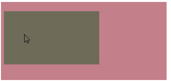

解决方案：

①可以为父亲元素定义上边距

暂时无法在飞书文档外展示此内容

②可以为父亲元素定义上内边距

③可以为父亲元素添加overflow:hidden

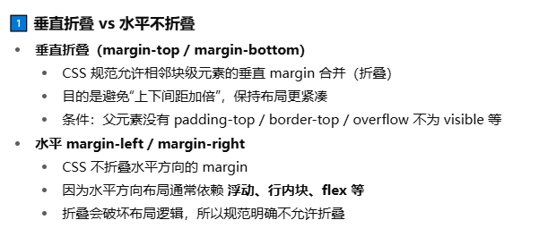

暂时无法在飞书文档外展示此内容

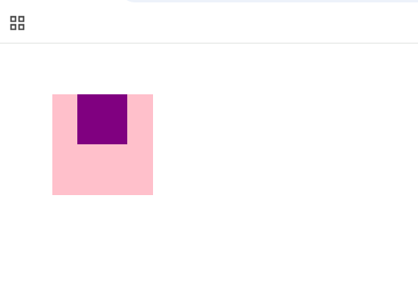

以后如果父盒子给定了宽高，子盒子要实现在父盒子中的居中效果，如果不给父盒子上边框，子盒子的margin对于竖直方向就会失效，但是水平方向不会失效

  

解决方式：子盒子使用定位；父盒子加边框；父盒子使用overflow:hidden

  

###### 11.4.清除内外边距

网页元素很多都带有默认的内外边距，而且不同浏览器默认的也不一致。因此我们在布局前，首先要清除下网页元素的内外边距

暂时无法在飞书文档外展示此内容

注意：行内元素为了照顾兼容性，尽量只设置左右内外边距，不要设置上下内外边距。但是转换为块级和行内块元素就可以了

###### 11.5.常用ps的基本操作

*   文件→打开 ：可以打开我们要测量的图片
    
*   Ctrl+R：可以打开标尺，或者 视图→标尺
    
*   右击标尺，把里面的单位改为像素
    
*   Ctrl+ 加号(+)可以放大视图， Ctrl+ 减号(-)可以缩小视图
    
*   按住空格键，鼠标可以变成小手，拖动 PS 视图
    
*   用选区拖动 可以测量大小
    

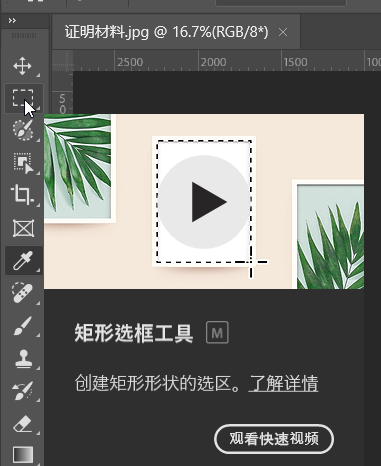

*   Ctrl+ D 可以取消选区，或者在旁边空白处点击一下也可以取消选区
    
*   吸管取色工具
    

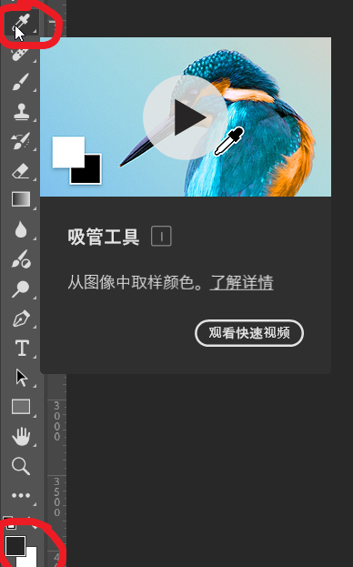

###### 11.6.案例

1.  小米商品
    

暂时无法在飞书文档外展示此内容

2.  快报模块
    

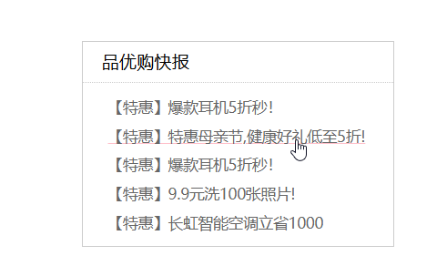

暂时无法在飞书文档外展示此内容

###### 11.7.盒子模型css中所用到的其他样式

1.  圆角边框
    

圆角边框的原理为拿着设定半径的圆去矩形等形状的角位置去截弧

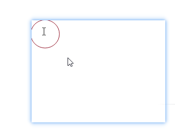

暂时无法在飞书文档外展示此内容

解释:

*   参数值可以为数值或百分比的形式
    
*   如果是正方形，想要设置为一个圆，把数值修改为高度或者宽度的一半即可，或者直接写为 50%
    
*   该属性是一个简写属性，可以跟四个值，分别代表左上角、右上角、右下角、左下角
    
*   分开写：border-top-left-radius、border-top-right-radius、border-bottom-right-radius 和border-bottom-left-radius
    
*   兼容性 ie9+ 浏览器支持, 但是不会影响页面布局,可以放心使用
    

2.  盒子阴影
    

暂时无法在飞书文档外展示此内容

  

| 值 | 描述 |
|:---|:---|
| h-shadow | 必需,水平阴影的位置,允许负值 |
| v-shadow | 必需,垂直阴影的位置,允许负值 |
| blur | 可选,模糊距离,就是影子的虚实 |
| spread | 可选,阴影尺寸 |
| color | 可选,阴影的颜色 |
| inset | 可选,将外部阴影(outset)改为内部阴影 |

3.  文字阴影
    

暂时无法在飞书文档外展示此内容

| 值 | 描述 |
|:---|:---|
| h-shadow | 必需,水平阴影的位置,允许负值 |
| v-shadow | 必需,垂直阴影位置,允许负值 |
| blur | 可选,模糊的距离 |
| color | 可选,阴影的颜色 |

### 12.浮动

###### 12.1.浮动介绍

在16.2中详细介绍

###### 12.2.清除浮动

1.  原因：由于父级盒子很多情况下，不方便给高度，但是子盒子浮动又不占有位置，最后父级盒子高度为 0 时，就会影响下面的标准流盒子
    
2.  清除浮动的本质
    

清除浮动的本质是清除浮动元素造成的影响：浮动的子标签无法撑开父盒子的高度

注意：

*   如果父盒子本身有高度，则不需要清除浮动
    
*   清除浮动之后，父级就会根据浮动的子盒子自动检测高度
    
*   父级有了高度，就不会影响下面的标准流了
    

3.  清除浮动样式
    

暂时无法在飞书文档外展示此内容

| 属性值 | 描述 |
|:---|:---|
| left | 不允许左侧有浮动元素（清除左侧浮动的影响） |
| right | 不允许右侧有浮动元素（清除右侧浮动的影响） |
| both | 同时清除左右侧浮动的影响 |

法一

额外标签法也称为隔墙法

使用方式：

额外标签法会在浮动元素末尾添加一个空的标签。

暂时无法在飞书文档外展示此内容

both这个元素要清除前面所有方向（左、右）的浮动影响，自己要出现在浮动元素的下方这个元素要清除前面所有方向（左、右）的浮动影响，自己要出现在浮动元素的下方

优点： 通俗易懂，书写方便

缺点： 添加许多无意义的标签，结构化较差

注意： 要求这个新的空标签必须是块级元素。

法二

父级添加overflow属性

暂时无法在飞书文档外展示此内容

overflow: hidden;

优点：代码简洁

缺点：无法显示溢出的部分

注意：是给父元素添加代码

法三

父级添加after伪元素

:after 方式是额外标签法的升级版

使用的时候复制就可以

暂时无法在飞书文档外展示此内容

优点：没有增加标签，结构更简单

缺点：照顾低版本浏览器

代表网站： 百度、淘宝网、网易等

法四

父级添加双伪元素

暂时无法在飞书文档外展示此内容

优点：代码更简洁

缺点：照顾低版本浏览器

代表网站：小米、腾讯等

### 13.PS切图

###### 13.1.常见图片格式

| jpg图像格式 | 对色彩的信息保留较好，高清，颜色较多，产品类的图片经常用 |
|:---|:---|
| gif图像格式 | 最多只能储存256色，通常用来显示简单图形及字体，但是可以保存透明背景和动画效果，实际经常用于一些图片小动画效果 |
| png图像格式 | 是一种新型的网络图形格式，结合了GIF和JPEG的优点，具有存储形式丰富的特点，能够保持透明背景。如果想要切成背景透明的图片，选择png格式 |
| PSD图像格式 | Photoshop的专用格式，里面可以存放图层、通道、遮罩等多种设计稿，对前端人员来说，最大的优点，可以直接从上面复制文字，获得图片，还可以测量大小和距离，不能直接放到页面 |

###### 13.2.图层切图

最简单的切图方式：右击图层 → 导出 → 切片

按住shift选中两个图层->图层菜单->合并图层

###### 13.3.切片切图

*   利用切片工具手动划出
    
*   文件菜单 → 存储为 web 设备所用格式 → 选择我们要的图片格式 → 存储
    

###### 13.4 切图步骤

用切片工具选中：

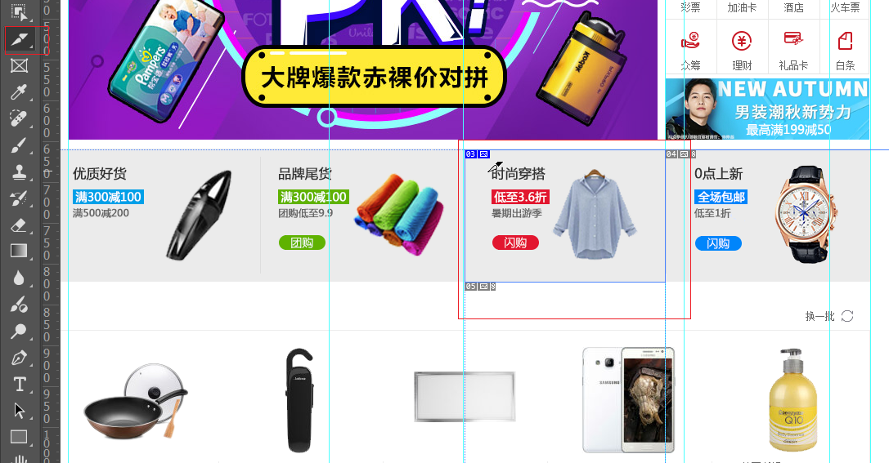

文件-->导出

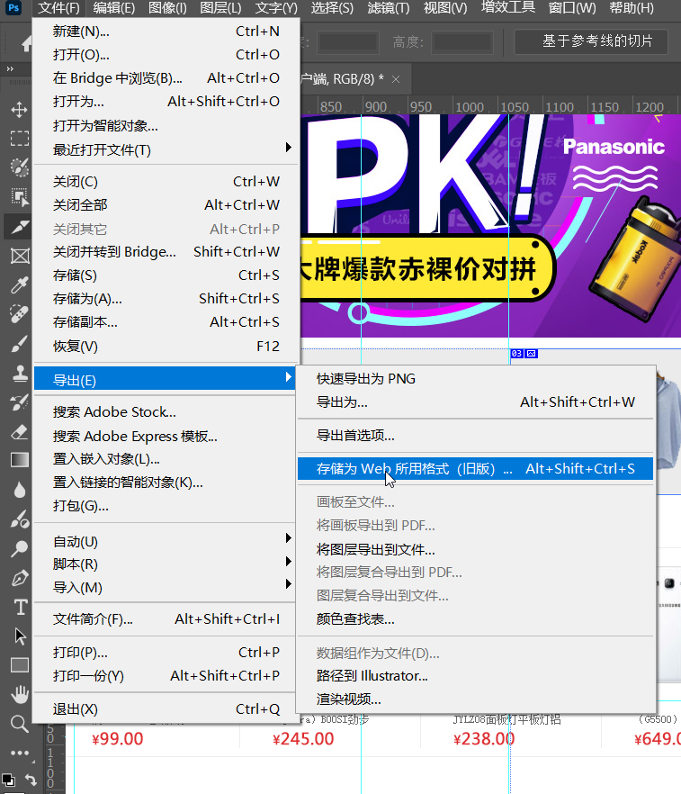

### 14.CSS属性书写顺序

1.  **布局定位属性** ：display / position / float / clear / visibility / overflow（建议 display 第一个写，毕竟关系到模式）
    
2.  **自身属性** ：width / height / margin / padding / border / background
    
3.  **文本属性** ：color / font / text-decoration / text-align / vertical-align / white- space / break-word
    
4.  **其他属性（CSS3）** ：content / cursor / border-radius / box-shadow / text-shadow / background:linear-gradient …
    

暂时无法在飞书文档外展示此内容

### 15.学成在线案例反思总结

###### 15.1.header头部制作

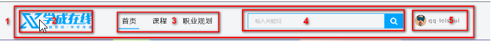

*   1号是版心盒子 **header** 1200 \* 42 的盒子水平居中对齐, 上下给一个margin值就好了
    
*   版心盒子 里面包含 2号盒子 **logo** 图标
    
*   版心盒子 里面包含 3号盒子 **nav** 导航栏
    
*   版心盒子 里面包含 4号盒子 **search** 搜索框
    
*   版心盒子 里面包含 5号盒子 **user** 个人信息
    
*   注意，要求里面的 **4个子盒子 必须都浮动**
    

1.  **导航栏注意点:**
    

实际开发中， **重要的****导航栏**，我们不会直接用链接a ，而是 **用 li 包含链接(li+a)的做法**

*   li+a 语义更清晰，一看这就是有条理的列表型内容
    
*   如果直接用a，搜索引擎容易辨别为有堆砌关键字嫌疑（故意堆砌关键字容易被搜索引擎有降权的风险），从而影响网站排名
    

注意：

  ①让导航栏一行显示, 给 li 加浮动, 因为 li 是块级元素, 需要一行显示

  ②这个nav导航栏可以不给宽度,将来可以继续添加其余文字

  ③因为导航栏里面文字不一样多,所以最好给链接 a 左右padding 撑开盒子,而不是指定宽度

2.  **4号盒子search的细节：**
    

*   search 搜索框的意思: 一个 search 大盒子里面包含 2个 表单
    
*   技巧：input和button都，属于行内块元素，会有缝隙，使用浮动，可以去缝隙
    
*   <button></button>按钮不能忘，按钮要手动去除边框
    

###### 15.2.banner制作

*   1号盒子是通栏的大盒子 **banner** ， 不给宽度，给高度，给一个蓝色背景
    
*   2号盒子是版心 **w** ， 要水平居中对齐
    
*   3号盒子版心内，左对齐 **subnav** 侧导航栏
    
*   4号盒子版心内，右对齐 **course** 课程
    

###### 15.3.精品推荐小模块

*   大盒子水平居中 goods 精品 ，注意此处有个盒子阴影
    
*   1号盒子是标题 H3 左侧浮动
    
*   2号盒子 里面放链接 左侧浮动goods-item距离可以控制链接的 左右外边距（注意行内元素只给左右内外边距）
    
*   3号盒子 右浮动 mod 修改
    

###### 15.4.精品推荐大模块

*   1号盒子为最大的盒子 **box** 版心水平居中对齐
    
*   2号盒子为上面部分 **box-hd** -- 里面 左侧标题H3 左浮动 右侧 链接 a 右浮动
    
*   3号盒子为底下部分 **box-bd** --- 里面是无序列表 有 10个 小li 组成
    
*   小li 外边距的问题， 在使用li的时候可能因为外边距的问题导致最后一个li盒子在这一行是放不开的，此时可以对ul进行处理，让ul大一点，大的那一块反正是外边距，所以不会有任何的影响，这样就不需要再单独写类选择器，对放不下的li盒子进行处理
    
*   复习点：我们用到清除浮动，因为 box-hd 里面的盒子个数不一定是多少，所以我们就不给高度了，但是里面的盒子浮动会影响下面的布局，因此需要清除浮动。
    

###### 15.5.底部模块制作

*   1号盒子通栏大盒子 底部 **footer** 给高度 底色是白色
    
*   2号盒子版心水平居中
    
*   3号盒子版权 **copyright** 左对齐
    
*   4号盒子 链接组 **links** 右对齐
    

###### 15.6.代码模块

1.  html部分
    

暂时无法在飞书文档外展示此内容

2.  css部分
    

暂时无法在飞书文档外展示此内容

###### 15.7.收获

1.  先确定版心，然后写一个类选择器，直接后边的就直接调用这个类选择器就可以
    
2.  在设置导航栏时，对于横的导航栏对li设置浮动，对a设置大小就可以，对于竖的导航栏对li设置宽高，以后这样做，保证书写规范
    
3.  行内块元素之间有空隙，解决的一个好方法是设置浮动
    
4.  设置用户的时候要灵活使用img标签，一个盒子放头像和名字
    
5.  遗忘代码
    

暂时无法在飞书文档外展示此内容

6.  html引css的程序
    

暂时无法在飞书文档外展示此内容

7.  浮动的盒子不会有外边距合并问题
    
8.  子盒子没有设置宽高，是直接继承父盒子的宽高的，此时给子盒子设置padding,是不会撑大父盒子的，可以理解为已经约束了子盒子，子盒子在确定空间中再如何动，也不会打破空间
    
9.  ctrl+g快速定位行；shift+alt多个光标
    
10.  学习上方各个模块的选择器起名方法，以后就这样用
    
11.  在写选择器时尽量写全一些，例如
    

暂时无法在飞书文档外展示此内容

12.  一定要用好注释
    
13.  浮动的盒子不会有外边距合并的问题
    

  

### 16.传统网页布局的三种方式

###### 16.1.普通流（标准流）

*   所谓的标准流: 就是标签按照规定好默认方式排列
    
*   块级元素会独占一行，从上向下顺序排列。常用元素：div、hr、p、h1~h6、ul、ol、dl、form、table
    
*   行内元素会按照顺序，从左到右顺序排列，碰到父元素边缘则自动换行。常用元素：span、a、i、em 等
    

###### 16.2.浮动

*   float 属性用于创建浮动框，将其移动到一边，直到左边缘或右边缘触及包含块或另一个浮动框的边缘
    
*   浮动可以改变元素标签默认的排列方式
    
*   浮动最典型的应用：可以让多个块级元素一行内排列显示
    
*   网页布局第一准则：多个块级元素纵向排列找标准流，多个块级元素横向排列找浮动
    
*   在使用行内块转换时盒子之间是有空隙的
    

暂时无法在飞书文档外展示此内容

| 属性值 | 描述 |
|:---|:---|
| none | 元素不浮动（默认值） |
| left | 元素向左浮动 |
| right | 元素向右浮动 |

浮动重点：

*   浮动元素会脱离标准流(脱标：浮动的盒子不再保留原先的位置)
    
*   浮动的元素会一行内显示并且元素顶部对齐
    
*   浮动的元素是互相贴靠在一起的（不会有缝隙），如果父级宽度装不下这些浮动的盒子，多出的盒子会另起一行对齐
    
*   浮动的元素会具有行内块元素的特性：①浮动元素的大小根据内容来决定；②浮动的盒子之间没有缝隙(行内元素有了浮动，则不需要转换块级\\行内块元素就可以直接给高度和宽度)
    
*   行内块元素如果没有设置宽度，则盒子大小受内容影响，内容多则就宽
    

设计策略：先用标准流父元素排列上下位置, 之后内部子元素采取浮动排列左右位置. 符合网页布局第一准侧

浮动的盒子只会影响浮动盒子后面的标准流,不会影响前面的标准流

暂时无法在飞书文档外展示此内容

###### 16.3.定位

16.3.1使用场景

①某个元素可以自由的在一个盒子内移动位置，并且压住其他盒子

②当我们滚动窗口的时候，盒子是固定屏幕某个位置的

16.3.2定位组成

定位 = 定位模式 + 边偏移

1.  **定位模式：** 用于指定一个元素在文档中的定位方式通过 position属性定义元素的 **定位模式**
    

暂时无法在飞书文档外展示此内容

| 值 | 语义 |
|:---|:---|
| static | 静态定位 |
| relative | 相对定位 |
| absolute | 绝对定位 |
| fixed | 固定定位 |

（1）静态定位：

*   静态定位是元素的 **默认定位方式** ， **无定位的意思** 。它相当于 border 里面的none，静态定位static，不要定位的时候用
    
*   语法：
    

暂时无法在飞书文档外展示此内容

*   静态定位 按照标准流特性摆放位置，它没有边偏移,可以理解为静态定位就是标准流
    
*   静态定位在布局时我们几乎不用的
    

（2）相对定位

*   相对定位是元素在移动位置的时候，是相对于它自己 **原来的位置** 来说的（自恋型）
    
*   语法：
    

暂时无法在飞书文档外展示此内容

*   相对定位的特点：
    
      ①它是相对于自己原来的位置来移动的（移动位置的时候参照点是自己原来的位置）
    
      ② **原来** 在标准流的 **位置** 继续占有，后面的盒子仍然以标准流的方式对待它，原来的位置和现在的位置都不影响后面盒子的位置
    
      ③因此， **相对定位并没有脱标** 。它最典型的应用是给绝对定位当爹的,相对定位是用来限制绝对定位的
    

（3）绝对定位

*   **绝对定位** 是元素在移动位置的时候，是相对于它 **祖先元素** 来说的（拼爹型）
    
*   语法：
    

暂时无法在飞书文档外展示此内容

*   绝对定位的特点：
    
      ①如果没有祖先元素或者祖先元素没有定位，则以浏览器为准定位
    
      ②如果祖先元素有定位（相对、绝对、固定定位），则以最近一级的有定位祖先元素为参考点移动位置
    
      ③绝对定位不再占有原先的位置。所以绝对定位是脱离标准流的。可以理解为绝对定位比浮动飘的更高（脱标）
    
      (4)固定定位
    
*   **固定定位** 是元素 **固定于浏览器可视区的位置** 。（认死理型）
    
*   主要使用场景：可以在浏览器页面滚动时元素的位置不会改变
    
*   语法:
    

暂时无法在飞书文档外展示此内容

*   特点:
    
      ①.以浏览器的可视窗口为参照点移动元素,跟父元素没有任何关系,不随滚动条滚动
    
      ②固定定位不再占有原先的位置,完全脱标
    
*   固定在版心位置的方法:
    
      ①让固定定位的盒子 left: 50%. 走到浏览器可视区（也可以看做版心） 的一半位置
    
      ②让固定定位的盒子 margin-left: 版心宽度的一半距离。 多走版心宽度的一半位置
    
      实例：
    
    暂时无法在飞书文档外展示此内容
    

(5)粘性定位

*   粘性定位可以被认为是相对定位和固定定位的混合
    
*   语法：
    

暂时无法在飞书文档外展示此内容

*   粘性定位的特点：
    
      ①以浏览器的可视窗口为参照点移动元素（固定定位特点）
    
      ②粘性定位占有原先的位置（相对定位特点）
    
      ③必须添加 top 、left、right、bottom **其中一个** 才有效
    
      ④跟页面滚动搭配使用。 兼容性较差，IE 不支持
    
    暂时无法在飞书文档外展示此内容
    

(6)总结

| 定位模式 | 是否脱标 | 移动位置 | 是否常用 |
|:---|:---|:---|:---|
| Static 静态定位 | 否 | 不能使用边偏移 | 很少 |
| Relative 相对定位 | 否(占有位置) | 相对于自身位置移动 | 基本单独使用 |
| Absolute 绝对定位 | 是(不占有位置) | 带有定位的父级 | 要和定位父级元素搭配使用 |
| Fixed 固定定位 | 是(不占有位置) | 浏览器可视区 | 单独使用,不需要父级 |
| Sticky 粘性定位 | 否(占有位置) | 浏览器可视区 | 当前阶段少 |

2.  **边偏移** 则决定了该元素的最终位置
    

| 边偏移属性 | 示例 | 描述 |
|:---|:---|:---|
| top | top: 80px; | 顶端偏移量，定义元素相对于父元素上边线的距离 |
| bottom | bottom: 80px ; | 底部偏移量，定义元素相对于其父元素下边线的距离 |
| left | left: 80px ; | 左侧偏移量，定义元素相对于其父元素左边线的距离 |
| right | right: 80px ; | 右侧偏移量，定义元素相对于其父元素右边线的距离 |

*   注意：
    
      ① **边偏移** 需要和 **定位模式** 联合使用， **单独使用无效** ；
    
      ②top和bottom不要同时使用
    
      ③left和right不要同时使用
    

16.3.3. 定位口诀-子绝父相

子级是绝对定位的话，父级要用相对定位

*   子级绝对定位，不会占有位置，可以放到父盒子里面的任何一个地方，不会影响其他的兄弟盒子
    
*   父盒子需要加定位限制子盒子在父盒子内显示
    
*   父盒子布局时，需要占有位置，因此父亲只能是相对定位
    
*   子绝父相不是永远不变的，如果父元素不需要占有位置， **子绝父绝** 也会遇到
    

16.3.4.堆叠顺序(z-index)

*   在使用 **定位** 布局时，可能会 **出现盒子重叠的情况** 。此时，可以使用 **z-index** 来控制盒子的前后次序 (z轴)
    
*   语法：
    

暂时无法在飞书文档外展示此内容

*   z-index的特性
    
      ① **属性值** ： **正整数** 、 **负整数** 或 **0** ，默认值是 0，数值越大，盒子越靠上；
    
      ②如果 **属性值相同** ，则按照书写顺序， **后来居上** ；
    
      ③数字后面 **不能加单位**
    
      ④z-index 只能应用于相对定位,绝对定位和固定定位的元素,其他标准流,浮动和静态定位无效(只有定位的盒子才有z-index属性)
    

16.4.4.绝对定位盒子居中

加了绝对定位/固定定位的盒子不能通过设置margin:auto;设置水平居中

方法:

*   left: 50%; 让 **盒子的左侧** 移动到 **父级元素的水平中心位置**
    
*   margin-left: -100px; 让盒子 **向左** 移动 **自身宽度的一半**
    

16.4.5.定位特殊特性

1.  行内元素添加绝对或者固定定位，可以直接设置高度和宽度
    
2.  块级元素添加绝对或者固定定位，如果不给宽度或者高度，默认大小是内容的大小
    

也就是说绝对定位和固定定位和浮动类似

3.  display 是显示模式， 可以改变显示模式有以下方式:
    

*   可以用inline-block 转换为行内块
    
*   可以用浮动 float 默认转换为行内块（类似，并不完全一样，因为浮动是脱标的）
    
*   绝对定位和固定定位也和浮动类似， 默认转换为行内块
    

一个行内的盒子,如果加了浮动,固定定位和绝对定位,不用转换,就可以给这个盒子直接设置宽度和高度等

16.4.6.绝对定位(固定定位)会完全压住盒子

1.  浮动元素不同，只会压住它下面标准流的盒子，但是不会压住下面标准流盒子里面的文字
    
2.  绝对定位（固定定位）会压住下面标准流所有的内容
    
3.  浮动之所以不会压住文字，因为浮动产生的目的最初是为了做文字环绕效果的。 文字会围绕浮动元素
    
4.  以前浮动就是为了文字环绕效果，现在已经经常用于布局了
    

暂时无法在飞书文档外展示此内容

16.4.7.轮播图

1.  制作顺序:
    

*   大盒子我们类名为： tb-promo 淘宝广告
    
*   里面先放一张图片
    
*   左右两个按钮 用链接就好了。 左箭头 prev 右箭头 next
    
      ①左按钮样式（border-radius：左上，右上，右下，左下）
    
      ②右按钮定位，提取左右按钮共同的样式代码（并集选择器）
    
*   底侧小圆点ul 继续做。 类名为 promo-nav
    
      ①中间长方形椭圆 ul的定位（水平居中，离底部15px）
    
      ②长方形需要五个小圆点，ul无序列表，li浮动，椭圆中小圆点的样式
    

2.  代码模块
    

暂时无法在飞书文档外展示此内容

总结收获:主要学习的地方是相同属性使用并集选择器

###### 16.4 定位数值的移动

✨ 黄金口诀：

"TOP正下负上，LEFT正右负左"

"RIGHT正左负右，BOTTOM正上负下

可以理解为正数就是相反方向移动，负值相同方向移动

✨ 简单记：

margin的四个方向，正值都是增加该方向的外边距（即向外推开），负值都是减少外边距（即向内拉近）

###### 17.元素的显示和隐藏

*   目的:让一个元素在页面中消失或者显示出来
    
*   场景:类似网站广告，当我们点击关闭就不见了，但是我们重新刷新页面，会重新出现！
    

17.1.display 显示

1.  display 设置或检索对象是否及如何显示
    

*   display: none;隐藏对象
    
*   display: block; 除了转换为块级元素之外，同时还有显示元素的意思
    

2.  特点： display 隐藏元素后， **不再占** 有原来的位置
    
3.  在js中使用非常的广泛
    

17.2.visibility可见性

1.  visibility 属性用于指定一个元素应可见还是隐藏
    

*   visibility： visible；元素可见
    
*   visibility：hidden；元素隐藏
    

2.  如果隐藏元素想要原来位置， 就用 visibility：hidden；
    
3.  如果隐藏元素不想要原来位置， 就用 display：none； (用处更多）
    

4.  隐藏后继续占有原有位置
    

17.3.overflow溢出

*   overflow 属性指定了如果内容溢出一个元素的框（超过其指定高度及宽度） 时，会发生什么
    

| 属性值 | 描述 |
|:---|:---|
| visible | 不剪切内容也不添加滚动条，默认的，溢出的也显示出来，写不写overflow:hidden；是都显示溢出的文字的 |
| hidden | 不显示超过对象尺寸的内容，超出的部分隐藏掉 |
| scroll | 不管超出内容否，总是显示滚动条 |
| auto | 超出自动显示滚动条，不超出不显示滚动条 |

*   一般情况下，我们都不想让溢出的内容显示出来，因为溢出的部分会影响布局
    
*   但是如果有定位的盒子， 请慎用overflow:hidden； 因为它会隐藏多余的部分，如果对父盒子使用overflow:hidden;的话，那子盒子使用绝对定位时如果多出去一块，则会造成子盒子一部分不显示（就是有时候可能小盒子有一部分是在大盒子外边的，使用overflow:hidden后超出大盒子的就不再显示，会导致小盒子显示不全，所以这时候就不能加overflow:hidden）
    

17.4.案例收获

问题：没做出来动态效果，使用hover没实现

收获：在做这类效果的时候，不要再盒子里再放盒子了，可以直接使用背景background来做中间的播放按钮，把它放在阴影盒子中就欧克，其次在使用hover时，做成滚动到大盒子时，阴影盒子显示

暂时无法在飞书文档外展示此内容

完整代码：

暂时无法在飞书文档外展示此内容

分布思路重点详解：

暂时无法在飞书文档外展示此内容

图片太大，盒子太小，此时需要修改图片的大小

暂时无法在飞书文档外展示此内容

制造遮罩层

暂时无法在飞书文档外展示此内容

此时是这样的为标准流

还要子绝父相，不然子盒子会以浏览器为准，不以盒子为准

中间播放按钮作为背景展示就可以，不用再加盒子了

让他在中间，用center(background-position)

将需要变的尽可能放到一个盒子中

放大盒子上内部盒子发生变化

暂时无法在飞书文档外展示此内容

当鼠标放到使用tudou这个类选择器盒子上时，使用mask类选择器的盒子会显现内容

###### 18.精灵图

18.1 理解

1.  目的： **为了有效地减少服务器接收和发送请求的次数** ， **提高** 页面的 **加载速度** ，出现了 **CSS 精灵技术** （也称 CSS Sprites、CSS 雪碧），将网页中的一些小背景图像整合到一张大图中 ，这样服务器只需一次请求就可以了
    
2.  使用精灵图核心：
    
      ①精灵技术主要针对于背景图片使用。就是把多个小背景图片整合到一张大图片中
    
      ②这个大图片也称为 sprites 精灵图 或者 雪碧图
    
      ③移动背景图片位置， 此时可以使用 background-position
    
      ④移动的距离就是这个目标图片的 x 和 y 坐标。注意网页中的坐标有所不同
    
      ⑤因为一般情况下都是往上往左移动，所以数值是负值
    
      ⑥使用精灵图的时候需要精确测量，每个小背景图片的大小和位置
    
      18.2 扒图
    
    
    

18.3 精灵图的实现

打开FW软件，使用切片命令，将想实现精灵图的位置进行切片操作，然后下方会出现坐标

暂时无法在飞书文档外展示此内容

在前端中坐标轴的正方向是右和下

###### 19.字体图标

19.1.字体图标与精灵图的对比

字体图标使用场景： 主要用于显示网页中通用、常用的一些小图标。

精灵图是有诸多优点的，但是缺点很明显。

1.图片文件还是比较大的。

2.图片本身放大和缩小会失真。

3.一旦图片制作完毕想要更换非常复杂。

此时，有一种技术的出现很好的解决了以上问题，就是 **字体图标 iconfont** 。

**字体图标** 可以为前端工程师提供一种方便高效的图标使用方式，**展示的是图标，本质属于字体**。

19.2.字体图标的优点

*   **轻量级** ：一个图标字体要比一系列的图像要小。一旦字体加载了，图标就会马上渲染出来，减少了服务器请求
    
*   灵活性：本质其实是文字，可以很随意的改变颜色、产生阴影、透明效果、旋转等
    
*   兼容性：几乎支持所有的浏览器，请放心使用
    
*   注意： 字体图标不能替代精灵技术，只是对工作中图标部分技术的提升和优化
    
*   样式结构比较简单，样式比较复杂的小图片的话还是得用精灵图来进行做
    

19.3.字体库下载网站

*   icomoon字体库：[http://icomoon.io](http://icomoon.io/)
    

进去之后点icomoon app

可以对其编辑：

生成字体：

下载：

*   阿里iconfont字体库： [http://www.iconfont.cn/](http://www.iconfont.cn/)
    

19.4.字体图标的引入

1.  把下载包里面的 **fonts** 文件夹放入页面根目录下
    

2.  字体文件格式
    

| 格式 | 特点 |
|:---|:---|
| **.ttf** | ttf字体是Windows和Mac的最常见的字体，支持这种字体的浏览器有IE9+、Firefox3.5+、Chrome4+、Safari3+、Opera10+、iOS Mobile、Safari4.2+ |
| **.woff** | woff字体，支持这种字体的浏览器有IE9+、Firefox3.5+、Chrome6+、Safari3.6+、Opera11.1+ |
| **.eot** | eot字体是IE专用字体，支持这种字体的浏览器有IE4+ |
| **svg** | svg字体是基于SVG字体渲染的一种格式，支持这种字体的浏览器有Chrome4+、Safari3.1+、Opera10.0+、iOS Mobile Safari3.2+ |

3.  在 CSS 样式中全局声明字体： 简单理解把这些字体文件通过css引入到我们页面中
    

暂时无法在飞书文档外展示此内容

字体声明也可以在下载的字体文件中找到style.css中复制，也可以复制上边的内容

  

4.  添加字体
    

复制：

还有谁需要就把声明加在谁那里一份 font-family:'icomoon'

5.  代码展示：
    

暂时无法在飞书文档外展示此内容

更加细节展示：

1.  html 标签内添加小图标
    

2.  给标签定义字体
    

暂时无法在飞书文档外展示此内容

注意：务必保证 这个字体和上面@font-face里面的字体保持一致

19.5.字体图标的追加

如果工作中，原来的字体图标不够用了，我们需要添加新的字体图标到原来的字体文件中

把压缩包里面的 **selection.json** 从新上传，然后选中自己想要新的图标，从新下载压缩包，并替换原来的文件即可

打开网站，点下方：

点yes重新加载

然后重复之前的操作就可以实现了

下载最新的文件夹，原来的文件夹可以是删除了！

19.6.字体图标的加载原理

###### 20.css三角

原理概括：只设置边框，需要朝向哪边的三角就让其他的边框进行透明

*   用css 边框可以模拟三角效果
    
*   宽度高度为0
    
*   4个边框都要写， 只保留需要的边框颜色，其余的不能省略，都改为 transparent 透明就好了
    
*   为了照顾兼容性 低版本的浏览器，加上 font-size: 0; line-height: 0;
    

暂时无法在飞书文档外展示此内容

暂时无法在飞书文档外展示此内容

###### 21.css用户界面样式

21.1.鼠标样式

暂时无法在飞书文档外展示此内容

| 属性值 | 描述 |
|:---|:---|
| default | 小白 默认 |
| pointer | 小手 |
| move | 移动 |
| text | 文本 |
| not-allowed | 禁止 |

21.2.轮廓线 outline

去除表单轮廓线

给表单添加 outline: 0; 或者 outline: none; 样式之后，就可以去掉默认的蓝色边框

暂时无法在飞书文档外展示此内容

文本域：

此时会有一个空白区域

写在同一行就不会出现这个问题

文本域是行内块元素，一定记住！！！

结果：

文本域尽量放在一行

知识回顾：cols是列，rols是行

它可以进行拖动，显然这是我们不愿意看到的

使用resize进行解决

暂时无法在飞书文档外展示此内容

此时就无法通过右下方实现拖动了

21.3.vertical-align 属性应用

实现一个盒子中的文字和图片对齐

用于设置一个元素的 **垂直对齐方式** ，但是它只针对于行内元素或者行内块元素有效

图片和文字默认是基线对齐

暂时无法在飞书文档外展示此内容

  

21.3.1 图片、表单和文字对齐

图片、表单都属于行内块元素，默认的 vertical-align 是基线对齐

此时可以给图片、表单这些行内块元素的 **vertical-align 属性设置为 middle** 就可以让文字和图片垂直居中对齐了

21.3.2 解决图片底部默认空白缝隙问题

bug：图片底侧会有一个空白缝隙，原因是行内块元素会和文字的基线对齐。

例如：

暂时无法在飞书文档外展示此内容

主要解决方法有两种：

1. **给图片** 添加 **vertical-align:middle | top| bottom** 等。 （提倡使用的）

2.把图片转换为块级元素 **display: block**

两个块级盒子里边放了img图片，此时两个图片一个在上一个在下，但是是有间隙的，不像两个块级元素那样之间是没有间隙， 这是因为对齐方式的原因，加一句

img {

vertical-align:middle;

}

21.4 溢出文字用省略号显示

效果：

单行文本溢出显示省略号--必须满足三个条件：

暂时无法在飞书文档外展示此内容

21.5 多行文本溢出显示省略号

效果：

多行文本溢出显示省略号， **有较大兼容性问题** ，适合于webKit浏览器或移动端（移动端大部分是webkit内核）

暂时无法在飞书文档外展示此内容

由于后台人员可以操作每行多少字，所以最好从后台出发来实现该功能

###### 22.常见布局技巧

**巧妙利用一个技术更快更好的布局：**

1.  margin负值的运用
    
2.  文字围绕浮动元素
    
3.  行内块的巧妙运用
    
4.  CSS三角强化
    

22.1 margin负值的运用

应用场景：

每个盒子都加边框，第一个的最右侧与第二个的最左侧会进行重合，通过margin负值可以解决该问题

  

1.让每个盒子margin 往左侧移动 -1px 正好压住相邻盒子边框

暂时无法在飞书文档外展示此内容

2.鼠标经过某个盒子的时候，提高当前盒子的层级即可（如果没有有定位，则加相对定位（保留位置），如果有定位，则加z-index）

暂时无法在飞书文档外展示此内容

加上上述代码会发现：

只有最后一个盒子边框显示的全，其他盒子右侧边框显示不全

解决方式1： 加相对定位，可以理解为在保留原位置的同时飞的更高一些了

暂时无法在飞书文档外展示此内容

解决方式2：

父盒子每个都是相对定位的话，用z-index提高层级就可以

暂时无法在飞书文档外展示此内容

22.2 文字围绕浮动元素

应用场景：

实现结构图：

巧妙运用浮动元素不会压住文字的特性

代码显示：

暂时无法在飞书文档外展示此内容

22.3 行内块巧妙运用

应用场景：

页码在页面中间显示:

1.  把这些链接盒子转换为行内块，之后给父级指定 text-align:center;
    
2.  利用行内块元素中间有缝隙，并且给父级添加 text-align:center; 行内块元素会水平会居中
    

补充回顾知识：alt+shift+鼠标下滑可以实现多行输入操作

暂时无法在飞书文档外展示此内容

对行内元素转换为行内块元素之后，就可以设置宽和高了

此时要实现整体居中可以使用text-align:center

暂时无法在飞书文档外展示此内容

最终展示结果：

暂时无法在飞书文档外展示此内容

###### 23.CSS 三角强化 案例

23.1 原理

暂时无法在飞书文档外展示此内容

23.2 实例

暂时无法在飞书文档外展示此内容

###### 24.css的初始化

不同浏览器对有些标签的默认值是不同的，为了消除不同浏览器对HTML文本呈现的差异，照顾浏览器的兼容，我们需要对CSS 初始化

简单理解： CSS初始化是指重设浏览器的样式。 (也称为CSS reset）

每个网页都必须首先进行 CSS初始化。

这里我们以 京东CSS初始化代码为例。

在网页右键查看网页源代码

找到css的link引入语句

然后ctrl+f 输入body

①

②

③打开了网页上传压缩的代码

④从body前可以查看这个网页的初始化代码

**Unicode编码字体：**

把中文字体的名称用相应的Unicode编码来代替，这样就可以有效的避免浏览器解释CSS代码时候出现乱码的问题。

比如：

黑体 \\9ED1\\4F53

宋体 \\5B8B\\4F53

微软雅黑 \\5FAE\\8F6F\\96C5\\9ED1

###### 25.HTML5的新特性

25.1 基本标签

HTML5 的新增特性主要是针对于以前的不足，增加了一些新的标签、新的表单和新的表单属性等

这些新特性都有兼容性问题，基本是 **IE9+ 以上版本的浏览器** 才支持，如果不考虑兼容性问题，可以大量使用这些新特性

以前布局，我们基本用 div 来做。div 对于搜索引擎来说，是没有语义的

现在使用的是新特性：

*   `<header>` 头部标签
    
*   `<nav>` 导航标签
    
*   `<article>` 内容标签
    
*   `<section>` 定义文档某个区域
    
*   `<aside>` 侧边栏标签
    
*   `<footer>` 尾部标签
    

注意点：

*   这种语义化标准主要是针对搜索引擎的
    
*   这些标签页面中可以经常使用
    
*   在IE9中，需要把这些元素转换为块级元素
    
*   移动端更喜欢使用这些标签
    

25.2 多媒体标签

音频 **audio** 和视频 **video** 两个标签

25.2.1 视频标签- video

1.  支持格式：
    

尽量使用MP4，兼容性好

用MP4就可以

暂时无法在飞书文档外展示此内容

2.  兼容写法
    

由于各个浏览器的支持情况不同，所以我们会有一种兼容性的写法，这种写法了解一下即可

暂时无法在飞书文档外展示此内容

面这种写法，浏览器会匹配video标签中的source，如果支持就播放，如果不支持往下匹配，直到没有匹配的格式，就提示文本

3.  video常用属性
    

poster属性后面是跟的等待加载图片的地址

暂时无法在飞书文档外展示此内容

谷歌浏览器为了避免移动端自动播放视频导致消耗较大的流量问题，对自动播放进行了禁用，解决方式：

暂时无法在飞书文档外展示此内容

muted:自动静音属性

25.2.2 音频标签audio

1.  基本使用
    

当前 **<audio>** 元素支持三种视频格式： 尽量使用 **mp3格式**

2.  兼容写法
    

暂时无法在飞书文档外展示此内容

上面这种写法，浏览器会匹配audio标签中的source，如果支持就播放，如果不支持往下匹配，直到没有匹配的格式，就提示文本

3.  常用属性
    

暂时无法在飞书文档外展示此内容

谷歌也把音频的自动播放功能给禁用了：只能通过js来解决

25.2.3 总结

*   音频标签和视频标签使用方式基本一致
    
*   浏览器支持情况不同
    
*   谷歌浏览器把音频和视频自动播放禁止了
    
*   我们可以给视频标签添加 muted 属性来静音播放视频，音频不可以（可以通过JavaScript解决）
    
*   视频标签是重点，我们经常设置自动播放，不使用 controls 控件，循环和设置大小属性
    

25.3 表单元素

25.3.1 HTML5新增input类型

暂时无法在飞书文档外展示此内容

25.3.2 HTML5新增表单属性

使用autocomplete时需要给name值，可以理解为name就是用于连接服务器的

快捷操作：

例子1：

暂时无法在飞书文档外展示此内容

value是表单域的内容

例子2：

暂时无法在飞书文档外展示此内容

  

  

  

###### 26.CSS新特性

26.1 新增选择器

26.1.1 属性选择器

暂时无法在飞书文档外展示此内容

注意点：

*   属性选择器，按照字面意思，都是根据标签中的属性来选择元素
    
*   属性选择器可以根据元素特定属性的来选择元素。 这样就可以不用借助于类或者id选择器
    
*   属性选择器也可以选择出来自定义的属性
    
*   **注意：** 类选择器、属性选择器、伪类选择器，权重为 10
    

26.1.2 结构伪类选择器

1.  fist-child
    

暂时无法在飞书文档外展示此内容

ul的第一个儿子文本为红色

一定要在冒号前加空格，不然就是选中所有的了

暂时无法在飞书文档外展示此内容

一般为了更加条理选择上述这样，表示ul的第一个儿子li中的文本颜色为红色，用这样的方法，一定要注意空格！！！

空格表示的就是要表示它的儿子

2.  last-chlid
    

与first-child用法相同

3.  nth-child(n)
    

**匹配到父元素的第n个元素,跟偶数，奇数和公式**

*   匹配到父元素的第2个子元素
    
*   `ul li:nth-child(2){}`
    
*   匹配到父元素的序号为奇数的子元素
    
*   `ul li:nth-child(odd){}` **odd** 是关键字 奇数的意思（3个字母 ）
    
*   匹配到父元素的序号为偶数的子元素
    
*   `ul li:nth-child(even){}` **even** （4个字母 ）
    
*   **匹配到父元素的前3个子元素**
    
*   `ul li:nth-child(-n+3){}`
    
*   选择器中的 **n** 是怎么变化的呢？
    
*   因为 n是从 0 ，1，2，3..
    
*   所以 -n+3 就变成了
    
    *   n=0 时 -0+3=3
        
    *   n=1时 -1+3=2
        
    *   n=2时 -2+3=1
        
    *   n=3时 -3+3=0
        
    *   ...
        

总结：

n选择了所有的孩子

2n选择偶数孩子

2n+1选择奇数孩子

\-n+5 前5个

n+5 从第5个开始

4.  first-of type/last-of-type/nth-of-type(n)
    

写法与上方的fist-child/last-child/nth-chlid(n)相同

5.  两种类型的区别
    

*   `E:nth-child(n)` 匹配父元素的第n个子元素E，也就是说，nth-child 对父元素里面所有孩子排序选择（序号是固定的） 先找到第n个孩子，然后看看是否和E匹配
    

暂时无法在飞书文档外展示此内容

此时有1会执行操作，确定为第一个孩子:光头强，但是它是p标签，然后接着与前边进行匹配，前面是div与p是不匹配的，所以此时是不输出任何结果的，不会使第一个孩子的背景变为蓝色

*   `E:nth-of-type(n)` 匹配同类型中的第n个同级兄弟元素E，也就是说，对父元素里面指定子元素进行排序选择。 先去匹配E ，然后再根据E 找第n个孩子
    

也就是说它选择的是熊大

6.  权重
    

暂时无法在飞书文档外展示此内容

这个的权重为12，:nth-of-type(1)为结构伪类选择器，权重为10，div为标签选择器为1，section也为标签选择器权重也为1,也就是上述总权重为12

26.1.3 伪元素选择器

伪元素选择器可以帮助我们利用CSS创建新标签元素，而不需要HTML标签，从而简化HTML结构

1.  注意点：
    

*   before 和 after 创建一个元素，但是属于行内元素（也就是宽高不起作用，需要转换模式才会起作用）
    
*   新创建的这个元素在文档树中是找不到的（在网页F12中查看文档树），找不到这个盒子，所以我们称为伪元素
    
*   语法： element::before {}
    
*   before 和 after 必须有 content 属性
    
*   before 在父元素内容里面的前面创建元素，after 在父元素内容里面的后面插入元素，内容是放到中间的，不会影响本身的内容
    
*   伪元素选择器和标签选择器一样，权重为 1
    

2.  实例
    

暂时无法在飞书文档外展示此内容

3.  使用场景1
    

不需要再加盒子来整红色那部分了

暂时无法在飞书文档外展示此内容

如果使用字体图标时可以不复制后边的矩形框，复制前边的数字也是可以的

但是在引用时需要先转义一下

content='\\e930'

4.  使用场景2
    

仿土豆效果

通过使用伪元素选择器可以减少body中盒子的数量

暂时无法在飞书文档外展示此内容

5.  使用场景3
    

清除浮动：原因回顾，大盒子没有设置高度，里边的两个盒子都设置浮动之后，大盒子会塌陷

暂时无法在飞书文档外展示此内容

没加浮动时：

加上浮动后：

大盒子没有高度了

解决方案：清除浮动，方式：

*   额外标签法也称为隔墙法，是 W3C 推荐的做法。（就是在大盒子中在加一个盒子，但是这个盒子必须是块级元素才可以）
    
*   父级添加 overflow 属性
    
*   父级添加after伪元素
    
*   父级添加双伪元素
    

如果用display:block；的话会导致末尾的伪类元素在前边这个伪类元素的下边

此时使用table可以理解塞入一个一前一后的表格恰好可以进行隔开处理

26.2 盒子模型

以前对于给定宽度和高度的盒子，如果假如padding内边距会导致盒子变大

css3可以通过 box-sizing 来指定盒模型，有2个值：即可指定为 content-box、border-box，这样我们计算盒子大小的方式就发生了改变

可以分成两种情况：

*   box-sizing: content-box 盒子大小为 width + padding + border （以前默认的）写不写这段代码都默认这样计算
    
*   box-sizing: border-box 盒子大小为 width
    

如果盒子模型我们改为了box-sizing: border-box ， 那padding和border就不会撑大盒子了（前提padding和border相加不会超过width宽度）

以后提前写这段代码，把它归结到清除内外边距代码中，避免马虎导致的盒子变大

暂时无法在飞书文档外展示此内容

26.3 CSS3图片变模糊

filter CSS属性将模糊或颜色偏移等图形效果应用于元素

filter: 函数(); --> 例如： filter: blur(5px); --> blur模糊处理 数值越大越模糊

26.4 计算盒子宽度

calc() 此CSS函数让你在声明CSS属性值时执行一些计算

width: calc(100% - 80px);

括号里面可以使用 + - \* / 来进行计算

运算符前后要加空格，不然显示不出来

要求子盒子宽度永远比父盒子小30像素

26.5 CSS3 过渡

过渡（transition)是CSS3中具有颠覆性的特征之一，我们可以在不使用 Flash 动画或 JavaScript 的情况下，当元素从一种样式变换为另一种样式时为元素添加效果

**过渡动画：** 是从一个状态 渐渐的过渡到另外一个状态

可以让我们页面更好看，更动感十足，虽然 低版本浏览器不支持（ie9以下版本） 但是不会影响页面布局。

我们现在经常和 :hover 一起 搭配使用

语法：

transition: 要过渡的属性 花费时间 运动曲线 何时开始;

*   属性 ： 想要变化的 css 属性， 宽度高度 背景颜色 内外边距都可以 。如果想要所有的属性都变化过渡， 写一个all 就可以
    
*   花费时间： 单位是 秒（必须写单位） 比如 0.5s
    
*   运动曲线： 默认是 ease （可以省略）
    
*   何时开始：单位是 秒（必须写单位）可以设置延迟触发时间 默认是 0s （可以省略）
    
*   **后面两个属性可以省略**
    
*   **记住过渡的使用口诀： 谁做过渡给谁加**
    

代码案例

暂时无法在飞书文档外展示此内容

如果想让多个元素都发生变化

不能如下操作：

transition: width 2s ease 0.5s;

transition: height 2s ease 0.5s;不对！！！

上方会样式冲突，导致不显示任何过渡效果

  

使用如下：加逗号隔开

transition: width 2s ease 0.5s, height 2s ease 0.5s, background-color 2s ease;

transition all 2s ease;

26.6 过渡练习

1.  进度条
    

暂时无法在飞书文档外展示此内容

2.  小米logo
    

当将鼠标放到图标时，mi-logo会往右侧过渡；mi-home出现

暂时无法在飞书文档外展示此内容

理解：在设计的时候可以多考虑使用伪元素选择器，动画的时候不要想着只通过一个hover就可以实现，可以让before和after都添加hover来进行运动

###### 27.品优购项目pc端

27.1 项目规划

**原型图：** 页面的布局，告知我们开发人员，整个页面的结构是怎样的，说白了就是什么地方放什么内容

**效果图：** 告知我们开发人员，最终做出来的成品应该是什么样子，相比原型图，效果图里面包含内容，风格，字体大小等等

27.2 项目介绍

原型图：

主页：

列表页：

注册页：

27.3 项目搭建工作

27.3.1 创建的文件夹如下（称为项目结构）

经常更换的图片要放到upload文件夹中

不经常换的放到images文件夹中

27.3.2 创建文件如下

**初始化样式：**

有些网站初始化的不太提倡 \* { margin: 0; padding: 0; }

比如新浪： html,body,ul,li,ol,dl,dd,dt,p,h1,h2,h3,h4,h5,h6,form,fieldset,legend,img{margin:0;padding:0}

  

通配符选择器写代码的时候简单，但是浏览器渲染的时候没有后边类似于新浪这样的效率高

27.3.3 项目模块化开发

所谓的模块化：将一个项目按照功能划分，一个功能一个模块，互不影响，模块化开发具有重复使用、更换方便等优点

这里最典型的应用就是 **`common.css`** 公共样式。写好一个样式，其余的页面用到这些相同的样式

通过link方法来引入

27.3.4 网站 favicon 图标

favicon.ico 一般用于作为缩略的网站标志，它显示在浏览器的地址栏或者标签上。目前主要的浏览器都支持 favicon.ico 图标

1.  制作favicon图标
    

①把品优购图标切成 `png` 图片

②把 `png` 图片转换为 `ico` 图标，这需要借助于第三方转换网站，例如比特虫：[http://www.bitbug.net/](http://www.bitbug.net/)

2.  favicon图标放到网站根目录下
    
3.  HTML页面引入favicon
    

在html 页面里面的 `<head> </head>`元素之间引入代码

<link rel="shortcut icon" href="favicon.ico" type="image/x-icon"/>

复制这行代码或者在生成这个的网站进行复制

在网站后边输入/favicon.ico就可以得到这个网站的图标

例如:https://www.jd.com/favicon.ico

27.3.5 TDK三大标签SEO优化

**SEO（Search Engine Optimization）** 汉译为搜索引擎优化，是一种利用搜索引擎的规则提高网站在有关搜索引擎内自然排名的方式。

**SEO** 的目的是对网站进行深度的优化，从而帮助网站获取免费的流量，进而在搜索引擎上提升网站的排名，提高网站的知名度。

页面必须有三个标签用来符合 SEO 优化

1.  title网站标题
    

**建议：** 网站名（产品名）- 网站的介绍 （尽量不要超过30个汉字）

  

例：

*   京东(JD.COM)-综合网购首选-正品低价、品质保障、配送及时、轻松购物！
    
*   小米商城 - 小米5s、红米Note 4、小米MIX、小米笔记本官方网站
    

2.  description网站描述
    

简要说明我们网站主要是做什么的

**我们提倡** ，description 作为网站的总体业务和主题概括，多采用“我们是…”、“我们提供…”、“×××网作为…”、“电话：010…”之类语句

  

例：

<meta name="description" content="京东JD.COM-专业的综合网上购物商城,销售家电、数码通讯、电脑、家居百货、服装服饰、母婴、图书、食品等数万个品牌优质商品.便捷、诚信的服务，为您提供愉悦的网上购物体验!" />

3.  keywords关键词
    

keywords 最好限制为 6～8 个关键词，关键词之间用英文逗号隔开，采用 关键词1,关键词2 的形式

  

例：

`<meta name= " keywords" content="网上购物,网上商城,手机,笔记本,电脑,MP3,CD,VCD,DV,相机,数码,配件,手表,存储卡,京东" />`

这里它是电商所以写的多，把最好产品往前写，越好的产品权重越高

**对于我们前端人员来说，我们只需要准备好这三个标签，具体里面的内容，有专门的 SEO 人员准备**

4.  代码总结
    

暂时无法在飞书文档外展示此内容

27.4 项目公共部分制作

27.4.1 常用模块类命名

27.4.2 快捷导航 shortcut 制作

布局思路：

*   通栏的盒子命名为 shortcut ，是快捷导航的意思。 注意这里的行高，可以继承给里面的子盒子
    
*   里面包含版心的盒子
    
*   版心盒子里面包含 1 号左侧盒子左浮动
    
    *   1 号盒子 里面包含一个`ul`，`ul`包裹li，第一个li里面包裹文字就行，因为不能点击，第二个li包含两个a标签
        
    *   里面的内容是水平排列，所以需要给`li`设置浮动
        
    *   文字要垂直居中，我们可以给 shortcut设置行高，因为行高可以继承，里面的孩子就不需要设置了
        
*   版心盒子里面包含 2 号右侧盒子右浮动
    
    *   2 号盒子 里面包含一个`ul`，`ul`包裹`li`，中间的`|`可以用样式去设置，也可以用字符 |
        
    *   里面内容水平排列，给`li`设置浮动
        
    *   找到里面所有偶数的 `li` 设置样式（偶数的 `li` 显示是一个 | 竖线，所以需要单独选择出来设置样式，利用nth-child就可以实现）
        
*   需要用到字体图标
    
    *   利用伪元素的方式来实现字体图标，给需要添加的标签设置类名为 ： `arrow-icon`
        
    *   先要引入字体图片的资源
        
    *   在样式里面利用 font-face 来进行声明
        
    *   在伪元素的 content属性设置 图标的编码
        
    *   给伪元素设置font-family属性
        

结构实例代码：

暂时无法在飞书文档外展示此内容

样式实例代码：

暂时无法在飞书文档外展示此内容

27.4.3 header 头部模块搭建

*   header 盒子必须要有高度
    

1 号盒子是 `logo` 标志定位，在正常开发过程中， **logo的布局其实是有讲究的，需要进行 `logoSEO`的优化 （★★★）**

*   `logo` 里面首先放一个 `h1` 标签，目的是为了提权，告诉搜索引擎，这个地方很重要
    
*   `h1` 里面再放一个链接，可以返回首页的，把 `logo` 的背景图片给链接即可
    
*   为了搜索引擎收录我们，我们链接里面要放文字（网站名称），但是文字不要显示出来
    
    *   方法1：`text-indent` 移到盒子外面（`text-indent: -9999px`) ，然后 `overflow:hidden` ，淘宝的做法
        
    *   方法2：直接给 `font-size: 0;` 就看不到文字了，京东的做法
        
*   最后给链接一个 `title` 属性，这样鼠标放到 `logo` 上就可以看到提示文字了
    

结构实例代码：

暂时无法在飞书文档外展示此内容

样式实例代码：

暂时无法在飞书文档外展示此内容

2 号盒子是 `search` 搜索模块定位

*   search盒子利用定位的方式放在对应的位置
    
*   search盒子设置绝对定位，header盒子设置相对定位
    
*   search盒子里面包含两个子元素，一个是输入框，一个是按钮，分别跟定固定的宽高（搜索框 宽度：454px；按钮宽度：80px）
    
*   输入框和按钮本来就是行内块元素，在一行显示，但是中间会有间隙，所以我们可以让让这两个元素浮动起来
    

结构实例代码：

暂时无法在飞书文档外展示此内容

样式实例代码：

暂时无法在飞书文档外展示此内容

这里为了避免给大盒子加边框子，小盒子不加边框塞进大盒子后，他们之间会有神奇的空隙问题，当浏览器缩放一定程度没有空隙，但是大部分都会有空隙问题，避免该问题，通过不给大盒子边框，给小盒子边框来解决

3 号盒子是 `hotwords` 热词模块定位

*   热词模块怎么简单怎么来，直接在里面放a标签即可
    
*   给里面所有的a标签设置 左右10px的外边距
    
*   给第一个a标签设置文字变红色（#c81623）
    

结构实例代码：

暂时无法在飞书文档外展示此内容

样式实例代码：

暂时无法在飞书文档外展示此内容

4 号盒子是 `shopcar` 购物车模块

*   在`shopcar`里面添加一个before伪元素和after伪元素，分别放置 购物车的图标和 右箭头
    
*   count 统计部分用绝对定位做
    
*   count 统计部分不要给宽度，因为可能买的件数比较多，让件数撑开就好了，给一个高度
    
*   一定注意左下角不是圆角，其余三个是圆角 写法： border-radius: 7px 7px 7px 0;
    

结构实例代码：

暂时无法在飞书文档外展示此内容

样式实例代码：

暂时无法在飞书文档外展示此内容

27.4.4 `nav`导航模块制作

`nav` 盒子通栏有高度，而且有个下边框，里面包含版心，版心里面包含 1 号盒子 和 2号盒子

1 号盒子左侧浮动，`dropdown`

*   1号盒子有讲究，根据相关性 里面包含 `.dt` 和 `.dd` 两个盒子
    
*   `.dt` 内容是全部商品分类，然后把这个盒子的宽高设置跟父亲一样，这样就把 `.dd` 挤到下面去了
    
*   给 `.dd` 盒子设置宽度 和 高度，以及背景颜色
    
*   给 `.dd` 盒子里面定义 无序列表 （`ul > li > a`）
    
*   每个 `li` 都有一个高度（`31px`），宽度可以不用设置，让文字垂直居中，左边设置2个像素的margin值
    
*   给 `li` 里面的a设置文字大小（`14px`）
    
*   给 `li` 设置 `hover`，当鼠标移入的时候，让`li`的背景变成白色，让里面的文字变成红色
    
*   `li` 右侧的三角 就可以利用 伪元素来实现，给伪元素设置字体图标，利用定位的方式放在`li`的右侧，那么给`li`设置相对定位
    

一定要注意相关性

结构实例代码：

暂时无法在飞书文档外展示此内容

样式实例代码：

暂时无法在飞书文档外展示此内容

尽量使用伪元素选择器添加后边的那个符号吧，当时使用的是em盒子加浮动做的

2 号盒子左侧浮动，`navitems` 导航栏组

*   里面结构是 `ul > li > a`
    
*   导航栏都是能点击的，所以我们不能给定宽度，给`a`左右的`padding`把两侧撑开
    
*   让文字垂直居中（行高等于高度）
    

在制作导航栏是将li变为浮动，对a设置高度，这样就可以实现上图中的效果，并不一定非得点击文字才行，点击文字的周围也是可以的

结构实例代码：

暂时无法在飞书文档外展示此内容

样式实例代码：

暂时无法在飞书文档外展示此内容

补充一下下边这个美观问题，把大盒子的左边边框给挡住了，解决方法是给家用电器这个的大盒子一个magin，让它下去一些，就ok

暂时无法在飞书文档外展示此内容

27.4.5 footer底部模块制作

*   `footer` 页面底部盒子通栏给一个高度（415px）和灰色的背景
    
*   `footer` 里面有一个大的版心
    
*   版心里面包含 1 号盒子，`mod_service` 是服务模块，mod 是模块的意思
    
    *   给 `mod_service` 设置高度（80px）和下边框
        
    *   在里面定义 `ul > li` ,每个`li` 宽度是300px 高度是 50px，给每个`li`设置35px的左内边距
        
    *   在每个`li`里面，放一个 `h5`（里面放图标），一个`div`（里面放`div`和`p`）
        
    *   给 `h5`设置浮动，让h5与这个div左右排列
        
    *   通过精灵图技术（核心思路：利用background-position来实现），把图标设置给h5
        

结构实例代码：

暂时无法在飞书文档外展示此内容

样式实例代码：

暂时无法在飞书文档外展示此内容

版心里面包含 2 号盒子，mod\_help 是帮助模块

*   给 mod\_help 设置 50px的左内边距和20px的上内边距，给定高度（185px）
    
*   里面的布局利用 自定义列表来实现（`dl > dt + dd`）
    
*   给 `dl` 设置浮动，让其可以水平排列，给每个dl盒子设置宽度
    
*   给 `dt` 设置文字大小（16px），设置下外边距（10px），让`dt`和`dd`之间有些距离
    
*   最后一个 dl 结构和样式不一样，需要单独设置
    

结构实例代码：

暂时无法在飞书文档外展示此内容

样式实例代码：

暂时无法在飞书文档外展示此内容

版心里面包含 3 号盒子，mod\_copyright 是版权模块

*   分为上下两块，上面是 `links` 友情链接，下面是 `copyright`，给mod\_copyright 大盒子设置 文字水平居中，20px的上内边距，让上面内容和下面内容之间有些间隙
    
*   把内容分别复制到相应模块中
    
*   给 `links` 设置 15px 的下外边距，给`links` 里面 的 `a` 标签设置 左右 3px 的外边距
    
*   给`copyright` 设置 20px 的行高
    

结构实例代码：

暂时无法在飞书文档外展示此内容

样式实例代码：

暂时无法在飞书文档外展示此内容

回顾：对于每行文字的间隔采用line-height （行高）来处理

27.5 项目主体模块制作

27.5.1 首页制作

**main** 主体模块是 **index** 里面专有的，注意需要新的样式文件 **index.css，** 就不要写在common.css中了

画红色线处才是main主体部分，左边那部分是与公共部分带有联系的，所以归于公共部分

*   main 盒子宽度为 980 像素，高度是455像素，位置距离左边 220px (margin-left ) ，这样就会被公共部分给挡住了，给高度就不用清除浮动
    
*   main 里面包含左侧盒子，宽度为 721像素，左浮动，focus 焦点图模块
    
*   main 里面包含右侧盒子，宽度为 250像素，右浮动，newsflash 新闻快报模块
    

结构实例代码：

暂时无法在飞书文档外展示此内容

样式实例代码：

暂时无法在飞书文档外展示此内容

1.  左侧focus模块制作
    

结构实例代码：

暂时无法在飞书文档外展示此内容

样式实例代码：

暂时无法在飞书文档外展示此内容

对于经常换的图片要放在ul中li内，用img来表示，就不要拿它来当背景整了

2.  右侧newsflash模块制作
    

右侧的模块 分为上中下三个盒子

结构代码：

暂时无法在飞书文档外展示此内容

1 号盒子为 `news` 新闻模块 高度为 165px

分为上下两个结构，但是两个模块都用 div，上面是 `news-hd`，下面是 `news-bd`

结构代码：

暂时无法在飞书文档外展示此内容

样式代码：

暂时无法在飞书文档外展示此内容

上面是`news-hd`，设置高度是 33px，设置下边框

*   里面放一个`h5` 标题
    
*   放一个a`标签`，内容是 更多，然后让 `a` 进行右浮动，三角用伪元素设置字体图标就好
    

结构代码：

暂时无法在飞书文档外展示此内容

样式代码：

暂时无法在飞书文档外展示此内容

下面是`news-bd`

*   里面包含 `ul` 和 `li` 还有链接
    
*   给`li`设置高度，24px，设置单行文字溢出省略： 1. 设置 `overflow: hidden;` 2.设置 `white-space: nowrap;` 3. 设置 `text-overflow: ellipsis;`
    

结构代码：

暂时无法在飞书文档外展示此内容

样式代码：

暂时无法在飞书文档外展示此内容

2 号盒子为 `lifeservice` 生活服务模块 高度为 209px

*   设置边框（左右下边框）
    
*   里面的内容 是 `ul > 12*li`，给`li`设置宽 63px，高71px，设置 右边和下边的边框，设置浮动
    
*   这样设置后，第四个li会装不开，掉下来，解决办法如下
    
    *   `lifeservice` 盒子宽度为 250 ，但是装不开里面的 4 个小 li
        
    *   可以让 `lifeservice` 里面的 `ul` 宽度为 252，就可以装的下 4 个 小 li
        
    *   `lifeservice` 盒子 overflow 隐藏多余的部分就可以了
        
*   在 `li` 里面放一个 `i`（里面放图标），下面的文本用 `p` 标签包裹
    
*   给 `i` 设置 24px宽和28px的高（注意 `i` 是行内元素， 转成行内块），给 `li` 设置 `text-align:center` 让里面内容居中显示
    

结构代码：

暂时无法在飞书文档外展示此内容

样式代码：

暂时无法在飞书文档外展示此内容

3 号盒子为 `bargain` 特价商品

*   这个比较简单，直接插入一张图片即可
    

结构代码：

暂时无法在飞书文档外展示此内容

样式代码：

暂时无法在飞书文档外展示此内容

27.5.2 推荐模块制作

大盒子 `recom` 推荐模块 recommend

*   给这个 `recom` 大盒子 设置版心，设置 163px的高，背景颜色（`#ebebeb`），设置距离上边 12px
    

结构代码：

暂时无法在飞书文档外展示此内容

样式代码：

暂时无法在飞书文档外展示此内容

里面包含 2 个盒子， 浮动即可

结构代码：

暂时无法在飞书文档外展示此内容

1 号盒子 `recom_hd`

*   设置宽度205px，高度163px
    
*   里面放一个`img`标签，插入图片即可
    

结构代码：

暂时无法在飞书文档外展示此内容

样式代码：

暂时无法在飞书文档外展示此内容

2 号盒子 `recom_bd` ，注意里面的小竖线

*   右侧结构里面放 `ul` 包含 4个 `li`，每个li里面包含一个`img`
    
*   直接利用切片工具把里面的内容当成一张图片
    
*   给 `li` 设置浮动
    
*   给 `img` 设置宽高，宽度 248px，高度 163px
    
*   小竖线利用伪元素来实现，给每一个li设置一个 after 伪元素，然后给这个伪元素设置绝对定位，设置`top 10px`，给`li`设置相对定位（注意，最后一个`li`不用设置伪元素），可以利用 `nth-child(-n+3){...}`
    

结构代码：

暂时无法在飞书文档外展示此内容

样式代码：

暂时无法在飞书文档外展示此内容

27.5.3 家用电器模块制作

注意这个 floor ，不要给高度，内容有多少，算多少

第一楼是家用电器模块： 里面包含两个盒子

`box_hd` 制作

1 号盒子 `box_hd`，给一个高度，有个下边框，里面分为左右 2 个盒子

*   `box_hd` 给 30px 的高度，2个像素的下边框
    
*   里面放一个左侧 h3 的盒子，右侧一个div盒子，div盒子里面放 `ul > li > a`
    
*   左侧盒左浮动，右侧盒子右浮动
    
*   `a`标签之间的距离用左右的`padding`撑开即可
    

结构代码

暂时无法在飞书文档外展示此内容

样式代码

暂时无法在飞书文档外展示此内容

`box_bd` 制作

2 号盒子 box\_bd，不要给高度

这里边塞的都是现有的图片，给图片加上a超链接就可以实现跳转了，所以这个模块看似复杂，实际一点也不复杂，塞现有图片即可

还有这边为了简化css，对内部的五个盒子使用得1类名不用子代选择器，就仅仅类选择器就可以，这样只需要复制做好的家电模块，改一下名改一下图就又增加了新的模块

比如ul下li中有a，对a使用了类选择器.aa,在css中写的时候就不需要写成ul li .aa，直接写.aa就ok了

*   `box_bd` 属于是tab栏的内容区域，所以在这个里面先嵌套一个盒子 `tab_content`，在`tab_content` 里面包裹tab选项卡对应的内容
    
*   内容被一个大盒子包裹（`tab_list_item`），里面是 `ul` 包裹 5个 `li`，每个`li`设置对应的宽度，然后设置浮动
    
*   而这5个`li`的宽度是不一致的，在这里我们的做法是 先把宽度的样式列出来，然后给对应的`li`设置
    
    *   第一个小 `li` 分为上下结构，上面是 `ul` 包裹 `li` ，`li`里面包裹 `a`，下面插入一张图片
        
    *   上面的li设置宽高，设置浮动，这样就排列下来了
        
    *   后面的小 `li` 里面先放一个`a`标签，然后在`a`标签里面插入图片即可
        

结构代码

暂时无法在飞书文档外展示此内容

样式代码

暂时无法在飞书文档外展示此内容

tab栏切换需求！！！！！！介绍：

*   `tab`栏的布局是 `ul > li > a`
    
*   有多少个`tab`选项卡，那么对应就有多少个内容
    
*   但是每一次只会显示一个内容块，其他内容进行的隐藏
    
*   等后面我们学习了`js`之后，我们就会配合`js`来实现，`tab`栏的切换
    

27.6 列表制作

27.6.1 准备工作

*   列表页面是新的页面，我们需要新建页面文件 list.html
    
*   因为列表页的头部和底部基本一致，所以我们需要把首页中的头部和底部的结构复制过来
    
*   头部和底部的样式也需要，因此 list.html 中还需要引入 common.css
    
*   需要新的 list.css 样式文件，这是列表页专门的样式文件
    

27.6.2 列表页 `header` 和 `nav` 修改

*   秒杀盒子 sk（ second kill ） 定位即可
    

结构代码：

暂时无法在飞书文档外展示此内容

样式代码：

暂时无法在飞书文档外展示此内容

*   1 号盒子左侧浮动 `sk_list` 里面包含 `ul` 和 `li`
    
*   2 号盒子左侧浮动 `sk_con` 里面包含 `ul` 和 `li`
    

结构代码：

暂时无法在飞书文档外展示此内容

样式代码：

暂时无法在飞书文档外展示此内容

27.6.3 列表页主体 `sk_container`

*   1 号盒子 `sk_container` 给宽度 1200，不要给高度
    
*   一定不要忘记清除浮动
    

结构代码：

暂时无法在飞书文档外展示此内容

1.  sk\_hd制作
    

*   2 号盒子 `sk_hd` ，插入图片即可
    

结构代码：

暂时无法在飞书文档外展示此内容

2.  sk\_bd制作
    

*   3 号盒子 `sk_bd` ，里面包含很多的 `ul` 和 `li`
    
    *   当鼠标移入到 `li` 上面的时候显示红色的边框，在这里先给 `li` 设置透明的边框，当鼠标移入的时候 设置为红色即可
        
    *   由于给每个 `li` 都设置了外边距，导致一行的最后一个 `li` 掉了下来，在这里我们利用 `nth-child(4n)` 来选择出来每一行最后一个 `li`，去掉外边距就好了
        

结构代码：

暂时无法在飞书文档外展示此内容

样式代码：

暂时无法在飞书文档外展示此内容

27.7 注册页面制作

**注意：** 注册页面比较隐私，为了保护用户信息，我们不需要对当前页面做SEO优化

27.7.1 准备工作

*   创建register.html，引入 base.css，引入favicon图标
    
*   创建register.css ，在html页面进行引入
    

27.7.2 `header` 头部实现

*   整个内容用 版心 进行包裹
    
*   第一个头部区域怎么简单怎么来，用一个header盒子包裹链接，链接里面放图片即可
    

结构代码：

暂时无法在飞书文档外展示此内容

样式代码：

暂时无法在飞书文档外展示此内容

27.7.3 `registerarea` 主体模块实现

整个大盒子 高度为 522px，设置4个边框

结构代码：

暂时无法在飞书文档外展示此内容

样式代码：

暂时无法在飞书文档外展示此内容

1号盒子 是一个 h3 标签，放标题

*   里面放 注册新用户 的文字，然后包一个 div的标签，让div标签右浮动
    

结构代码：

暂时无法在飞书文档外展示此内容

样式代码：

暂时无法在飞书文档外展示此内容

2号盒子 里面放注册的内容

*   先用一个盒子，把整个内容包裹起来，设置盒子宽度（600px），让这个盒子距上边50px，水平居中显示
    
*   里面的内容利用 `ul` 包含 `li` 来实现的（不需要用表格）
    
*   每个 `li` 里面，左侧放 `label` 标签， 中间放`input` 标签， 右侧放 `span` 提示信息
    
*   左侧 `label`里面的文字都是右对齐，我们可以给`label`设置一个宽度（88px），然后利用`text-align` 来设置右对齐
    
*   input 表单设置 宽度 242px，高度 37px，设置边框
    
*   右侧 span修饰一下文字颜色
    
*   提示信息的样式优化
    
    *   定义一个 错误的样式，定义一个 正确的样式，然后给对应的盒子设置类名
        
    *   在span里面放一个小盒子，这个小盒子用来显示 图标的，设置一下宽高 （20x20）
        
    *   插入图片了之后，默认与文字是基线对齐，通过 `vertical-algin` 来设置 图片与文字对齐方式
        
*   安装程度的布局，在第4个小 li 里面放 三个盒子，分别放 弱、中、强
    
    *   设置 `em` 的 左右 12px 的内边距，设置一下文字颜色
        
    *   分别设置 背景颜色
        
*   同意协议 和 完成注册 都是用 `li` 进行包裹
    

结构代码：

暂时无法在飞书文档外展示此内容

样式代码：

暂时无法在飞书文档外展示此内容

27.7.4 底部实现

结构代码：

暂时无法在飞书文档外展示此内容

样式代码：

暂时无法在飞书文档外展示此内容

  

27.8 项目总结

1.  大盒子添加水平居中后，它的子盒子也会水平居中
    
2.  一般情况下，a包含有宽度的盒子，a需要转换为块级元素
    
3.  一个盒子里边的子盒子进行浮动的时候，如果在父盒子中放不开，则会导致子盒子放不下的跑到下边去
    
4.  出现下图注意点，多半是因为文字环绕浮动的盒子了，解决方式就是在这个浮动盒子的父盒子设置为多余父盒子的部分进行隐藏：overflow:hidden;隐藏掉多余的部分，外边的文字就没有浮动盒子了，就可以实现位置的 空置，文字就不在环绕了
    

5.  对于行内块元素，如果要类似于下边图片的效果，可以使用padding来撑开盒子，不要用margin，这个是处理盒子之间的问题
    

6.  对于提交按钮不要使用button，要使用input，参数选择submit，在里边的value中写的字，在给input设置宽度和高度后，这个文字会居中
    

暂时无法在飞书文档外展示此内容

7.  如果图片过大，想要缩放它的话，只需要设置宽度或者高度其中一个就可以，另一个参数就会等比缩放
    
8.  使用a链接，鼠标放上去提示信息，在a中使用title属性
    

###### 28.Web服务器

把自己网站上传到服务器上，可以让其他人访问

**服务器** （我们也会称之为主机）是提供计算服务的设备，它也是一台计算机。在网络环境下，根据服务器提供的服务类型不同，服务器又分为文件服务器、数据库服务器、应用程序服务器、 **Web 服务器等**

根据服务器在网络中所在的位置不同，又可分为 **本地服务器（自己电脑设置为服务器，就是本地服务器）** 和 **远程服务器** 。

## 将自己的网站上传到远程服务器（★★★）

**注意：一般稳定的服务器都是需要收费的。 比如：阿里云**

这里给大家推荐一个免费的远程服务器（免费空间） [http://free.3v.do/](http://free.3v.do/)

*   去免费空间网站注册账号。
    
*   记录下主机名、用户名、密码、域名。
    
*   利用 `utftp` 软件 上传网站到远程服务器
    
*   在浏览器中输入域名，即可访问我们的品优购网站了
    

使用软件上传，对上传软件文件进行解压

输入刚刚申请的服务器账号信息：

将内容拖过去即可，左边是电脑文件，右边是服务器

浏览器输入域名即可访问

首页一定必须是index

###### 29.CSS3 2D转换

**转换（transform）**是CSS3中具有颠覆性的特征之一，可以实现元素的位移、旋转、缩放等效果

转换（transform）你可以简单理解为变形

*   移动：translate
    
*   旋转：rotate
    
*   缩放：scale
    

29.1 **2D 转换之移动** **translate**

29.1.1 translate介绍

2D移动是2D转换里面的一种功能，可以改变元素在页面中的位置，类似**定位**

translate最大的优点就是不会影响其他元素的位置，可以凭借这一优点去整过渡效果transition

对于行内元素无效

总结：移动盒子的位置三种方法：定位、盒子的外边距、2d转换移动

29.1.2 盒子实现水平居中

暂时无法在飞书文档外展示此内容

29.2 **2D 转换之旋转** **rotate**

29.2.1 rotate介绍

2D旋转指的是让元素在2维平面内顺时针旋转或者逆时针旋转

29.2.2 旋转效果

暂时无法在飞书文档外展示此内容

29.2.3 三角做法

该下标当经过最外层大盒子时会实现向上反转

暂时无法在飞书文档外展示此内容

29.3 **2D 转换中心点** **transform-origin**

29.3.1 transform-origin介绍

设置中心点

设置像素时这个中心点也是相对于这个大盒子来说的

29.3.2 盒子不同中心旋转

暂时无法在飞书文档外展示此内容

29.3.3 旋转案例

暂时无法在飞书文档外展示此内容

29.4 **2D 转换之缩放****scale**

29.4.1 scale介绍

缩放，顾名思义，可以放大和缩小。 只要给元素添加上了这个属性就能控制它放大还是缩小

29.4.2 分页按钮

暂时无法在飞书文档外展示此内容

29.5 2D转换总结

29.5.1 综合写法

29.5.2 总结

###### 30.动画

**动画（animation）**是CSS3中具有颠覆性的特征之一，可通过设置多个节点来精确控制一个或一组动画 ，常用来实现复杂的动画效果

相比较过渡，动画可以实现更多变化，更多控制，连续自动播放等效果

30.1 动画的基本使用

制作动画分为两步：

1.  先定义动画
    
2.  再使用（调用）动画
    

30.1.1 定义动画

**用keyframes 定义动画（类似定义类选择器）**

from to 与0%与100%效果一模一样

不写0%也是可以的！

30.1.2 使用动画

30.1.3 小案例

1.  可以做多个状态的变化 keyframs 关键帧
    
2.  里边的百分比最好写成整数
    
3.  里边的百分比就是总的时间的划分
    

暂时无法在飞书文档外展示此内容

30.1.4 动画常用属性

暂时无法在飞书文档外展示此内容

30.1.5 动画简写

name,duration这两个属性必须写！

30.2 案例

30.2.1 热点图

暂时无法在飞书文档外展示此内容

30.2.2 奔跑的熊大

这个需要用到动画效果，同时要使用steps，一步一步的展示，不可以用ease等值，这个图片一般很大，上边集成了运动的多个状态

暂时无法在飞书文档外展示此内容

背景如果跟父盒子一样的话，往左走100%会使得背景露出来，此时不要忘记背景平铺：repeat-x,repeat-y

30.3 知识点回顾

暂时无法在飞书文档外展示此内容

###### 31.**3D 转换**

我们生活的环境是3D的，照片就是3D物体在2D平面呈现的例子

31.1 坐标轴认识

31.2 **3D移动 translate3d**

x,y,z如果没有移动量的话，不要不写，不可省略

translate3d的效果需要搭配透视perspective来使用

31.3 **透视** **perspective**

透视写在父盒子上，单位为像素

31.4 **3D旋转 rotate3d**

31.4.1 分开解释

总结来说就是左手原则

31.4.2 rotate3d介绍

31.5 **3D呈现** **transfrom-style**

  

暂时无法在飞书文档外展示此内容

31.6 案例

31.6.1 两面反转的盒子

暂时无法在飞书文档外展示此内容

31.6.2 **3D导航栏**

暂时无法在飞书文档外展示此内容

31.6.3 **旋转木马**

暂时无法在飞书文档外展示此内容

###### 32.**浏览器私有前缀**

意思就是加个前缀，增加兼容性

###### 33.移动端现状认识

调试方法：

###### 34.**视口**

**视口（viewport）**就是浏览器显示页面内容的屏幕区域。 视口可以分为布局视口、视觉视口和理想视口

34.1 **布局视口** **layout viewport**

  

34.2 **视觉视口** **visual viewport**

34.3 **理想视口** **ideal viewport**

*   为了使网站在移动端有最理想的浏览和阅读宽度而设定
    
*   理想视口，对设备来讲，是最理想的视口尺寸
    
*   需要手动添写meta视口标签通知浏览器操作
    
*   meta视口标签的主要目的：布局视口的宽度应该与理想视口的宽度一致，简单理解就是设备有多宽，我们布局的视口就多宽
    

34.5 **meta视口标签**

暂时无法在飞书文档外展示此内容

标准视口设置：

1.  视口宽度和设备保持一致
    
2.  视口的默认缩放比例1.0
    
3.  不允许用户自行缩放
    
4.  最大允许的缩放比例1.0
    
5.  最小允许的缩放比例1.0
    

34.6 **二倍图**

34.6.1 **物理像素&物理像素比**

34.6.2 **多倍图**

二倍图法，代码如下：

暂时无法在飞书文档外展示此内容

34.6.3 **背景缩放 background-size**

1.  如果只写一个参数，肯定是宽度，高度省略了，会进行等比缩放
    
2.  里边的单位可以跟百分比% 是相对于父盒子来说的
    
3.  cover运行的时候就是沿着宽高方向进行放大背景，所以会可能导致部分背景图片显示不全，正方形时就可以显示全
    
4.  contain它是高度和宽度等比例拉伸，当宽度或高度 铺满div盒子就不再进行拉伸了，div可能有部分空白区域
    

34.6.4 二倍精灵图做法

###### 35. **移动端主流方案**

1.  **单独移动端页面（主流）**
    

2.  **响应式兼容PC移动端**
    

3.  两种页面选型布局方式
    

###### 36\. 移动端技术解决方案

36.1 **CSS初始化** **normalize.css**

官网地址： http://necolas.github.io/normalize.css/

36.2 **CSS3 盒子模型** **box-sizing**

去除高亮：

在用a元素的时候在pc端没事，但是在手机端一点会有颜色背景，去除的方式是

\-webkit- tap-highlight-color: transparent;

###### 37\. 布局方式

37.1 **流式布局（百分比布局）**

37.2 流式布局案例

注意点：

移动端在进行大盒子中左右两个盒子大小固定不变，中间盒子随着大盒子的放大而变大，变小而变小，此时可以一定要学会使用定位，定位非常非常重要，如果想让大盒子不动，不随着页面向下的滑动而改变，此时对大盒子使用固定定位，并将宽度设置为100%，高度自己定，左右两个盒子设置为固定定位，并给定其确定的宽和高，让它不会随意浏览器的缩放而改变，对中间盒子采用标准流做法，给它设定一个magin，让它与左右盒子相隔，宽度设为100%，高度设为确定值，设置magin是因为那两个左右盒子是绝对定位，它会盖住中间盒子两边的部分的。

也可以使用flex布局来实现，给左右盒子设置好宽高，对大盒子使用flex布局，然后中间剩余部分全给中间盒子即可实现！

图片格式：

效果：

结构代码：

暂时无法在飞书文档外展示此内容

样式代码：

暂时无法在飞书文档外展示此内容

37.3 flex布局

37.3.1 布局原理

flex 是 flexible Box 的缩写，意为"弹性布局"，用来为盒状模型提供最大的灵活性，任何一个容器都可以指定为 flex 布局

*   当我们为父盒子设为 flex 布局以后，子元素的 float、clear 和 vertical-align 属性将失效
    
*   伸缩布局 = 弹性布局 = 伸缩盒布局 = 弹性盒布局 =flex布局
    
*   采用 Flex 布局的元素，称为 Flex 容器（flex container），简称"容器"。它的所有子元素自动成为容器成员，称为 Flex 项目（flex item），简称"项目"
    
*   总结来说就是：就是通过给父盒子添加flex属性，来控制子盒子的位置和排列方式
    
*   flex可以直接将行内元素变成类似于浮动的效果，就有宽高了
    

父盒子被设置为弹性布局后，如果不给它设置宽度的话，父盒子的宽度就是子盒子撑开的宽度，如果有两个子盒子，第一个子盒子设置了宽高，第二个盒子宽度设为100%，则第二个盒子的宽度就是第一个盒子的宽度。父盒子由第一个盒子撑开

在弹性布局中如果是个单选标签，可以使用下边的方式进行布局：

<label>性别</label>

<label class="male-label"><input type="radio" name="gender" class="gender" value="0">男</label>

<label class="male-label"><input type="radio" name="gender" class="gender" value="1">女</label>

样式：

.form-item .male-label {

   margin-right: 20px;

   display: inline-flex;

   align-items: center;

}

37.3.2 **常见父项属性**

1.  flex-direction：设置主轴的方向
    
2.  justify-content：设置主轴上的子元素排列方式
    
3.  flex-wrap：设置子元素是否换行
    
4.  align-content：设置侧轴上的子元素的排列方式（多行）
    
5.  align-items：设置侧轴上的子元素排列方式（单行）
    
6.  flex-flow：复合属性，相当于同时设置了 flex-direction 和 flex-wrap
    

1.  flex-direction：设置主轴的方向
    

2.  justify-content：设置主轴上的子元素排列方式
    

`space-evenly`：所有间距都完全相等（包括两端和元素之间）

跟着主轴走

3.  flex-wrap：设置子元素是否换行
    

flex布局中是默认不换行的，当父亲盒子宽100px，高100px，内部的5个四盒子设置 宽为30px，高30px，如果排列方式按照默认，则按照x轴来进行排，从左到右的方式来进行排列，则子盒子不会换行，子盒子的宽度将会失效，然后会自动调整宽度以适应这个父盒子，会将父盒子沿这个轴塞满

4.  align-content：设置侧轴上的子元素的排列方式（多行）
    

搭配前边的主轴排列方式就可以实现对主轴与侧轴的操作

stretch:沿着侧轴拉伸，但是要首先去掉侧轴方向的宽或高：若侧轴为y轴，则去掉高度大小

5.  align-items：设置侧轴上的子元素排列方式（单行）
    

align-items与align-content之间的区别：

单找items，多找content

6.  flex-flow：复合属性，相当于同时设置了 flex-direction 和 flex-wrap
    

37.3.3 **flex布局子项常见属性**

1.  **flex 属性**
    

flex 属性定义子项目分配剩余空间，用flex来表示占多少份数

可以理解为没站位的剩余空间 ，数字表示的含义理解为：数字/总元素

flex后边也可以跟百分比，通常用于父盒子不给高度，宽度为100%，想让子盒子换行和撑开的情况，li没有宽度，此时用flex：1；是不太起作用的，他不会换行，这是因为没有宽度，此时可以通过给子盒子使用flex: 20%;让子盒子平均为大盒子宽度的百分之50,这时候给父盒子加上flex-wrap: wrap;就管用了，就可以实现换行了

2.  **align-self** **控制子项自己在侧轴上的排列方式**
    

单个子盒子在父盒子侧轴上的排列方式

3.  **order** 属性定义项目的排列顺序
    

37.3.4 背景线性渐变

必须要添加浏览器的私有前缀

37.3.5 携程网首页案例

学到最重要的知识：

flex处理这样的布局思路

暂时无法在飞书文档外展示此内容

对上述的布局思路的多个多个背景图片替换的方式如下：一定要学会思路！！！

使用属性选择器

结构：

暂时无法在飞书文档外展示此内容

样式：

暂时无法在飞书文档外展示此内容

总代码和效果展示：

结构：

暂时无法在飞书文档外展示此内容

样式：

暂时无法在飞书文档外展示此内容

37.4 **rem适配布局**

37.4.1 rem单位

也就是父盒子font-size设置为12px的话，子盒子的font-size设为10em，则子盒子文字大小为120px

37.4.2 **媒体查询**

1.  参数介绍
    

暂时无法在飞书文档外展示此内容

媒体查询一般按照从大到小或者 从小到大的顺序来

2.  引入资源
    

引入资源就是针对不同的屏幕尺寸 调用不同的css文件

37.4.3 **媒体查询+rem实现元素动态大小变化**

*   rem单位是跟着html来走的，有了rem页面元素可以设置不同大小尺寸
    
*   媒体查询可以根据不同设备宽度来修改样式
    
*   媒体查询+rem 就可以实现不同设备宽度，实现页面元素大小的动态变化
    

37.5 Less基础

css冗余度较高，不利于复用，没有很好的计算能力

Less可以解决该问题，它是css的扩展语言

Less中文网址： http://lesscss.cn/

**Less 是一门 CSS 预处理语言，它扩展了CSS的动态特性**

37.5.1 less安装

如果使用vscode，则无需进行下方安装步骤

http://nodejs.cn/download/

37.5.2 less使用

我们首先新建一个后缀名为less的文件， 在这个less文件里面书写less语句

1.  **Less 变量**
    

2.  **Less 编译**
    

3.  **Less 嵌套**
    

4.  **Less 运算**
    

运算的时候不需要加单位，比如第一个+5之后就是宽度变为15px了

注意点：

*   乘号（\*）和除号（/）的写法
    
*   运算符中间左右有个空格隔开 1px + 5
    
*   对于两个不同的单位的值之间的运算，运算结果的值取第一个值的单位
    
*   如果两个值之间只有一个值有单位，则运算结果就取该单位
    
*   注意在进行除法运算时一定要加括号，不然无法运算！
    

37.6 **rem 适配方案**

① 按照设计稿与设备宽度的比例，动态计算并设置 html 根标签的 font-size 大小（媒体查询）

② CSS 中，设计稿元素的宽、高、相对位置等取值，按照同等比例换算为 rem 为单位的值；

37.6.1 **rem 实际开发适配方案1**

rem + 媒体查询 + less 技术

这里可以这样理解，这个屏幕分成15份，也就是说由15份的文字组成，750px页面上文字的大小就是50px，要保持比例相同，那么在320px屏幕上的文字应该也得保证有15个，每个文字的大小就是21.33px，文字的个数由自己来定，那么只需要将页面中的文字大小设置为这15个字大小的倍数就可以了，知道倍数之后就保证了在不同屏幕上的展示比例不变

也可以理解为获得设计网页html尺寸与手机不同类型屏幕尺寸的比例，这个比例就可以保证设计网页在手机屏幕尺寸的正常显示

写的时候每个元素都需要加（xxxrem / @baseFront）

例如：

index.html:

暂时无法在飞书文档外展示此内容

common.less

暂时无法在飞书文档外展示此内容

index.less

暂时无法在飞书文档外展示此内容

初始化样式：normalize.css(直接复制下载即可)

暂时无法在飞书文档外展示此内容

less保存时会自动变成.css文件

好好搞懂上述代码写法

37.6.2 样式导入样式

37.6.3 **rem 适配方案2**

1.  准备工作
    

github地址：https://github.com/amfe/lib-flexible

下载之后，将index.js文件拖到项目中就可以了

js文件引入到index.html中使用的是

2.  vscode插件
    

js这个flexible是将整个浏览页面设计成了10等分，也就是说按照750px的设计尺寸，body的大小为75px，所以body的宽度应为10rem，由于这里不在使用媒体查询，就没有最大界面限制了，所以给body设置为margin：0 auto;是不显示的，要加一个最大宽度，即max-width

在下面布局时每个盒子的大小都是依据html（手机的尺寸界面）来变的，都要转化成rem单位，每个宽度除75不好算，这个插件可以帮助我们来算，插件就是下面的效果

使用之前需要先修改一下html字体大小基准值，应该改为75px

修改成75就可以，alt+z为快捷键

index.css：

暂时无法在飞书文档外展示此内容

index.html:

暂时无法在飞书文档外展示此内容

37.7 响应式开发

他的开发原理就是使用媒体查询针对不同宽度的设备进行布局和样式的设置，从而适配不同设备的目的。

做法：

*   响应式需要一个父级做为布局容器，来配合子级元素来实现变化效果
    
*   原理就是在不同屏幕下，通过媒体查询来改变这个布局容器的大小，再改变里面子元素的排列方式和大小，从而实现不同屏幕下，看到不同的页面布局和样式变化，通过父亲来改变孩子的大小
    

布局容器比页面稍微小一点是为了美观好看，由于小一点点，距离两边会有空隙，美观

37.7.1 简单代码示范

暂时无法在飞书文档外展示此内容

父盒子一般命名为container

37.7.2 **Bootstrap前端开发框架**

Bootstrap 来自 Twitter（推特），是目前最受欢迎的前端框架。Bootstrap 是基于 HTML、CSS 和JAVASCRIPT的，它简洁灵活，**使得 Web 开发更加快捷**

*   官网：**http://getbootstrap.com/**
    

可以直接去官网拿现成的东西

1.  Bootstrap的使用
    

控制权在框架本身，使用者要按照框架所规定的某种规范进行开发

Bootstrap 使用四步曲：

**1\. 创建文件夹结构** 2\. 创建 html 骨架结构 3. 引入相关样式文件 4. 书写内容

打开Bootstrap官网，然后下载

这里边的小图标都是用类选择器写的，需要啥就复制这些类名就ok，它的效果就是给我们的标签创立了元素伪类选择器，使用的before,修改位置时，我们要对这个标签的元素伪类选择器来进行修改，只需要改变移动的量就可以，因为这个类的效果就已经进行了元素伪类选择器的设置

下载后会得到一个压缩包，然后解压一下，复制里边的js css fonts文件

在项目文件夹中新建一个bootstrap文件夹，然后将那些文件粘贴进去

暂时无法在飞书文档外展示此内容

<!--\[if lt IE 9\]>是条件注释：如果小于IE9，引入下边两个文件

bootstrap中的代码是通过类实现的，也就是说我们可以自己建立盒子，然后用他的类选择器，在微调，就可以实现自己想要的效果了，如果没效果，往往可能权重不够，加！important增加权重看看能否解决

bootstrap也是通过normalize.css进行初始化的，这说明在进行项目的时候不用再引入normalize.css这个文件进行了。bootstrap内部带有初始化的引入

2.  布局容器
    

这样就可以不用媒体查询了，直接用类就可以实现（这个类选择器包含了不同屏幕尺寸的宽度，可以理解为这个里边对各个尺寸进行了从小到大的媒体查询，使用这个类就完全ok，不需要媒体查询）

container-fluid用于移动式布局比较方便

3.  bootstrap **栅格系统原理**
    

4.  **栅格选项参数**
    

.col-lg-3表示再大桌面显示器上每个盒子占三份，也就是4个小盒子各占四分之一

例如：

暂时无法在飞书文档外展示此内容

效果：

再强调一下：这个响应式布局可以实现一行内容如何分，在这个界面是这样分的，当缩小或放大一定页面就一行内容展示的可能变多，也可能变少，这就是响应式布局

  

然后总列份为12份，然后后边的数字就表示了占的列份，也就是占的宽度为多少

  

如果孩子的份数相加等于12， 则孩子能占满整个 container布局容器的宽度

如果孩子的份数相加小于12，则占不满整个container的宽度，会在右侧留有宽度

如果孩子的份数相加大于12，多余的那一列，会另起一行来显示

汇总展示说明：

暂时无法在飞书文档外展示此内容

一行中的内容在不同页面展示不同个数的效果代码写法如下：

暂时无法在飞书文档外展示此内容

5.  **列嵌套**
    

我们列嵌套最好加1个行row，这样可以取消父元素的padding值 而且高度自动和父级一样高，此时就是每个子盒子的padding值了

没加row内部这样：

加上row之后内部为：

6.  **列偏移**
    

不要用margin，如果用这个的话会导致响应式失效，我们要的就是在不同界面上变化不同，但是比例相同，还有margin的值也不好确定，不能值卡死，所以不要用padding!!!

要加偏移量，即偏移份数

偏移的份数=12-两个盒子的份数

7.  **列排序**
    

pull拉左；push推右

8.  **响应式工具**
    

与之相反的，是visible-xs visible-sm visible-md visible-lg是显示页面的内容

37.7.3 响应式小项目

在使用无序列表时可以通过对ul进行，取消li前边的点不用非得在li上进行操作，要知道继承性，反正要对ul进行操作了，所以直接给ul写就行，可以避免代码的冗余

ul {

list-style: none;

margin:0;

padding:0; }

要灵活用好浮动！！！，样式优先去网站上找类名，然后直接复制，提高自己开发的效率，当屏幕缩放内容改变的时候不要忘记媒体查询

结构：

暂时无法在飞书文档外展示此内容

样式：

暂时无法在飞书文档外展示此内容

37.8 swiper 插件使用

*   下载需要的css和js文件html页面中 引入相关文件
    
*   官网找到类似案例，复制html结构，css样式 js 语法
    
*   根据需求定制修改模块
    

解压后将这两部分放到项目中

这个插件可以帮助我们实现轮播图效果

用法：

找到自己喜欢的

右键，查看网页源代码

复制人家的结构内容

然后去看API文档：

可以看看如何修改样式

现成的轮播图效果，直接需要啥取啥就行，然后再稍微进行修改即可

###### 39.网页提交码云（国内版github可以理解为）

法1：

1.  登录网站注册：https://gitee.com/
    
2.  码云创建新的仓库
    
3.  利用git 提交 把本地网站提交到 码云新建的仓库里面
    

*   在网站根目录右键-- Git Bash Here
    

*   如果是第一次利用git提交，请配置好全局选项
    

暂时无法在飞书文档外展示此内容

*   初始化仓库
    

暂时无法在飞书文档外展示此内容

*   把本地文件放到暂存区
    

暂时无法在飞书文档外展示此内容

*   把本地文件放到本地仓库里面
    

暂时无法在飞书文档外展示此内容

*   链接远程仓库
    

暂时无法在飞书文档外展示此内容

*   把本地仓库的文件推送到远程仓库 push
    

暂时无法在飞书文档外展示此内容

上方方法暂未实现，后边学完git后在整

法2：也可以通过下方方式进行上传代码，这个在创建代码库的时候选择readme，然后进去这个页面后选择上传文件就可以了

###### 40.新型相对单位

这里与rem的区别是为了方便计算，将窗口设置为100份

基本不用vh,手机的屏幕高度尺寸太大了，混用的话会可能导致撑破盒子，我们更关心的是屏幕宽度的变化，所以基本只用vw

还有个单位vmin和vmax，是为了实现手机横屏显示的影响。vmin就是取手机视口宽高的最小值来算比例，vmax就是取的是视口宽高的最大值来算比例
