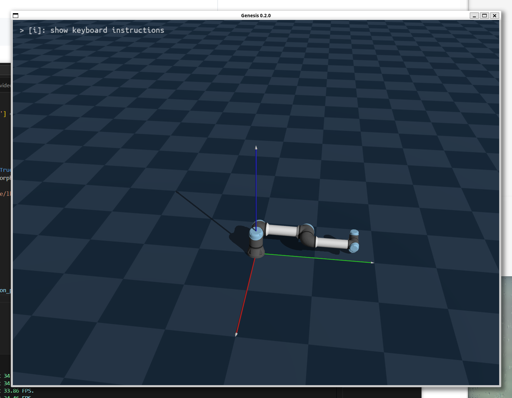

项目简介：Genesis是一个开源的生成式物理引擎，由卡内基梅隆大学等20多个研究机构经过两年合作开发而成，旨在为通用机器人、具身人工智能和物理人工智能应用提供支持。通过使用genesis对机器人及工程环境仿真实现实验内容。

# 1.Ubuntu环境配置

1.  ubuntu环境换源
    
2.  安装cuda
    
3.  安装miniconda
    
4.  安装pytorch
    
5.  安装genesis
    

参考链接：

```Bash
https://blog.csdn.net/xiangshangdemayi/article/details/144728092?fromshare=blogdetail&sharetype=blogdetail&sharerId=144728092&sharerefer=PC&sharesource=qq_69379513&sharefrom=from_link
```

# 2.Genesis 报错issue

参考链接：

```bash
https://blog.csdn.net/xiangshangdemayi/article/details/144728092?fromshare=blogdetail&sharetype=blogdetail&sharerId=144728092&sharerefer=PC&sharesource=qq_69379513&sharefrom=from_link
```
```bash
https://github.com/Genesis-Embodied-AI/Genesis/issues/43
```

# 3.Genesis 项目运行结果

hello\_robot.py

```python
import os
os.environ['PYOPENGL_PLATFORM'] = 'glx'

import genesis as gs
from pynput import keyboard

gs.init(backend=gs.gpu)

scene = gs.Scene(show_viewer=True)
plane = scene.add_entity(gs.morphs.Plane())
franka = scene.add_entity(
    gs.morphs.MJCF(file='xml/franka_emika_panda/panda.xml'),
)

scene.build()

def on_press(key):
    try:
        if key.char == 'q':
            return False
    except AttributeError:
        pass

listener = keyboard.Listener(on_press=on_press)
listener.start()

while listener.running:
    scene.step()
```

