https://www.runoob.com/numpy/numpy-tutorial.html菜鸟教程

# 1.安装

numpy是科学计算基础库,底层是C语言

三种方式：

## 1.1 通过pip安装

```python
pip install numpy
```

首选方式，自动处理依赖项

在提示系统命令符中使用cmd

## 1.2 通过Anaconda安装

```python
conda install numpy
```

自动解决环境依赖

## 1.3 通过系统包管理器（linux/macos）

对于Debian/Ubuntu

```python
sudo apt-get install python3-numpy
```

对于Fedora:

```python
sudo dnf install python3-numpy
```

# 2.创建数组

## 2.1 array()函数创建数组

### 2.2.1 函数语句

```python
numpy.array(object, dtype = None, copy = True, order = None, subok = False, ndmin = 0)
```

参数：

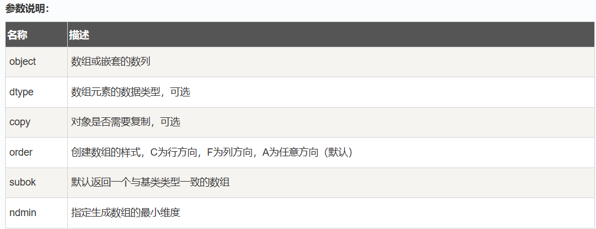

### 2.2.2 实例

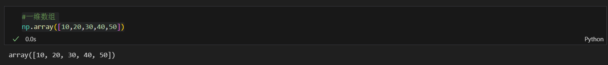

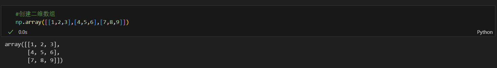

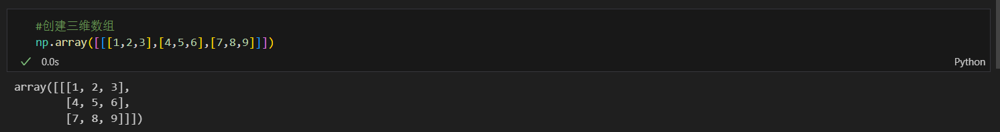

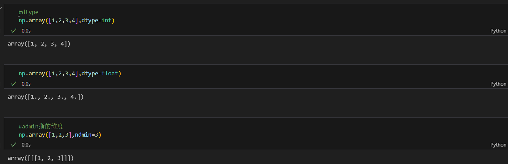

在使用admin属性指定维度时，如果是ndim=3，表示创建一个三维的数组；如果ndim=4，表示创建了一个四维的数组，上述结果就变为：

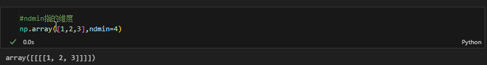

## 2.2 随机数创建数组

### 2.2.1 random语句

```python
#random.random()
#确定随机种子,就是每次运行结果是相同的
np.random.seed(0)
np.random.random()
#生成一个随机的数目
```

使用seed()函数后就可以保证每次生成的随机数都是一样的，不会再变了

可以指定数组形状 size

①生成一维数组

```python
#random.random(size())
np.random.random(size=5)
#生成一位的五个元素
a=np.random.random(size=4)
a.shape #输出数组形状
```

②生成二维数组

```python
#二维数组
aa=np.random.random(size=(4,5))
#生成四行五列的数组
```

③生成三维数组

```python
#三维数组
aaa=np.random.random(size=(2,3,4))
aaa.shape
```

### 2.2.2 randint语句

```python
#生成随机的整数 random.randint(low,high,size)
np.random.randint(5) #0~5中的随机一个数
```

①生成一维数组

```python
#一维
np.random.randint(1,11,size=(10))
#运行结果：array([4, 5, 5, 9, 5, 4, 8, 6, 6, 1], dtype=int32)
```

②生成二维数组

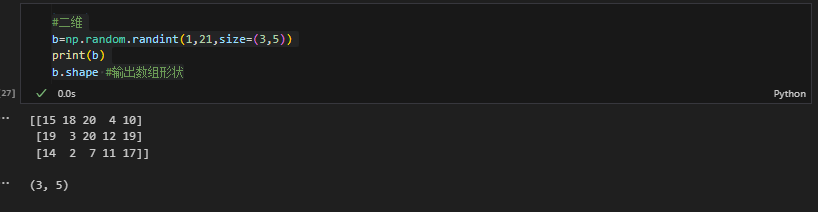

③生成三维数组

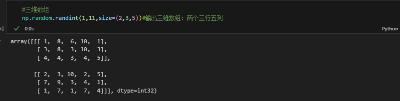

### 2.2.2 rand语句

Numpy 的函数，生成均匀分布的随机数（0-1）

```python
np.random.rand(100,10)
#第一个参数100：行数，表示有100个样本
#第二个参数10：列数，表示每个样本有10个值（例如分类标签）
```

## 2.3 arange()创建数组

### 2.3.1 函数语句

```python
numpy.arange([start,] stop[, step], dtype=None)
#参数
"""
start:起始值，可选，默认从 0 开始。
stop:结束值（不包含该值）。
step:步长，可选，默认是 1。可以为浮点数。
dtype:指定返回数组的数据类型（如 int32、float64 等），默认自动推断。
"""
```

### 2.3.2 实例

```python
#创建一维数组
np.arange(1,21,1,dtype=int)
#输出结果：
#array([ 1,  2,  3,  4,  5,  6,  7,  8,  9, 10, 11, 12, 13, 14, 15, 16, 17,18, 19, 20])
#创建二维数组
np.array([np.arange(1,4),np.arange(4,7)])
#结果：
"""
array([[1, 2, 3],
       [4, 5, 6]])
"""
```

## 2.4 生态分布

### 2.4.1 标准正态分布

randn()函数返回一个或一组数据，具有标准正态分布（期望为0，方差为1）

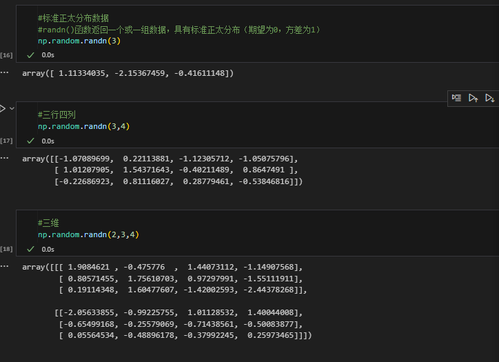

### 2.4.2 常规正态分布

```python
random.normal(loc,scale,size)也可以生成正态分布
#loc:期望
#scale:方差
#size:用于确定是几维的数列
```

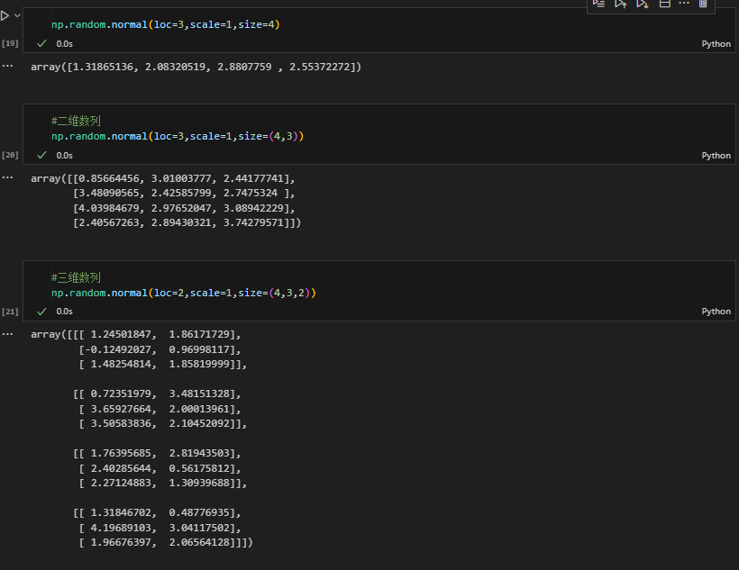

## 2.5 ndarry属性（数组属性）

ndim:秩，维度个数

size:数组元素的个数

shape:数组的形状

dtype:数组元素的类型

itemsize:每个元素的大小，以字节为单位，一个字节8位 (结果其实就是数组的元素类型结果除8)

他们都是属性，通过数组.属性的形式来确定

如果需要输出多个可以通过以下方式：

```python
print(a.dtype,aa.dtype,aaa.dtype,aaa.itemsize)
```

## 2.6 其他方式创建数组

### 2.6.1 zeros()创建数组

①创建一维数组

```python
np.zeros(10)
"""
输出结果：
array([0., 0., 0., 0., 0., 0., 0., 0., 0., 0.])
"""
```

上方代码等价于：

```python
np.zeros(shape=(10))#创建10个元素的0数组
```

也可以指定类型

```python
#指定类型
np.zeros(5,dtype=int)
```

②创建二维数组

```python
np.zeros((3,4),dtype=int)
```

③创建三维数组

```python
#创建三维数组
np.zeros((3,4,5),dtype=int)
```

④zeros\_like:根据传入的数组形状创建全为0的数组

```python
#使用zeros_like将创建的一维数组变成全0的数组
a=np.arange(4)#这个得到的结果：一维数组0，1，2，3
np.zeros_like(a)
#使用zeros_like将创建的二维数组变成全0的数组
aa=np.random.random(size=(4,5))
np.zeros_like(aa)
```

### 2.6.2 ones()创建数组

与zeros的用法一模一样，两者如果不指定元素类型的话，都默认为浮点型

### 2.6.3 empty()创建数组

①empty()用法

```python
numpy.empty(shape,dtype=float,order='c')
```

创建的一个指定形状(shape)、数据类型(dtype)且未初始化的数组，里边的元素的值是之前内存的值

order:有"C"和"F"两个选项,分别代表，行优先和列优先，在计算机内存中的存储元素的顺序。

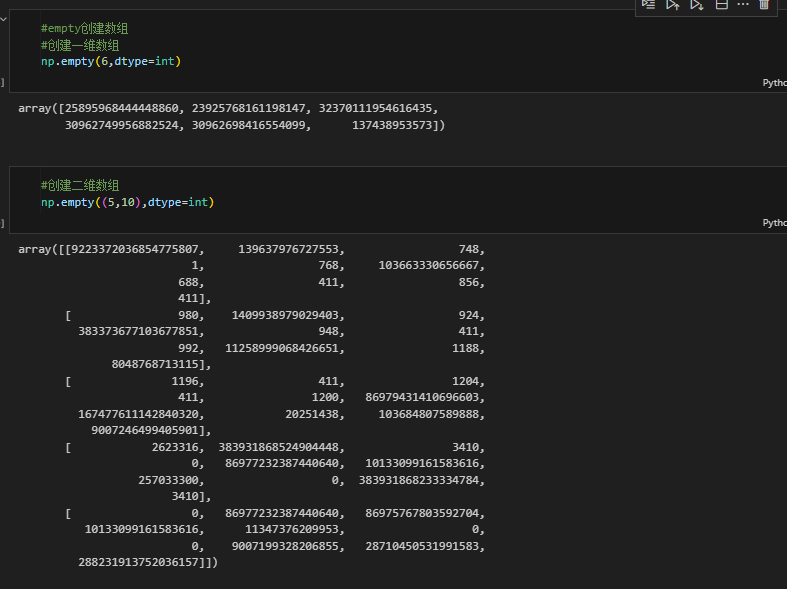

②empty()用法

```python
y=np.empty(10,dtype=int)
x=np.arange(5)
np.add(2,x,out=y[:5])
#指的是x数列中的每个元素都加2，然后再out存到y中，是存放到的是前五个
y
```

输出结果：

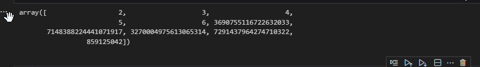

```python
x=np.arange(1,6)
y=np.empty(5,dtype=int)
np.add(x,2,out=y)
#将数列x中的每个元素都加2，然后放到y数列中去
```

③empty\_like()

**创建一个****与给定数组形状和数据类型相同****，但内容未初始化的新数组。**

`np.empty_like()`不会清空内存中的原数据，它只是分配一块与原数组相同大小和类型的内存区域。

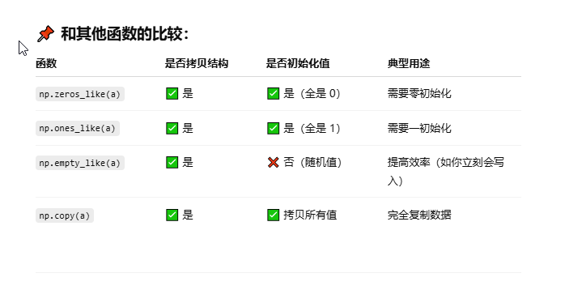

### 2.6.4 ？？用法

当想查看一个函数的参数时，可以通过？？来实现

```python
np.full??
```

### 2.6.5 full()创建数组

```python
full(shape,fill_value)
创建全为某个指定值的数组
```

①一维数组

```python
#创建一个一维数组,以20进行填充
np.full(10,20)
```

②二维数组

```python
#创建二维数组
np.full((3,5),11)
```

③full\_like用法

跟上边的zeros\_like()和ones\_like()的用法一模一样

这里是指定填充而已

```python
#创建一个指定形状数组
a=np.arange(1,37).reshape(4,9)
#进行指定填充
np.full_like(a,10)
```

输出结果：

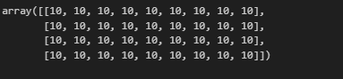

### 2.6.6 创建单位矩阵

#### 2.6.6.1 法1：eye()函数

```python
np.eye(4,dtype=int)
#四行四列的单位矩阵，是二维的，并且里边的元素全为整型
```

#### 2.6.6.2 法2：identity()

```python
#identity()
np.identity(5,dtype=int)
```

两个函数是有区别的

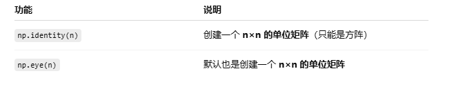

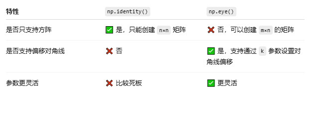

```python
# 创建一个 3 行 4 列的矩阵，对角线在第 0 条（默认）
np.eye(3, 4)
# 输出:
# [[1. 0. 0. 0.]
#  [0. 1. 0. 0.]
#  [0. 0. 1. 0.]]

# 对角线向上偏移1
np.eye(3, 4, k=1)
# 输出:
# [[0. 1. 0. 0.]
#  [0. 0. 1. 0.]
#  [0. 0. 0. 1.]]

```

### 2.6.7 linspace创建等差数列

```python
#linspace函数用于创建一个一维数组，数组是一个等差数列构成的，格式如下：
"""
np.linspace(start,|stop,num=50,endpoint=True,retstep=False,dtype=None)
参数介绍：
start：序列的起始值
stop:序列的终止值，如果endpoint为True，该值包含数列中
num：要生长的等步长的样本数量，默认为50
endpoint：该值为True时，数列中包含stop值，反之不包含，默认是True
retstep：如果为True时，生长的数组中会显示间距，反之不显示
dtype：ndarry的数据类型
"""
```

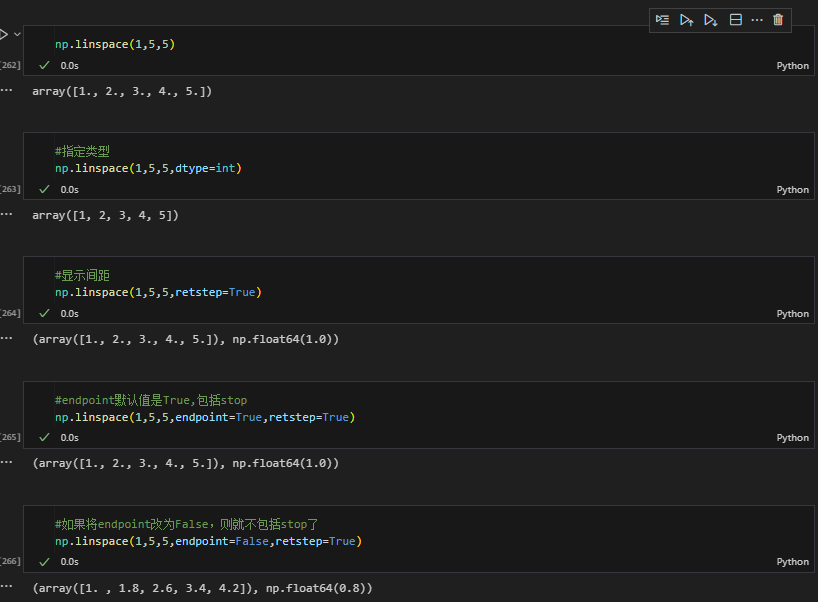

这里num=是可以省略的

也就是下方两行代码结果是一模一样的

```python
np.linspace(1,5,5)
np.linspace(1,5,num=5)
```

### 2.6.8 logspace创建等比数列

```python
#logspace函数用于创建一个等比数列，格式如下：
"""
np.logspace(start,stop,num=50,endpoint=True,base=10.0,dtype=None)
参数为：
start:序列的起始位置为：base**start
stop：序列的终止值为：base**stop。如果endpoint为True，该值包含于数列
num：要生长的等步长的样本数量，默认为50
endpoint：是否包含 stop 这个值，默认是 True
base：对数的底数，默认是 10（常见对数）
dtype：ndarry的数据类型
"""
```

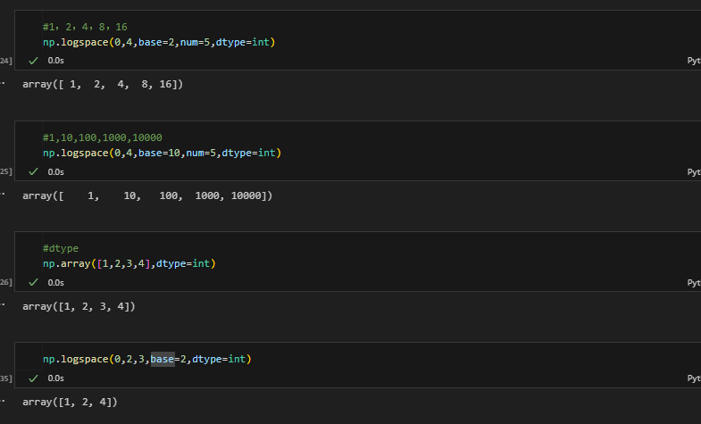

logspace()函数中的num参数也是可以不写num=的

endpoint是不可以省略的

3.  # 一维数组的索引和切片
    

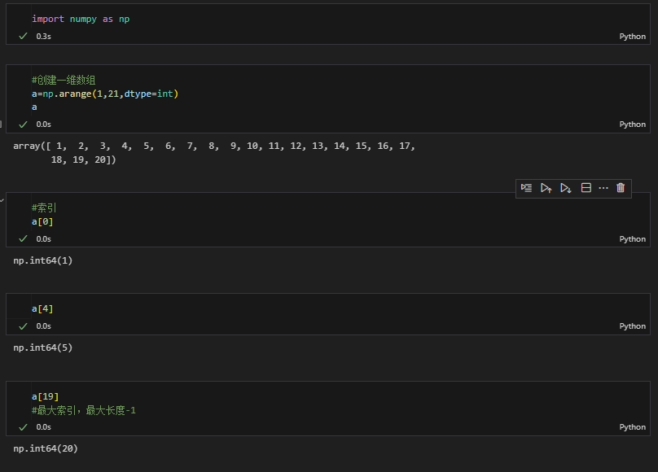

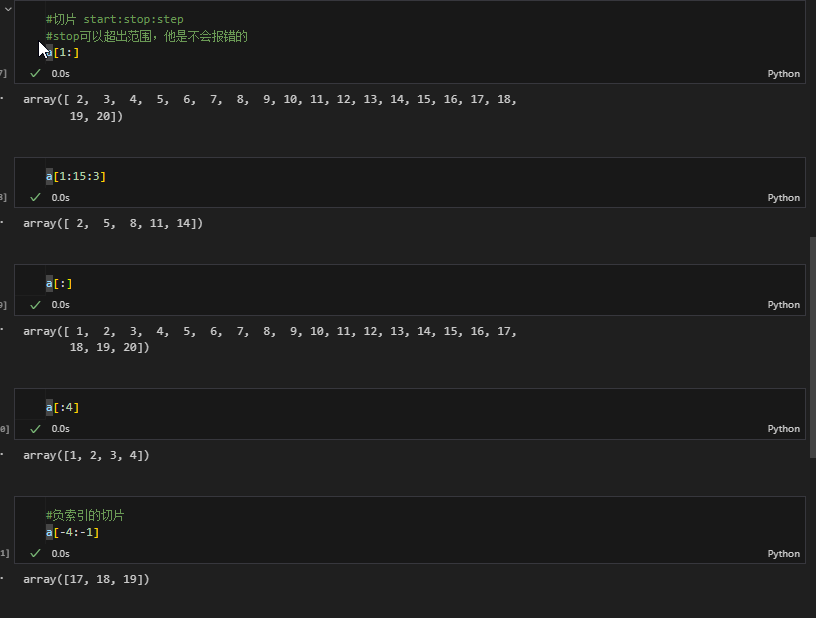

4.  # 二维数组的索引与切片
    

①获取指定单个元素

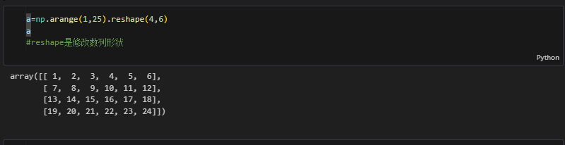

```python
#获取元素9
#先获取所在行，再获取所在列
#数组[行索引号，列索引号]
a[1,2]
```

②获取整行元素

```python
#获取整行 数组[行索引号]
#这个的效果与   数组[行索引号，：]效果是一样的
a[2]
#也可以负索引获取一行
a[-1]
```

③获取整列元素

```python
#获取整列 数组名[:,列索引]
a[:,2]
#也可以负索引获取一列
a[:,-1]
```

④部分行部分列的元素

```python
#部分行部分列 数组名[行切片，列切片]
a[:2,:]
#结果：
'''
array([[ 1,  2,  3,  4,  5,  6],
       [ 7,  8,  9, 10, 11, 12]])
'''
a[:,1:4]
#结果：
'''
array([[ 2,  3,  4],
       [ 8,  9, 10],
       [14, 15, 16],
       [20, 21, 22]])
'''
#对列行同时进行切片，使用了step参数
a[::2,::2]
```

⑤同时获取两个元素

```python
#同时获取第三行第二列，第四行第一列
#逗号前边括号为行的所有索引，逗号后边为列的所有索引
a[(2,3),(1,0)]
```

⑥切片，对行进行反向获取

```python
#切片 对所有行进行反向获取
a[::-1]
#结果：
'''
array([[19, 20, 21, 22, 23, 24],
       [13, 14, 15, 16, 17, 18],
       [ 7,  8,  9, 10, 11, 12],
       [ 1,  2,  3,  4,  5,  6]])
'''
#对行列都进行反向切片获取
a[::-1,::-1]
'''
array([[24, 23, 22, 21, 20, 19],
       [18, 17, 16, 15, 14, 13],
       [12, 11, 10,  9,  8,  7],
       [ 6,  5,  4,  3,  2,  1]])
'''
```

⑦修改元素

```python
#获取前两行和前两列
sub_a=a[:2,:2]
#修改sub_a第一个元素的值
sub_a[0,0]=100
```

⑧数组复制copy()

```python
#数组复制
copy_a=np.copy(sub_a)
#修改copy_a后不影响原数组
copy_a[0,0]=100
```

使用copy()指令后创建的数组，对这个新的数组的元素进行改变，原数组的元素值是不会发生改变的

# 5.改变数组的维度

## 5.1 使用reshape()

通过reshape方法可以将一维数组变成二维数组、三维或者多维数组，也可以通过reshape方法将多维数组变成一维

①一维数组转换为二维数组

```python
a=np.arange(1,13)
#将一维数组进行转换
#注意点：元素个数不可以变
#转换维度要保持一致，不一致就异常！！！
aa=a.reshape(2,6)
```

②一维数组转换为三维数组

```python
aaa=a.reshape(2,3,2)
```

③二维数组转化为一维数组

```python
#知道元素个数：
aa.reshape(12)
```
```python
#不知道元素个数，参数传递-1
aa.reshape(-1)
```

④三维数组转换为一维数组

```python
aaa.reshape(-1)
```

## 5.2 使用revel()转换为一维数组

```python
aa=np.arange(1,13).reshape(2,6)#转换为2行6列的数组
aa.revel()
#结果：
#array([ 1,  2,  3,  4,  5,  6,  7,  8,  9, 10, 11, 12])
```

## 5.3 使用flatten()转换为一维数组

```python
aa=np.arange(1,13).reshape(2,6)
aa.flatten()
#结果：
#array([ 1,  2,  3,  4,  5,  6,  7,  8,  9, 10, 11, 12])
```

## 5.4 使用resize()

改变数组的维度还可以直接设置numpy数组的shape属性（元组类型）

通过resize方法可以改变数组的维度

#resize修改数组维度

#以元组的形式指定形状

#改变的是原数组

```python
a=np.arange(1,13)
a.shape=(2,6)#改变了原数组
a=resize((12))
#结果：
#array([ 1,  2,  3,  4,  5,  6,  7,  8,  9, 10, 11, 12])
```
```python
a.resize((6,2))
#结果：
'''
array([[ 1,  2],
       [ 3,  4],
       [ 5,  6],
       [ 7,  8],
       [ 9, 10],
       [11, 12]])
'''
```

## 5.5 使用数组shape属性修改

改变了原数组

```python
a=np.arange(1,13)
a.shape=(2,6)
#结果：
'''
array([[ 1,  2,  3,  4,  5,  6],
       [ 7,  8,  9, 10, 11, 12]])
'''
```

## 5.6 重要比较：

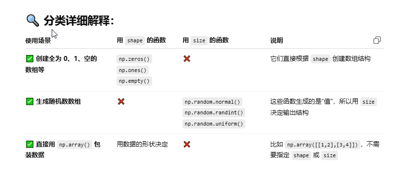

口诀：NumPy 函数要么用 `shape`，要么用 `size`，创建结构用 shape，造数据用 size


# 6.数组的拼接

## 6.1 使用concatenate数组拼接

使用concatenate进行数组拼接连接沿现有轴的数组数列

函数内部传两个数列构成的数列或者元组

①一维数组的拼接

```python
a=np.array([1,2,3])
b=np.array([4,5,6])
#调用concatenate进行数组拼接
np.concatenate((a,b))
#这里函数内部是以数列或者元组的形式进行传递的，也可以使用数列
#np.concatenate([a,b])
```

②一维多个数组拼接

```python
#也可以多个数组进行拼接
c=np.array([10,11,13])
c
np.concatenate((a,b,c))
```

③二维数组拼接

```python
#二维数组使用concatenate进行拼接
aa=np.arange(1,13).reshape(3,4)
bb=np.arange(101,113).reshape(3,4)
#调用concatenate进行拼接,axis默认值为0，按行;axis=1时按列
#concatenate是有两个参数的，一个是要拼接数组组成的数列或者元组，另一个是轴axis
np.concatenate((aa,bb),axis=0)
```

结果：

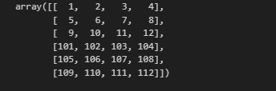

```python
#指定axis为1进行拼接
np.concatenate((aa,bb),axis=1)
```

结果：

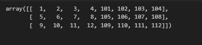

**二维数组总结：0竖着方向，1横着方向**

④三维数组拼接

#concatenate()三维数组拼接，axis有三个维度0，1，2

```python
#两个三行六列
aaa=np.arange(1,37).reshape(2,3,6)
bbb=np.arange(101,137).reshape(2,3,6)
#axis=0
s=np.concatenate((aaa,bbb),axis=0)
s.shape
#输出：(4,3,6)
#axis=1
ss=np.concatenate((aaa,bbb),axis=1)
ss.shape
#输出：(2,6,6)
#axis=2
np.concatenate((aaa,bbb),axis=2).shape
#输出：（2，3，12）
```

⑤四维数组拼接

```python
#两个三行六列
aaa=np.arange(1,37).reshape(2,3,6)
bbb=np.arange(101,137).reshape(2,3,6)
aaaa=aaa.reshape(2,3,3,2)
bbbb=bbb.reshape(2,3,3,2)
#axis=0
np.concatenate((aaaa,bbbb),axis=0).shape
#结果：（4，3，3，2）
#axis=1
np.concatenate((aaaa,bbbb),axis=1).shape
#结果：（2，6，3，2）
#axis=2
np.concatenate((aaaa,bbbb),axis=2).shape
#结果：（2，3，6，2）
#axis=3
np.concatenate((aaaa,bbbb),axis=3).shape
#结果：（2，3，3，4）
```

## 6.2 使用hstack数组拼接

使用hstack进行数组拼接，水平堆叠序列中的数组(列方向)

①二维数组

```python
aa=np.arange(1,13).reshape(3,4)
bb=np.arange(101,113).reshape(3,4)
np.hstack((aa,bb))
#跟concatenate函数方法一样，把要拼接的数组放到数列或者元组中去
#np.hstack([aa,bb])
```

结果：

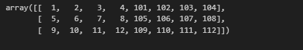

等效于concatenate()函数中axis=1时的情况

②三维数组

```python
#两个三行六列
aaa=np.arange(1,37).reshape(2,3,6)
bbb=np.arange(101,137).reshape(2,3,6)
#使用hstack
np.hstack((aaa,bbb)).shape
#输出：（2，6，6）
```

## 6.3 使用vstack数组拼接

使用vstack进行数组拼接，竖直堆叠序列中的数组(行方向)

①二维数组

```python
aa=np.arange(1,13).reshape(3,4)
bb=np.arange(101,113).reshape(3,4)
#vstack 垂直方向进行堆叠
np.vstack((aa,bb))
#与hstack传的参数类似，等价于：
np.vstack([aa,bb])
```

结果：

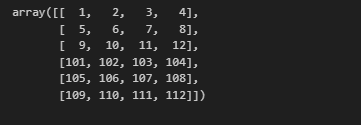

②三维数组

```python
#两个三行六列
aaa=np.arange(1,37).reshape(2,3,6)
bbb=np.arange(101,137).reshape(2,3,6)
#使用vstack
np.vstack((aaa,bbb)).shape
#输出：（4，3，6）
```

## 6.4 使用dstack数组拼接

该方法是三维数组特有的方法

也就是说

一维数组拼接方法用：concatenate()

二维数组拼接方法用: concatenate(),hstack(),vstack()

三维数组拼接方法用: concatenate(),hstack(),vstack(),dstack()

四维数组及多维数组只能用concatenate进行拼接

```python
#两个三行六列
aaa=np.arange(1,37).reshape(2,3,6)
bbb=np.arange(101,137).reshape(2,3,6)
#使用dstack
np.dstack((aaa,bbb)).shape
#结果：（2，3，12）
```

# 7.数组转置

使用transpose()函数

```python
import numpy as np
a= np.arange(1,13).reshape(4,3)
#二维数组转置
#调用transpose()函数
a.transpose()
#对于二维数组也可以采用.T来实现
a.T#与上述代码一样
#结果：
'''
array([[ 1,  4,  7, 10],
       [ 2,  5,  8, 11],
       [ 3,  6,  9, 12]])
'''
```

也可以使用np.transpose()的形式

#多维数组进行转置 np.transpose()

#对二维数组也可以使用np.transpose()进行转置

#这个有两个维度，第一个是数组，第二个是维度,可以是数列也可以是元组的形式传到这个函数中

第二个参数，维度可以理解为用axis中的数来理解

对于二维数组，axis是有两个值的0，1 进行转置就传（1,0）两者进行了替换

对于三维数组，axis是有三个值的0，1，2，进行转置，想换哪个就将默认的(0,1,2)进行改

四维及以上的数组也是一样的道理

```python
x=np.arange(1,37).reshape(3,6,2)
x.shape
#结果：（3,6,2）
#使用np.transpose()进行转置 变为(2,6,3)
np.transpose(x,(2,1,0)).shape
#结果：(2,6,3)
aaaa=np.arange(1,37).reshape(3,2,1,6)
aaaa.shape
#结果：（3，2，1，6）
#使用np.transpose()进行转置 变为(2,1,3,6)
np.transpose(aaaa,(1,2,0,3)).shape
#结果：(2,1,3,6)
```

# 8.数组分割

split分割

numpy.split(ary,indics\_or\_sections,axis)

解释：

ary:被分割的数组

indics\_or\_sections:如果是一个整数，就用该数平均切分，如果是一个数组，为沿轴切分的位置(左开右闭)

axis:沿着哪个维度进行切向，默认为0，横向切分。为1时，纵向切分

①一维数组的分割

```python
a=np.arange(1,9)
#如果传入整数，必须能够平分，否则会报错
np.split(a,2)
#结果：
#[array([1, 2, 3, 4]), array([5, 6, 7, 8])]
np.split(a,4)
#结果：
#[array([1, 2]), array([3, 4]), array([5, 6]), array([7, 8])]
#传入数组
np.split(a,[3,5])
#结果：
#[array([1, 2, 3]), array([4, 5]), array([6, 7, 8])]
np.split(a,[5,7])
#结果：
#[array([1, 2, 3, 4, 5]), array([6, 7]), array([8])]
```

②二维数组的分割

使用split()

```python
#二维数组分割
aa=np.arange(1,37).reshape(6,6)
#默认axis=0  传入整数平均分,按行来的
np.split(aa,3)
#输出结果：
'''
[array([[ 1,  2,  3,  4,  5,  6],
        [ 7,  8,  9, 10, 11, 12]]),
 array([[13, 14, 15, 16, 17, 18],
        [19, 20, 21, 22, 23, 24]]),
 array([[25, 26, 27, 28, 29, 30],
        [31, 32, 33, 34, 35, 36]])]
 '''
#传入数组
np.split(aa,[2,5])
#输出结果：
'''
[array([[ 1,  2,  3,  4,  5,  6],
        [ 7,  8,  9, 10, 11, 12]]),
 array([[13, 14, 15, 16, 17, 18],
        [19, 20, 21, 22, 23, 24],
        [25, 26, 27, 28, 29, 30]]),
 array([[31, 32, 33, 34, 35, 36]])]
'''
#axis=1 按照列来分
np.split(aa,3,axis=1)
#输出结果：
'''
[array([[ 1,  2],
        [ 7,  8],
        [13, 14],
        [19, 20],
        [25, 26],
        [31, 32]]),
 array([[ 3,  4],
        [ 9, 10],
        [15, 16],
        [21, 22],
        [27, 28],
        [33, 34]]),
 array([[ 5,  6],
        [11, 12],
        [17, 18],
        [23, 24],
        [29, 30],
        [35, 36]])]
 '''
#传入数组
np.split(aa,[1,2],axis=1)
#结果：
'''
[array([[ 1],
        [ 7],
        [13],
        [19],
        [25],
        [31]]),
 array([[ 2],
        [ 8],
        [14],
        [20],
        [26],
        [32]]),
 array([[ 3,  4,  5,  6],
        [ 9, 10, 11, 12],
        [15, 16, 17, 18],
        [21, 22, 23, 24],
        [27, 28, 29, 30],
        [33, 34, 35, 36]])]
'''
#在处理二维数组时也可以直接用vsplit()和hsplit()函数
np.vsplit(aa,3)
#结果：
'''
[array([[ 1,  2,  3,  4,  5,  6],
        [ 7,  8,  9, 10, 11, 12]]),
 array([[13, 14, 15, 16, 17, 18],
        [19, 20, 21, 22, 23, 24]]),
 array([[25, 26, 27, 28, 29, 30],
        [31, 32, 33, 34, 35, 36]])]
'''
np.hsplit(aa,3)
#结果：
'''
[array([[ 1,  2],
        [ 7,  8],
        [13, 14],
        [19, 20],
        [25, 26],
        [31, 32]]),
 array([[ 3,  4],
        [ 9, 10],
        [15, 16],
        [21, 22],
        [27, 28],
        [33, 34]]),
 array([[ 5,  6],
        [11, 12],
        [17, 18],
        [23, 24],
        [29, 30],
        [35, 36]])]
'''
np.vsplit(aa,[2,5])
#结果：
'''
[array([[ 1,  2,  3,  4,  5,  6],
        [ 7,  8,  9, 10, 11, 12]]),
 array([[13, 14, 15, 16, 17, 18],
        [19, 20, 21, 22, 23, 24],
        [25, 26, 27, 28, 29, 30]]),
 array([[31, 32, 33, 34, 35, 36]])]
 '''
```

# 9.数学函数

补充回顾：python的列表推导式

```python
[1/i for i in a]
```

## 9.1 求倒数

```python
#数组求倒数
a=[1,2,3,4,5]
b=np.array(a)#将列表转换为数组
1/b
```
```python
a=[1,2,3,4,5]
b=np.array(a)
#调用numpy中的函数reciprocal()
np.reciprocal(b)
```

## 9.2 求平方

①一维数组

```python
#square()，求平方
#一维数组
a=np.arange(1,10)
np.square(a)
```
```python
#或者通过循环遍历的形式来计算
#这是一个列表
[i*i for i in a]#这个求完之后在数列当中
np.array([i*i for i in a])
```

②二维数组

```python
#二维数组
aa=np.arange(1,13).reshape(4,3)
np.square(aa)
```
```python
#传统的方式
bb=np.empty_like(aa)
for i in range(4):
    for j in range(3):
        bb[i,j]=aa[i,j]*aa[i,j]
bb
```

## 9.3 求各元素的符号

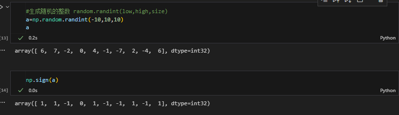

## 9.4 modf函数

计算各元素的小数部分和整数部分以两个独立的数组返回

```python
a=np.arange(-10,10,0.3)
np.modf(a)
```

总结：就是得到两个数组，一个是由小数部分组成，另一个数组是由整数部分组成

## 9.5 向上取整、向下取整、四舍五入

np.cell()

np.floor()

np.rint()

对各元素分别向上取整、向下取整、四舍五入

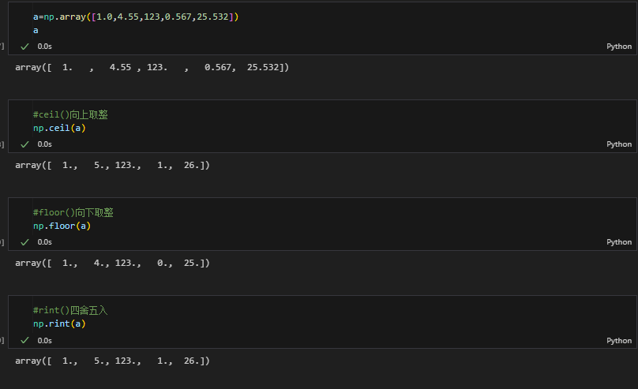

## 9.6 around()函数

around()函数也可以实现对数的小数位数进行操作

其中的参数：

1.要传的数组

2.decimals:舍入的小数位数。默认值为0。如果为负，整数将四舍五入到小数点左侧的位置

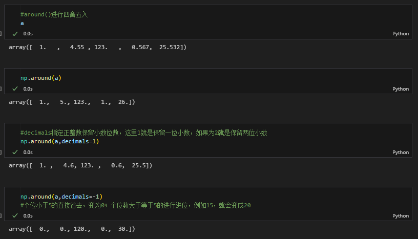

## 9.7 三角函数

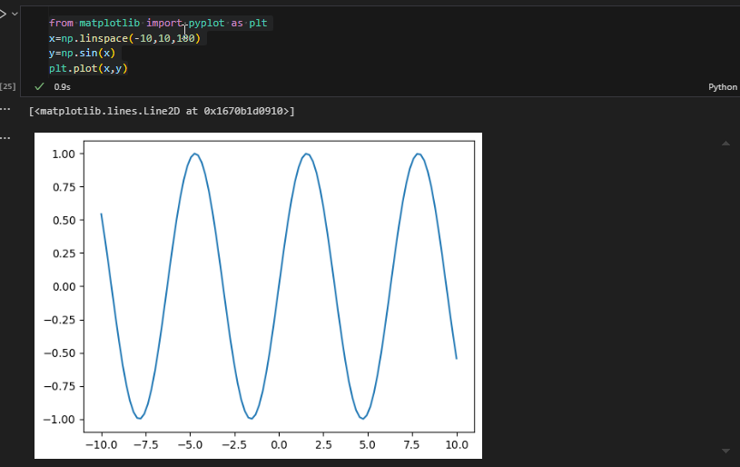

引入图像模块非常重要

```python
from matplotlib import pyplot as plt
```

# 10.算数函数

加减乘除运算跟python基础语法没区别

除了python那种方法外还可以使用函数

加：np.add(a,b)

减：np.subtract(a,b)

乘：np.multiply(a,b)

除：np.divide(a,b) == a/b

取余：np.mod(a,b) == a%b

必须会的用法：

```python
a=np.arange(9).reshape(3,3)
b=np.array([10,10,10])
result=np.empty_like(a)
np.add(a,b,out=result)
result
```

总结：使用函数可以使用out参数将结果放到具体的位置，在进行运算时，两个数组形状不同时，会进行广播操作，变成一样的

# 11.统计函数

sum max min mean

这些有axis参数，可以指定方向

## 11.1 sum()求和函数

```python
#创建一维数组
a=np.random.randint(1,100,20)
np.sum(a)#求和
```

## 11.2 max()求最大值函数

```python
#创建一维数组
a=np.random.randint(1,100,20)
np.max(a)
#最大索引(求最大元素的索引)arg
np.argmax(a)
```
```python
a = np.array([1, 5, 3])
b = np.array([3, 2, 4])

print(np.maximum(a, b))   # [3 5 4]，每个位置上取较大值
```

## 11.3 mean()求平均值函数

①一维数组：

```python
#创建一维数组
a=np.random.randint(1,100,20)
#求平均值
np.mean(a)
```

②二维数组

```python
#二维数组
aa=np.arange(1,13).reshape(3,4)
#对数组中的所有数求平均
np.mean(aa)
```

## 11.4 median()求中位数函数

```python
#求中位数
b=np.arange(1,10)
np.median(b)
#正常这个代码就可以，对于奇数就是排序后中间哪个值，对于偶数就是排序后中间那两个数的平均值
```

## 11.5 power()求幂运算函数

```python
b=np.arange(1,10)
#幂运算
#第一个参数是要进行幂运算的数列，第二个参数是为方
np.power(b,2)
#或者以下代码，将数据存储起来
y=np.empty_like(b)
np.power(b,2,out=y)
```

## 11.6 sqrt()求开方函数

```python
b=np.arange(1,10)
#开方
np.sqrt(b)
#或者以下代码，将数据存储起来
y=np.empty_like(b,dtype=float)
np.sqrt(b,out=y)
```

## 11.7 cumsum()累计求和函数

对数组中的元素累计求和，可指定轴

#累计求和的意思是：

a = np.array(\[1, 2, 3, 4\])

\[1, 1+2, 1+2+3, 1+2+3+4\] → \[1, 3, 6, 10\]

```python
b=np.arange(1,10)
np.cumsum(b)
#结果：
#array([ 1,  3,  6, 10, 15, 21, 28, 36, 45])
```

## 11.8 cumprod()累计求积函数

```python
b=np.arange(1,10)
#对数组中的元素累计求积，可指定轴
np.cumprod(b)
#结果：
#array([     1,      2,      6,     24,    120,    720,   5040,  40320,362880])
```

## 11.9 uniqu()删除重复元素+排序

```python
#删除数组中的重复数据，并对数据进行排序
a=np.array([1,2,3,12,3,10,32,0,23,4])
np.unique(a)
#结果：
#array([ 0,  1,  2,  3,  4, 10, 12, 23, 32])
```

升序形式排序

## 11.10 nonzero()返回非零元素索引

```python
a=np.array([1,2,3,12,3,10,32,0,23,4])
#返回数组中非零元素的索引
np.nonzero(a)
```

## 11.11 ptp()计算最值之差

```python
a=np.array([1,2,3,12,3,10,32,0,23,4])
#计算一组数中最大值与最小值的差，可指定轴
np.ptp(a)
```

# 12.其他常用函数

## 12.1 tile()元素按行列复制扩展

将数组的数据按照行列复制扩展

```python
a=np.arange(1,5)
np.tile(a,2)
#结果：
#array([1, 2, 3, 4, 1, 2, 3, 4])
#行复制两次，列复制三次
np.tile(a,(2,3))
#结果：
'''
array([[1, 2, 3, 4, 1, 2, 3, 4, 1, 2, 3, 4],
       [1, 2, 3, 4, 1, 2, 3, 4, 1, 2, 3, 4]])
'''
#创建二维数组
aa=np.arange(1,13).reshape(4,3)
np.tile(aa,2)#一个数的时候就是行
#结果：
'''
array([[ 1,  2,  3,  1,  2,  3],
       [ 4,  5,  6,  4,  5,  6],
       [ 7,  8,  9,  7,  8,  9],
       [10, 11, 12, 10, 11, 12]])
'''
np.tile(aa,(2,3))
#结果：
'''
array([[ 1,  2,  3,  1,  2,  3,  1,  2,  3],
       [ 4,  5,  6,  4,  5,  6,  4,  5,  6],
       [ 7,  8,  9,  7,  8,  9,  7,  8,  9],
       [10, 11, 12, 10, 11, 12, 10, 11, 12],
       [ 1,  2,  3,  1,  2,  3,  1,  2,  3],
       [ 4,  5,  6,  4,  5,  6,  4,  5,  6],
       [ 7,  8,  9,  7,  8,  9,  7,  8,  9],
       [10, 11, 12, 10, 11, 12, 10, 11, 12]])
'''

```

## 12.2 repeat()元素重复若干

repeat()将数组中的每个元素重复若干次

```python
a=np.arange(1,5)
np.repeat(a,3)
#结果：
#array([1, 1, 1, 2, 2, 2, 3, 3, 3, 4, 4, 4])
aa=np.arange(1,13).reshape(4,3)
#这个重复之后二维变成一维
np.repeat(aa,2)
'''
array([ 1,  1,  2,  2,  3,  3,  4,  4,  5,  5,  6,  6,  7,  7,  8,  8,  9, 9, 10, 10, 11, 11, 12, 12])
'''
#指定axis
np.repeat(aa,2,axis=0)
#结果：
'''
array([[ 1,  2,  3],
       [ 1,  2,  3],
       [ 4,  5,  6],
       [ 4,  5,  6],
       [ 7,  8,  9],
       [ 7,  8,  9],
       [10, 11, 12],
       [10, 11, 12]])
'''
np.repeat(aa,2,axis=1)
#结果：
'''
array([[ 1,  1,  2,  2,  3,  3],
       [ 4,  4,  5,  5,  6,  6],
       [ 7,  7,  8,  8,  9,  9],
       [10, 10, 11, 11, 12, 12]])
'''
```

## 12.3 roll()沿指定轴对数组元素移位

```python
a=np.arange(1,5)
#array([，2，3，4])
np.roll(a,2)#传正数向后调多少位，传负数向前调多少位
#结果：
#array([3, 4, 1, 2])
np.roll(a,-1)
#结果：
#array([2, 3, 4, 1])
```

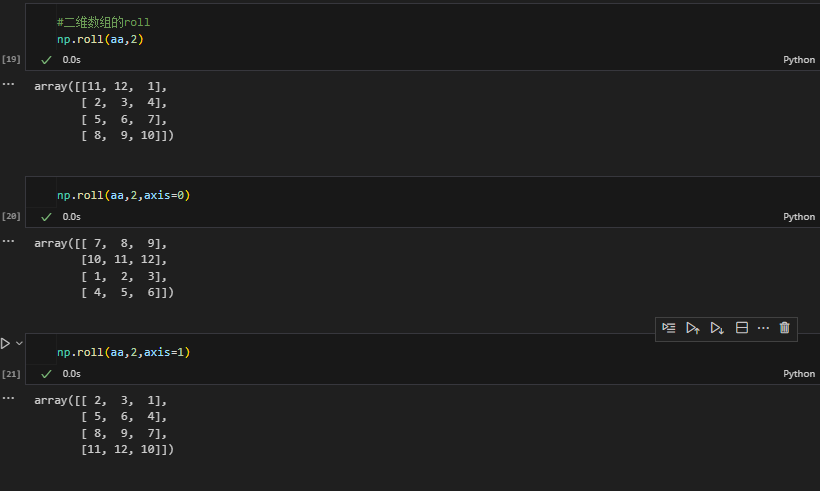

## 12.4 resize()重新调整数组大小

resize()重新调整数组的大小

reshape修改数组的维度，数组元素个数不能改变，要保持一致

```python
#resize()重新调整 数组的大小，数组元素个数可以不相同
np.resize(aa,(2,6))
np.resize(aa,(2,9))#这样改完之后可以与原数组形状不同，多出来的元素又从第一个元素依次进行排
```

## 12.5 place()/put()函数

将数组中满足条件的元素/指定的元素替换为指定的值

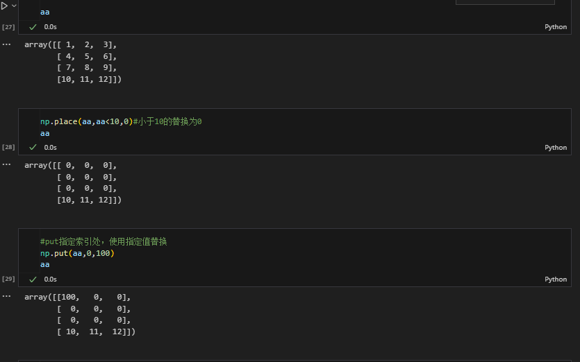

## 12.6 保存加载文件

savetxt():将数据保存到txt文件中

loadtxt():从文件加载数据

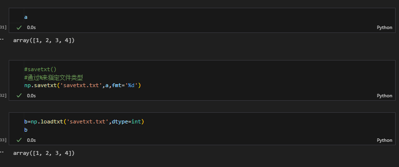

## 12.7 genfromtxt()函数

根据文件内容中生成数据，可以指定缺失值的处理等

## 12.8 any()/all()函数

any():如果数组中存在一个True的元素（或者能转化为True的元素），则返回True

all():如果数组中所有的元素都为True（或者能转为True的元素），则返回True

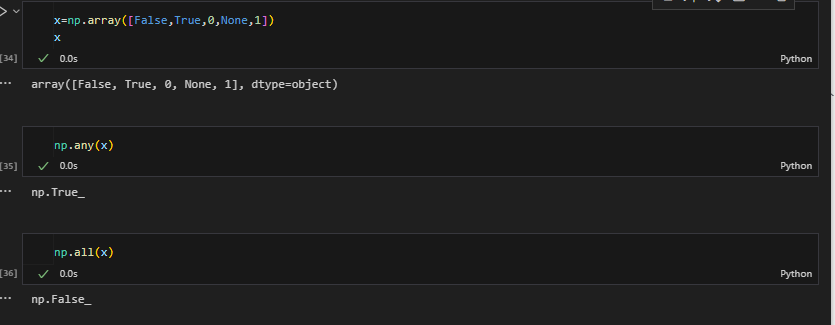

## 12.9 where语句

np.where(条件,x,y)

如果条件为True,对应值为x,否则对应值为y

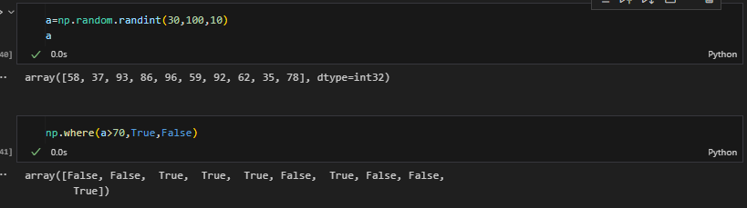

## 12.10 dot()矩阵

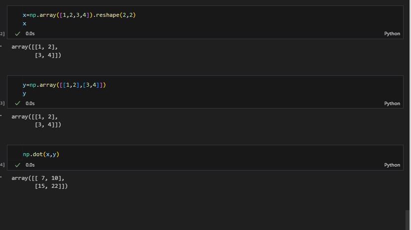

# 13.数组排序

排序主要用到的方法是np.sort和np.argsort

其中np.sort()对数组直接排序

而np.argsort()是返回排序后的原始索引

①一维数组

```python
#创建一维数组
a=np.array([3,12,8,23,67,123,6,10])
np.sort(a)#升序排序
np.argsort(a)#按照元素大小来索引排序
```

②二维数组

```python
np.random.seed(0)#保证每次值一样
aa=np.random.randint(100,size=(4,6))
#原数组：
'''
array([[44, 47, 64, 67, 67,  9],
       [83, 21, 36, 87, 70, 88],
       [88, 12, 58, 65, 39, 87],
       [46, 88, 81, 37, 25, 77]], dtype=int32)
'''
np.sort(aa)#每行进行了排序
'''
array([[ 9, 44, 47, 64, 67, 67],
       [21, 36, 70, 83, 87, 88],
       [12, 39, 58, 65, 87, 88],
       [25, 37, 46, 77, 81, 88]], dtype=int32)
'''
#axis=0时
np.sort(aa,axis=0)
'''
array([[44, 12, 36, 37, 25,  9],
       [46, 21, 58, 65, 39, 77],
       [83, 47, 64, 67, 67, 87],
       [88, 88, 81, 87, 70, 88]], dtype=int32)
'''
#axis=1时,为默认值
np.sort(aa,axis=1)
'''
array([[ 9, 44, 47, 64, 67, 67],
       [21, 36, 70, 83, 87, 88],
       [12, 39, 58, 65, 87, 88],
       [25, 37, 46, 77, 81, 88]], dtype=int32)
'''
#按最后一列排序
b=aa[:,-1]
#获取最后一列排好序的索引
index=np.argsort(b)
aa[index]
'''
array([[44, 47, 64, 67, 67,  9],
       [46, 88, 81, 37, 25, 77],
       [88, 12, 58, 65, 39, 87],
       [83, 21, 36, 87, 70, 88]], dtype=int32)
'''
```

# 14.广播机制

广播的规则：

  

1.如果两个数组维度个数不同，那么小维度的数组形状会在左边补1，

例如1和\[1,2\]这两个维度个数是不同的，一个是数，是个标量是0维的，另一个是一维的，第一个数形状往左补1，之后就可以进行广播了

2.如果两个数组形状在任何维度上都不匹配，数组的形状会沿着维度为1的维度扩展到匹配上另一个数组的形状

3.如果没有维度形状为1，则会引发异常

也就是只有维度或者个数为1才可以进行广播操作

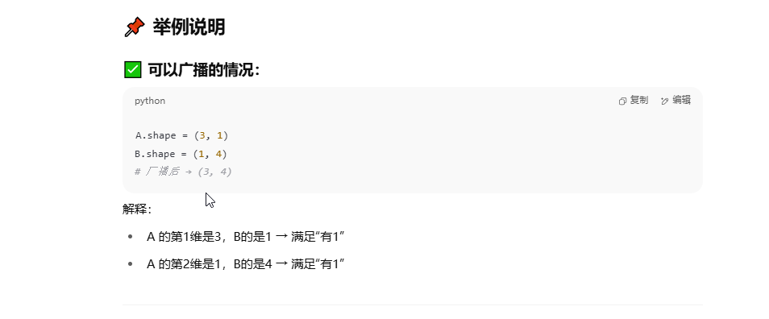

# 15.比较掩码

比较操作，会返回与参与运算数组形状相同的数组，其中，满足条件的为True，不满足的为False

```python
a=np.array([[1,2,3],[11,12,13],[21,22,23]])
a<20#结果是一个由True,False组成的数组
a[a<20]#小于20的元素会存到这个数组中
#结果：
#array([ 1,  2,  3, 11, 12, 13])
```

# 16.魔法命令time

魔法命令是ipython提供特殊命令，能实现一些特殊功能，比如统计时间(time/timeit)和占用内存(memit/mprun)等功能,魔法命令有种形式：

%:行模式

%%:单元格模式

IPython 是一个“更强大、更智能”的 Python 交互式命令行工具，比你平时在终端运行的 python 要聪明得多。

```python
#程序执行时间
import time 
#获取时间
start=time.time()
time.sleep(0.4)#让程序暂停执行 0.4 秒（即 400 毫秒）再继续运行
#获取时间
end=time.time()
end-start
```

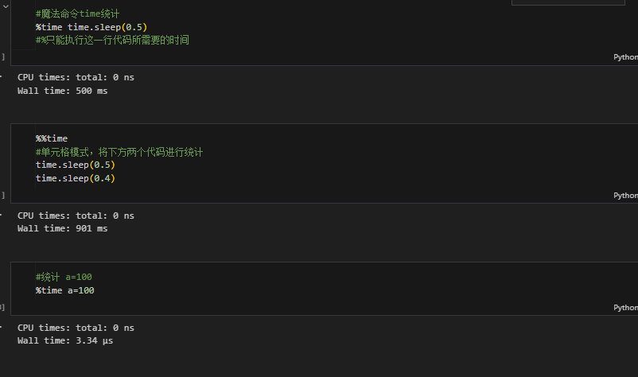

# 17.魔法命令timeit

timeit可以循环执行被统计语句，得到平均执行时间，支持行模式和单元格模式

timeit命令参数，-n指定每轮测试次数，-r指定测试轮数(默认为7)

单元格模式：

第一行语句(与timeit同一行语句)为初始化语句，作用为后续代码中变量提供初始化功能

初始化语句执行次数由轮数来决定

初始化语句每轮测试只执行一次，且不参与计时。第二行至整个单元格末尾语句会执行相应次数，并参与计时

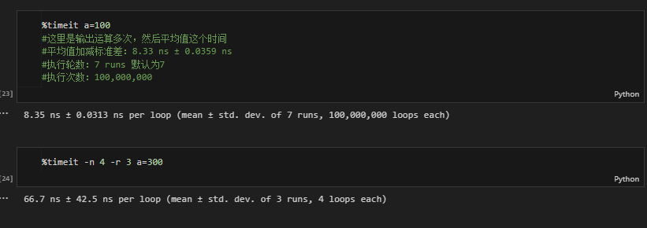

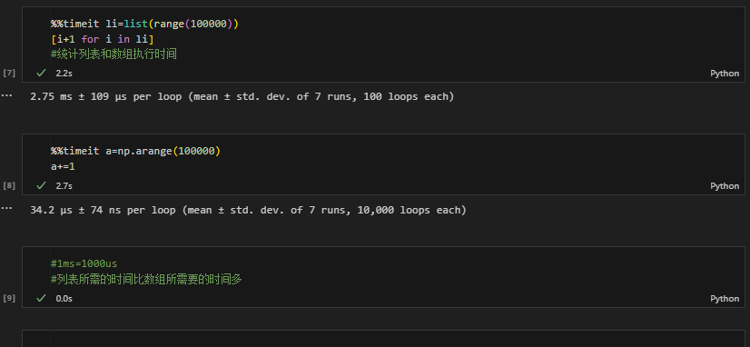

# 18.魔法命令writefile和run

writefile将单元格内容写入到文件中。如果文件不存在则创建，如果文件存在，则覆盖文件。如果指定-a参数，则追加内容，不覆盖

run运行外部python文件，运行结束后，外部文件中定义的变量得到保留

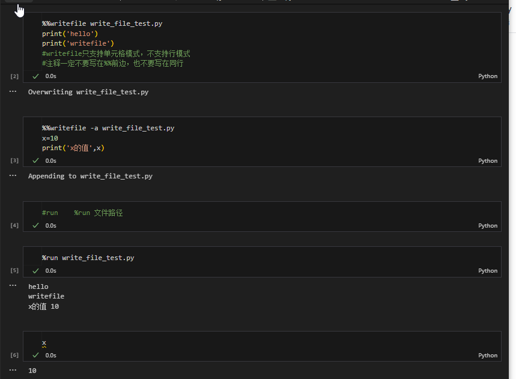

# 19.魔法命令memit

memit：用于分析语句内存使用情况，memit支持行模式与单元格模式。单元格模式下，初始化语句不会参与计算内存。第二行至整个单元格末尾会参与计算内存

说明：

memit不是Ipython的内置，需要安装memory\_profiler模块(pip install memory\_profiler)

安装后，需要通过%load\_ext memory\_profiler载入，才能使用

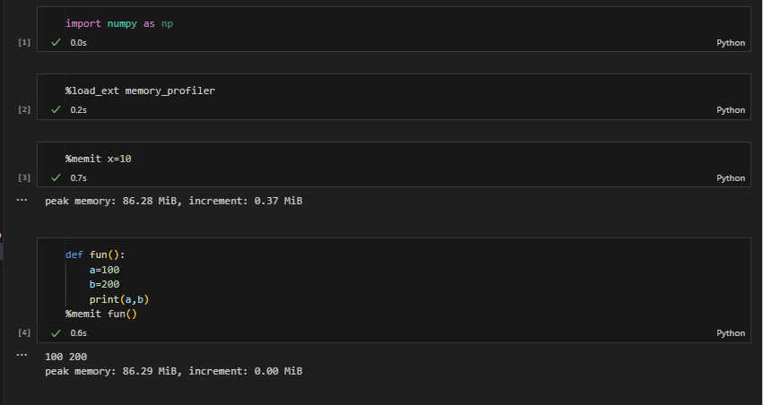

补充：

Python 3.12+ 版本已经完全移除了 distutils 模块，而许多工具链（包括 IPython 的旧版本）仍依赖它

在 Python 3.10+ 版本中，distutils 库已被弃用，并在 Python 3.12 中完全移除。在加载 memory\_profiler 扩展时，因为 IPython 的旧版本依赖 distutils,当前python版本太高，所以如果不升级升级 IPython 和依赖库或者降python版本的话会报错

解决方法：

1.cmd

2.依次输入以下代码：

#升级 IPython 到兼容 Python 3.12+ 的版本

pip install --upgrade ipython

#升级 memory\_profiler 和 setuptools

pip install --upgrade memory\_profiler setuptools

# 20.魔法命令mprun

逐行分析数据内存的使用情况

语法格式：

%mprun -f 模块名.函数名 模块名.函数名()

分析结果列如下：

Line行号

Mem usage内存使用大小

increment内存增量

Line content代码内容

补充说明：

mprun不是Ipython内置，需要安装memory\_profiler模块

安装后，需要通过%load\_ext memory\_profiler载入，才能使用

mprun测试的函数必须定义在独立模块中，不能定义在交互式Ipython环境中,要把它写入文件当中

如果需要重新加载模块，可以调用importlib模块提供reload函数

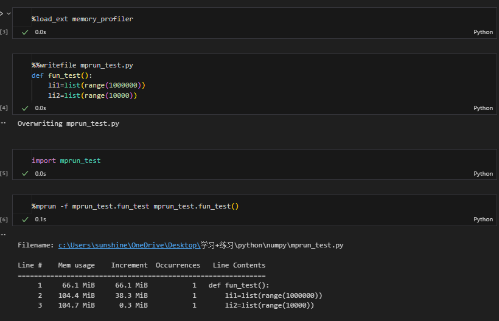

这个时候如果将函数里边range()范围改了，则重新运行之后，结果increment的每一句代码是不变的

这时候需要重新加载模块

```python
#重新加载模块
import importlib
importlib.reload(mprun_test)
%mprun -f mprun_test.fun_test mprun_test.fun_test()
```