# 1.工具

提示错误插件：有问题会提前报错

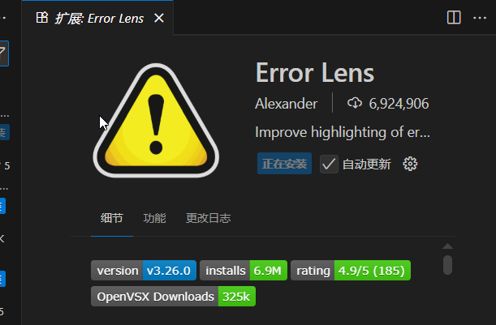

https://developer.mozilla.org/en-US/前端资料搜集必备网站

alt键加上下箭头可以实现语句的移动

# 2.基础语法

## 2.1 js的使用基本介绍

### 2.1.1 js组成

1.  js是编程语言，html和css不是编程语言，是标记语言
    

js组成：ECMAScript(JavaScript语言基础)和Web APIs(由DOM页面文档对象模型和BOM浏览器对象模型)

2.  JavaScript 程序不能独立运行，它需要被嵌入 HTML 中，然后浏览器才能执行 JavaScript 代码
    

### 2.1.2 js书写位置

1.  **内部 JavaScript**
    

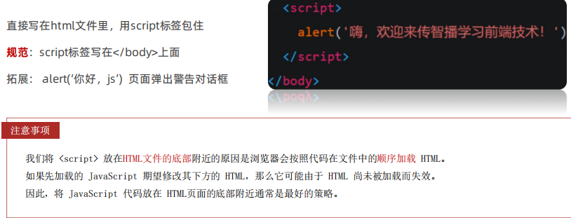

2.  **外部 JavaScript**
    

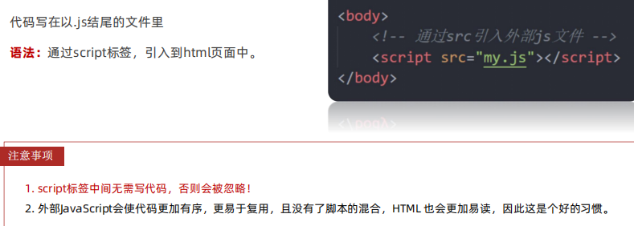

3.  **内联 JavaScript**
    

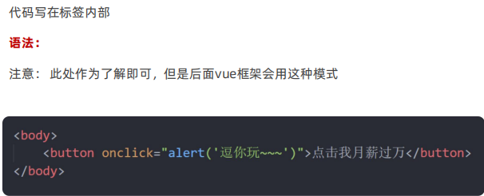

### 2.1.3 JavaScript注释

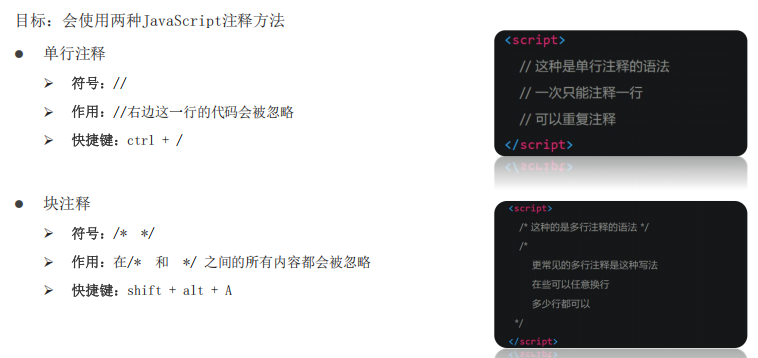

alt+shift+a一定要记住！

### 2.1.4 JavaScript结束符

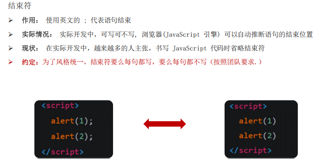

  

### 21.1.5 JavaScript 输入输出语法

1.  输出语法：
    

①document.write('要出的内容')

向body内输出内容；

如果输出的内容写的是标签，也会被解析cheng

②alert('要出的内容')

页面弹出警告对话框

③console.log('控制台打印')

控制台输出语法，程序员调试使用

输入log就行，自动生成：

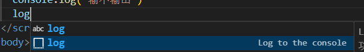

2.  输入语法：
    

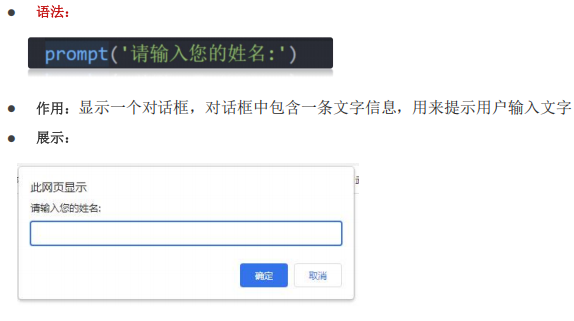

### 21.1.6 字面量

在计算机科学中，字面量（literal）是在计算机中描述 事/物

例如：18 是一个数字字面量；'pink' 是一个字符串字面量

## 2.2 变量

1.  变量声明
    

let 变量名

*   声明变量有两部分组成：声明关键字 变量名（也叫标识符）
    
*   let 即关键字 (let: 允许、许可、让、要)，所谓关键字是系统提供的专门用来声明（定义）变量的词语
    

2.  变量赋值
    

```html
let age
age=18 
```

3.  连这些（变量的初始化）：let age=18
    
4.  更新变量
    

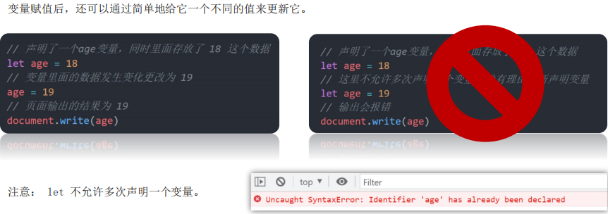

5.  声明多个变量
    

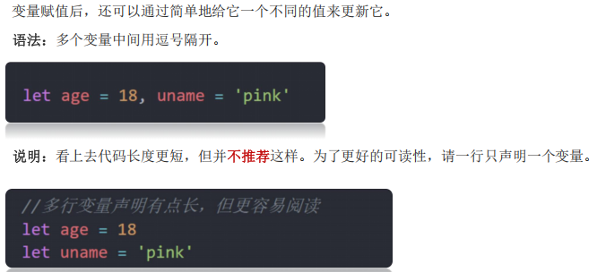

6.  变量命名规则与规范
    

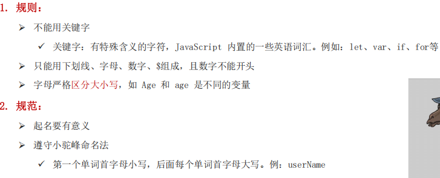

遵守小驼峰！

7.  变量拓展-let和var的区别
    

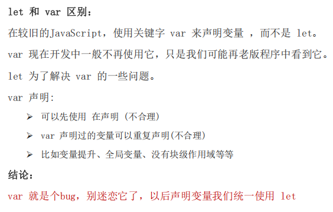

## 2.3 数组

```html
let arr = []
```

  

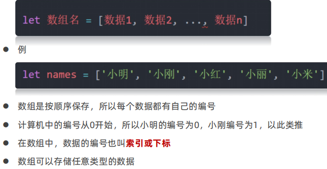

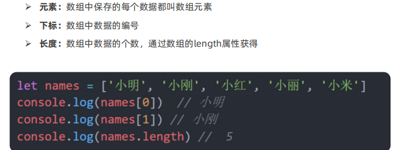

## 2.4 常量

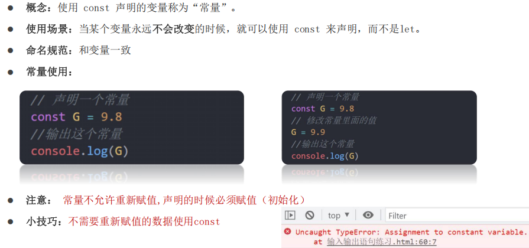

const — 类似于 let ，但是变量的值无法被修改

  

## 2.5 数据类型

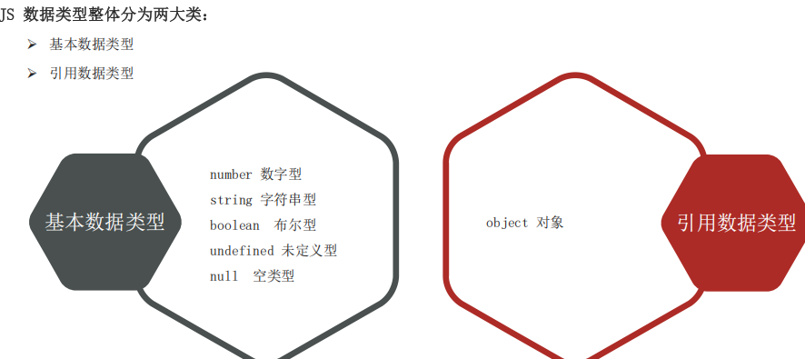

1.  js是一门弱数据类型的语言，只要是数字就是数字型语言
    
2.  算数运算符：
    

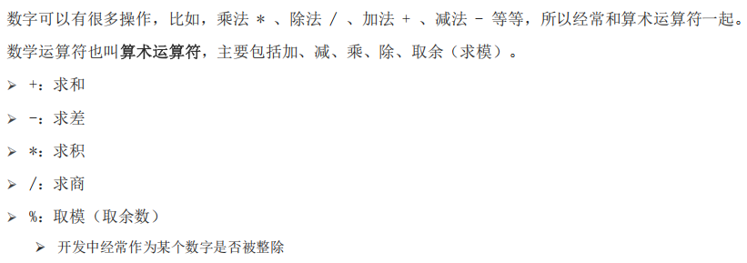

3.  数字类型（Number）
    

JavaScript 中的正数、负数、小数等 统一称为 数字类型

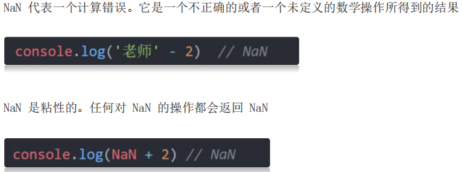

4.  字符串类型（string）
    

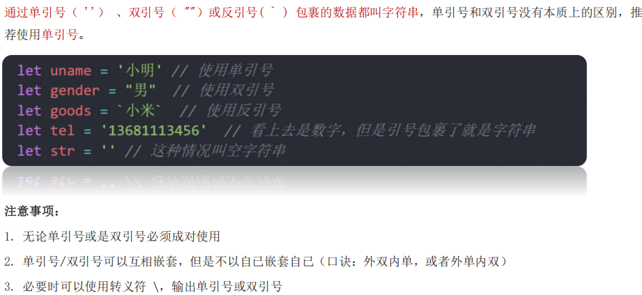

反引号也是可以使用的

➕：数字相加，字符相连，只要有字符串就可以与其他进行相加

例如：document.write("我今年"+age+"岁")

5.  模板字符串
    

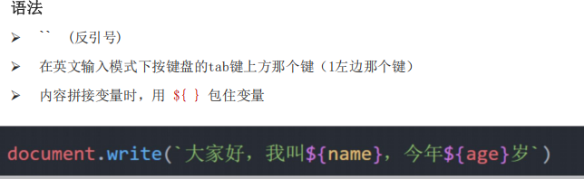

类似于python的字符串格式化

6.  布尔类型
    

true 和 false

7.  未定义类型（underfined）
    

表示没有赋值

未定义类型是比较特殊的类型，只有一个值undefined

只声明变量，不赋值的情况下，变量的默认值为 undefined，一般很少【直接】为某个变量赋值为 undefined

8.  null（空类型）
    

JavaScript 中的 null 仅仅是一个代表“无”、“空”或“值未知”的特殊值

赋值了，但是内容为空

```html
typeof null
输出的是'object'，是一个对象数据类型
```

9.  控制台检测数据类型
    

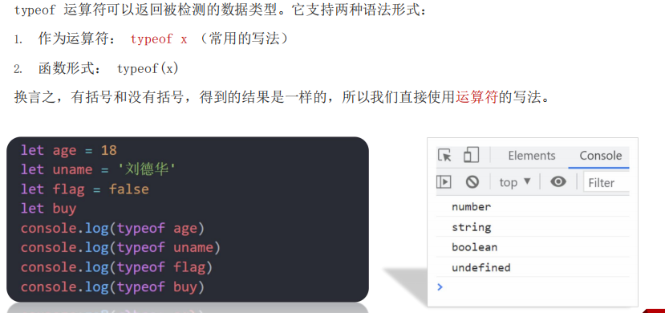

10.  类型转换
    

prompt输入的内容都是字符串字面量，还有html时的表单（input啥的输入的也是字符串字面量）

转换方式：隐式转换和显示转换

①隐式转换

*   号两边只要有一个是字符串，都会把另外一个转成字符串
    
*   除了+以外的算术运算符 比如 - \* / 等都会把数据转成数字类型（只要有数字就会把另一个转化成数字字面变量）
    
*   加号作为正号解析可以转换成数字型：console.log(+'123')不再是字符串类型，是数字类型为123
    
*   任何数据和字符串相加结果都是字符串
    

②显示转换

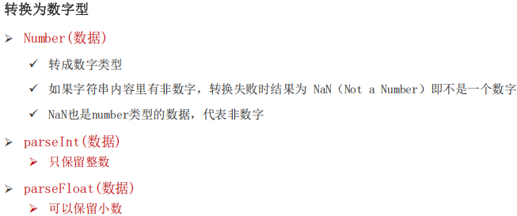

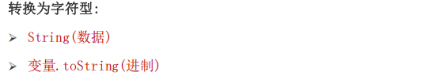

在输入的时候要用好隐式转换，简单写起来

let num = +prompt(’请输入数字：‘)

  parseInt与parseFloat是只取前边的数字，如果前边有字母，是无法进行识别后边的数字的，会显示NaN，表示错误

console.log(parseInt('12.333px'))

输出为：12

console.log(parseInt('a'a'a12.333px'))

输出：NaN

## 2.6 运算符

### 2.6.1 赋值运算符

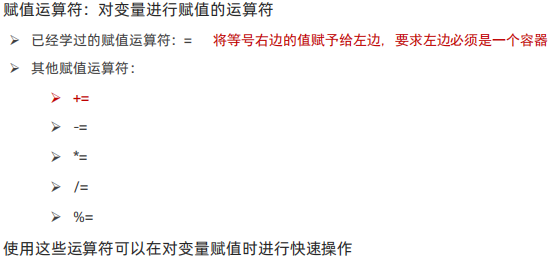

### 2.6.2 一元运算符

众多的 JavaScript 的运算符可以根据所需表达式的个数，分为一元运算符、二元运算符、三元运算符，就看需要几个数来操作，例如+需要两个数才能相加，所以叫做二元运算符，正负号的话就是一元运算符

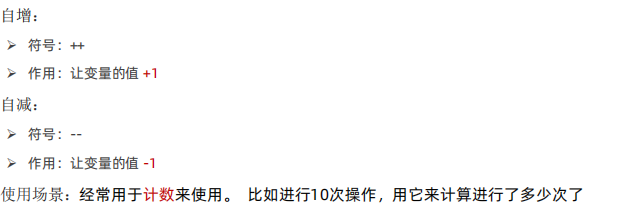

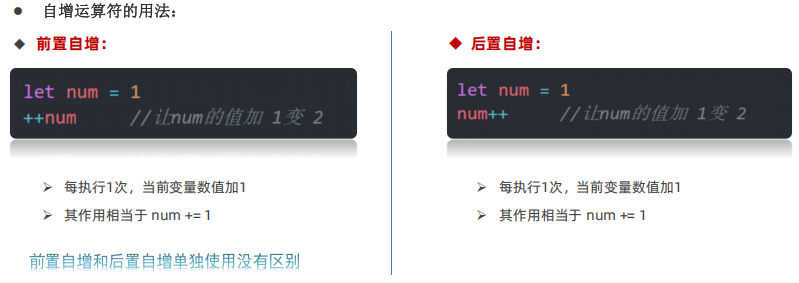

两者的区别：

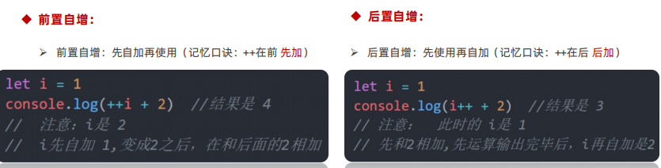

前置先自加；后置后加，代码执行完之后再加

### 2.6.3 比较运算符

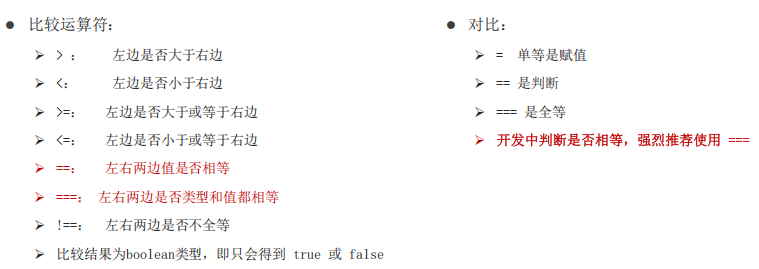

比较运算符也有隐式转换

console.log(2 == '2')输出为true，只判断值，==含有隐式转换，前边是数字字面量的情况下，会将字符串转化为数字字面量

console.log(2==='2')输出false，===全等，会判断值和数据类型，需要全部一样才为true

要使用三等，开发的时候

NaN不等于任何人，包括它自己

小数在进行运算的时候它会先把自己转化为整数，然后最后再除以放大的数变回原来：例如：0.5+0.2：它是0.5\*10+0.2\*10=7

7/10=0.7

最后：0.5+0.2=0.7

字符串比较，比较的是字符对应的ASCII码

### 2.6.4 逻辑运算符

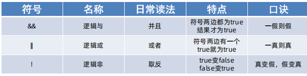

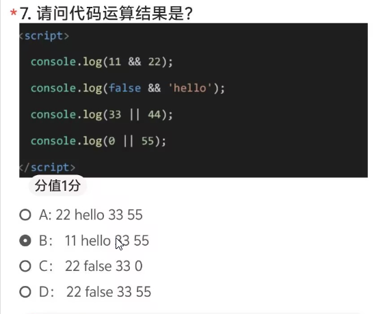

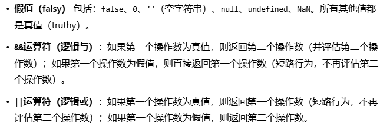

上述题目选D

与真2假1；或真1假2

### 2.6.5 运算符优先级

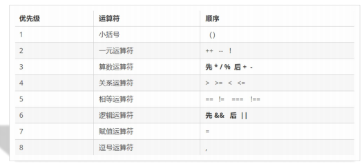

先算逻辑与，后算逻辑或

## 2.7 语句

表达式：是可以被求值的代码，会有结果给我们

语句：语句是可以被执行的代码，例如prompt()

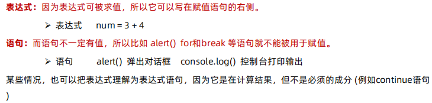

因为表达式可被求值，所以它可以写在赋值语句的右侧。

而语句不一定有值，所以比如 alert() for和break 等语句就不能被用于赋值。

### 2.7.1 分支语句

#### 2.7.1.1 if分支语句

if语句单行简单的话，可以不写{}，写在一行就行

1.  单分支语句
    

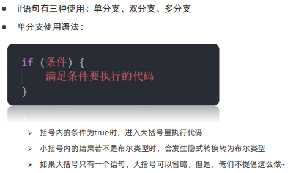

  

除了0，所有数字都为真

```html
if（0) {
    let a=1
    alert(typeof a)
}
不输出，括号为假
```

2.  双分支语句
    

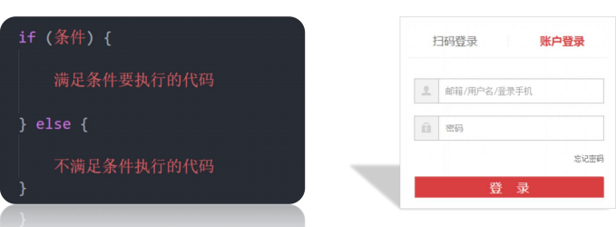

3.  多分支语句
    

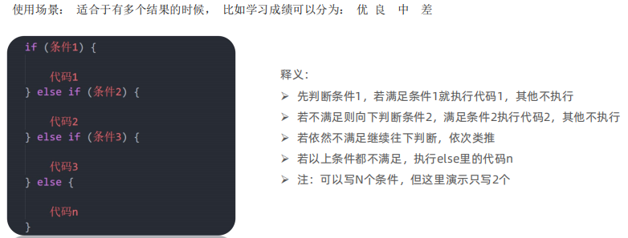

#### 2.7.1.2 三元运算符

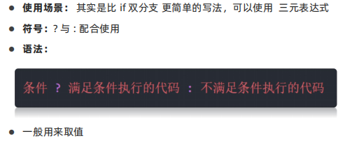

#### 2.7.1.3 switch语句

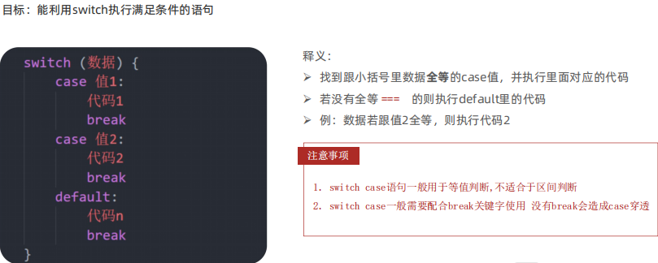

如果不写break，在匹配成功之后，输出完这个匹配内容后，switch语句就失效了，他会把后边的内容也全部输出

### 2.7.2 循环语句

#### 2.7.2.1 断点演示

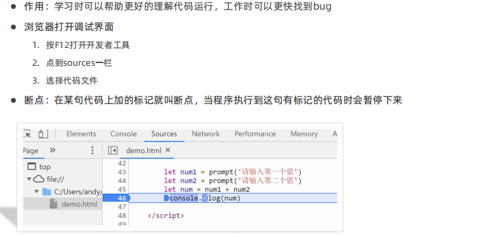

#### 2.7.2.2 while循环

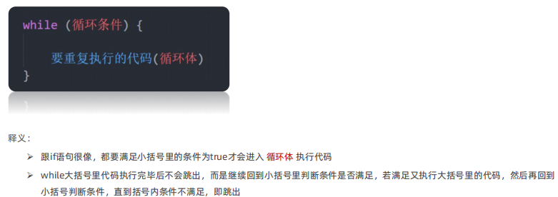

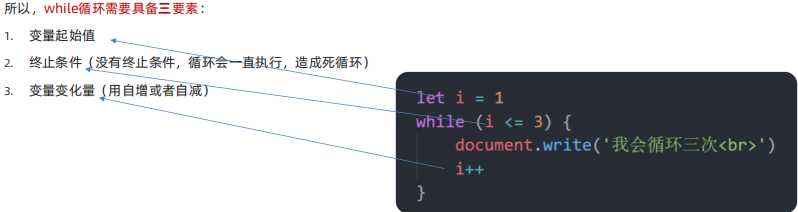

#### 2.7.2.3 for循环

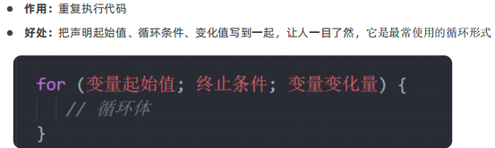

for(;;) {

}

表示无限循环

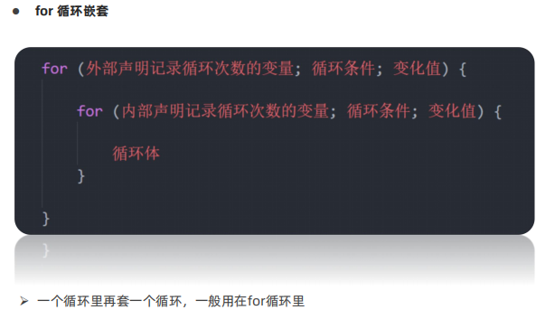

#### 2.7.2.4 循环的退出

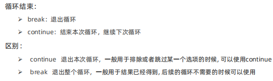

## 2.8 数组

### 2.8.1 基础认识

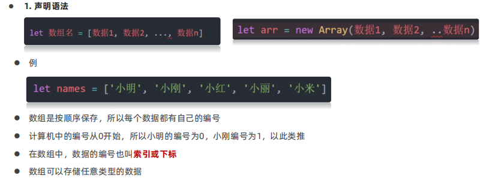

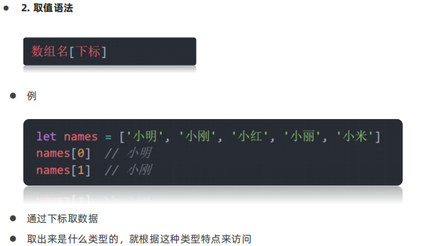

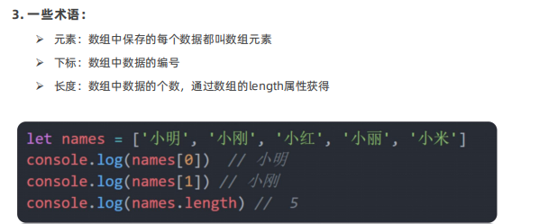

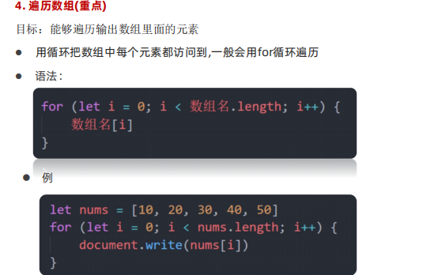

  

### 2.8.2 操作数组

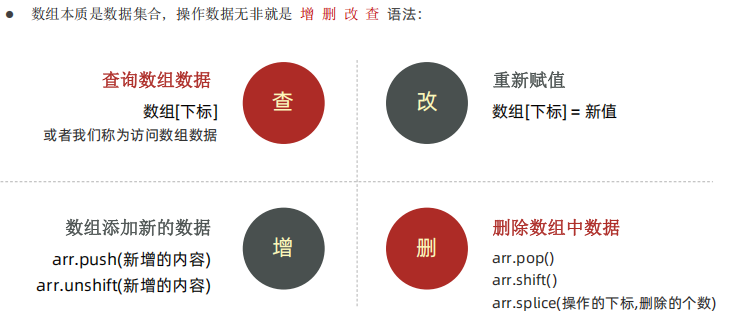

1.  添加元素
    

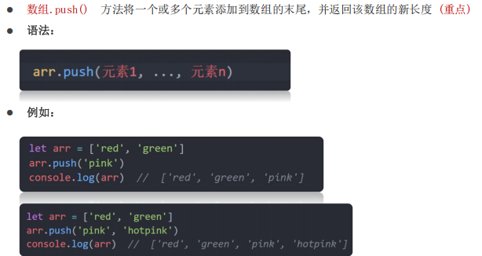

console.log(arr.push('green'))

输出结果：为新数组的长度


push用的非常多，一定要记住

1.  删除元素
    


### 2.8.3 根据数据生成柱形图

```html
<!DOCTYPE html>
<html lang="en">

<head>
    <meta charset="UTF-8">
    <meta http-equiv="X-UA-Compatible" content="IE=edge">
    <meta name="viewport" content="width=device-width, initial-scale=1.0">
    <title>Document</title>
    <style>
        * {
            margin: 0;
            padding: 0;
        }

        .box {
            display: flex;
            width: 700px;
            height: 300px;
            border-left: 1px solid pink;
            border-bottom: 1px solid pink;
            margin: 50px auto;
            justify-content: space-around;
            align-items: flex-end;
            text-align: center;
        }

        .box>div {
            display: flex;
            width: 50px;
            background-color: pink;
            flex-direction: column;
            justify-content: space-between;
        }

        .box div span {

            margin-top: -20px;
        }

        .box div h4 {
            margin-bottom: -35px;
            width: 70px;
            margin-left: -10px;
        }
    </style>
</head>

<body>

    <script>
        // 1. 四次弹框效果
        // 声明一个新的数组
        let arr = []
        for (let i = 1; i <= 4; i++) {
            // let num = prompt(`请输入第${i}季度的数据:`)
            // arr.push(num)
            arr.push(prompt(`请输入第${i}季度的数据:`))
            // push记得加小括号，不是等号赋值的形式
        }
        // console.log(arr)  ['123','135','345','234']
        // 盒子开头
        document.write(` <div class="box">`)

        // 盒子中间 利用循环的形式  跟数组有关系
        for (let i = 0; i < arr.length; i++) {
            document.write(`
              <div style="height: ${arr[i]}px;">
                <span>${arr[i]}</span>
                <h4>第${i + 1}季度</h4>
              </div>          
            `)
        }
        // 盒子结尾
        document.write(` </div>`)
    </script>
</body>

</html>
```

### 2.8.4 冒泡排序

```html
<!DOCTYPE html>
<html lang="en">

<head>
  <meta charset="UTF-8">
  <meta name="viewport" content="width=device-width, initial-scale=1.0">
  <title>Document</title>
</head>

<body>
  <script>
    let arr = [5, 4, 3, 2, 1]
    for (let i = 0; i < arr.length - 1; i++) {
      for (let j = 0; j < arr.length - i - 1; j++) {
        // 开始交换,但是前提 第一个数大于第二个数才会进行交换
        if (arr[j] > arr[j + 1]) {
          // 交换两个变量
          let tmp = arr[j]
          arr[j] = arr[j + 1]
          arr[j + 1] = tmp
        }
      }
    }
    document.write(arr)
  </script>
</body>

</html>
```


实际开发中我们使用的是函数：sort()，默认按照升序

let arr = \[4, 2, 5, 1, 3\]

// 1.升序排列写法

arr.sort(function (a, b) {

return a - b

})

console.log(arr) // \[1, 2, 3, 4, 5\]

// 降序排列写法

arr.sort(function (a, b) {

return b - a

})

console.log(arr) // \[5, 4, 3, 2, 1\]

## 2.9 函数


（）是调用的意思，为了区分哪个函数，所以前边加上函数名，因此函数的调用：函数名()

函数的声明用function

函数里边可以嵌套函数

### 2.9.1 函数传参


*   形参：声明函数时写在函数名右边小括号里的叫形参（形式上的参数）
    
*   实参：调用函数时写在函数名右边小括号里的叫实参（实际上的参数）
    
*   形参可以理解为是在这个函数内声明的变量（比如 num1 = 10）实参可以理解为是给这个变量赋值
    
*   开发中尽量保持形参和实参个数一致
    
*   我们曾经使用过的 alert('打印'), parseInt('11'), Number('11') 本质上都是函数调用的传参
    
*   形参只在函数中有用，所以不需要进行声明这个变量
    

可以给形参初始值，此时函数调用的时候，不放实参这个函数也可以使用，不会报错；默认值只会在缺少实参参数传递时 才会被执行，所以有参数会优先执行传递过来的实参, 否则默认为undefined

### 2.9.2 函数的返回值


*   在函数体中使用 return 关键字能将内部的执行结果交给函数外部使用
    
*   return 后面代码不会再被执行，会立即结束当前函数，所以 return 后面的数据不要换行写，return要写在函数的最下边
    
*   return函数可以没有 return，这种情况函数默认返回值为 undefined
    
*   返回多个值时使用数组，让它返回数组，就能将多个值返回
    
*   断点调试:进入函数内部看执行过程F11
    

### 2.9.3 参数个数不同情况

```html
    function fn(a, b) {
      console.log(a + b);
    }
    fn(1, 2, 3)输出3，最后一个参数没人接，不要
    fn(1)输出NaN，第二个值undefined,1+undefined=NaN,计算错误
```

### 2.9.4 作用域

*   一段程序代码中所用到的名字并不总是有效和可用的，而限定这个名字的可用性的代码范围就是这个名字的 **作用域**
    
*   **作用域的使用提高了程序逻辑的局部性，增强了程序的可靠性，减少了名字冲突**
    
*   分为全局作用域和局部作用域；全局作用域的变量叫作全局变量，局部作用域的变量叫作局部变量，也称为函数作用域，函数内部有效
    
*   函数内部可以直接所使用全局变量
    
*   如果函数内部，变量没有声明，直接赋值，也当全局变量看，但是强烈不推荐，但是需要先调用函数才可以输出函数内部的变量
    

例如：

```html
    function fun() {
      num = 10
    }
    fun()
    console.log(num)
   会输出10，如果不调用函数，直接就报错，尽量不要用这种方法，如果此时我在函数的上方写了
   let num=20,则num的值会被覆盖，这样值就乱了，这样是不对的！
```

*   函数内部的形参可以看做是局部变量
    
*   不同作用域变量可以重名；相同作用域变量不可以重名
    

变量访问原则： **在能够访问到的情况下 先局部， 局部没有在找全局**

### 2.9.5 匿名函数

函数可以分为具名函数和匿名函数

匿名函数是指没有名字的函数，它是无法直接使用的，使用的两种方式：

1.  函数表达式
    


里边也可以写参数

具名函数调用位置可以随意调整；

匿名函数函数表达式形式只能在声明后才可以使用

2.  立即执行函数
    


直接执行函数，不需要再调用！！！本质它已经调用了

写法：两个小括号，然后在第一个小括号中写function

(function () {})();

不要落下最后的;

立即执行函数必须要加;

分号写前写后都没问题

写前：

(function() {})()

;(function () {})();

写后:

(function() {})();

(function () {})();

  

可以这样理解：最后一个小括号实质是调用前边的函数，为了保证前边的函数正常进行又给其套了一层括号，最后括号里边的数为实参，function后面的参数为形参

还有一种写法：

(function(){}());

或者:

!function(){}();

立即执行函数有时候也是可以加名字的：

(function flexible(window,document) {}(window,document));

省一些调用方法

### 2.9.6 逻辑中断!!!


这样就不用非得给x,y初始化了


代码执行时先看左边

例如：console.log(false && 3+5)

&&逻辑与遇假则假，当执行左边为假时就不执行右边了，所以输出false

&&都是真时，就返回最后一个真值

console.log(11 && 22)

输出22

  

逻辑与：遇真则真

例如：

let age=1

console.log(11 || age++)

不执行后边的age++，先执行左边11为真，就是真，就直接结束语句了，输出11

console.log(11 || 22)

||逻辑或遇到真就直接输出，输出结果为11

||如果都是假的话，就取最后一个假的值了

### 2.9.7 转换为Boolean型

显示转换：

**记忆**： **‘’ 、0、undefined、null、false、NaN 转换为布尔值后都是false, 其余则为 true**

空字符串为假，其他字符串全为真


隐式转换：


隐式转换:

null+3=3

undefined+3=NaN

null==undefined 输出true,他两个都当0看

null===undefined 输出false

undefined做任何操作都是NaN

NaN不等于NaN，NaN表示计算错误

## 2.10 对象

### 2.10.1 对象的介绍

对象也是一种数据类型，里边的数据是无序的

对象由属性和方法组成


### 2.10.2 对象属性


1.  查询对象
    

对象名.属性 goods.uname

属性名中带有字符串时采用：对象名\['属性名'\] goods\['uname'\]

不带字符串的属性名也可以使用 对象名\['属性名'\]

\[\]语法里面的值如果不添加引号 默认会当成变量解析

  

总结：点后面的属性名一定不要加引号；\[\] 里面的属性名一定加引号(单引双引都🆗)

2.  重新赋值
    

对象名.属性=新值

3.  增加新数据
    

对象名.属性=新值

4.  删除对象中的属性
    

delete 对象名.属性

### 2.10.3 对象方法


后边跟的是匿名函数

对象外面的叫函数；对象内部的叫方法


### 2.10.4 遍历对象

理解为加括号的python字典遍历


k是字符串类型

用for in可以实现对数组的遍历工作，但是k为字符串，我们在遍历的时候需要用到数组的下标，下表是数组字面量，不应该为字符串，所以我们不要使用for in来遍历字典，正常for循环遍历就可以

```html
   let arr = [1, 2, 3]
    for (let k in arr) {
      console.log(k)
      console.log(arr[k])
    }
```


数字型控制台输出颜色偏蓝，字符串型控制台打印是黑色的

for in 用来遍历对象 k这个写啥也行，习惯使用key或k

for in 得到的k是属性名

<script>

let pink = {

uname: 'pink老师',

age: 18,

gender: '男',

sing: function () {

document.write('唱歌')

}

}

// 遍历对象

for (let k in pink) {

console.log(k)

console.log(pink\[k\])

}

</script>

k是字符串，不可以进行pink.k，这是不对的，k是带引号的属性名，点k的话，对象中就没有这个属性名了，所以得到的是undefined，无法准确遍历

### 2.10.5 遍历数组对象、

数组中放对象信息

```xml
<script>
    let students = [
      { name: '小明', age: 18, gender: '男', hometown: '河北省' },
      { name: '小红', age: 19, gender: '女', hometown: '河南省' },
      { name: '小刚', age: 17, gender: '男', hometown: '山西省' },
      { name: '小丽', age: 18, gender: '女', hometown: '山东省' }
    ]
    for (let i = 0; i < students.length; i++) {
      for (let k in students[i]) {
        console.log(`输出第${i + 1}个同学的${k}:${students[i][k]}`)
        //输出每个人的名字：
        //console.log(students[i].name)
      }
    }
  </script>
```

### 2.10.6 内置对象

JavaScript内部提供的对象，包含各种属性和方法给开发者调用，例如document.write()

1.  数学对象Math
    


https://developer.mozilla.org/en-US/docs/Web/JavaScript/Reference/Global\_Objects/Math

联想：parseInt转换为整数型，与floor相似，输入小数的数字，只取最小值

两者区别是parseInt可以传入字符串，会去掉后边的字符串，只留前边的数字

数组不可以使用Math中的max,min来求最大值与最小值

null是一个空对象，可以认为：null类似于let obj={}

null属于对象数据类型

2.  生成任意范围随机数
    


这里加1是想取到右边的部分，因为它是左闭右开，第一个是\[0,11），永远取不到11

乘以几就取不到几

取数组中的随机元素：

let arr = \['red', 'green', 'blue'\]

let random = Math.floor(Math.random() \* arr.length)

console.log(arr\[random\])

  

这个函数得到的是全闭区间

function getRandom(N, M) {

return Math.floor(Math.random() \* (M - N + 1)) + N

}

console.log(getRandom(4, 8))

### 2.10.7 基本数据类型和引用数据类型


简单数据类型是直接把值放在了栈中，复杂数据类型是将值的地址放在栈中，值放在堆中，通过地址得到存放的内容


所有复杂数据类型都存放在堆中，将它内容的地址存放在栈中

简单数据类型是深拷贝，复杂数据类型是浅拷贝

js实际是没有堆栈的，这里是为了方便理解，在ts中有堆栈，ts与js百分之80是相同的

# 3.Web APIs

尽量使用const，因为绝大多数定义的变量基本上它的值都不会再改变

实际开发中的思路：有了变量先给const，如果发现它后面是要被修改的，再改为let


此时arr.push(3),给数组添加新的元素，这个元素加添加到堆中了，地址还是那个地址，因此这里的使用const来声明是没有问题的。如果此时接着写arr=\[4,5,6\]，此时这个就是一个新的数组，存到堆中的位置与之前那个是不同的，在栈中存了新地址，所以此时就会报错，就是不对的，如果想这样干，只能使用let来声明变量。const声明的是常量

建议数组和对象使用 const 来声明

Web APIs分为DoM(页面文档对象模型)和BoM(浏览器对象模型)

## 3.1 Dom(文档对象模型)

### 非常重要：window是整个窗口；html是DOM树的根节点；document代表了整个html中所有内容，代表整个HTML页面（DOM树）

`document` = HTML 文件解析后的对象化表示；

`document` ≠ HTML 文件本身

**`window`** = 窗口对象，代表浏览器的这个标签页/容器

**`document`** ：容器里的内容，代表当前加载的网页（DOM）

document实际上为window.document的简写

### 3.1.1 关于DoM的基础知识


console.dir()

dir用来打印对象

*   任何一个标签，都是一个对象
    
*   也就是说这些标签在HTML中就是一个标签，但是在js的DoM中从HTML获取过来就是对象，叫作DoM对象
    
*   在DoM中最大的对象是document对象，它提供的方法是用来访问和操作网页内容的，document是整个网页中最大的对象，它存放了页面的所有元素！
    

  

  

DoM对象可以理解为就是标签元素，在html中就是标签，修饰的时候使用的是css，在js中就是对象，通过对对象的属性进行修改来实现对标签的修饰

### 3.1.2 获取DoM对象

css是通过选择器的方式来获取标签，对标签的样式进行修饰的

获取DoM元素现在主要是通过css选择器的方式来获取，必须牢记这一方法！！！

**查找元素DOM元素就是利用 JS 选择页面中标签元素**

1.  利用CSS选择器来获取标签元素
    


里边的选择器必须必须加引号！！！

只选择第一个元素

```xml
<body>
  <div class="box">123</div>
  <div class="box">456</div>
  <script>
    // 1.获取匹配的第一个元素
    const box = document.querySelector('div')
    console.dir(box)
  </script>
</body>
```

只选123，不选456


返回的是一个数组的集合，不能对其进行直接修改


单个标签也可以使用querySelectAll()来获取，直接通过索引号就可以使用这个元素

querySelect()的调用对象是它的父亲，并不一定用document来进行调用

2.  其他方法来获取标签元素
    

不要使用，还是使用css法获取DoM的元素的方法就行，下面的方法认识就ok


### 3.1.3 操作元素的内容

设置修改DOM元素内容有两种方式：

*   元素.innerText=''
    
*   元素.innerHTML=''
    
*   不写字符串输出数字也是可以的
    
*   元素.innerHtml=1
    

#### 3.1.3.1 innerText


思路：实现了修改盒子中的内容！

它只显示纯文本，不解析标签

#### 3.1.3.2 innerHTML


相比于innerText，他的强大之处在于可以解析标签

### 3.1.4 操作元素属性

#### 3.1.4.1 操作元素常用属性


#### 3.1.4.2 操作元素样式属性


后边跟的是字符串，必须加引号，然后单位也不要忘记

  

div.style.backgroundColor = 'hotpink'

如果按照css的写法，-表示减，就会出错

body元素不需要再获取，直接用就行！！！！！！

如果使用的是body标签，它是网页写标签部分的唯一标签，所以对body来说可以不用获取他的DOM对象，直接使用document.body.style来进行修改样式

  

通过该方式来修改css样式，解析之后生成的是行内样式，行内样式的权重高于内部样式，权重非常高，所以可以覆盖原有样式


1.  className这个方式就是修改很多样式的时候来使用的！
    
2.  常常用于一个动作特效，比如轮播图点下边按钮才动
    
3.  这个只能添加类名，前边已经有classNmae，就不需要加点了，只写类名就ok!
    
4.  className为属性名，如果还用class的话就导致与关键字冲突
    
5.  通过操作类名来修改css时，一定要看看这个标签是否原本就有类名，如果不要之前的样式，写上div.classNmae=‘box’后会覆盖之前的nav，就是给对象中的属性改值了，就是如果要的话就写成div.className='nav box'
    
6.  解析标签的时候就变为了<div class="nav box"></div>
    

  

例子：

<body>

<div class="nav"></div>

<script>

const div = document.querySelector('div')

div.className = 'box'

</script>

</body>


追加和删除类名用classList

常用于类似于开关的操作

toggle,切换一个类名意思就是：有就删掉，没有就加上（指的是盒子中是否有这个类名，不是说css中有没有这个类名，css中肯定得写类名的，不写那还要操作类控制css干嘛）

4.classList.contains()看看有没有包含某个类，如果有则返回true，没有则返回false

  

#### 3.1.4.3 牢记点

1.  获取对象时在不忘记双引号的同时加上类选择器前的.；id选择器前的#
    
2.  使用style属性操作css时不要忘记引号
    
3.  使用className或者classList时也不要忘记引号
    
4.  修改标签内容，也就是获取后的对象（浏览器根据html生成的js对象），通过innerText和innerHTML来实现，只不过innerText不能识别标签，innerHTML可以识别标签
    
5.  获取后的标签就是一个对象，其中包含了非常多的属性值和方法，const xxx=document.querySelector('.nav')，这个xxx就是一个常量，起啥名也行，一般写成这个盒子的名或者原有类名，赋值给这个常量后，就变成对象，className等就是这个类（元素）下的方法
    
6.  body就这么一个元素，所以可以对它不获取，来xiu'ga
    
7.  若： let arr=\['1','2',3\] arr\[0\]=1
    
8.  如果一个对象第一个属性值为‘1’，则获取该对象的属性值就是这个1
    
9.  上述说明了输出对象和数组中字符串的时候是不带引号的，在修改对象属性值的时候必须加字符串必须加引号，不然中文会报错，计算机不会认为这是字符串，但是将这个字符串对应的数组加下标的方式给他，就不要加字符串了，它本身就是字符串呀这个元素
    

### 3.1.5 操作表单元素

1.  天生的属性
    


innerHTML可以得到元素的内容 username.innerHTML,但是仅限于普通元素，表单不是通过它来进行获取的，得到表单内容用value,但是button比较特殊,它是双标签,要使用.innerHTML来获取,使用.value是无法获取的

console.log(username.innerHTML) 获取一般元素的值，对表单元素来说输出的是空，啥也没有，无法读取内容，修改内容是 username.innerHTML='修改的值'

console.log(username.value) 获取表单值 修改表单元素的值：username.value='修改的值'


```html
在复选框中如果checked='checked',则可以在表单元素中只写一个checked
<input type="checkbox" name="" id="" checked>
不选的话：
const input = document.querySelector('input')
input.checked=false
这里写'true'也对，但是不要这样写，字符串只有空时为假，这里有隐式转换，就正常写布尔值就行

禁用按钮：
它的属性值disabled='disabled'这样可以进行，属性与值相等，就只写一个属性值就行
<button disabled>点击</button>
<button>点击</button>
const bt = document.querySelector('button')
bt.disabled = false
```

2.  自定义属性
    


```xml
<body>
  <div data-id="1" data-spm="我不知道">1</div>
  <div data-id="2">2</div>
  <div data-id="3">3</div>
  <div data-id="4">4</div>
  <div data-id="5">5</div>
  <script>
    const one = document.querySelector('div')
    console.log(one.dataset)
    console.log(one.dataset.id)
    console.log(one.dataset.spm)
  </script>
</body>
```


document.querySelector选择的是第一个对象（元素）

### 3.1.6 定时器-间歇函数


定时器返回的是数字，表示第几个定时器，每个定时器的都是独一无二的，表示的是第几个定时器：

<script>

function fn() {

   document.write(1)

   }

let n = setInterval(fn, 1000)

   console.log(n)

</script>

此时输出结果为1，每1000毫秒输出一个1，若：

<script>

function fn() {

   document.write(1)

   }

let n = setInterval(fn, 1000)

   let n1 = setInterval(fn, 1000)

   console.log(n1)

</script>

此时输出结果就是2，每1秒输出两个1（因为前边还有一个执行输出1的定时器，两个一起作用在浏览器就每秒输出11）

当个执行时输出前有一秒的空窗期，当经过setInterval时，如果间隔时间为1000，它就是过了一秒钟才去调用函数，他不是立即执行的函数，跟后边的间隔时间有关

单位为毫秒！！！

可以搭配匿名函数来用！！！

setInterval(function () {

alert('两秒执行一次')

}, 2000)

  

如果有名函数的话，就不要在函数名的后边加小括号，小括号表示调用这个函数

function fn() {

document.write(1)

}

setInterval(fn, 1000)

  

如果函数名后边非得加括号的话，就将这个函数再加个引号，但是尽量不要用这种方式

setInterval('fn()', 1000)


#### 3.1.6.1 阅读注册协议

```html
<!DOCTYPE html>
<html lang="en">

<head>
  <meta charset="UTF-8">
  <meta name="viewport" content="width=device-width, initial-scale=1.0">
  <title>Document</title>
</head>

<body>
  <textarea name="" id="" cols="30" rows="10">
        用户注册协议
        欢迎注册成为京东用户！在您注册过程中，您需要完成我们的注册流程并通过点击同意的形式在线签署以下协议，请您务必仔细阅读、充分理解协议中的条款内容后再点击同意（尤其是以粗体或下划线标识的条款，因为这些条款可能会明确您应履行的义务或对您的权利有所限制）。
        【请您注意】如果您不同意以下协议全部或任何条款约定，请您停止注册。您停止注册后将仅可以浏览我们的商品信息但无法享受我们的产品或服务。如您按照注册流程提示填写信息，阅读并点击同意上述协议且完成全部注册流程后，即表示您已充分阅读、理解并接受协议的全部内容，并表明您同意我们可以依据协议内容来处理您的个人信息，并同意我们将您的订单信息共享给为完成此订单所必须的第三方合作方（详情查看
    </textarea>
  <br>
  <button class="btn" disabled>我已经阅读用户协议(5)</button>
  <script>
    // 1. 获取元素
    const btn = document.querySelector('.btn')
    // console.log(btn.innerHTML)  butto按钮特殊用innerHTML
    // 2. 倒计时
    let i = 5
    // 2.1 开启定时器
    let n = setInterval(function () {
      i--
      btn.innerHTML = `我已经阅读用户协议(${i})`
      if (i === 0) {
        clearInterval(n)  // 关闭定时器
        // 定时器停了，我就可以开按钮
        btn.disabled = false
        btn.innerHTML = '同意'
      }
    }, 1000)

  </script>
</body>

</html>
```

不要一直想着用死循环,避免死循环

`定时器本身就是循环`,就直接在匿名函数中写就欧克了,不要再去写循环了,尤其死循环!!!

#### 3.1.6.2 轮播图定时版

1.  法1
    

```html
<!DOCTYPE html>
<html lang="en">

<head>
  <meta charset="UTF-8">
  <meta name="viewport" content="width=device-width, initial-scale=1.0">
  <title>Document</title>
  <style>
    * {
      padding: 0;
      margin: 0;
    }

    li {
      list-style: none;
    }

    .box {
      position: relative;
      width: 976px;
      height: 600px;
      margin: 100px auto;
    }

    .slider-footer {
      position: absolute;
      left: 0;
      bottom: 0;
      width: 100%;
      height: 15%;
      background-color: skyblue;
    }

    .slider-footer p {
      position: absolute;
      font-size: 28px;
      left: 20px;
      top: 5px;
    }

    ul {
      position: absolute;
      top: 55px;
      left: 20px;
      display: flex;
      justify-content: space-between;
      position: absolute;
      width: 250px;
      height: 20px;
    }

    ul li {
      width: 20px;
      height: 20px;
      background-color: rgba(0, 0, 0, .4);
      border-radius: 10px;
    }

    .activate {
      background-color: #f7f7f7;
    }
  </style>
</head>

<body>
  <div class="box">
    <div class="slider-wrapper">
      
    </div>
    <div class="slider-footer">
      <p>对人类来说会不会太超前了?</p>
      <ul>
        <li class="activate"></li>
        <li></li>
        <li></li>
        <li></li>
        <li></li>
        <li></li>
        <li></li>
        <li></li>
      </ul>
    </div>
  </div>
  <script>
    const arrImage = [
      { url: '..../../public/images/slider01.jpg', title: '对人类来说会不会太超前了?', color: 'rgba(100,67,68)' },
      { url: '..../../public/images/slider02.jpg', title: '开启剑与雪的黑暗传说!', color: 'rgba(43,35,26)' },
      { url: '..../../public/images/slider03.jpg', title: '真正的jo厨出现了!', color: 'rgba(36,31,33)' },
      { url: '..../../public/images/slider04.jpg', title: '李玉刚:让世界通过b站看到东方大国文化', color: 'rgba(139,98,66)' },
      { url: '..../../public/images/slider05.jpg', title: '快来分享你的寒假日常吧', color: 'rgba(67,90,92)' },
      { url: '..../../public/images/slider06.jpg', title: '哔哩哔哩小年YEAR', color: 'rgba(166,131,143)' },
      { url: '..../../public/images/slider07.jpg', title: '一站式解决你的电脑配置问题', color: 'rgba(53,29,25)' },
      { url: '..../../public/images/slider08.jpg', title: '谁不想和小猫咪贴贴呢?', color: 'rgba(99,72,114)' }
    ]
    const img = document.querySelector('.slider-wrapper img')
    const p = document.querySelector('.slider-footer p')
    const color = document.querySelector('.slider-footer')
    const lis = document.querySelectorAll('.slider-footer ul li')
    let i = 1
    let timer = setInterval(function () {
      img.src = arrImage[i].url
      p.innerHTML = arrImage[i].title
      color.style.backgroundColor = arrImage[i].color
      // let li = document.querySelector(`.slider-footer ul li:nth-child(${i + 1})`)
      // li.classList.add('activate')
      // lis[i + 1].classList.add('activate')
      // lis[i].classList.remove('activate')
      document.querySelector('.activate')?.classList.toggle('activate')
      lis[i].classList.add('activate')

      i = (i + 1) % arrImage.length

    }, 1000)
  </script>
</body>

</html>
```


?.就是短路保护,确保输出正常进行

不要忘记取余%,有时候可以用

  

相同部分可以封装成函数,然后调用这部分就可以!!!

2.  法2
    

```html
<!DOCTYPE html>
<html lang="en">

<head>
  <meta charset="UTF-8">
  <meta name="viewport" content="width=device-width, initial-scale=1.0">
  <title>Document</title>
  <style>
    * {
      padding: 0;
      margin: 0;
    }

    li {
      list-style: none;
    }

    .box {
      position: relative;
      width: 976px;
      height: 600px;
      margin: 100px auto;
    }

    .slider-footer {
      position: absolute;
      left: 0;
      bottom: 0;
      width: 100%;
      height: 15%;
      background-color: skyblue;
    }

    .slider-footer p {
      position: absolute;
      font-size: 28px;
      left: 20px;
      top: 5px;
    }

    ul {
      position: absolute;
      top: 55px;
      left: 20px;
      display: flex;
      justify-content: space-between;
      position: absolute;
      width: 250px;
      height: 20px;
    }

    ul li {
      width: 20px;
      height: 20px;
      background-color: rgba(0, 0, 0, .4);
      border-radius: 10px;
    }

    .activate {
      background-color: #f7f7f7;
    }
  </style>
</head>

<body>
  <div class="box">
    <div class="slider-wrapper">
      
    </div>
    <div class="slider-footer">
      <p>对人类来说会不会太超前了?</p>
      <ul>
        <li class="activate"></li>
        <li></li>
        <li></li>
        <li></li>
        <li></li>
        <li></li>
        <li></li>
        <li></li>
      </ul>
    </div>
  </div>
  <script>
    const sliderData = [
      { url: '..../../public/images/slider01.jpg', title: '对人类来说会不会太超前了?', color: 'rgba(100,67,68)' },
      { url: '..../../public/images/slider02.jpg', title: '开启剑与雪的黑暗传说!', color: 'rgba(43,35,26)' },
      { url: '..../../public/images/slider03.jpg', title: '真正的jo厨出现了!', color: 'rgba(36,31,33)' },
      { url: '..../../public/images/slider04.jpg', title: '李玉刚:让世界通过b站看到东方大国文化', color: 'rgba(139,98,66)' },
      { url: '..../../public/images/slider05.jpg', title: '快来分享你的寒假日常吧', color: 'rgba(67,90,92)' },
      { url: '..../../public/images/slider06.jpg', title: '哔哩哔哩小年YEAR', color: 'rgba(166,131,143)' },
      { url: '..../../public/images/slider07.jpg', title: '一站式解决你的电脑配置问题', color: 'rgba(53,29,25)' },
      { url: '..../../public/images/slider08.jpg', title: '谁不想和小猫咪贴贴呢?', color: 'rgba(99,72,114)' }
    ]
    // 1.获取元素
    const img = document.querySelector('.slider-wrapper img')
    const p = document.querySelector('.slider-footer p')
    let i = 0
    // 2.开启定时器
    // console.log(sliderData[i]) 拿到对应对象了
    setInterval(function () {
      i++
      if (i >= sliderData.length) {
        i = 0
      }
      // 更换图片路径
      img.src = sliderData[i].url
      // 把文字写到p里面
      p.innerHTML = sliderData[i].title
      // 小圆点
      // 先删除以前的active
      // 只让当前li添加active
      document.querySelector('.slider-footer .activate').classList.remove('activate')
      document.querySelector(`.slider-footer ul li:nth-child(${i + 1})`).classList.add('activate')

    }, 1000)

  </script>
</body>

</html>
```

### 3.1.7 重要知识点

浏览器在渲染文本时， **没有空格或换行符就没有“断行点”**


让一些文字一直在浏览器打印输出的话，如果没有空格，就一直在浏览器一行内打印；当加上空格后，在浏览器一行内打印不开时就自动换行


## 3.2 DOM事件基础

### 3.2.1 事件监听


事件监听有响应的发生


  

不会立即执行,跟定时器差不多,定时器是经过了间隔时间再输出;定时器是当经历事件触发之后才会执行

  

对于有名函数,要执行的函数名后边不要加()

### 3.2.2 随机点名案例

```html
<!DOCTYPE html>
<html lang="en">

<head>
  <meta charset="UTF-8">
  <meta name="viewport" content="width=device-width, initial-scale=1.0">
  <title>Document</title>
  <style>
    * {
      margin: 0;
      padding: 0;
    }

    h2 {
      text-align: center;
    }

    .box {
      width: 600px;
      margin: 50px auto;
      display: flex;
      font-size: 25px;
      line-height: 40px;
    }

    .qs {

      width: 450px;
      height: 40px;
      color: red;

    }

    .btns {
      text-align: center;
    }

    .btns button {
      width: 120px;
      height: 35px;
      margin: 0 50px;
    }
  </style>
</head>

<body>
  <h2>随机点名</h2>
  <div class="box">
    <span>名字是：</span>
    <div class="qs">这里显示姓名</div>
  </div>
  <div class="btns">
    <button class="start">开始</button>
    <button class="end">结束</button>
  </div>

  <script>
    // 数据数组
    const arr = ['马超', '黄忠', '赵云', '关羽', '张飞']
    const qs = document.querySelector('.qs')
    // 1.业务1.开始按钮模块
    const start = document.querySelector('.start')
    // 定义全局变量, 如果在函数里边的话就是局部变量, 另一个函数无法使用
    let timerId = 0
    // 随机号要全局变量
    let random = 0
    // 1.1 添加点击事件
    start.addEventListener('click', function () {
      timerId = setInterval(function () {
        // 随机数
        random = parseInt(Math.random() * arr.length)
        qs.innerHTML = arr[random]
      }, 35)
      // 如果数组里面只有一个值了, 不需要抽取了, 让两个按钮禁用就可以
      if (arr.length === 1) {
        // start.disabled = true
        // end.disabled = true
        // 可以合起来写
        start.disabled = end.disabled = true
      }
    })
    // 1.2 关闭按钮模块
    const end = document.querySelector('.end')
    end.addEventListener('click', function () {
      clearInterval(timerId)
      // 结束了.可以删除掉当前抽取的那个数组元素
      arr.splice(random, 1)
    })

  </script>
</body>

</html>
```

函数中声明的变量是局部作用变量,另一个函数是无法使用的,想使用的话,就将这个变量改为全局变量

### 3.2.3 垃圾回收机制

```html
<!DOCTYPE html>
<html lang="en">

<head>
  <meta charset="UTF-8">
  <meta name="viewport" content="width=device-width, initial-scale=1.0">
  <title>Document</title>
</head>

<body>
  <button>点击</button>
  <script>
    const btn = document.querySelector('button')
    btn.addEventListener('click', function () {
      const num = Math.random()
      console.log(num)
    })
  </script>
</body>

</html>
```

当对按钮进行点击事件,就会执行函数,执行完之后这个变量就没用了,js有自动回收机制,相当于把这两行代码给删除了,当再次点击时,会创立一个新的变量出来,这个新变量与之前的那个是不同的,之前那个压根就没了,被回了,所以写const没事

常量不可以重新赋值

函数内部的变量和定义的常量在函数执行之后会有垃圾回收机制

```html
<!DOCTYPE html>
<html lang="en">

<head>
  <meta charset="UTF-8">
  <meta name="viewport" content="width=device-width, initial-scale=1.0">
  <title>Document</title>
</head>

<body>
  <button>点击</button>
  <script>
    const num = 10
    const btn = document.querySelector('button')
    btn.addEventListener('click', function () {
      const num = Math.random()
      console.log(num)
    })
  </script>
</body>

</html>
```

不会报错,num所述的作用域不同,一个在全局作用域,一个在局部作用域

```html
<!DOCTYPE html>
<html lang="en">

<head>
  <meta charset="UTF-8">
  <meta name="viewport" content="width=device-width, initial-scale=1.0">
  <title>Document</title>
</head>

<body>
  <button>点击</button>
  <script>
    const num = 10
    const btn = document.querySelector('button')
    btn.addEventListener('click', function () {
      num = Math.random()
      console.log(num)
    })
  </script>
</body>

</html>
```

此时报错,对全局重新赋值,肯定不对,出错!!!

### 3.2.4 事件监听版本


DOM L0和DOM L1都是用的:事件源.on事件=function(){}

这种方式会覆盖前边的事件监听:

```html
<!DOCTYPE html>
<html lang="en">

<head>
  <meta charset="UTF-8">
  <meta name="viewport" content="width=device-width, initial-scale=1.0">
  <title>Document</title>
</head>

<body>
  <button>点击</button>
  <script>
    const btn = document.querySelector('button')
    btn.onclick = function () {
      alert(11)
    }
    btn.onclick = function () {
      alert(22)
    }
  </script>
</body>

</html>
```

只要点击就输出结果为22,前边11被覆盖了

```html
  btn.addEventListener('click', function () {
      alert(11)
    })
    btn.addEventListener('click', function () {
      alert(22)
    })
```

点击第一次输出11,第二次点击为22

### 3.2.5 事件类型


#### 3.2.5.1 鼠标事件

补充知识:

轮播图自动播放模块,可以使用

let timerId = setInterval(function () {

// 利用js自动调用点击事件 click() 一定加小括号调用函数

用js方法模拟进行点击事件,click必须加()

next.click()

}, 1000)


```xml

<!DOCTYPE html>
<html lang="en">

<head>
  <meta charset="UTF-8" />
  <meta http-equiv="X-UA-Compatible" content="IE=edge" />
  <meta name="viewport" content="width=device-width, initial-scale=1.0" />
  <title>轮播图点击切换</title>
  <style>
    * {
      box-sizing: border-box;
    }

    .slider {
      width: 560px;
      height: 400px;
      overflow: hidden;
    }

    .slider-wrapper {
      width: 100%;
      height: 320px;
    }

    .slider-wrapper img {
      width: 100%;
      height: 100%;
      display: block;
    }

    .slider-footer {
      height: 80px;
      background-color: rgb(100, 67, 68);
      padding: 12px 12px 0 12px;
      position: relative;
    }

    .slider-footer .toggle {
      position: absolute;
      right: 0;
      top: 12px;
      display: flex;
    }

    .slider-footer .toggle button {
      margin-right: 12px;
      width: 28px;
      height: 28px;
      appearance: none;
      border: none;
      background: rgba(255, 255, 255, 0.1);
      color: #fff;
      border-radius: 4px;
      cursor: pointer;
    }

    .slider-footer .toggle button:hover {
      background: rgba(255, 255, 255, 0.2);
    }

    .slider-footer p {
      margin: 0;
      color: #fff;
      font-size: 18px;
      margin-bottom: 10px;
    }

    .slider-indicator {
      margin: 0;
      padding: 0;
      list-style: none;
      display: flex;
      align-items: center;
    }

    .slider-indicator li {
      width: 8px;
      height: 8px;
      margin: 4px;
      border-radius: 50%;
      background: #fff;
      opacity: 0.4;
      cursor: pointer;
    }

    .slider-indicator li.active {
      width: 12px;
      height: 12px;
      opacity: 1;
    }
  </style>
</head>

<body>
  <div class="slider">
    <div class="slider-wrapper">
      
    </div>
    <div class="slider-footer">
      <p>对人类来说会不会太超前了？</p>
      <ul class="slider-indicator">
        <li class="active"></li>
        <li></li>
        <li></li>
        <li></li>
        <li></li>
        <li></li>
        <li></li>
        <li></li>
      </ul>
      <div class="toggle">
        <button class="prev">&lt;</button>
        <button class="next">&gt;</button>
      </div>
    </div>
  </div>
  <script>
    // 1. 初始数据
    const data = [
      { url: '.../../public/images/slider01.jpg', title: '对人类来说会不会太超前了？', color: 'rgb(100, 67, 68)' },
      { url: '.../../public/images/slider02.jpg', title: '开启剑与雪的黑暗传说！', color: 'rgb(43, 35, 26)' },
      { url: '.../../public/images/slider03.jpg', title: '真正的jo厨出现了！', color: 'rgb(36, 31, 33)' },
      { url: '.../../public/images/slider04.jpg', title: '李玉刚：让世界通过B站看到东方大国文化', color: 'rgb(139, 98, 66)' },
      { url: '.../../public/images/slider05.jpg', title: '快来分享你的寒假日常吧~', color: 'rgb(67, 90, 92)' },
      { url: '.../../public/images/slider06.jpg', title: '哔哩哔哩小年YEAH', color: 'rgb(166, 131, 143)' },
      { url: '.../../public/images/slider07.jpg', title: '一站式解决你的电脑配置问题！！！', color: 'rgb(53, 29, 25)' },
      { url: '.../../public/images/slider08.jpg', title: '谁不想和小猫咪贴贴呢！', color: 'rgb(99, 72, 114)' },
    ]
    // 获取元素
    const img = document.querySelector('.slider-wrapper img')
    const p = document.querySelector('.slider-footer p')
    const footer = document.querySelector('.slider-footer')
    // 1. 右按钮业务
    // 1.1 获取右侧按钮 
    const next = document.querySelector('.next')
    let i = 0  // 信号量 控制播放图片张数
    // 1.2 注册点击事件

    next.addEventListener('click', function () {
      // console.log(11)
      i++
      // 1.6判断条件  如果大于8 就复原为 0
      // if (i >= 8) {
      //   i = 0
      // }
      i = i >= data.length ? 0 : i
      // 1.3 得到对应的对象
      // console.log(data[i])
      // 调用函数
      toggle()
    })

    // 2. 左侧按钮业务
    // 2.1 获取左侧按钮 
    const prev = document.querySelector('.prev')
    // 1.2 注册点击事件
    prev.addEventListener('click', function () {
      i--
      // 判断条件  如果小于0  则爬到最后一张图片索引号是 7
      // if (i < 0) {
      //   i = 7
      // }
      i = i < 0 ? data.length - 1 : i
      // 1.3 得到对应的对象
      // console.log(data[i])
      // 调用函数
      toggle()
    })

    // 声明一个渲染的函数作为复用
    function toggle() {
      // 1.4 渲染对应的数据
      img.src = data[i].url
      p.innerHTML = data[i].title
      footer.style.backgroundColor = data[i].color
      // 1.5 更换小圆点    先移除原来的类名， 当前li再添加 这个 类名
      document.querySelector('.slider-indicator .active').classList.remove('active')
      document.querySelector(`.slider-indicator li:nth-child(${i + 1})`).classList.add('active')
    }

    // 3. 自动播放模块
    let timerId = setInterval(function () {
      // 利用js自动调用点击事件  click()  一定加小括号调用函数
      next.click()
    }, 1000)

    // 4. 鼠标经过大盒子，停止定时器
    const slider = document.querySelector('.slider')
    // 注册事件
    slider.addEventListener('mouseenter', function () {
      // 停止定时器
      clearInterval(timerId)
    })

    // 5. 鼠标离开大盒子，开启定时器
    // 注册事件
    slider.addEventListener('mouseleave', function () {
      // 停止定时器
      if (timerId) clearInterval(timerId)
      // 开启定时器
      timerId = setInterval(function () {
        // 利用js自动调用点击事件  click()  一定加小括号调用函数
        next.click()
      }, 1000)
    })
  </script>
</body>

</html>
```

#### 3.2.5.2 焦点事件

小米搜索框案例：

```html
<!DOCTYPE html>
<html lang="en">

<head>
    <meta charset="UTF-8">
    <meta http-equiv="X-UA-Compatible" content="IE=edge">
    <meta name="viewport" content="width=device-width, initial-scale=1.0">
    <title>Document</title>
    <style>
        * {
            margin: 0;
            padding: 0;
            box-sizing: border-box;
        }

        ul {

            list-style: none;
        }

        .mi {
            position: relative;
            width: 223px;
            margin: 100px auto;
        }

        .mi input {
            width: 223px;
            height: 48px;
            padding: 0 10px;
            font-size: 14px;
            line-height: 48px;
            border: 1px solid #e0e0e0;
            outline: none;
        }

        .mi .search {
            border: 1px solid #ff6700;
        }

        .result-list {
            display: none;
            position: absolute;
            left: 0;
            top: 48px;
            width: 223px;
            border: 1px solid #ff6700;
            border-top: 0;
            background: #fff;
        }

        .result-list a {
            display: block;
            padding: 6px 15px;
            font-size: 12px;
            color: #424242;
            text-decoration: none;
        }

        .result-list a:hover {
            background-color: #eee;
        }
    </style>

</head>

<body>
    <div class="mi">
        <input type="search" placeholder="小米笔记本">
        <ul class="result-list">
            <li><a href="#">全部商品</a></li>
            <li><a href="#">小米11</a></li>
            <li><a href="#">小米10S</a></li>
            <li><a href="#">小米笔记本</a></li>
            <li><a href="#">小米手机</a></li>
            <li><a href="#">黑鲨4</a></li>
            <li><a href="#">空调</a></li>
        </ul>
    </div>
    <script>
        // 1. 获取元素
        const input = document.querySelector('[type=search]')
        const ul = document.querySelector('.result-list')
        // console.log(input)
        // 2. 监听事件 获得焦点
        input.addEventListener('focus', function () {
            // ul显示
            ul.style.display = 'block'
            // 添加一个带有颜色边框的类名
            input.classList.add('search')
        })
        // 3. 监听事件 失去焦点
        input.addEventListener('blur', function () {
            ul.style.display = 'none'
            input.classList.remove('search')
        })
    </script>
</body>

</html>
```

#### 3.2.5.3 键盘事件

评论字数统计案例

补充知识点：点击表单元素，获得焦点时盒子变大，可以使用focus伪类选择器

牢记focus伪类选择器

<!DOCTYPE html>

<html lang="en">

  

<head>

<meta charset="UTF-8">

<meta name="viewport" content="width=device-width, initial-scale=1.0">

<title>Document</title>

<style>

input {

width: 200px;

transition: all .3;

}

/\* 获得了光标 \*/

input:focus {

width: 300px;

}

</style>

</head>

<body>

<input type="text">

</body>

</html>

*   键盘事件代码，显示可以使用opacity样式属性，通过透明度的形式实现盒子或者文字显示和隐藏，相比于disabled来说显示效果更好一些，一定要学会使用
    
*   一定要用好placeholder，它是表单元素的属性值，表示提示文本
    

```html
<!DOCTYPE html>
<html lang="en">

<head>
  <meta charset="UTF-8">
  <meta http-equiv="X-UA-Compatible" content="IE=edge">
  <meta name="viewport" content="width=device-width, initial-scale=1.0">
  <title>评论回车发布</title>
  <style>
    .wrapper {
      min-width: 400px;
      max-width: 800px;
      display: flex;
      justify-content: flex-end;
    }

    .avatar {
      width: 48px;
      height: 48px;
      border-radius: 50%;
      overflow: hidden;
      background: url(.../../public/images/avatar.jpg) no-repeat center / cover;
      margin-right: 20px;
    }

    .wrapper textarea {
      outline: none;
      border-color: transparent;
      resize: none;
      background: #f5f5f5;
      border-radius: 4px;
      flex: 1;
      padding: 10px;
      transition: all 0.5s;
      height: 30px;
    }

    .wrapper textarea:focus {
      border-color: #e4e4e4;
      background: #fff;
      height: 50px;
    }

    .wrapper button {
      background: #00aeec;
      color: #fff;
      border: none;
      border-radius: 4px;
      margin-left: 10px;
      width: 70px;
      cursor: pointer;
    }

    .wrapper .total {
      margin-right: 80px;
      color: #999;
      margin-top: 5px;
      opacity: 0;
      transition: all 0.5s;
    }

    .list {
      min-width: 400px;
      max-width: 800px;
      display: flex;
    }

    .list .item {
      width: 100%;
      display: flex;
    }

    .list .item .info {
      flex: 1;
      border-bottom: 1px dashed #e4e4e4;
      padding-bottom: 10px;
    }

    .list .item p {
      margin: 0;
    }

    .list .item .name {
      color: #FB7299;
      font-size: 14px;
      font-weight: bold;
    }

    .list .item .text {
      color: #333;
      padding: 10px 0;
    }

    .list .item .time {
      color: #999;
      font-size: 12px;
    }
  </style>
</head>

<body>
  <div class="wrapper">
    <i class="avatar"></i>
    <textarea id="tx" placeholder="发一条友善的评论" rows="2" maxlength="200"></textarea>
    <button>发布</button>
  </div>
  <div class="wrapper">
    <span class="total">0/200字</span>
  </div>
  <div class="list">
    <div class="item" style="display: none;">
      <i class="avatar"></i>
      <div class="info">
        <p class="name">清风徐来</p>
        <p class="text">大家都辛苦啦，感谢各位大大的努力，能圆满完成真是太好了[笑哭][支持]</p>
        <p class="time">2022-10-10 20:29:21</p>
      </div>
    </div>
  </div>
  <script>
    const tx = document.querySelector('#tx')
    const total = document.querySelector('.total')
    // 1. 当我们文本域获得了焦点，就让 total 显示出来
    tx.addEventListener('focus', function () {
      total.style.opacity = 1
    })
    // 2. 当我们文本域失去了焦点，就让 total 隐藏出来
    tx.addEventListener('blur', function () {
      total.style.opacity = 0
    })
    // 3. 检测用户输入
    tx.addEventListener('input', function () {
      // console.log(tx.value.length)  得到输入的长度
      total.innerHTML = `${tx.value.length}/200字`
    })

    // const str = 'andy'
    // console.log(str.length)
  </script>
</body>

</html>
```

#### 3.2.5.4 change事件

在输入框中，获得焦点，不输入任何内容，再失去焦点，则会不会触发事件，函数不会执行

第一次要输入内容时，获得焦点，输入内容，失去焦点，函数执行

后边如果获得焦点不输入任何内容，表单里的内容只要不变，函数就不会去执行

```html
<!DOCTYPE html>
<html lang="en">

<head>
  <meta charset="UTF-8">
  <meta name="viewport" content="width=device-width, initial-scale=1.0">
  <title>Document</title>
</head>

<body>
  <input type="text">
  <script>
    const input = document.querySelector('input')
    input.addEventListener('change', function () {
      console.log(111)
    })
  </script>
</body>

</html>
```

总结：内容发生改变才回去触发

### 3.2.6 事件对象

#### 3.2.6.1 事件对象的介绍


点击一次，就输出了事件对象，它是个对象

只有事件监听中里边的执行函数括号里边的内容才是事件对象，其他的函数后边括号中的变量是一个形参


#### 3.2.6.2 事件对象的属性


实现按特殊字符才是实现打印输出效果：

```xml
<body>
  <!-- <button>点击</button> -->
  <input type="text">
  <script>
    // const btn = document.querySelector('button')
    // btn.addEventListener('click', function (e) {
    //   console.log(e);
    // })
    // 按回车键才进行触发这个事件的话一定要使用事件对象
    const input = document.querySelector('input')
    input.addEventListener('keyup', function (e) {
      if (e.key === 'Enter') {
        console.log('我按下了回车键')
      }
    })
  </script>
</body>
```

#### 3.2.6.3 trim方法


打印输出出现了空格，可以去除两侧的空格，不会去除左右的空格

str.trim()

### 3.2.7 环境对象


实际函数调用是window.fn()

普通函数里面this指向的是window

  

*   在普通函数下，this指向的是window
    
*   在事件监听中this指向的是调用者，例如下面的开关，this指向的是button
    
*   箭头函数没有this
    

  

粗略记法就是：谁调用，this就指向谁


这里button调用的这个执行函数，所以this就是button，this就表示它自己

this的用处，点击按钮，按钮自己的字变为粉色：

```xml
<body>
  <button>点击</button>
  <script>
    const button = document.querySelector('button')
    button.addEventListener('click', function () {
      // console.log(this);
      this.style.color = 'pink'
    })
  </script>
</body>
```

### 3.2.8 回调函数


定时器本身就是个函数，fn函数作为参数传递给了这个定时器这个函数，过了一秒钟就调用这个函数，fn就是回调函数

总结：

*   把函数当做另外一个函数的参数传递，这个函数就叫回调函数
    
*   回调函数本质还是函数，只不过把它当成参数使用
    
*   使用匿名函数做为回调函数比较常见
    

### 3.2.9 tab栏切换


```html
<!DOCTYPE html>
<html lang="en">

<head>
  <meta charset="UTF-8" />
  <meta http-equiv="X-UA-Compatible" content="IE=edge" />
  <meta name="viewport" content="width=device-width, initial-scale=1.0" />
  <title>tab栏切换</title>
  <style>
    * {
      margin: 0;
      padding: 0;
    }

    .tab {
      width: 590px;
      height: 340px;
      margin: 20px;
      border: 1px solid #e4e4e4;
    }

    .tab-nav {
      width: 100%;
      height: 60px;
      line-height: 60px;
      display: flex;
      justify-content: space-between;
    }

    .tab-nav h3 {
      font-size: 24px;
      font-weight: normal;
      margin-left: 20px;
    }

    .tab-nav ul {
      list-style: none;
      display: flex;
      justify-content: flex-end;
    }

    .tab-nav ul li {
      margin: 0 20px;
      font-size: 14px;
    }

    .tab-nav ul li a {
      text-decoration: none;
      border-bottom: 2px solid transparent;
      color: #333;
    }

    .tab-nav ul li a.active {
      border-color: #e1251b;
      color: #e1251b;
    }

    .tab-content {
      padding: 0 16px;
    }

    .tab-content .item {
      display: none;
    }

    .tab-content .item.active {
      display: block;
    }
  </style>
</head>

<body>
  <div class="tab">
    <div class="tab-nav">
      <h3>每日特价</h3>
      <ul>
        <li><a class="active" href="javascript:;">精选</a></li>
        <li><a href="javascript:;">美食</a></li>
        <li><a href="javascript:;">百货</a></li>
        <li><a href="javascript:;">个护</a></li>
        <li><a href="javascript:;">预告</a></li>
      </ul>
    </div>
    <div class="tab-content">
      <div class="item active"></div>
      <div class="item"></div>
      <div class="item"></div>
      <div class="item"></div>
      <div class="item"></div>
    </div>
  </div>
  <script>
    // 1. a 模块制作 要给 5个链接绑定鼠标经过事件
    // 1.1 获取 a 元素 
    const as = document.querySelectorAll('.tab-nav a')
    // console.log(as) 
    for (let i = 0; i < as.length; i++) {
      // console.log(as[i])
      // 要给 5个链接绑定鼠标经过事件
      as[i].addEventListener('mouseenter', function () {
        // console.log('鼠标经过')
        // 排他思想  
        // 干掉别人 移除类active
        document.querySelector('.tab-nav .active').classList.remove('active')
        // 我登基 我添加类 active  this 当前的那个 a 
        this.classList.add('active')

        // 下面5个大盒子 一一对应  .item 
        // 干掉别人
        document.querySelector('.tab-content .active').classList.remove('active')
        // 对应序号的那个 item 显示 添加 active 类
        document.querySelector(`.tab-content .item:nth-child(${i + 1})`).classList.add('active')

      })
    }
  </script>
</body>

</html>
```

总结：不要忘记this，还有tab栏优先考虑使用循环！！！

在监听事件中，this指向的就是他的调用者

补充：如果刚开始是没有active选中的，可以进行.active(使用这个类)的对象元素的获取，如果没有就是null，空为假，然后就可以进行if语句的判断，如果假的话就不用执行删除，真的话就删除，然后再添加active这个类就可以！

例子：

(function () {

const list = document.querySelector('.xtx-elevator-list')

list.addEventListener('click', function (e) {

if (e.target.tagName === 'A') {

// 排他思想

// 在不知道有么有active这个类的情况下不能上来就删除

const old = document.querySelector('.xtx-elevator-list .active')

// console.log(old);

// 判断

// 没有的话old=null，空为假，就不执行后边的操作

if (old) old.classList.remove('active')

e.target.classList.add('active')

}

})

})();

### 3.2.10 按钮全选或反选案例

```html
<!DOCTYPE html>

<html>

<head lang="en">
  <meta charset="UTF-8">
  <title></title>
  <style>
    * {
      margin: 0;
      padding: 0;
    }

    table {
      border-collapse: collapse;
      border-spacing: 0;
      border: 1px solid #c0c0c0;
      width: 500px;
      margin: 100px auto;
      text-align: center;
    }

    th {
      background-color: #09c;
      font: bold 16px "微软雅黑";
      color: #fff;
      height: 24px;
    }

    td {
      border: 1px solid #d0d0d0;
      color: #404060;
      padding: 10px;
    }

    .allCheck {
      width: 80px;
    }
  </style>
</head>

<body>
  <table>
    <tr>
      <th class="allCheck">
        <input type="checkbox" name="" id="checkAll"> <span class="all">全选</span>
      </th>
      <th>商品</th>
      <th>商家</th>
      <th>价格</th>
    </tr>
    <tr>
      <td>
        <input type="checkbox" name="check" class="ck">
      </td>
      <td>小米手机</td>
      <td>小米</td>
      <td>￥1999</td>
    </tr>
    <tr>
      <td>
        <input type="checkbox" name="check" class="ck">
      </td>
      <td>小米净水器</td>
      <td>小米</td>
      <td>￥4999</td>
    </tr>
    <tr>
      <td>
        <input type="checkbox" name="check" class="ck">
      </td>
      <td>小米电视</td>
      <td>小米</td>
      <td>￥5999</td>
    </tr>
  </table>
  <script>
    // 1. 获取大复选框
    const checkAll = document.querySelector('#checkAll')
    // 2. 获取所有的小复选框
    const cks = document.querySelectorAll('.ck')
    // 3. 点击大复选框  注册事件
    checkAll.addEventListener('click', function () {
      // 得到当前大复选框的选中状态
      // console.log(checkAll.checked)  // 得到 是 true 或者是 false
      // 4. 遍历所有的小复选框 让小复选框的checked  =  大复选框的 checked
      for (let i = 0; i < cks.length; i++) {
        cks[i].checked = this.checked
      }
    })
    // 5. 小复选框控制大复选框

    for (let i = 0; i < cks.length; i++) {
      // 5.1 给所有的小复选框添加点击事件
      cks[i].addEventListener('click', function () {
        // 判断选中的小复选框个数 是不是等于  总的小复选框个数
        // 一定要写到点击里面，因为每次要获得最新的个数
        // console.log(document.querySelectorAll('.ck:checked').length)
        // console.log(document.querySelectorAll('.ck:checked').length === cks.length)
        checkAll.checked = document.querySelectorAll('.ck:checked').length === cks.length
      })
    }
  </script>
</body>

</html>
```

一定要懂思路，反选做不出来去了解布尔值！！！

用好之间比较得到的布尔值！！！

在 JS 里访问的时候，`checkbox.checked` 是一个 **布尔值** (`true`/`false`)，不是字符串，也就是说js通过这个属性值可以实现对复选按钮选择与否的控制

HTML 的 `checked="checked"` 只是 **初始值；JS 的 `.checked` 表示当前实时状态，值是个布尔值，是true和false**

：checked是一个伪类选择器


:checked是一个伪类选择器，这个伪类选择器是对被勾选的复选框的样式进行处理


## 3.3 DOM事件进阶

### 3.3.1 事件流


#### 3.3.1.1 事件捕获


```html
<!DOCTYPE html>
<html lang="en">

<head>
  <meta charset="UTF-8">
  <meta name="viewport" content="width=device-width, initial-scale=1.0">
  <title>Document</title>
  <style>
    .father {
      width: 500px;
      height: 500px;
      background-color: pink;
    }

    .son {
      width: 200px;
      height: 200px;
      background-color: skyblue;
    }
  </style>
</head>

<body>
  <div class="father">
    <div class="son"></div>
  </div>
  <script>
    const fa = document.querySelector('.father')
    const son = document.querySelector('.son')
    document.addEventListener('click', function () {
      alert('woshiu1')
    }, true)
    fa.addEventListener('click', function () {
      alert('1')
    }, true)
    son.addEventListener('click', function () {
      alert('2')
    }, true)
  </script>
</body>

</html>
```


点击小盒子，先从最大盒子开始执行，先弹出woshiu1，再弹出1，最后弹出2；点击粉色盒子：先弹出woshiu1，再弹出1；点击浏览器其他区域，弹出woshiu1，捕获就是从最大对象（元素）开始往下找

#### 3.3.1.2 事件冒泡


反着来

注意是同名事件，比如都是‘click’

#### 3.3.1.3 阻止冒泡


#### 3.3.1.4 解绑事件


#### 3.3.1.5 事件类型和注册事件的区别

1.  事件类型的区别
    


mouseover有冒泡，如果想实现鼠标经过有冒泡效果，就不要使用mouseenter,用mouseover

2.  注册事件的区别
    


#### 3.3.1.6 阻止冒泡


```xml
<body>
  <form action="http://www.itcast.cn">
    <input type="submit" value="免费注册">
    <script>
      const form = document.querySelector('form')
      form.addEventListener('submit', function (e) {
        e.preventDefault()
      })
    </script>
  </form>
</body>
```

点击不在跳转！！！

### 3.3.2 事件委托


```html
<!DOCTYPE html>
<html lang="en">

<head>
  <meta charset="UTF-8">
  <meta name="viewport" content="width=device-width, initial-scale=1.0">
  <title>Document</title>
</head>

<body>
  <ul>
    <li>1</li>
    <li>2</li>
    <li>3</li>
    <li>4</li>
    <li>5</li>
    <p>我不需要变色</p>
  </ul>
  <script>
    // 点击每个li，当前文字变为红色
    const ul = document.querySelector('ul')
    ul.addEventListener('click', function (e) {
      // alert(1)
      // e.target就是我们点击的对象
      // 当点击时会获得事件对象，事件对象下面target属性中里边就是li
      // e.target.style.color = 'red'
      console.log(e)

      console.dir(e.target)

      // 我们需求，我们只有点击li才会变色
      // 通过tagName来进行判断
      if (e.target.tagName === 'LI') {
        e.target.style.color = 'red'
      }
    })
  </script>
</body>

</html>
```

当进行点击时，会获得事件对象的信息，这个对象中有一个属性为target，里边存放了点击的那个对象，然后target中又有属性值为tagName为所点击对象的名字，如果只想点击确定的对象实现某功能的话，就可以使用tagName来进行判断，对于p标签，只有点击p标签的时候执行效果，使用的是

if(e.target.ragName==='P') {}

一定要大写，可能写源码的人为了区分跟获取的p对象，才必须得大写

通过事件委托的方式实现tab栏切换改造：

一定要记住自定义属性！！！！！！

自定义属性内容都存放在了dataset这个属性中了，也就是获取值的时候就得

id是自定义的属性名

dataset.id 获取的是后面自定义属性的内容（标号），这些内容是个字符串，如果需要的是数字的话可以用parseint()，优先用隐式转换，直接在前加个+就ok

```html
<!DOCTYPE html>
<html lang="en">

<head>
  <meta charset="UTF-8" />
  <meta http-equiv="X-UA-Compatible" content="IE=edge" />
  <meta name="viewport" content="width=device-width, initial-scale=1.0" />
  <title>tab栏切换</title>
  <style>
    * {
      margin: 0;
      padding: 0;
    }

    .tab {
      width: 590px;
      height: 340px;
      margin: 20px;
      border: 1px solid #e4e4e4;
    }

    .tab-nav {
      width: 100%;
      height: 60px;
      line-height: 60px;
      display: flex;
      justify-content: space-between;
    }

    .tab-nav h3 {
      font-size: 24px;
      font-weight: normal;
      margin-left: 20px;
    }

    .tab-nav ul {
      list-style: none;
      display: flex;
      justify-content: flex-end;
    }

    .tab-nav ul li {
      margin: 0 20px;
      font-size: 14px;
    }

    .tab-nav ul li a {
      text-decoration: none;
      border-bottom: 2px solid transparent;
      color: #333;
    }

    .tab-nav ul li a.active {
      border-color: #e1251b;
      color: #e1251b;
    }

    .tab-content {
      padding: 0 16px;
    }

    .tab-content .item {
      display: none;
    }

    .tab-content .active {
      display: block;
    }
  </style>
</head>

<body>
  <div class="tab">
    <div class="tab-nav">
      <h3>每日特价</h3>
      <ul>
        <li><a class="active" href="javascript:;" data-id="0">精选</a></li>
        <li><a href="javascript:;" data-id="1">美食</a></li>
        <li><a href="javascript:;" data-id="2">百货</a></li>
        <li><a href="javascript:;" data-id="3">个护</a></li>
        <li><a href="javascript:;" data-id="4">预告</a></li>
      </ul>
    </div>
    <div class="tab-content">
      <div class="item active"></div>
      <div class="item"></div>
      <div class="item"></div>
      <div class="item"></div>
      <div class="item"></div>
    </div>
  </div>
  <script>
    // 采取事件委托的形式，tab栏切换
    // 1.获取ul父元素，因为ul只有一个
    const ul = document.querySelector('.tab-nav ul')
    // 2.添加事件
    ul.addEventListener('click', function (e) {
      console.dir(e.target)
      //e.targer是我们点击的对象
      if (e.target.tagName === 'A') {
        document.querySelector('.active').classList.remove('active')
        e.target.classList.add('active')

        // 下面大盒子模块
        // console.log(e.target.dataset.id)
        const i = +e.target.dataset.id
        document.querySelector('.tab-content .active').classList.remove('active')
        document.querySelector(`.tab-content .item:nth-child(${i + 1})`).classList.add('active')

      }
    })
  </script>
</body>

</html>
```

### 3.3.3 页面加载事件

1.  load
    


window代表整个窗口，比document还要大

并不一定非得window才可以用，其他的DOM对象也可以用

img.addEventListener('load', function () {

// 等待图片加载完毕，再去执行里面的代码

})

2.  DOMContentLoaded
    


这个主要是给html标签，给的是文档进行处理的，所以不是对整个页面，不是window,是document

### 3.3.4 元素滚动事件


scrollTop和scrollLeft都是属性，他不是方法，所以后面不需要加括号

获得的是数字型数据，不带单位

scrollTop可读写，既可以获得数据，也可以进行赋值操作

  

body作为document的属性可以直接通过document.boby进行获取，但是html不可以这样获取

它是通过document.documentElement来获取


让页面滚动，scrollTo()是方法，上边那个scrollTop是属性值

### 3.3.5 页面缩放事件


### 3.3.6 元素尺寸位置


  

offsetWidth和offsetHeight相比于clientWidth和clientHeight来说多了包含边框


scrollLeft和scrollTop与滚动有关系，是读写的，而offsetLeft和offsetTop与盒子的位置有关系，只可以读取，不可以进行赋值操作

offsetTop和offsetLeft 得到位置以带有定位的父级为准，如果都没有则以 文档左上角为准

  

pageX和pageY可以获取鼠标在页面中的坐标，要搭配事件对象使用

大盒子中套了一个小盒子，大盒子为相对定位，小盒子为绝对定位，则我对小盒子使用offsetTop和offsetLeft获取的位置是从小盒子的外边框到大盒子的内边框的距离，如果我们想获得小盒子在浏览器页面的位置可以使用 getBoundingClientRect() 这个函数不会受定位盒子的影响

getBoundingClientRect()这个方法得到的是一个对象，包含left,top等属性


getBoundingClientRect()是相对于浏览器可视页面的距离，滚动条稍微向下滚动一些，getBoundingClientRect().top的值就不准了，如果想得到鼠标在盒子中的y方向的距离，此时需要：e.pageY-box.getBoundingClientRect().top-document.documentElement.scrollTop

多减一下滚动的距离(HTML文档在window窗口内滚动的距离)，就可以得到鼠标在box盒子中相对父盒子的距离

浏览器页面由于基本不会进行左右拖动，可以不用考虑这方面的因素，鼠标相对于浏览器可视区域左侧的距离为：

e.pageX-box.getBoundingClientRect()

  

### 3.3.7 获取元素位置的另一种方法


这个是相对于视口来说的，它是个方法，不是属性值

### 3.3.8 总结


clientWidth/clientHeight和offsetWidth/offsetHeight都是可读的，不能进行赋值操作

修改盒子的宽高只能通过width和height来实现

### 3.3.9 页面滚动丝滑css写法

```html
/* 页面滑动 */
html {
  /* 让滚动条丝滑的滚动 */
  scroll-behavior: smooth;
}
```

默认是auto

### 3.3.10 日期对象

#### 3.3.10.1 实例化


#### 3.3.10.2 时期对象方法


月份+1

老外认为第一天为0，星期天

方法使用的时候必须要跟括号

  

快速获得日期

// 得到年月日

// div.innerHTML = date.toLocaleDateString()

// 得到当地日期

// div.innerHTML = date.toLocaleString()

// 得到当地时间

// div.innerHTML = date.toLocaleTimeString()

  

注意再使用定时器时，在定时器外也写一个获得时间，不然刷新浏览器刚开始由于定时器要间隔一段时间采取调用函数，会导致一开始不显示

  

如果不考虑快速的方式，要设置自己的样式的话，自己封装一个函数！！！

<script>

const div = document.querySelector('div')

function getMyDate() {

const date = new Date()

let h = date.getHours()

let m = date.getMinutes()

let s = date.getSeconds()

h = h < 10 ? '0' + h : h

m = m < 10 ? '0' + m : m

s = s < 10 ? '0' + s : s

return \``今天是${date.getFullYear()}年${date.getMonth() + 1}月${date.getDate()}号 ${h}:${m}:${s}`\`

}

// 外面还写一个这个时间是因为定时器需要经过1秒才调用一次函数，刚开始会有空白

div.innerHTML = getMyDate()

setInterval(function () {

div.innerHTML = getMyDate()

}, 1000)

</script>

  

学会去封装函数！

#### 3.3.10.3 时间戳


三种方法记住一个就可以

### 3.3.11 节点操作

#### 3.3.11.1 DOM节点


我们主要用的就是元素节点，因为对元素节点操作就可以实现对标签内容样式的修改，就不需要使用属性节点和文本节点来操作了，后边的增删改查都是对元素节点来进行操作的

#### 3.3.11.2 查找节点

前边的document.querySelector()是获取的元素

这里是通过关系来获取！！！，就是正常通过document.querySelector()获取元素，这个元素是个对象，此时他的父亲儿子啥的就不用再使用document.querySelector()来获取了，直接通过关系来获取


1.  父节点
    


2.  子节点
    


如果使用childNodes来获得子节点，还包括文本节点、注释节点等，但是这些对我们来说没啥用，所以children来获取子节点，他就是个标签

children获得的是伪数组，是亲儿子

3.  兄弟节点
    


#### 3.3.11.3 增加节点


创建好之后给它通过innerHTML添加内容是不显示的内容的，因为只是创建了节点，还不知道节点在哪里


在主体板块制作时，就是将各个信息写成数组对象的形式，然后利用循环来添加和追加节点，并将信息使用innerHTML来实现效果输出，因为innerHTML可以实现对标签的解析

下面是写法的部分展示，就按照下边的格式来写

例：

<script>

// 1. 重构 let data = \[

{

src: 'images/course01.png',

title: 'Think PHP 5.0 博客系统实战项目演练',

num: 1125

},

{

src: 'images/course02.png',

title: 'Android 网络动态图片加载实战',

num: 357

},

{

src: 'images/course03.png',

title: 'Angular2 大前端商城实战项目演练',

num: 22250

},

{

src: 'images/course04.png',

title: 'Android APP 实战项目演练',

num: 389

},

{

src: 'images/course05.png',

title: 'UGUI 源码深度分析案例',

num: 124

},

{

src: 'images/course06.png',

title: 'Kami2首页界面切换效果实战演练',

num: 432

},

{

src: 'images/course07.png',

title: 'UNITY 从入门到精通实战案例',

num: 888

},

{

src: 'images/course08.png',

title: 'Cocos 深度学习你不会错过的实战',

num: 590

},

\]

// 1.根据数据的个数创建对应的li

const ul = document.querySelector('ul')

for (let i = 0; i < data.length; i++) {

// 2.创建新的li

const li = document.createElement('li')

ul.appendChild(li)

// 把内容给li

li.innerHTML = `<a href="#">`

   ``

   `<h4>${data[i].title}</h4>`

   `<div class="info">`

   `<span>高级</span>·<span>${data[i].num}</span>人在学 </div>`

   `</a>`

}

</script>

  


false只克隆标签，里边的内容不会克隆过来

```html
    ul.appendChild(ul.children[1].cloneNode(true))
```

#### 3.3.11.4 删除节点


父亲删儿子

removeChild是真删除节点了，直接从HTML中删除了；而display: none;只是隐藏起来了盒子，而且还不占位置

### 3.3.12 M端事件

M端就是移动端


### 3.3.13 插件

要熟悉官网！！！

https://www.swiper.com.cn/

https://www.swiper.com.cn/demo/index.html

### 3.3.14 学生信息表

1.  对于表单元素，添加事件监听的时候，事件类型应当为submit，即给form标签添加事件监听，事件类型为submit
    
2.  提交表单的时候不能跳转刷新，应当使用阻止跳转 e.preventDefault() 点任何地方都不可以跳转
    
3.  在提交信息之后内容填写的内容应当清空，清空的操作(this就是指的form,因为是对它添加的事件监听)：this.reset()
    
4.  用好表单元素自带的属性，value,name等
    
5.  删除操作的时不要删DOM节点，删除的是数组中的数据，要使用的是自定义属性，让它自己生成，循环的时候加上自定义属性
    
6.  不要忘记事件对象
    
7.  selecte选择标签，里边的option的value一定要写，不然通过.value的形式获取不到值
    
8.  表单元素不要具备记录标签，就是过段事件点击填写，不显示上次输入的内容：给form的属性autocomplete设为off，这个属性两个值，on是记录，off是不记录
    

结构：

```html
<!DOCTYPE html>
<html lang="en">

<head>
  <meta charset="UTF-8" />
  <meta name="viewport" content="width=device-width, initial-scale=1.0" />
  <meta http-equiv="X-UA-Compatible" content="ie=edge" />
  <title>学生信息管理</title>
  <link rel="stylesheet" href="css/index.css" />
</head>

<body>
  <h1>新增学员</h1>
  <form class="info" autocomplete="off">
    姓名：<input type="text" class="uname" name="uname" />
    年龄：<input type="text" class="age" name="age" />
    性别:
    <select name="gender" class="gender">
      <option value="男">男</option>
      <option value="女">女</option>
    </select>
    薪资：<input type="text" class="salary" name="salary" />
    就业城市：<select name="city" class="city">
      <option value="北京">北京</option>
      <option value="上海">上海</option>
      <option value="广州">广州</option>
      <option value="深圳">深圳</option>
      <option value="曹县">曹县</option>
    </select>
    <button class="add">录入</button>
  </form>

  <h1>就业榜</h1>
  <table>
    <thead>
      <tr>
        <th>序号</th>
        <th>姓名</th>
        <th>年龄</th>
        <th>性别</th>
        <th>薪资</th>
        <th>就业城市</th>
        <th>操作</th>
      </tr>
    </thead>
    <tbody>
      <!-- 
        <tr>
          <td>1001</td>
          <td>欧阳霸天</td>
          <td>19</td>
          <td>男</td>
          <td>15000</td>
          <td>上海</td>
          <td>
            <a href="javascript:">删除</a>
          </td>
        </tr> 
        -->
    </tbody>
  </table>
  <script>
    // 获取元素
    const uname = document.querySelector('.uname')
    const age = document.querySelector('.age')
    const gender = document.querySelector('.gender')
    const salary = document.querySelector('.salary')
    const city = document.querySelector('.city')
    const tbody = document.querySelector('tbody')

    // 获取所有带有name属性的元素
    const items = document.querySelectorAll('[name]')
    // 声明一个空的数组
    const arr = []
    // 1.录入模块
    // 1.1这是一个表单提交事件
    const info = document.querySelector('.info')
    info.addEventListener('submit', function (e) {
      // 阻止默认行为，点击按钮之后不进行跳转
      e.preventDefault()
      // console.log(11)

      // 这里进行表单验证  如果不通过,直接添加中断,不需要添加数据
      // 先遍历循环
      for (let i = 0; i < items.length; i++) {
        if (items[i].value === '') {
          return alert('输入内容不能为空')
        }
      }

      // 创建新的对象
      const obj = {
        stuID: arr.length + 1,
        uname: uname.value,
        age: age.value,
        gender: gender.value,
        salary: salary.value,
        city: city.value
      }
      // console.log(obj);
      // 追加到数组里面
      arr.push(obj)
      // console.log(arr);
      // 清空表单  reset重置表单
      this.reset()
      // 调用渲染函数
      render()
    })
    // 2.渲染函数(因为增加和删除都需要渲染)
    function render() {
      // 先清空tbody,把最新数组里面的数据渲染完毕
      tbody.innerHTML = ''
      // 遍历数组
      for (let i = 0; i < arr.length; i++) {
        const tr = document.createElement('tr')
        tr.innerHTML = `
        <td>${arr[i].stuID}</td>
          <td>${arr[i].uname}</td>
          <td>${arr[i].age}</td>
          <td>${arr[i].gender}</td>
          <td>${arr[i].salary}</td>
          <td>${arr[i].city}</td>
          <td>
            <a href="javascript:" data-id=${i}>删除</a>
          </td> 
          `
        // 追加元素 父元素.appendChild(子元素)
        tbody.appendChild(tr)
      }
    }

    // 3.删除委托
    // 3.1 事件委托 tbody
    tbody.addEventListener('click', function (e) {
      if (e.target.tagName === 'A') {
        // 得到当前元素的自定义属性 data-id
        // console.log(e.target.dataset.id);
        // 删除arr 数组里面对应的数据
        arr.splice(e.target.dataset.id, 1)
        // 重新渲染一次
        render()
      }
    })
  </script>

</body>

</html>
```

样式：

```yaml
* {
  margin: 0;
  padding: 0;
}

a {
  text-decoration: none;
  color:#721c24;
}
h1 {
  text-align: center;
  color:#333;
  margin: 20px 0;
 
}
table {
  margin:0 auto;
  width: 800px;
  border-collapse: collapse;
  color:#004085;
}
th {
  padding: 10px;
  background: #cfe5ff;
  
  font-size: 20px;
  font-weight: 400;
}
td,th {
  border:1px solid #b8daff;
}
td {
  padding:10px;
  color:#666;
  text-align: center;
  font-size: 16px;
}
tbody tr {
  background: #fff;
}
tbody tr:hover {
  background: #e1ecf8;
}
.info {
  width: 900px;
  margin: 50px auto;
  text-align: center;
}
.info  input, .info select {
  width: 80px;
  height: 27px;
  outline: none;
  border-radius: 5px;
  border:1px solid #b8daff;
  padding-left: 5px;
  box-sizing: border-box;
  margin-right: 15px;
}
.info button {
  width: 60px;
  height: 27px;
  background-color: #004085;
  outline: none;
  border: 0;
  color: #fff;
  cursor: pointer;
  border-radius: 5px;
}
.info .age {
  width: 50px;
}
```

思路：


### 3.3.15 重绘回流


## 3.4 BOM


平时写的document省略了window而已，实际上是window.document

函数也是这样，调用的时候实际为window.fn()

var声明标量也是这样的，const和let是挂载在自己的作用域内，所以如果写：const num=10 console.log(window.num)会输出undefined

window大部分情况下可以省略

### 3.4.1 定时器-延时函数

只执行一次


某些特殊情况下，如递归函数中，我需要自己调用自己，此时就需要清除一下延时函数了


### 3.4.2 JS执行机制


两个的结果都是1111 3333 2222


总结：同步任务是立马可以执行的，异步是需要事件的

工作流程：


js只能进行单线程的操作，右边部分是浏览器操作，在浏览的作用下可以实现多线程任务

由于主线程不断的重复获得任务、执行任务、再获取任务、再执行，所以这种机制被称为事件循环（ event loop）

### 3.4.3 location对象

location对象属于window这个全局对象下的，可以 省略window


href可以跳转页面

1.  search:在表单中提交信息之后,上边的网址后面会包含自己的信息
    

search得到提交信息之后网站后边的地址


2.  hash:这个获取单页面应用#后边的地址
    

如下,点击我的音乐等按钮,浏览器不会刷新,只是刷新下边的内容,此时网站后边的地址为#


  

  

```xml
  <a href="#/my">我的</a>
  <a href="#/friend">关注</a>
  <a href="#/download">下载</a>
```

就是当时候提前写好每部分,一点就会换过来写好的这部分,浏览器不会刷新,在vue中会详细说明

3.  reload 类似于浏览器中点击F5,进行刷新操作,它是个方法!!! 用的时候要加()
    
      强制刷新是从在线重新获取数据(ctrl+f5) location.reload(true)
    
      刷新是从本地获取数据 (f5) location.reload(false)
    

### 3.4.5 navigator对象


```javascript
// 检测 userAgent（浏览器信息） 
!(function () { 
const userAgent = navigator.userAgent 
// 验证是否为Android或iPhone 
const android = userAgent.match(/(Android);?[\s\/]+([\d.]+)?/) 
const iphone = userAgent.match(/(iPhone\sOS)\s([\d_]+)/) 
// 如果是Android或iPhone，则跳转至移动站点 
if (android || iphone) { 
location.href = 'http://m.itcast.cn' 
} 
})()
```

### 3.4.6 histroy对象


浏览器地址的前进与后退!!!

history.back() 等效于 history.go(-1)

history.forward() 等效于 history.go(1)

## 3.5 本地存储

1.  数据存储在用户浏览器中
    
2.  设置、读取方便、甚至页面刷新不丢失数据
    
3.  容量较大，sessionStorage和localStorage约 5M 左右
    

### 3.5.1 本地存储分类- localStorage

只能存储字符串


键值对要加引号,不然就会当变量来看了

localStorage.setItem('uname', 'pink')

刷新之后信息不再丢失

  

操作key,value会跟着变

删除只删除键就可以,即名字

  

localStorage.setItem('uname', 'pink')

改:

localStorage.setItem('uname','red')

有这个键就是改,没有这个键就是改


这个是全部删除,但是如果代码没有改动的话,一刷新,这些数据又都会存储在这里边,在测试中使用:


本地存储只能存储字符串,在存储数据时,文字必须使用引号,不然字母会被看成变量,数字可以不加引号,但是本地存储之后都会变成字符串

### 3.5.2 本地存储分类- sessionStorage

相比于localStorage来说,关闭浏览器就会消失,但是localStorage关闭浏览器是不会消失的

特性:

1.  生命周期为关闭浏览器窗口
    
2.  在同一个窗口(页面)下数据可以共享
    
3.  以键值对的形式存储使用
    
4.  用法跟localStorage 基本相同
    

### 3.5.3 存储复杂数据类型

本地只能存储字符串,无法直接存储复杂数据类型

```xml
<script>
    const obj = {
      uname: 'pink老师',
      age: 18,
      gender: '女'
    }
    // 存储复杂数据类型
    localStorage.setItem('obj', obj)
  </script>
```


如果获取一下数据:

log(localStorage.getItem('obj'))


发现直接存对象是使用不了的!!!

#### 3.5.3.1 复杂对象转化为JSO字符串


```html
<script>
    const obj = {
      uname: 'pink老师',
      age: 18,
      gender: '女'
    }
    // 存储复杂数据类型
  localStorage.setItem('obj', JSON.stringify(obj))
  console.log(localStorage.getItem('obj'))
  </script>
  
  输出:{"uname":"pink老师","age":18,"gender":"女"}
  类型是字符串的
  JSON对象 属性和值有引号,而且引号统一是双引号
```

#### 3.5.3.2 JSON字符串转化为对象


```xml
  <script>
    const obj = {
      uname: 'pink老师',
      age: 18,
      gender: '女'
    }
    // 1.存储复杂数据类型
    // localStorage.setItem('obj', obj)
    // console.log(localStorage.getItem('obj'))
    // 2.复杂数据类型存储必须转换为JSON字符串存储
    localStorage.setItem('obj', JSON.stringify(obj))
    // 取
    // console.log(typeof localStorage.getItem('obj'))
    console.log(JSON.parse(localStorage.getItem('obj')))
  </script>
```


### 3.5.6 数组map方法

map多和join一起使用，使用map，将原数组的内容给小盒子，然后遍历完得到好多小盒子（就是小盒子填上了内容），这些小盒子就作为元素添加到了新的数组中，新的数组使用join的方法，比如新数组叫newArr，然后新数组newArr.join(''),元素之间不再有分隔符，转为了一个字符串塞给了大盒子，就可以实现对大盒子的填充


**map 也称为映射。** 映射是个术语，指两个元素的集之间元素相互“对应”的关系

map有返回值，但是forEach没有返回值

map是个方法。用的时候要加 ()

map返回的是一个数组

### 3.5.7 数组中join方法


类似于python中拼接字符串一样！

1.  小括号为空则逗号分开
    
2.  小括号为空字符串 ''，则元素之间没有分隔符
    
3.  小括号用啥符号就用进行分割
    

### 3.5.8 学生就业统计表本地存储

1.  记住本地时间获取快速方式：new Date().toDateString()
    
2.  尽量减少DOM操作，用好map+join的渲染方式
    
3.  输入内容为空不执行，可以使用！,获取输入的内容，!输入的内容 如果输入了字，那这个字符串的非为假，放到if语句中就不执行，如果没有输入字，那么输入的字符串的非为真，就去执行if语句
    
4.  return可以实现函数的结束
    
5.  禁止跳转是 preventDefault() 不要忘记
    

```html
<!DOCTYPE html>
<html lang="en">

<head>
  <meta charset="UTF-8">
  <meta name="viewport" content="width=device-width, initial-scale=1.0">
  <title>Document</title>
  <style>
    * {
      padding: 0;
      margin: 0;
    }

    h2 {
      text-align: center;
      margin-top: 20px;
    }

    .info {
      width: 700px;
      margin: 10px auto;
      text-align: center;
    }

    .uname,
    .age,
    .salary {
      width: 100px;
      height: 20px;
      outline: none;
      margin-right: 15px;
    }

    .gender,
    .city {
      width: 100px;
      height: 25px;
      outline: none;
      margin-right: 15px;
      border: 1px solid rgb(200, 197, 197);
    }

    button {
      height: 25px;
      width: 75px;
      background-color: rgb(126, 187, 36);
      color: #fff;
      border: 0;
    }

    button span {
      display: inline-block;
      width: 10px;
      height: 10px;
      line-height: 11px;
      border: 1px solid #fff;
      border-radius: 5px;
      margin-right: 1px;
    }

    .total {
      width: 800px;
      height: 40px;
      line-height: 40px;
      text-align: right;
      margin: 40px auto 10px;
      padding-right: 10px;
      font-size: 13px;
      background-color: rgb(237, 235, 235);
      box-sizing: border-box;
    }

    .total span {
      color: red;
    }

    table {
      width: 800px;
      margin: auto;
      border-collapse: collapse;
    }

    th {
      background-color: rgb(237, 235, 235);
    }

    th,
    td {
      height: 35px;
      text-align: left;
      font-size: 14px;
      border: 1px solid rgb(228, 225, 225);
      padding-left: 5px;
      transition: all linear 0.5s;
    }

    tbody tr:hover {
      background-color: rgb(237, 235, 235);
      cursor: pointer;
    }

    tbody tr td a {
      display: block;
      width: 60px;
      height: 25px;
      line-height: 25px;
      margin-top: 2px;
      color: #fff;
      text-align: center;
      text-decoration: none;
      background-color: orange;
      border-radius: 12.5px;
    }
  </style>
</head>

<body>
  <h2>学生就业统计表</h2>
  <form class="info" autocomplete="off">
    <input type="text" name="uname" placeholder="姓名" class="uname">
    <input type="text" name="age" placeholder="年龄" class="age">
    <input type="text" name="salary" placeholder="薪资" class="salary">
    <select name="gender" id="" class="gender">
      <option value="男">男</option>
      <option value="女">女</option>
    </select>
    <select name="city" id="" class="city">
      <option value="北京">北京</option>
      <option value="上海">上海</option>
      <option value="广州">广州</option>
      <option value="深圳">深圳</option>
      <option value="曹县">曹县</option>
    </select>
    <button>
      <span>+</span>添加</button>
  </form>
  <div class="total">共有数据 <span>0</span> 条</div>
  <table>
    <thead>
      <tr>
        <th>ID</th>
        <th>姓名</th>
        <th>年龄</th>
        <th>性别</th>
        <th>薪资</th>
        <th>就业城市</th>
        <th>录入时间</th>
        <th>操作</th>
      </tr>
    </thead>
    <tbody>
      <!-- <tr>
        <td>1</td>
        <td>1</td>
        <td>1</td>
        <td>1</td>
        <td>1</td>
        <td>1</td>
        <td>1</td>
        <td>
          <a href="#" data-id=""></a>
        </td>
      </tr> -->
    </tbody>
  </table>
  <script>
    // const initData = [{
    //   unameId: 1,
    //   uname: '华晨宇',
    //   age: 22,
    //   salary: 12000,
    //   gender: '男',
    //   city: '北京',
    //   time: '2099/9/9 08:08:08'
    // }]
    // localStorage.setItem('data', JSON.stringify(initData))
    // 1.渲染业务
    // 1.1 先读取本地存储的数据
    // (1) 本地存储有数据记得转换为对象然后存储到变量里面，后期用于渲染页面
    // (2) 如果没有数据，则用空数组来代替

    // 下面这句话意思是去本地存储读取最新的数据
    // const arr = JSON.parse(localStorage.getItem('data')) || []
    const arr = []
    console.log(arr)

    // 时间函数
    function getTime() {
      const date = new Date()
      const h = date.getHours() < 10 ? '0' + date.getHours() : date.getHours()
      const m = date.getMinutes() < 10 ? '0' + date.getMinutes() : date.getMinutes()
      const s = date.getSeconds() < 10 ? '0' + date.getSeconds() : date.getSeconds()
      const str = `${date.getFullYear()}/${date.getMonth() + 1}/${date.getDate()} ${h}:${m}:${s}`
      return str
    }
    // 渲染函数
    const tbody = document.querySelector('tbody')
    function render() {
      // (1) 利用map遍历数组，返回对应tr的数组
      // map遍历的是数组，这里里边存的都是对象，所以ele就是代表里边的对象
      const trArr = arr.map(function (ele, index) {
        return `
      <tr>
        <td>${ele.unameId}</td>
        <td>${ele.uname}</td>
        <td>${ele.age}</td>
        <td>${ele.gender}</td>
        <td>${ele.salary}</td>
        <td>${ele.city}</td>
        <td>${ele.time}</td>
        <td>
          <a href="#" data-id="${index}">删除</a>
        </td>
      </tr>
  `
      })
      console.log(trArr)

      // (2) 把数组转换为字符串join
      // (3) 把生成的字符串追加给tobody
      tbody.innerHTML = trArr.join('')
      // 显示共有几条
      document.querySelector('.total span').innerHTML = arr.length
    }
    // render()

    // 获取DOM对象
    const info = document.querySelector('.info')
    const uname = document.querySelector('.uname')
    const age = document.querySelector('.age')
    const salary = document.querySelector('.salary')
    const gender = document.querySelector('.gender')
    const city = document.querySelector('.city')

    // form表单注册提交事件，阻止默认行为
    info.addEventListener('submit', function (e) {
      // 禁止浏览器跳转
      e.preventDefault()
      // 非空判断
      // !代表取反的意思，输入的是字符串，如果输入了内容，字符串就是真，取反之后就为假
      // 就不执行if语句，如果没输入取反就为真，就执行了if语句，表示信息输入不全
      if (!uname.value || !age.value || !salary.value) {
        return alert('输入内容不能为空')
      }
      arr.push({
        // 这里是push，给数组添加对象，原来的数组如果只有一个对象的话，数组长度为1，
        // 在加上现在这个对象，数组里边的对象就有两个了，数组长度为2，所以新加的这个
        // 对象的序号应为数组长度+1
        // unameId: arr.length + 1,

        // 因为是push  元素从数组的最后边添加，如果按照上边按照数组长度的方式来计算的话会出现图中两个数据ID分别为1，2
        // 删除1后，在添加一个数据，此时就都为2，2了
        // 必须进行判断，因为当全删除之后，就没有数据了，就不能通过数组中最后元素的unameId来获取了，此时直接给它赋值为1就可以
        // 0当假看
        unameId: arr.length ? arr[arr.length - 1].unameId + 1 : 1,
        uname: uname.value,
        age: age.value,
        salary: salary.value,
        gender: gender.value,
        city: city.value,
        // 这里的时间可以不去封装函数，直接使用toLocaleString()方法
        // time: new Date().toDateString()
        time: getTime()
      })
      // 渲染页面和重置表单 （reset()方法）
      render()
      this.reset() //重置表单
      // 把数据重新存放在本地存储里面，记得转换为JOSN字符串存储
      localStorage.setItem('data', JSON.stringify(arr))
    })

    // 3.删除业务
    // 3.1 采取事件委托的形式，给body注册点击事件
    tbody.addEventListener('click', function (e) {
      // 判断是否点击的是删除按钮
      if (e.target.tagName === 'A') {
        // alert(1)
        // 3.2 得到当前点击的索引号。渲染数据的时候，动态给a链接添加自定义属性例如data-id='0'
        // console.log(e.target)
        // 3.3 根据索引号，利用splice删除数组这条数据

        // 确认框，确然是否真的要删除
        // confirm()为确认框
        // confirm会返回两个值，如果点击确定，就会返回true，如果点击取消，就会返回false
        if (confirm('您确定要删除这条数据吗？')) {
          arr.splice(e.target.dataset.id, 1)
          // 3.4 重新渲染页面
          render()
          // 3.5 把最新arr数组存到本地存储
          localStorage.setItem('data', JSON.stringify(arr))
        }
      }

    })

  </script>
</body>

</html>
```

## 3.6 正则表达式

正则表达式（Regular Expression）是用于匹配字符串中字符组合的模式。在 JavaScript中，正则表达式也是对

象，通常用来查找、替换那些符合正则表达式的文本，许多语言都支持正则表达式。

正则表达式的作用：

*   表单验证（ **匹配** ）
    
*   过滤敏感词（ **替换** ）
    
*   字符串中提取我们想要的部分（ **提取** ）
    

### 3.6.1 语法

正则表达式使用步骤：

1.  定义规则
    
2.  查找是否匹配
    

正则表达式里边不需要写引号


记忆方法：先有规则，再有在看后边的数据是否可以与前边规则匹配

reg.test(str)


### 3.6.2 元字符

1.  普通字符：大多数的字符仅能够描述它们本身，这些字符称作普通字符，例如所有的字母和数字。也就是说普通字符只能够匹配字符串中与它们相同的字符。
    
2.  元字符（特殊字符）：是一些具有特殊含义的字符，可以极大提高了灵活性和强大的匹配功能。
    
3.  比如，规定用户只能输入英文26个英文字母，普通字符的话 abcdefghijklm….. 但是换成元字符写法： \[a-z\]
    
4.  正则验证工具：https://tool.oschina.net/regex
    
5.  分类：边界符（表示位置，开头和结尾，必须用什么开头，用什么结尾）、量词（（表示重复次数）、字符类（比如 \\d 表示 0~9）
    

#### 3.6.2.1 边界符


console.log(/^哈$/.test('哈哈')) //false 加上量词之后会true

只有console.log(/^哈$/.test('哈'))这样才会true，开头结尾都写的话就是精准匹配

  

只匹配一次

两个其中一个来进行匹配的话，可以使用| ：/我是|它会/

#### 3.6.2.2 量词


console.log(/^哈\*$/.test('哈好哈')) //false，只允许里边只允许有哈，不允许出现任何其他字符

#### 3.6.2.3 元字符


匹配的是a或b或c \[\]只选一个


qq号是从1开始的，第一个为1-9已经进行匹配完成了，从第二位开始0-9都可以了，大括号{}只重复前边离他最近的那个字符，{}就近原则


（2）. 匹配除换行符之外的任何单个字符，除了换行都行


```html
<!DOCTYPE html>
<html lang="en">

<head>
  <meta charset="UTF-8">
  <meta name="viewport" content="width=device-width, initial-scale=1.0">
  <title>Document</title>
</head>

<body>
  <script>
    // 元字符中
    console.log(/哈/.test('哈'))  //true
    console.log(/哈/.test('哈哈'))  //true
    console.log(/哈/.test('二哈'))   //true

    // 1.边界符
    console.log(/^哈/.test('哈'))  //true
    console.log(/^哈$/.test('哈哈'))  //false
    // 2.量词
    // 量词 * 类似于 >= 0
    console.log(/^哈*$/.test('哈哈'))  //true
    console.log(/^哈*$/.test('二哈好傻'))  //false 必须以哈开头或结尾
    console.log(/^哈*$/.test('哈好哈'))   //false，只允许里边只有哈，不允许出现任何其他字符

    // +类似于>=1
    console.log(/^哈+$/.test('哈哈'))  //true
    console.log(/^哈+$/.test('二哈好傻'))  //false 必须以哈开头或结尾
    console.log(/^哈+$/.test('哈好哈'))   //false

    // ?类似于0次或一次
    console.log(/^哈？$/.test(''))   //true
    console.log(/^哈?$/.test('哈哈'))  //false
    console.log(/^哈?$/.test('二哈好傻'))  //false 必须以哈开头或结尾
    console.log(/^哈?$/.test('哈好哈'))  //false

    // {n}写几，就必须出现几次
    console.log(/^哈{4}$/.test('哈哈哈哈')) //true

    // {n,}大于等于n次
    console.log(/^哈{4,}$/.test('哈哈哈哈')) //true
    console.log(/^哈{4,}$/.test('哈哈哈哈哈')) //true

    // 重复{n,m} 重复n到m次，逗号两侧不能有空格
    console.log(/^哈{4,6}$/.test('哈哈哈哈')) //true
    console.log(/^哈{4,6}$/.test('哈哈哈哈哈')) //true
    console.log(/^哈{4,6}$/.test('哈哈哈哈哈哈哈')) //false

    // 3.字符类 [abc] 只选一个字符
    console.log(/^[abc]$/.test('a'))  //true
    console.log(/^[abc]$/.test('b'))  //true
    console.log(/^[abc]$/.test('c'))  //true
    console.log(/[abc]/.test('ab'))  //true
    console.log(/^[abc]$/.test('ab'))  //false     不加精确匹配，就是true
    console.log(/^[abc]{2}$/.test('ab'))  //true   可以选两个
    console.log(/^[a-z]$/.test('p'))   //true   依然只能选一个
    console.log(/^[A-Z]$/.test('p'))   //false
    console.log(/^[A-Z]$/.test('P'))   //true
    console.log(/^[0-9]$/.test('0'))   //true
    console.log(/^[a-zA-Z0-9]$/.test('p'))  //true
  </script>
</body>

</html>
```

#### 3.6.2.4 修饰符


replace是个方法，使用的时候一定不要忘记括号()


```html
<!DOCTYPE html>
<html lang="en">
<head>
  <meta charset="UTF-8">
  <meta name="viewport" content="width=device-width, initial-scale=1.0">
  <title>Document</title>
</head>
<body>
  <script>
    console.log(/^java$/.test('java')) //true
    console.log(/^java$/.test('Java')) //false
    // 不区分大小写、
    console.log(/^java$/i.test('Java')) //true
    const str = 'java是一门编程语言，学完java工资很高'
    const result = str.replace(/java/ig, '前端')
    console.log(result)
  </script>
</body>
</html>
```

# 4.js进阶

这部分是对es6的新特性和es7,es8等的描述，统称为es6+

## 4.1 作用域

### 4.1.1 局部作用域


*   函数作用域在函数内部
    
*   块级作用域在{}
    
*   对象的那个{}不是作用域，不是块作用域
    

### 4.1.2 全局作用域


window.a=10不要这样写

### 4.1.3 作用域链

变量查找机制


## 4.2 垃圾回收机制

### 4.2.1 大体介绍

垃圾回收机制(Garbage Collection) 简称 GC


内存泄漏：程序中分配的内存由于某种原因程序未释放或无法释放叫作泄露

### 4.2.2 JS垃圾回收机制算法说明

堆栈空间分配区别：

1.  栈（操作系统）: 由操作系统自动分配释放函数的参数值、局部变量等，基本数据类型放到栈里面。
    
2.  堆（操作系统）: 一般由程序员分配释放，若程序员不释放，由垃圾回收机制回收。复杂数据类型放到堆里面。
    

目前常见的浏览器垃圾回收算法: 引用计数法 和 标记清除法

#### 4.2.2.1 引用计数


如果不写o1.a=o2和o2.a=o1，则函数执行完之后，o1和o2都是局部变量，会自动被系统回收掉，加上这个之后堆内的这两个对象相互指引，引用次数不为0，导致了变量的无法回收，就产生了内存泄漏

#### 4.2.2.2 标记清除法


这个算法就是全局开始的，找到就是有用，找不到就是没用，就清除

## 4.3 闭包


闭包：内层函数+外层函数的变量


closure就是闭包


内层函数必须包含外层函数的变量才是闭包


闭包可能会引起内存泄漏

闭包作用：封闭数据，实现数据私有，外部也可以访问函数内部的变量

## 4.4 变量提升


在代码执行之前，先去检测当前作用域下所有var声明的变量，把所有var声明的变量提到当前作用域的前边，只提升声明，但不提升赋值

## 4.5 函数进阶

### 4.5.1 函数提升

在程序执行之前会把所有函数声明提升到当前作用域的最前面

只提升函数声明，不提升函数调用

<script>

fn()

function fn() {

console.log('函数提升')

}

上方程序在执行前将函数的声明进行了提前，但是不提前调用，然后我们去调用，是没有问题的

fun()

var fun = function () {

console.log('我将报错')

}

这个一个用var声明的变量，赋值等于一个匿名函数，var声明的变量会提前，但赋值不提前，所有在前边调用，此时会报错

</script>

### 4.5.2 函数参数

#### 4.5.2.1 动态参数


箭头函数里边没有arguments

#### 4.5.2.2 剩余参数


剩余参数使用的时候不需要写...

剩余参数更加的灵活，我可以在函数括号中写上参数，然后再写...arr，如果是：

  function getSum(a,b,...arr) {

  console.log(11)

  }

  getSum(1,2,3,4)

  将1传给a，2传给b，剩下的传给剩余参数

  getSum(1,2)

  将1传给a，2传给b，剩余参数为一个空数组


#### 4.5.2.3 展开运算符与剩余参数的区别


...arr其实是等价于1,2,3的，这样才可以丢给Math对象来求最值

  

展开运算符可以用于数组之间的合并：

const arr1 = \[1, 2, 3\]

const arr2 = \[3, 4, 5\]

const arr = \[...arr1, ...arr2\]

console.log(arr) //输出\[1,2,3,3,4,5\]

  

剩余参数：函数参数使用，得到真数组

展开运算符：数组中使用，数组展开

### 4.5.3 箭头函数

#### 4.5.3.1 语法基本介绍

箭头函数不是为了替代以前的函数，不是意味着以前的函数不再写了，箭头函数是为了替代原来需要匿名函数的地方

它不是万能的！！！

箭头函数在vue中用的非常多，必须保证百分百会！！！


注意点：

① 只有一个形参的时候，可以省略小括号：

const fn=x=>{console.log(x)}

② 只有一行代码时可以省略大括号：

const fn=x=>console.log(11)

③ 如果函数有返回值的话，如果只有一行代码的话return可以省略，大括号也可以省略，写在一行中：

const fn=x=>x+x

④ 没有参数或者两个参数及以上的都不可以省去括号

⑤ 阻止表单默认提交：

const form = document.querySelector('form')

form.addEventListener('click', ev => ev.preventDefault())

⑤ 箭头函数可以直接返回一个对象，理解为自带return的：

const fn=uname=>({uname:uname})

对象是需要大括号的，函数也有大括号，函数的大括号和对象大括号冲突了，所以将对象用小括号进行包住，这个等价会有一个返回值


一定不要忘记用()，有()就理解为自带return

#### 4.5.3.2 箭头函数参数

箭头函数是没有动态参数的arguments


#### 4.5.3.3 箭头函数this

总结：

1.  可以理解为箭头函数中this值就看它父亲的this的指向
    
2.  事件回调函数使用箭头函数时，this 为全局的 window
    
3.  DOM事件回调函数最好不要使用箭头函数，尤其是需要用到this的时候
    


```xml
  <script>
    // 1.以前this的指向：谁调用的这个函数，this就指向谁
    console.log(this) //指向window
    // window.console.log(111)   实际写法，window进行了省略
    function fn() {
      console.log(this)  //指向window
    }
    window.fn()//实际写法，调用时可以省略window

    const obj = {
      name: 'andy',
      sayHai: function () {
        console.log(this)
      }
    }
    obj.sayHai() //this指向obj
    // 2.箭头函数的this
    const fn = () => console.log(this)
  </script>
```

2.箭头函数的this 是上一层作用域的this指向，箭头函数是不会创建自己的this的

const fn = () => console.log(this)

fn() //指向window

// 3.对象方法箭头函数 this

①

const obj = {

uname: 'pink老师',

sayHai: () => console.log(this) //this指向的是window

}

调用对象里边的函数

箭头函数里不会创建自己的this，所以在箭头函数没有this，所以会往这个箭头函数上方去寻找，对象是没有作用域的，上一层的作用域是指向window的，因为obj在这个作用域，也就是说可以看obj的this的指向，指向window，所以这个this指向window，obj实际为window.obj

obj.sayHai()

②

const obj1 = {

uname: 'pink老师',

sayHai: function () {

let i = 10

const count = () => {

console.log(this)

这个this指向的是obj1,箭头函数不会创建this，所以不指向这个作用域的的父亲

也就是count，这个作用域的上层作用域在这个匿名函数中，这个匿名函数的this指向的obj1

}

count()

}

}

obj1.sayHai()

## 4.6 解构赋值

### 4.6.1 数组解构

以前要是使用数组中的值的话：

假设一个数组我存放了3个值，分别为最大值，最小值和平均值，我要使用里边的值的话，我需要再去声明这个常量

const arr=\[100,60,80\]

const max=arr\[0\]

const min=arr\[1\]

const avg=arr\[2\]

要写很多行代码，较为麻烦，所以我们需要用到数组解构

用数组解构的话：const \[max,min,avr\]=\[100,60,80\]

这个写法就类似于上边的那种用很多const的方法


```html
①变量之间交换值:
let a=1
let b=2;
必须加这行代码，不然就会报错
[b,a]=[a,b]


可以写成下面的方式：
let a=1
let b=2
;[b,a]=[a,b]

②排序
const arr1 = [2, 6, 4, 3, 5, 1]
for (let i = 0; i < arr1.length; i++) {
   for (let j = 0; j < arr1.length - 1; j++) {
      if (arr1[j] > arr1[j + 1]) {
         [arr1[j + 1], arr1[j]] = [arr1[j], arr1[j + 1]]
       }
   }
}
console.log(arr1)
```

数组解构的细节：

①变量多，单元值少


防止出现undefined的方法：

const \[a=0,b=0\] =\[1\]

a为1，b为0；优先执行传过来的参数，没有参数传过来就是用自己的参数

②变量少，单元值多


此时可以使用剩余参数来接收多余的值

const \[a,b,...c\]=\[1,2,3,4\]

console.log(c) 输出\[3,4\]

③可以按需导入，忽略某些返回值


④支持多维数组的结构

```cpp
const arr = [1, 2, [3, 4]]
console.log(arr[0])  //1
console.log(arr[1])  //2
console.log(arr[2])  //[3,4]
console.log(arr[2][0])  //3
```
```cpp
const [a, b, c] = [1, 2, [3, 4]]
console.log(a)  //1
console.log(b)  //2
console.log(c)  //[3,4]
```
```cpp
const [a, b, [c, d]] = [1, 2, [3, 4]]
console.log(a)  //1
console.log(b)  //2
console.log(c)  //3
console.log(d)  //4
```

### 4.6.2 对象解构

对象解构是将对象属性和方法快速批量赋值给一系列变量的简洁语法

用的非常非常多！！！！！！

#### 4.6.2.1 对象解构的基本用法

基本语法：

1.  赋值运算符 = 左侧的 {} 用于批量声明变量，右侧对象的属性值将被赋值给左侧的变量
    
2.  对象属性的值将被赋值给与属性名相同的变量
    
3.  注意解构的变量名不要和外面的变量名冲突否则报错
    
4.  对象中找不到与变量名一致的属性时变量值为 undefined
    

```html
const obj = {
   uname: 'pink老师',
   age: 18,
}
const { uname, age } = obj
```

上方代码这样写等价于：

const uname等价于obj.uname

变量名可以重新改名：

const uname\='red老师'

const user={

  uname:'pink老师',

  age:18

}

const {uname,age}=user

解构的变量名与全局变量名冲突，此时会报错，解决方案是改解构变量名，因为全局变量名可能有很多代码正在使用，不能改，一改就会影响其他部分，所以要改解构变量名

const {旧变量名：新变量名}=对象

const {uname:username,age}=user

#### 4.6.2.2 数组对象的解构


#### 4.6.2.3 多级对象解构


```xml
  <script>
    const pig = {
      name: '佩奇',
      family: {
        mother: '猪妈妈',
        father: '猪爸爸',
        sister: '乔治'
      },
      age: 6
    }
    // 多级对象解构
    const { name, family: { mother, father, sister }, age } = pig
  </script>
```

多级对象跟多维数组不同的是，需要指定是哪个对象

```java
    // 这是后台传递过来的数据
    const msg = {
      "code": 200,
      "msg": "获取新闻列表成功",
      "data": [
        {
          "id": 1,
          "title": "5G商用自己，三大运用商收入下降",
          "count": 58
        },
        {
          "id": 2,
          "title": "国际媒体头条速览",
          "count": 56
        },
        {
          "id": 3,
          "title": "乌克兰和俄罗斯持续冲突",
          "count": 1669
        },
      ]
    }
```

1.针对后台的数据，如果我只要data的话，只需要： const {data}=msg

对象里边的属性和方法是无序的，我们只要里边的其中一个值的话，只需要：const{要的那个属性}=对象

//上面msg是后台传递过来的数据，我们需要把data选出当做参数传递给函数 function render(arr) { const { data } = arr // 我们只要 data 数据 // 内部处理 console.log(data) } render(msg) msg是个对象，为实参，arr为形参，上述代码可以实现msg内部的data对象的输出，我们也可以按照下方的形式来写：

function({data}) {

console.log(data)

}

render(msg)

实参传递给形参的时候解构了

这样可以节省空间，放在函数里解构，只有函数调用的时候才会用到，放在外面的话内存就要存好几遍这些数据

2.为了防止msg里面的data名字混淆，要求渲染函数里面的数据名改为 myData

function render({data:mydata}) {

  console.log(data)

}

### 4.6.3 总结代码加分号的情况

有两种情况：一个是数组结构，一个是立即执行函数

1.  如果对一个数组进行遍历，有两种方式：
    

①法1

const arr=\[1,2,3\]

arr.map(function(item,index) {

  console.log(item)

})


②法2

const str='pink'

\[1,2,3\].map(function(item,index) {

console.log(item)

})


此时会报错

他会认为是const str='pink' \[1,2,3\].map(function(item,index) {

console.log(item)

})

内部会当成这样处理，所以我们用分号进行隔开

## 4.7 遍历数组forEach方法

forEach多和字符串来进行联合使用，使用forEach遍历后加到小盒子中，字符串str+=小盒子，然后将字符串加到大盒子中，大盒子使用innerHTML

可以理解为加强版的for循环


里边不写return，不返回数组，只遍历不返回

map是返回数组

forEach主要用于遍历数组对象

```xml
  <script>
    const arr = ['red', 'green', 'pink']
    const result = arr.forEach(function (item, index) {
      console.log(item)
      console.log(index)
    })
    console.log(result)
  </script>
```


## 4.8 筛选数组 filter方法


只能写比较符，写加号不写任何作用，map中写比较符也不起任何作用，每种方法都有其各自的作用，但是有一点他们两个方法返回的都是新数组

```xml
<body>
  <script>
    const arr = [10, 20, 30]
    const newArr = arr.filter(function (item, index) {
      console.log(item)
      console.log(index)
      return item >= 20
    })
    console.log(newArr)
  </script>
</body>
```

这个也可以写成箭头函数：

```html
const newArr = arr.filter(item => item >= 20)
```

## 4.9 商品列表价格筛选


步骤：

①：渲染页面模块

*   初始化需要渲染页面，同时，点击不同的需求，还会重新渲染页面，所以渲染做成一个函数
    
*   用forEach+字符串的形式
    

②：点击不同需求，显示不同页面内容

*   点击采取事件委托方式 .filter
    
*   利用过滤函数 filter 筛选出符合条件的数据，因为生成的是一个数组，传递给渲染函数即可
    
*   筛选条件是根据点击的 data-index 来判断
    
*   可以使用对象解构，把事件对象解构
    
*   因为全部区间不需要筛选，直接把goodList渲染即可
    

```html
<!DOCTYPE html>
<html lang="en">

<head>
  <meta charset="UTF-8">
  <meta name="viewport" content="width=device-width, initial-scale=1.0">
  <title>Document</title>
  <style>
    * {
      padding: 0;
      margin: 0;
      box-sizing: border-box;
    }

    .list {
      width: 990px;
      margin: 0 auto;
      display: flex;
      flex-wrap: wrap;
    }

    .item {
      width: 240px;
      margin-left: 10px;
      padding: 20px 30px;
      transition: all ease .5s;
      margin-bottom: 20px;
    }

    .item:nth-child(4n) {
      margin-left: 0;
    }

    .item:hover {
      box-shadow: 0px 0px 5px rgba(0, 0, 0, .2);
      transform: translate3d(0, -4px, 0);
      cursor: pointer;
    }

    .item img {
      width: 100%;
    }

    .item .name {
      font-size: 18px;
      margin-bottom: 10px;
      color: #666;
    }

    .item .price {
      font-size: 22px;
      color: firebrick;
    }

    .item .price::before {
      content: '￥';
      font-size: 14px;
    }

    .filter {
      display: flex;
      width: 990px;
      margin: 0 auto;
      padding: 50px 30px
    }

    .filter a {
      padding: 10px 20px;
      background: #f5f5f5;
      color: #666;
      text-decoration: none;
      margin-right: 20px;
    }

    .filter a:focus {
      background-color: #05943c;
      color: #fff;
    }
  </style>
</head>

<body>
  <div class="filter">
    <a href="#" data-index="1">0-100元</a>
    <a href="#" data-index="2">100-300元</a>
    <a href="#" data-index="3">300元以上</a>
    <a href="#">全部区间</a>
  </div>
  <div class="list">
    <!-- <div class="item">
      
      <p class="name"></p>
      <p class="price"></p>
    </div> -->
  </div>
  <script>
    // 2. 初始化数据
    const goodsList = [
      {
        id: '4001172',
        name: '称心如意手摇咖啡磨豆机咖啡豆研磨机',
        price: '289.00',
        picture: 'https://yanxuan-item.nosdn.127.net/84a59ff9c58a77032564e61f716846d6.jpg',
      },
      {
        id: '4001594',
        name: '日式黑陶功夫茶组双侧把茶具礼盒装',
        price: '288.00',
        picture: 'https://yanxuan-item.nosdn.127.net/3346b7b92f9563c7a7e24c7ead883f18.jpg',
      },
      {
        id: '4001009',
        name: '竹制干泡茶盘正方形沥水茶台品茶盘',
        price: '109.00',
        picture: 'https://yanxuan-item.nosdn.127.net/2d942d6bc94f1e230763e1a5a3b379e1.png',
      },
      {
        id: '4001874',
        name: '古法温酒汝瓷酒具套装白酒杯莲花温酒器',
        price: '488.00',
        picture: 'https://yanxuan-item.nosdn.127.net/44e51622800e4fceb6bee8e616da85fd.png',
      },
      {
        id: '4001649',
        name: '大师监制龙泉青瓷茶叶罐',
        price: '139.00',
        picture: 'https://yanxuan-item.nosdn.127.net/4356c9fc150753775fe56b465314f1eb.png',
      },
      {
        id: '3997185',
        name: '与众不同的口感汝瓷白酒杯套组1壶4杯',
        price: '108.00',
        picture: 'https://yanxuan-item.nosdn.127.net/8e21c794dfd3a4e8573273ddae50bce2.jpg',
      },
      {
        id: '3997403',
        name: '手工吹制更厚实白酒杯壶套装6壶6杯',
        price: '100.00',
        picture: 'https://yanxuan-item.nosdn.127.net/af2371a65f60bce152a61fc22745ff3f.jpg',
      },
      {
        id: '3998274',
        name: '德国百年工艺高端水晶玻璃红酒杯2支装',
        price: '139.00',
        picture: 'https://yanxuan-item.nosdn.127.net/8896b897b3ec6639bbd1134d66b9715c.jpg',
      },
    ]

    // 1.渲染函数
    function render(arr) {
      // 声明空字符串
      let str = ''
      // 遍历数组
      arr.forEach(item => {
        const { name, price, picture } = item
        str += `
          <div class="item">
            
            <p class="name">${name}</p>
            <p class="price">${price}</p>
          </div>
        `
      })
      // 追加给List
      document.querySelector('.list').innerHTML = str
    }
    // 页面一打开就需要渲染
    render(goodsList)
    // 2.过滤筛选
    document.querySelector('.filter').addEventListener('click', e => {
      // 我们需要根据自定属性值来判断点击的哪个小盒子a,即需要获取e.target.dataset.index
      const { tagName, dataset } = e.target
      // 判断
      if (e.target.tagName === 'A') {
        // console.log(11)
        // 创建用于接收新对象的数组，这个新数组直接覆盖掉它就行，或者这边let arr=[]也可以
        // 这里就给goodslist就行，因为如果下边的if不执行的话，我点击全部区间就会生效，因为渲染了个空数组
        let arr = goodsList
        if (dataset.index === '1') {
          arr = goodsList.filter(item => item.price >= 0 && item.price <= 100)
        } else if (dataset.index === '2') {
          arr = goodsList.filter(item => item.price >= 100 && item.price <= 300)
        } else if (dataset.index === '3') {
          arr = goodsList.filter(item => item.price >= 300)
        }
        // 渲染函数
        render(arr)
      }

    })
  </script>
</body>

</html>
```

## 4.10 深入了解对象

### 4.10.1 创建对象


这个new Object方法创建对象也是一种函数的形式进行创建的，但是这个写法是写死的，只能这样写，它是系统给我们的创造函数

### 4.10.2 构造函数

**构造函数 ：** 是一种特殊的函数，主要用来初始化对象

**使用场景：** 常规的 {...} 语法允许创建一个对象。比如我们创建了佩奇的对象，继续创建乔治的对象还需要重新写一 遍，此时可以通过构造函数来快速创建多个类似的对象

```html
<script>
//例：
function Pig(name,age,gender) {
    this.name=name
    this.age=age
    this.gender=gender    
}
//创建佩奇对象
const Peppa=new Pig('佩奇',6,'女')
//创建乔治对象
const George=new Pig('乔治',3,'男')
</script>
```


这里非常重要的点：这里是构造函数来初始化对象， 过一会回来调用Pig，一会要new它，所以this指向的是对象，不是window，this指向的就是对象

无new就是纯函数了，有new说明这个函数是专门用于创建对象的

this.uname=uname 这里的第一uname是属性，第二个uname是形参

在利用对象字面量创建对象和new Object创建对象中都是用的是：不是=

这里用等号是因为：对象.属性=值

①利用对象字面量创建对象

const o={

name:'pink'

} ②利用new Object创建对象

const o=new Object({name:'pink'})

  

构造函数内部不需要写return，构造函数自动返回创建的新的对象

构造函数创建对象的执行过程：


### 4.10.3 实例成员

通过构造函数创建的对象称为实例对象，实例对象中的属性和方法称为实例成员

1.  实例对象的属性和方法即为实例成员
    
2.  为构造函数传入参数，动态创建结构相同但值不同的对象
    
3.  构造函数创建的实例对象彼此独立互不影响
    

### 4.10.4 静态成员


静态成员有Date.now() Math.PI Math.random()

构造函数理解为一个特殊的对象，给这个对象添加的属性和方法就是静态成员

对象的属性和方法只能该对象使用，该对象方法中的this指向的就是该对象（构造函数）

function Pig(name) n {

this.name=name

}

Pig.eyes=2

Pig.sayHai=function () { console.log(this) }

Pig.sayHai() //指向就是构造函数

console.log(Pig.eyes) //2

总结：

1.  实例对象的属性和方法即为实例成员；实例对象相互独立，实例成员当前实例对象使用
    
2.  静态成员是写在构造函数身上的，构造函数的属性和方法被称为静态成员；静态成员只能函数访问
    
3.  构造函数内部的属性不是静态成员，内部是通过this.属性名=值，它是给实例对象创建的
    
4.  构造函数外部创建的，构造函数名.属性名=值 是静态成员
    
5.  实例对象无法访问静态成员，静态成员只依附在这个构造函数上
    

自己的理解：构造函数可以认为是一个升级版的函数，它就是一个对象

### 4.10.5 内置构造函数

内置构造函数包含：


这些基本数据类型，js对他们进行了包装

<body>

<script>

// const str = 'pink'

console.log(str.length)

const num = 12

// toFixed()是保留几位小数

console.log(num.toFixed(2))

// 虽然写了const str='pink'

// 但是内部是按照下面的形式进行执行的：

//js底层完成的，把简单数据类型包装为了复杂数据类型，就是把他转化为了对象，就可以直接使用它的属性和方法了，下面这行代码是不需要自己写的

const str = String('pink')

</script>

</body>

#### 4.10.5.1 Object

Object 是内置的构造函数，用于创建普通对象

平时最好还是使用字面量的形式声明对象，而不是使用Object这个这个内置函数

```html
const user=new Object({name:'小明',age:15})
```

三个常用的静态方法：

##### 4.10.5.1.1 Object.keys和Object.values

它是创建对象那个构造函数里边的静态方法，是一个静态成员，使用的时候是函数名.方法（）


```xml
<body>
  <script>
    const o = { name: 'pink', age: 6 }
    // 获得所有属性名
    const arr = Object.keys(o)
    console.log(arr)
    // 获得所有属性值
    console.log(Object.values(o))
  </script>
</body>
```

##### 4.10.5.1.2 Object. assign

Object.assign(oo,o)

后的东西添加给前 是追加


```xml
<body>
  <script>
    const o = { name: 'pink', age: 6 }
    // 获得所有属性名
    const arr = Object.keys(o)
    console.log(arr)
    // 获得所有属性值
    console.log(Object.values(o))
    const oo = {}
    Object.assign(oo, o)
    console.log(oo)
    Object.assign(o, { gender: '女' })
    console.log(o)
  </script>
</body>
```


#### 4.10.5.2 Array

Array 是内置的构造函数，用于创建数组

这个也是平时最好使用字面量的方式创建数组，而不是使用Array构造函数创建

```html
const arr=new Array(3,5)
console.log(arr)  //[3,5]
```

Array的实例方法，这个方法是实例成员


##### 4.10.5.2.1 reduce


```xml
<body>
  <script>
    const arr = [1, 5, 8]
    // 1.没有初始值
    const total = arr.reduce(function (prev, current) {
      return prev + current
    })
    console.log(total)   //14
    // 2.有初始值
    const total1 = arr.reduce(function (prev, current) {
      return prev + current
    }, 10)
    console.log(total1)  //14+10=24 最后结果为24

    // 3.箭头函数写法
    const total2 = arr.reduce((prev, current) => prev + current, 10)
    console.log(total2)   //24
  </script>
</body>
```

执行过程：

1.  如果没有起始值，则上一次值以数组的第一个数组元素的值
    
2.  每一次循环，把返回值给作为下一次循环的上一次值
    
3.  如果有起始值，则起始值作为上一次值
    

```xml
<body>
  <script>
    const arr = [1, 5, 8]
    // 1.没有初始值
    const total = arr.reduce(function (prev, current) {
      return prev + current
    })
    console.log(total)   //14
    // 上一次值         当前值           返回值（第一次循环）
    //     1              5                    6
    // 上一次值         当前值           返回值（第二次循环）
    //     6              8                    14
    // 无初始值时，循环次数是比数组长度小一的
    // 2.有初始值
    const total1 = arr.reduce(function (prev, current) {
      return prev + current
    }, 10)
    console.log(total1)  //14+10=24 最后结果为24
    // 上一次值         当前值           返回值（第一次循环）
    //     10             1                     11
    // 上一次值         当前值           返回值（第二次循环）
    //     11             5                    16
    // 上一次值         当前值           返回值（第二次循环）
    //     16             8                    24
    // 有初始值时循环次数就是数组的长度
    // 3.箭头函数写法
    const total2 = arr.reduce((prev, current) => prev + current, 10)
    console.log(total2)   //24
  </script>
</body>
```

##### 4.10.5.2.2 员工涨薪案例


```xml
<body>
  <script>
    const arr = [
      { name: '张三', salary: 10000 },
      { name: '李四', salary: 10000 },
      { name: '王五', salary: 10000 }
    ]
    // 如果是个数组对象的话从0开始，起始值设为0，不然从数组第一个开始的话，就是加一个对象了
    // prev是累计值
    const total = arr.reduce((prev, current) => prev + current.salary * 1.3, 0)
    console.log(total)
    // 上一次值        当前值       返回值（第一次遍历）
    //    0       10000*1.3=13000       13000
    // 上一次值        当前值       返回值（第一次遍历）
    //  13000     10000*1.3=13000       26000
    // 上一次值        当前值       返回值（第一次遍历）
    //  26000     10000*1.3=13000       39000
  </script>
</body>
```

##### 4.10.5.2.3 Array的其他方法


1.  find()
    

循环查找，找到第一个就ok

https://developer.mozilla.org/zh-CN/docs/Web/JavaScript/Reference/Global\_Objects/Array/find

```html
const array1 = [5, 12, 8, 130, 44]
const found = array1.find((element) => element > 10)
console.log(found)  //12
```

`find()` 方法是一个[迭代方法](https://developer.mozilla.org/zh-CN/docs/Web/JavaScript/Reference/Global_Objects/Array#%E8%BF%AD%E4%BB%A3%E6%96%B9%E6%B3%95)。它按索引升序顺序为数组中的每个元素调用提供的 `callbackFn` 函数，直到 `callbackFn` 返回一个[真值](https://developer.mozilla.org/zh-CN/docs/Glossary/Truthy)。然后 `find()` 返回该元素并停止迭代数组。如果 `callbackFn` 从未返回真值，则 `find()` 返回 `[undefined](https://developer.mozilla.org/zh-CN/docs/Web/JavaScript/Reference/Global_Objects/undefined)`

```xml
<body>
  <script>
    const arr = ['red', 'blue', 'green']
    const found = arr.find(item => item === 'pink')
    console.log(found)   //没有，输出undefined

    // 使用场景，用于查找数据
    const arr1 = [
      {
        name: '小米',
        price: 1999
      },
      {
        name: '华为',
        price: 3999
      }
    ]
    // 这小米这个对象，并且返回这个对象
    // const found1 = arr1.find(item => {
    //   if (item.name === '小米') {
    //     return item
    //   }
    // })
    // 另一种写法
    const found1 = arr1.find(item => {
      // 这个return是为了在找到小米之后退出函数，但是这个函数返回的是包含小米的这个对象
      return item.name = '小米'
    })
    console.log(found1)
  </script>
</body>

```


上面还可以进一步的省略，写为：const found1 = arr1.find(item => item.name === '小米')

2.  every()返回的是布尔值
    

https://developer.mozilla.org/zh-CN/docs/Web/JavaScript/Reference/Global\_Objects/Array/every

filter是筛选之后返回的是数组，every()返回的是筛选后的布尔值

some是只有有一个就没问题

every是必须全是才行

```sql
function isBigEnough(element, index, array) {
  return element >= 10;
}
[12, 5, 8, 130, 44].every(isBigEnough); // false
[12, 54, 18, 130, 44].every(isBigEnough); // true
```
```xml
<body>
  <script>
    // every 每个是否都符合条件，如果都符合返回true，否则返回false
    const arr = [10, 20, 30]
    const flag = arr.every(item => item >= 10)
    console.log(flag)    //true
  </script>
</body>
```
```xml
<body>
  <script>
    // every 每个是否都符合条件，如果都符合返回true，否则返回false
    const arr = [10, 0, 5]
    const flag = arr.some(item => item >= 10)
    console.log(flag)   //true
  </script>
</body>
```

##### 4.10.5.2.4 处理数据案例


```html
<!DOCTYPE html>
<html lang="en">

<head>
  <meta charset="UTF-8">
  <meta name="viewport" content="width=device-width, initial-scale=1.0">
  <title>Document</title>
  <style>
    div {
      width: 200px;
      height: 40px;
      line-height: 40px;
      font: 12px;
      text-align: center;
      background-color: pink;
    }
  </style>
</head>

<body>
  <div></div>
  <script>
    const spec = { size: '40cm*40cm', color: '黑色' }
    // const arr = Object.values(spec)
    // document.querySelector('div').innerHTML = arr.join('/')
    document.querySelector('div').innerHTML = Object.values(spec).join('/')
  </script>
</body>

</html>
```

一定要记住Object是内置构造函数，他的那三个方法都是静态方法

##### 4.10.5.2.5 Array.from()方法

静态方法，将伪数组转换为真数组


```xml
<body>
  <ul>
    <li></li>
    <li></li>
    <li></li>
  </ul>
  <script>
    const lis = document.querySelectorAll('li')
    const liss = Array.from(lis)
    liss.pop()
    console.log(liss)
  </script>
</body>
```


#### 4.10.5.3 String


##### 4.10.5.3.1 split()字符串变数组

```xml
<body>
  <script>
    // 把字符串转化为数组
    const str = 'pink,red'
    const arr = str.split(',')
    console.log(arr)
    const str1 = '2025-8-25'
    const arr1 = str1.split('-')
    console.log(arr1)
  </script>
</body>
```

##### 4.10.5.3.2 字符串的截取

语法：

substring(indexStart)

substring(indexStart, indexEnd)

*   如果省略了 `indexEnd`，则 `substring()` 提取字符直到字符串的末尾
    
*   如果 `indexStart` 等于 `indexEnd`，则 `substring()` 返回一个空字符串
    
*   如果 `indexStart` 大于 `indexEnd`，则 `substring()` 的效果就像交换了这两个参数一样
    
*   结束的索引号不包含想要截取的部分
    

```sql
const anyString = "Mozilla";

console.log(anyString.substring(0, 1))  // 'M'
console.log(anyString.substring(1, 0))  // 'M'

console.log(anyString.substring(0, 6))  // 'Mozill'

console.log(anyString.substring(4))  // 'lla'
console.log(anyString.substring(4, 7))   // 'lla'
console.log(anyString.substring(7, 4))  // 'lla'

console.log(anyString.substring(0, 7))  // 'Mozilla'
console.log(anyString.substring(0, 10))  // 'Mozilla'
```

##### 4.10.5.3.3 startsWith

`[String](https://developer.mozilla.org/zh-CN/docs/Web/JavaScript/Reference/Global_Objects/String)` 的 **`startsWith()`** 方法用来判断当前字符串是否以另外一个给定的子字符串开头，并根据判断结果返回 `true` 或 `false`

```cpp
const str1 = "Saturday night plans"
console.log(str1.startsWith("Sat"))
// Expected output: true
console.log(str1.startsWith("Sat", 3))
// Expected output: false
```
```html
startsWith(searchString)
startsWith(searchString, position)       position指的是第一个字符的索引，默认为0

const str3 = 'pink老师上课中'
console.log(str3.startsWith('pink'))   //true
console.log(str3.startsWith('p'))   //true
```

##### 4.10.5.3.4 includes

includes(searchString) includes(searchString, position)

1.  searchString:
    

一个要在 `str` 中查找的字符串。[不能是正则表达式](https://developer.mozilla.org/zh-CN/docs/Web/JavaScript/Reference/Global_Objects/RegExp#%E6%AD%A3%E5%88%99%E8%A1%A8%E8%BE%BE%E5%BC%8F%E7%9A%84%E7%89%B9%E6%AE%8A%E5%A4%84%E7%90%86)。所有非正则表达式的值都会被[强制转换为字符串](https://developer.mozilla.org/zh-CN/docs/Web/JavaScript/Reference/Global_Objects/String#%E5%AD%97%E7%AC%A6%E4%B8%B2%E5%BC%BA%E5%88%B6%E8%BD%AC%E6%8D%A2)，因此如果该参数被省略或传入 `undefined`，`includes()` 方法会在字符串中搜索 `"undefined"`，这通常不是你想要的

2.  `[position 可选](https://developer.mozilla.org/zh-CN/docs/Web/JavaScript/Reference/Global_Objects/String/includes#position)`:
    

在字符串中开始搜索 `searchString` 的位置。默认值为 `0`

3.  返回值：
    

如果在给定的字符串中找到了要搜索的字符串（包括 `searchString` 为空字符串的情况），则返回 **`true`** ，否则返回 **`false`**

4.  异常：
    

如果 `searchString` [是一个正则表达式](https://developer.mozilla.org/zh-CN/docs/Web/JavaScript/Reference/Global_Objects/RegExp#%E6%AD%A3%E5%88%99%E8%A1%A8%E8%BE%BE%E5%BC%8F%E7%9A%84%E7%89%B9%E6%AE%8A%E5%A4%84%E7%90%86)，则会抛出

只要是有就是true，不需要非得以谁开头结尾

```cpp
const str = "To be, or not to be, that is the question."
console.log(str.includes("To be"))  // true
console.log(str.includes("question"))  // true
console.log(str.includes("nonexistent"))  // false
console.log(str.includes("To be", 1))  // false
console.log(str.includes("TO BE"))  // false
console.log(str.includes(""))  // true
```

##### 4.10.5.3.5 转换为字符串

```xml
<body>
  <script>
    const num = 10
    // 强制转换
    console.log(String(num))
    // toString()方法转换
    console.log(num.toString())
  </script>
</body>
```

##### 4.10.5.3.6 显示赠品练习


```html
<!DOCTYPE html>
<html lang="en">

<head>
  <meta charset="UTF-8">
  <meta name="viewport" content="width=device-width, initial-scale=1.0">
  <title>Document</title>
</head>

<body>
  <div></div>
  <script>
    const gift = '50g的茶叶，清洗球'
    // 1.把字符串拆分为数组
    // console.log(gift.split(','))
    // 2.根据数组元素的个数生成对应的标签
    const str = gift.split('，').map(item => `<span>【赠品】${item}</span><br>`).join('')
    document.querySelector('div').innerHTML = str
  </script>
</body>

</html>
```

#### 4.10.5.4 Number


整数也可以进行toFixed来保留小数

比如：

const price=10

console.log(price.tofixed(2)) //输出：10.00

#### 4.10.5.5 购物车展示


```html
<!DOCTYPE html>
<html lang="en">

<head>
  <meta charset="UTF-8">
  <meta name="viewport" content="width=device-width, initial-scale=1.0">
  <title>Document</title>
  <style>
    * {
      padding: 0;
      margin: 0;
      box-sizing: border-box;
    }

    .list {
      width: 990px;
      margin: 100px auto;
    }

    .item {
      padding: 15px;
      transition: all ease .5s;
      display: flex;
      border: 1px solid #e4e4e4;
    }

    .item:hover {
      cursor: pointer;
      background-color: #f5f5f5;
    }

    .item img {
      width: 80px;
      height: 80px;
      margin-right: 5px;
    }

    .item .name {
      width: 200px;
    }

    .item .name .tag {
      display: block;
      padding: 2px;
      font-size: 12px;
      color: #999;
    }

    .item .price,
    .item .sub-total {
      font-size: 18px;
      color: firebrick;
      flex: 1;
    }

    .item .price::before,
    .item .sub-total::before,
    .amount::before {
      content: '￥';
      font-size: 12px;
    }

    .item .spec {
      flex: 2;
      color: #888;
      font-size: 14px;
      margin-left: 20px;
    }

    .item .count {
      flex: 1;
      color: #aaa;
    }

    .total {
      width: 990px;
      margin: 0 auto;
      display: flex;
      justify-content: flex-end;
      border-top: 1px solid #4e4e4e;
      padding: 20px;
    }

    .total .amount {
      font-size: 18px;
      color: firebrick;
      font-weight: 700;
      margin-right: 50px;
    }
  </style>
</head>

<body>
  <div class="list">
  </div>
  <div class="total">
    <div>合计：<span class="amount"></span></div>
  </div>
  <script>
    const goodsList = [
      {
        id: '4001172',
        name: '称心如意手摇咖啡磨豆机咖啡豆研磨机',
        price: 289.9,
        picture: 'https://yanxuan-item.nosdn.127.net/84a59ff9c58a77032564e61f716846d6.jpg',
        count: 2,
        spec: { color: '白色' }
      },
      {
        id: '4001009',
        name: '竹制干泡茶盘正方形沥水茶台品茶盘',
        price: 109.8,
        picture: 'https://yanxuan-item.nosdn.127.net/2d942d6bc94f1e230763e1a5a3b379e1.png',
        count: 3,
        spec: { size: '40cm*40cm', color: '黑色' }
      },
      {
        id: '4001874',
        name: '古法温酒汝瓷酒具套装白酒杯莲花温酒器',
        price: 488,
        picture: 'https://yanxuan-item.nosdn.127.net/44e51622800e4fceb6bee8e616da85fd.png',
        count: 1,
        spec: { color: '青色', sum: '一大四小' }
      },
      {
        id: '4001649',
        name: '大师监制龙泉青瓷茶叶罐',
        price: 139,
        picture: 'https://yanxuan-item.nosdn.127.net/4356c9fc150753775fe56b465314f1eb.png',
        count: 1,
        spec: { size: '小号', color: '紫色' },
        gift: '50g茶叶,清洗球'
      }
    ]
    //  1.根据数据渲染页面
    document.querySelector('.list').innerHTML = goodsList.map(item => {
      // 对象解构
      const { picture, name, count, price, spec, gift } = item
      // 规格文字模块处理
      const text = Object.values(spec).join('/')
      // 处理赠品模块
      const str = gift ? gift.split(',').map(item => `<span class="tag">【赠品】${item}</span>`).join('') : ''
      // 计算小计模块，保留两位小数,在计算有关小数的问题时，我们要将其转化为整数，然后再除回去，就可以避免小数计算时精度的问题
      const subtotal = ((price * 100 * count) / 100).toFixed(2)

      return `
        <div class="item">
          
          <p class="name">${name}${str}</p>
          <p class="spec">${text}</p>
          <p class="price">${price.toFixed(2)}</p>
          <p class="count">x${count}</p>
          <p class="sub-total">${subtotal}</p>
        </div> 
             `
    }).join('')
    // 合计模块   prev为累计值   item为当前元素   为了保证精度也先把它转化为整数计算完再变回去
    const total = goodsList.reduce((prev, item) => prev + (item.price * 100 * item.count) / 100, 0)
    document.querySelector('.amount').innerHTML = total.toFixed(2)
  </script>
</body>

</html>
```

## 4.11 编程思想

### 4.11.1 面向过程介绍

**面向过程** 就是分析出解决问题所需要的步骤，然后用函数把这些步骤一步一步实现，使用的时候再一个一个的依次

调用就可以了


### 4.11.2 面向对象

面向对象编程具有灵活、代码可复用、容易维护和开发的优点，更适合多人合作的大型软件项目


面向对象的特性：

*   封装性
    
*   继承性
    
*   多态性
    

### 4.11.3 两者比较


## 4.12 构造函数回顾


构造函数在进行实例化创建对象的时候，会先创建一个空的对象，这个空的对象，属性和方法存在堆里，栈里存放存放堆里内容的地址，然后构造函数的this指向新对象；执行构造函数代码，修改this，添加新的属性；返回新对象，这样导致了一个问题，相同的方法在各自的堆里都存了一下，导致了内存的浪费问题


## 4.13 原型

### 4.13.1 原型对象的认识

可以解决构造函数有时导致内存浪费问题，实现方法共享


原型是构造函数的属性，它也是一个对象

公共的属性写在构造函数里边，因为这个属性一会在实例化的时候会赋值

公共的方法写在原型对象身上，这样就可以一起使用了

```xml
<body>
  <!-- 构造函数  公共的属性和方法  封装到构造函数里面了 -->
  <script>
    function Star(uname, age) {
      this.uname = uname,
        this.age = age
      // this.sing = function () {
      //   console.log('唱歌')

      // }
    }
    Star.prototype.sing = function () {
      console.log('唱歌')
    }
    // console.dir(Star.prototype)
    const pink = new Star('pink', 18)
    const red = new Star('red', 20)
    pink.sing()
    console.log(pink.sing = red.sing)   //如果不使用圆型对象就是false，使用之后就是true,现在是true

  </script>
</body>
```


```xml
<body>
  <script>
    let that
    function Star(uname) {
      this.uname = uname
      that = this
    }
    // 实例对象是 ldh
    const ldh = new Star('刘德华')
    console.log(that === ldh)    //true   说明构造函数里的this就是实例对象

    Star.sing = function () {
      console.log('唱歌')
    }
    ldh.sing()    //原型对象里的函数this指向的也是实例对象

  </script>
</body>
```

构造函数的this指向的是实例对象；

原型对象的this指向的也是实例对象（因为是实例对象去调用这个方法）

### 4.13.2 数组扩展方法


```xml
<body>
  <script>
    // 注意数组不可以直接用min和max求最值
    const arr = [1, 2, 3]
    // 自己定义数组的扩展方法
    // 1.我们定义的这个方法，任何一个数组实例对象都可以使用
    // 2.自定义的方法写到prototype身上
    // ①.最大值
    Array.prototype.max = function () {
      // 使用展开运算符,这里不是剩余运算符   ...为展开运算符
      return Math.max(...this)
      // 原型对象中函数的this指向的是实例对象   这里指向的是arr
    }
    console.log(arr.max())
    // ②最小值
    Array.prototype.min = function () {
      return Math.min(...this)
    }
    console.log(arr.min())
    //③求和
    Array.prototype.sum = function () {
      return this.reduce((prev, current) => prev + current, 0)
    }
    console.log(arr.sum())
    // ③排序
    Array.prototype.rever = function () {
      return this.reverse()
    }
    console.log(arr.rever())

  </script>
</body>
```


### 4.13.3 constructor 属性

每个原型对象里面都有个constructor 属性（constructor 构造函数）


```xml
<body>
  <script>
    //constructor   单词是构造函数的意思
    function Star() {
    }
    const ldh = new Star()
    console.log(Star.prototype)
    console.log(Star.prototype.constructor === Star)
  </script>
</body>
```


问题：如果很多的公共方法的话,那么要写太多了,较为繁琐,所以我们考虑将这些方法塞一个对象中，例：

```xml
  <script>
    //constructor   单词是构造函数的意思
    function Star() {
    }
    // const ldh = new Star()
    // console.log(Star.prototype)
    // console.log(Star.prototype.constructor === Star)

    // 如果很多的公共方法的话,那么要写太多了,较为繁琐
    // Star.prototype.sing = function () {
    //   console.log('唱歌')
    // }
    // Star.prototype.dance = function () {
    //   console.log('跳舞')
    // }
    console.log(Star.prototype)
    Star.prototype = {
      sing: function () {
        console.log('唱歌')
      },
      dance: function () {
        console.log('跳舞')
      }
    }
    console.log(Star.prototype)
  </script>
```

进行输出结果后会发现：


将方法塞进这个原型对象中，打印后没有constructor，也就是说这个原型对象是谁的不知道了，因为这里进行了赋值操作，把以前的内容直接给覆盖了，赋值把以前的原型对象给覆盖了，指向了现在自己创建的这个对象了

所以，要重新指回创造这个原型对象的构造函数

```javascript
Star.prototype = {
// 要重新指回创造这个原型对象的构造函数
  constructor: Star,
  sing: function () {
    console.log('唱歌')
   },
   dance: function () {
     console.log('跳舞')
   }
}
```


总结1：

如果有多个对象的方法，我们可以给原型对象采取对象形式赋值，但是这样就会覆盖构造函数原型对象原来的内容，这样修改后的原型对象 constructor 就不再指向当前构造函数了

此时，我们可以在修改后的原型对象中，添加一个 constructor 指向原来的构造函数

  

constructor指的是他的来源


总结2：


### 4.13.4 对象原型

解释实例对象可以访问原型对象里边的方法的问题（解释实例对象如何拿到方法的问题）

对象原型就是\_\_proto\_\_这个属性


```xml
<body>
  <script>
    function Star() {
    }
    const ldh = new Star()
    console.log(ldh)
  </script>
</body>
```

\_\_proto\_\_是非标准属性，在浏览器中的写法可能不同，下面是谷歌浏览器的表示方法，最新的浏览器基本上都是使用的下面这种方式，就理解为两个是相同的就可以，这个是只读的，不可以进行修改

原型对象中\[\[Prototype\]\]只是现在大部分浏览器对对象原型的展示，以前浏览器使用的是\_\_proto\_\_，但是要访问这个原型对象的话，还是得使用\_\_proto\_\_


理解总结: 对象原型\_\_proto\_\_指向该构造函数的原型对象

对象原型指向原型对象


### 4.13.5 构造函数，对象原型和原型对象总结


1.  构造函数通过new的形式实例化得到实例对象
    
2.  每一个实例对象中都有一个\_\_proto\_\_属性，这个属性中有constructor属性，指向构造函数
    
3.  构造函数公共的属性和方法放在原型对象中，这个原型对象（prototype）是构造函数本身的一个属性，它指向的是一个对象。只要创建一个构造函数就会自动产生一个原型对象。原型对象属于构造函数，构造函数通过prototype引用它，原型对象有一个constructor属性，指回构造函数
    
4.  每个实例对象的\_\_proto\_\_属性都会指向原型对象（prototype）
    


题目梳理：


### 4.13.6 原型继承


回顾：构造函数每次new得到对象都是不同的

### 4.13.7 原型链


只要是对象就有对象原型，它可以通过\_\_proto\_\_属性来访问原型对象，获取公共的属性和方法，然后每个原型对象都会有一个\[\[prototype\]\]，它是个指针，用来查看它自己的原型对象的信息，然后会提供一个\_\_proto\_\_的属性以供对象原型来访问，\_\_proto\_\_这个属性就理解为是对象原型，这个对象原型就在对象实例中。其实\_\_proto\_\_就是浏览器给开发者的接口，用来访问\[\[prototype\]\]

  

对象原型指向原型对象，这个原型对象本身就含有对象原型，因为所有对象都有一个对象原型\_\_proto\_\_，所以这个原型对象可以通过它内部的对象原型\_\_proto\_\_指向他自己的原型对象

大哥是Object


ldh属于构造函数的，由这个构造函数构成的，只要是在这个链上就是true

万物皆对象

### 4.13.8 消息提示对象封装

模态框

以后遇见这个效果直接使用这个就行


补充知识点：

1.  append()
    


```html
append(param1)
append(param1, param2)
append(param1, param2, /* …, */ paramN)


let div = document.createElement("div");
let p = document.createElement("p");
div.append(p);

console.log(div.childNodes); // NodeList [ <p> ]
```

2.  remove()
    

自己删自己


```html
<!DOCTYPE html>
<html lang="en">

<head>
  <meta charset="UTF-8">
  <meta name="viewport" content="width=device-width, initial-scale=1.0">
  <title>Document</title>
  <style>
    .modal {
      width: 300px;
      min-height: 100px;
      box-shadow: 0 0 10px rgba(0, 0, 0, 0.1);
      border-radius: 4px;
      position: fixed;
      z-index: 999;
      left: 50%;
      top: 50%;
      transform: translate3d(-50%, -50%, 0);
      background-color: #fff;
    }

    .modal .header {
      line-height: 40px;
      padding: 0 10px;
      position: relative;
      font-size: 20px;
    }

    .modal .header i {
      font-style: normal;
      color: #999;
      position: absolute;
      right: 15px;
      top: -2px;
      cursor: pointer;
    }

    .modal .body {
      text-align: center;
      padding: 10px;
    }

    .modal .footer {
      display: flex;
      justify-content: flex-end;
      padding: 10px;
    }

    .modal .footer a {
      padding: 3px 8px;
      background: #ccc;
      text-decoration: none;
      color: #fff;
      border-radius: 2px;
      margin-right: 10px;
      font-size: 14px;
    }

    .modal .footer a.submit {
      background-color: #369;
    }
  </style>
</head>

<body>
  <button id="delete">删除</button>
  <button id="login">登录</button>
  <script>
    // 1.Model 构造函数的封装  模态框
    function Modal(title = '', message = '') {
      // 创建Model 模态框盒子
      // 1.1 创建div标签
      this.modalBox = document.createElement('div')
      // 1.2 给div 添加类名为model
      this.modalBox.className = 'modal'
      // 1.3 model盒子内部填充2个div标签并且修改文字内容 
      this.modalBox.innerHTML = `
        <div class="header">${title}<i>x</i></div>
        <div class="body">${message}</div>
      `
      // console.log(this.modalBox)
    }
    // new Model('温馨提示', '您没有删除权限操作')
    // new Model('友情提示', '您还没有登录呢')
    // 2.给构造函数原型对象挂载open方法
    Modal.prototype.open = function () {
      // 准备open显示的时候，先判断页面中有没有modal盒子，有就移除，没有加添加
      const box = document.querySelector('.modal')
      // 使用逻辑中断来判断   若前边为假则中断，box.remove()就不执行了，就接着执行后边的代码；如果box为真，则执行box.remove()，再接着执行后边的代码
      box && box.remove()
      // 主要这个方法不要用箭头函数
      // 把刚才创建的modelBox 显示到页面body中
      // append可以增加对象
      document.body.append(this.modalBox)

      //要等到盒子显示出来，就可以绑定点击事件了
      this.modalBox.querySelector('i').addEventListener('click', () => {
        // 这个地方需要用到箭头函数
        // 这个this是指向的是上上级 是实例对象
        // 如果不用箭头函数的话，就指向的是i这个DOM对象了
        this.close()
      })
    }

    // 测试一下 点击 删除按钮
    document.querySelector('#delete').addEventListener('click', () => {
      // 先调用Model构造函数
      const del = new Modal('温馨的提示', '您没有删除权限操作')
      // 实例对象调用open方法
      del.open()
    })
    // 测试一下 点击 登录按钮
    document.querySelector('#login').addEventListener('click', () => {
      // 先调用Model构造函数
      const log = new Modal('友情提示', '您还没有登录呢')
      // 实例对象调用open方法
      log.open()
    })
    // 3.给构造函数原型对象挂载close方法
    Modal.prototype.close = function () {
      this.modalBox.remove()
    }
  </script>
</body>

</html>
```


## 4.14 深浅拷贝

### 4.14.1 浅拷贝


展开运算符也可以对对象使用，将对象的键值取出放到新对象中


下边这个情况的时候，浅拷贝只拷贝外面这一层，外面这一层是把值给了这个新对象，里层的这个对象在拷贝的时候还是拷贝的地址，所以一改里层对象的值，原来的对象和拷贝的对象的值就都变了，这样拷贝就会有问题


总结：


### 4.14.2 深拷贝

深拷贝：拷贝的是对象，不是地址

常用的三种方法：

1.  通过递归实现深拷贝
    
2.  lodash/cloneDeep
    
3.  通过JSON.stringify()实现
    

#### 4.14.2.1 递归函数


1.  死递归占溢出：
    

```xml
<body>
  <script>
    function fn() {
      fn()
    }
    fn()
  </script>
</body>
```

2.  递归函数要加判断条件：
    


  

3.  应用：利用递归函数实现setTimeout模拟setInterval效果
    

```html
<!DOCTYPE html>
<html lang="en">

<head>
  <meta charset="UTF-8">
  <meta name="viewport" content="width=device-width, initial-scale=1.0">
  <title>Document</title>
</head>

<body>
  <div></div>
  <script>
    function getTime() {
      document.querySelector('div').innerHTML = new Date().toLocaleString()
      setTimeout(getTime, 1000)
    }
    getTime()
  </script>
</body>

</html>
```


4.  通过递归实现深拷贝
    


现在的这个递归函数还是一个浅拷贝的函数，通过将旧值给新值的方式进行，简单数据直接就是把值给他了，但是复杂数据是把他的地址给他

解决方式:

这个是简易版的递归函数深拷贝

一定要注意先数组再对象，因为万物皆可对象

```html
<!DOCTYPE html>
<html lang="en">

<head>
  <meta charset="UTF-8">
  <meta name="viewport" content="width=device-width, initial-scale=1.0">
  <title>Document</title>
</head>

<body>
  <script>
    const obj = {
      uname: 'pink',
      age: 18,
      hobby: ['乒乓球', '足球'],
      family: {
        baby: '小pink'
      }
    }
    const o = {}
    // 拷贝函数
    function deepCopy(newObj, oldObj) {
      for (let k in oldObj) {
        // 处理数组的问题
        // 判断是否属于数组
        // 一定先写数组，因为万物皆对象，数组也属于对象，把对象写前边的话，数组就执行对象的操作了，就无法正常运行了
        if (oldObj[k] instanceof Array) {
          // newObj[k]  接收的内容放到[]
          // oldObj[k]  就是['乒乓球','足球']
          newObj[k] = []
          deepCopy(newObj[k], oldObj[k])
        } else if (oldObj[k] instanceof Object) {
          newObj[k] = {}
          deepCopy(newObj[k], oldObj[k])
        } else {
          //  k 是属性名  属性值为oldObj[k]
          // newObj[k]与newObj写法是等价的
          newObj[k] = oldObj[k]
        }
      }
    }
    deepCopy(o, obj) //函数调用 两个参数 o是新对象，obj是旧对象
    console.log(o)
    o.age = 20
    o.hobby[0] = '篮球'
    o.family = '老pink'
    console.log(obj)
  </script>
</body>

</html>
```


#### 4.14.2.2 **js库lodash里面cloneDeep内部实现了深拷贝**

https://www.lodashjs.com/

lodash里边的方法都要加上一个下划线\_

\_.cloneDeep()

```html
<!DOCTYPE html>
<html lang="en">

<head>
  <meta charset="UTF-8">
  <meta name="viewport" content="width=device-width, initial-scale=1.0">
  <title>Document</title>
</head>

<body>
  <!-- 先引用这个库 -->
  <script src="lodash.min.js"></script>
  <script>
    const obj = {
      uname: 'pink',
      age: 18,
      hobby: ['乒乓球', '足球'],
      family: {
        baby: '小pink'
      }
    }
    const o = _.cloneDeep(obj)
    console.log(o)
    o.family.baby = '老pink'
    console.log(obj)
  </script>
</body>

</html>
```


#### 4.14.2.3 利用JSON实现深拷贝

```html
<!DOCTYPE html>
<html lang="en">

<head>
  <meta charset="UTF-8">
  <meta name="viewport" content="width=device-width, initial-scale=1.0">
  <title>Document</title>
</head>

<body>
  <script>
    const obj = {
      uname: 'pink',
      age: 18,
      hobby: ['乒乓球', '足球'],
      family: {
        baby: '小pink'
      }
    }
    // stringify 把对象转换为 JOSN 字符串; parse 把字符串转换为对象
    // 字符串就是简单数据类型了，就直接存值了，然后再转化为对象，然后就在堆里存值了，栈里存地址
    // 但是与原来对象没有联系了，独立了，修改值不会改变原对象了，中间经过了转化为字符串
    const o = JSON.parse(JSON.stringify(obj))
    console.log(o)
    o.family.baby = '123'
    console.log(obj)
  </script>
</body>

</html>
```


## 4.15 异常处理

1.  throw抛异常
    


2.  try/catch 捕获错误信息
    


```html
<!DOCTYPE html>
<html lang="en">

<head>
  <meta charset="UTF-8">
  <meta name="viewport" content="width=device-width, initial-scale=1.0">
  <title>Document</title>
</head>

<body>
  <p>123</p>
  <script>
    function fn() {
      try {
        // 可能发生错误的代码  要写到try中
        const p = document.querySelector('.p')
        p.style.color = 'red'
      } catch (err) {
        // 拦截错误，提示浏览器提供的错误信息，但是不中断程序的执行
        console.log(err.message)
        // 想要中断程序，需要加return
        // return
        // 或者不用return，搭配throw来使用，因为throw可以中断程序
        throw new Error('你看看，选择器错误了吧')
      }
      // finally时不管程序对不对，都要去执行的代码
      finally {
        alert('弹出对话框')
      }
      console.log(11)

    }
    // catch后边括号的是形参，写啥内容都行，保存了浏览器提供的错误信息
    // message是一个属性，没有错误信息时，catch就不会执行
    fn()
  </script>
</body>

</html>
```

try和catch去处理可能有错误的代码，finally去处理不管有没有错误一定会执行的代码

3.  debugger
    


在代码比较长的情况用比较方便，在检查代码的时候输上debugger，浏览器f12，直接就跳转断点位置，剩下的调式与之前在浏览器手动打断点方式相同

## 4.16 处理this

### 4.16.1 this的指向

1.  普通函数的this
    


2.  箭头函数的this
    


### 4.16.2 this的改变

call() apply() bind()

1.  call()
    


两个作用：①调用函数；②改变this指向

```xml
<body>
  <script>
    const obj = {
      uname: 'pink'
    }
    function fn(x, y) {
      console.log(this)  //window
      console.log(x + y)
    }
    fn.call(obj, 1, 2)
  </script>
</body>
```


2.  apply()
    


两个作用：①调用函数；②改变this指向

call传递的是普通参数，而apply必须传递的是数组

```html
<!DOCTYPE html>
<html lang="en">

<head>
  <meta charset="UTF-8">
  <meta name="viewport" content="width=device-width, initial-scale=1.0">
  <title>Document</title>
</head>

<body>
  <script>
    const obj = {
      age: 18
    }
    // 形参接收的不是数组，是数组里的值，但实参必须是数组
    function fn(x, y) {
      console.log(this)
      console.log(x + y)
    }
    // fn.apply(this指向谁, 数组参数)
    fn.apply(obj, [1, 2])
    // 和call一样，返回值就是函数的返回值，因为他就是在调用函数

    // 使用场景：求数组最大值
    // const max = Math.max(1, 2, 3)
    // console.log(max)   //3
    // 指向空或者Math都是可以的
    const arr = [100, 44, 77]
    // apply这个方法实参必须是数组，形参是接收的是数组中的每一个值
    const max = Math.max.apply(Math, arr)
    const min = Math.min.apply(Math, arr)
    console.log(max, min)     //100,4

    // 求最大值的另一种方式:展开运算符
    console.log(Max.max(...arr))
  </script>
</body>

</html>
```


3.  bind()
    


bind()相比于call和apply来说不会调用函数，call和apply只要一写就直接调用函数

bind的语法跟call很相似

```xml
<body>
  <script>
    const obj = {
      age: 18
    }
    function fn() {
      console.log(this)
    }
    // 1.bind 不会调用函数
    // 2.bind能改变this的指向
    fn.bind()
    // 3.返回值是一个函数,他相当于进行的是对原函数拷贝,然后新函数的这个this指向我们设定的那个指定值
    const fun = fn.bind(obj)
    // console.log(fun)
    // 调用,查看this的指向
    fun()
  </script>
</body>
```


4.  按钮案例：按钮点击之后被禁用，两秒之后自动变为不禁用状态，要求尽可能多的用this
    

```xml
<body>
  <button>禁用</button>
  <script>
    const btn = document.querySelector('button')
    btn.addEventListener('click', function () {
      this.disabled = true
      // 定时器是window进行调用的
      setTimeout(function () {
        // 在这个普通函数里面，我们要this由原来的window 改为 btn
        this.disabled = false
      }.bind(this), 2000)
      // 上边的这个this是在延时函数外面的，所以这个this跟上边的那个this是相同的，就是指的是btn
      // .bind(this)之后就已经拷贝完之前对象了，就可以等两秒之后延时函数来调用它就可以了
    })
  </script>
</body>
```

5.  总结
    


## 4.17 性能优化

### 4.17.1 防抖


**案例：利用防抖来处理-鼠标经过盒子显示文字（要求:鼠标在盒子上移动，里面的数字就会变化+1）**

防抖实现方式：

*   lodash 提供了防抖处理
    

\_.debounce(func,\[wait=0\],\[options={}\])

创建一个debounced（防抖函数），该函数会从上一次被调用后，延迟wait毫秒后调用func方法。

```html
<!DOCTYPE html>
<html lang="en">

<head>
  <meta charset="UTF-8">
  <meta name="viewport" content="width=device-width, initial-scale=1.0">
  <title>Document</title>
  <style>
    .box {
      box-sizing: border-box;
      width: 200px;
      height: 200px;
      background-color: gray;
      font-size: 25px;
      color: #fff;
      text-align: center;
      padding-top: 5px;
    }
  </style>
</head>

<body>
  <div class="box"></div>
  <script src="lodash.min.js"></script>
  <script>
    const box = document.querySelector('.box')
    let i = 0
    function mouseMove() {
      box.innerHTML = i++
      // 如果里面存在大量消耗性能的代码，比如dom操作，比如数据处理，可能会造成卡顿
    }
    // box.addEventListener('mousemove', mouseMove)
    // 利用lodash库实现防抖 -500毫秒之后才去+1
    // 以前在事件监听中的执行函数是不可以加括号的，加括号就成调用了，但是现在是需要传递参数的，所以必须加
    box.addEventListener('mousemove', _.debounce(mouseMove, 500))
  </script>
</body>

</html>
```

*   手写一个防抖函数来处理
    

防抖的核心就是利用定时器来实现的：

①声明一个定时器变量

②当鼠标每次滑动都先判断是否有定时器了，如果有定时器先清除以前的定时器

③如果没有定时器则开启定时器，记得存到变量里面

```html
<!DOCTYPE html>
<html lang="en">

<head>
  <meta charset="UTF-8">
  <meta name="viewport" content="width=device-width, initial-scale=1.0">
  <title>Document</title>
  <style>
    .box {
      box-sizing: border-box;
      width: 200px;
      height: 200px;
      background-color: gray;
      font-size: 25px;
      color: #fff;
      text-align: center;
      padding-top: 5px;
    }
  </style>
</head>

<body>
  <div class="box"></div>
  <script src="lodash.min.js"></script>
  <script>
    const box = document.querySelector('.box')
    let i = 0
    function mouseMove() {
      box.innerHTML = i++
      // 如果里面存在大量消耗性能的代码，比如dom操作，比如数据处理，可能会造成卡顿
    }
    // box.addEventListener('mousemove', mouseMove)
    // 手写防抖函数
    // 核心是利用延时器setTimeout来实现的
    // 1.声明定时器变量
    // 2.每次鼠标移动(事件触发)的时候都要先判断是否有定时器,如果有先清除以前的定时器
    // 3.如果没有定时器,则开启定时器,存入到定时器变量里面
    // 4.定时器里面写函数调用
    function debounce(fn, t) {
      let timer
      // return 返回一个匿名函数
      return function () {
        // 这里边写第二三四步
        if (timer) clearTimeout(timer)
        timer = setTimeout(function () {
          fn() //加小括号调用fn }, t)
        }, t)
      }
    }
    box.addEventListener('mousemove', debounce(mouseMove, 500))

    // debounce(mouseMove, 500)是在调用函数,一调用就会拿到return后边的内容
    // 相当于debounce(mouseMove, 500) = function () {// 这里边写第二三四步}
    // 我们移动鼠标时想要实现的是这个匿名函数
    // 要的其实是这个函数名,事件中的执行函数不能写括号,写括号就是函数调用
  </script>
</body>

</html>
```

### 4.17.2 节流


**案例：利用节流来处理-鼠标滑过盒子显示文字（要求：鼠标在盒子上移动，不管移动多少次，每隔500ms才+1）**

实现方式：

*   lodash 提供的节流函数来处理
    

\_.throttle(func,\[wait=0\],\[options=\])

创建一个节流函数，在wait秒内最多执行func一次的函数

```html
<!DOCTYPE html>
<html lang="en">

<head>
  <meta charset="UTF-8">
  <meta name="viewport" content="width=device-width, initial-scale=1.0">
  <title>Document</title>
  <style>
    .box {
      box-sizing: border-box;
      width: 200px;
      height: 200px;
      background-color: gray;
      font-size: 25px;
      color: #fff;
      text-align: center;
      padding-top: 5px;
    }
  </style>
</head>

<body>
  <div class="box"></div>
  <script src="lodash.min.js"></script>
  <script>
    const box = document.querySelector('.box')
    let i = 0
    function mouseMove() {
      box.innerHTML = i++
      // 如果里面存在大量消耗性能的代码，比如dom操作，比如数据处理，可能会造成卡顿
    }
    // box.addEventListener('mousemove', mouseMove)
    // 利用lodash库实现节流 -500毫秒之后才去加1
    // 语法:_.throttle(fun,时间)
    box.addEventListener('mousemove', _.throttle(mouseMove, 500))
  </script>
</body>

</html>
```

*   手写一个节流函数来处理
    

思路：

①声明一个定时器变量

②当鼠标每次滑动都先判断是否有定时器了，如果有定时器则不开启新定时器

③如果没有定时器则开启定时器，记得存放到变量里面:定时器里面调用执行的函数；定时器里面要把定时器清空

```html
<!DOCTYPE html>
<html lang="en">

<head>
  <meta charset="UTF-8">
  <meta name="viewport" content="width=device-width, initial-scale=1.0">
  <title>Document</title>
  <style>
    .box {
      box-sizing: border-box;
      width: 200px;
      height: 200px;
      background-color: gray;
      font-size: 25px;
      color: #fff;
      text-align: center;
      padding-top: 5px;
    }
  </style>
</head>

<body>
  <div class="box"></div>
  <script src="lodash.min.js"></script>
  <script>
    const box = document.querySelector('.box')
    let i = 0
    function mouseMove() {
      box.innerHTML = i++
      // 如果里面存在大量消耗性能的代码，比如dom操作，比如数据处理，可能会造成卡顿
    }
    // box.addEventListener('mousemove', mouseMove)
    // 手写节流函数  每隔500ms+1
    // 1.声明一个定时器变量
    // 2.当鼠标每次滑动都先判断是否有定时器,如果有定时器则不开启新定时器
    // 3.如果没有定时器则开启定时器,记得存到变量里面
    // 3.1定时器里面调用执行函数
    // 3.2定时器里面要把定时器清空
    function throttle(fn, t) {
      let timer
      return function () {
        if (!timer) {
          timer = setTimeout(function () {
            fn()
            // 清空定时器,当时间到了,定时器就停止了,但原来那个timer还有,
            // 所以需要清除定时器,这样timer就是空的了,然后就又重复执行了
            timer = null
            // 不能用clearTimeout(timer)
            // 在开启的定时器里边是无法清除定时器的
          }, t)
        }
      }
    }
    box.addEventListener('mousemove', throttle(mouseMove, 500))
  </script>
</body>

</html>
```

### 4.17.3 清除定时器遇到的问题

```xml
<body>
  <script>
    let timer = null
    timer = setTimeout(() => {
      clearTimeout(timer)
      console.log(timer)
    }, 1000)
  </script>
</body>
```

输出为1

在开启的定时器里边写清除定时器

总结：在setTimeout中是无法删除定时器的，因为定时器还在运作，所以使用timer=null 而不是clearTimeout(timer)

### 4.17.4 节流综合案例

页面打开，可以记录上一次的视频播放位置


```html
<!DOCTYPE html>
<html lang="en">

<head>
  <meta charset="UTF-8" />
  <meta http-equiv="X-UA-Compatible" content="IE=edge" />
  <meta name="viewport" content="width=device-width, initial-scale=1.0" />
  <meta name="referrer" content="never" />
  <title>综合案例</title>
  <style>
    * {
      padding: 0;
      margin: 0;
      box-sizing: border-box;
    }

    .container {
      width: 1200px;
      margin: 0 auto;
    }

    .video video {
      width: 100%;
      padding: 20px 0;
    }

    .elevator {
      position: fixed;
      top: 280px;
      right: 20px;
      z-index: 999;
      background: #fff;
      border: 1px solid #e4e4e4;
      width: 60px;
    }

    .elevator a {
      display: block;
      padding: 10px;
      text-decoration: none;
      text-align: center;
      color: #999;
    }

    .elevator a.active {
      color: #1286ff;
    }
  </style>
</head>

<body>
  <div class="container">
    <div class="header">
      <a href="http://pip.itcast.cn">
        
      </a>
    </div>
    <div class="video">
      <video src="https://v.itheima.net/LapADhV6.mp4" controls></video>
    </div>
    <div class="elevator">
      <a href="javascript:;" data-ref="video">视频介绍</a>
      <a href="javascript:;" data-ref="intro">课程简介</a>
      <a href="javascript:;" data-ref="outline">评论列表</a>
    </div>
  </div>
  <script src="https://cdn.jsdelivr.net/npm/lodash@4.17.21/lodash.min.js"></script>
  <script>
    // 1.获取元素 要对视频进行操作
    const video = document.querySelector('video')
    // 这个事件类似于点击事件的另外一个写法.onclick
    video.ontimeupdate = _.throttle(() => {
      // 要进行本地存储,存当前播放的时间
      // 控制台输出当前的时间
      // console.log(video.currentTime)  //获得当前的视频时间
      // 简单数据类型本地存储直接存储就可以,把当前的时间存储到本地存储
      localStorage.setItem('currentTime', video.currentTime)
    }, 1000)
    // 打开页面触发事件,就从本地存储里面取出事件,赋值给 video.currentTime
    video.onloadeddata = () => {
      // console.log(11)
      // 第一次打开的话,若本地存储无数据的话,就从0开始,从视频的开头开始,使用逻辑中断
      video.currentTime = localStorage.getItem('currentTime') || 0
    }
  </script>
</body>

</html>
```