# 1.验证深度学习环境

关于环境的安装，看[Pytorch-->深度学习](https://acn59hvfac4g.feishu.cn/docx/K4cjdAj26ogJLGxVfWTcrwo6nih)

补充一点安装cuda和cudnn时，使用指令比较好一些，不用单独进行安装，安装pytorch时直接安依赖包就可以（ `pytorch-cuda=12.4` 是一个“ **元包（meta-package）** ”，它并不包含真正的 CUDA 文件，而是一个 **依赖集合，** 里边包含了所需要的一些包，需要注意的是安装前先查看电脑支持的cuda最高版本，要安装的cuda版本小于等于13.0

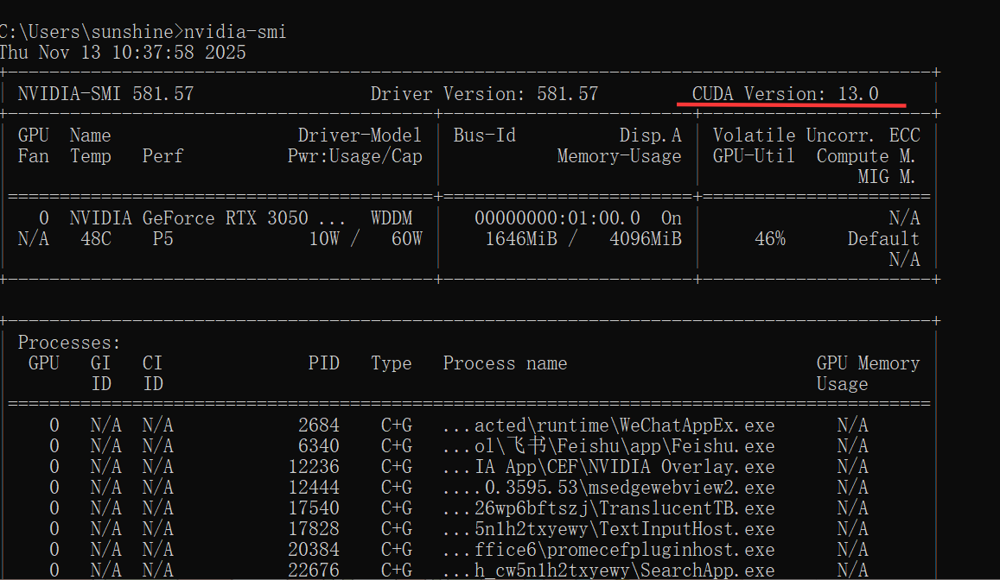

```bash
# CUDA 12.4
conda install pytorch==2.5.1 torchvision==0.20.1 torchaudio==2.5.1 pytorch-cuda=12.4 -c pytorch -c nvidia
```

）：

https://pytorch.org/get-started/previous-versions/

```python
# 对深度学习环境进行测试
import torch
# 查看cuda是否被激活
flag=torch.cuda.is_available()
print("cuda:", flag)   #返回true的话说明被激活
# 进行调用查看:有GPU调用GPU，没有GPU调用CPU
ngpu=1
device=torch.device("cuda:0" if(torch.cuda.is_available() and ngpu>0) else "cpu")
print(device)
print(torch.cuda.get_device_name(0))
print(torch.rand(3,3).cuda())
# 查看cuda和cudnn的版本
cuda_version=torch.version.cuda
print("cuda version",cuda_version)
cudnn_version=torch.backends.cudnn.version()
print("cudnn version",cudnn_version)
```

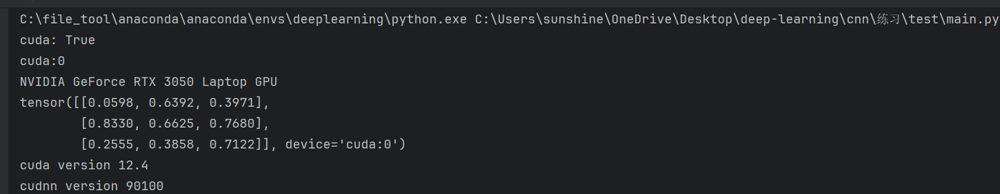

cuda:0 指的是一块显卡

# 2.经典神经网络

### 2.1.LeNet与AlexNet

#### 2.1.1.原理介绍

LeNet-5

1.  原理
    

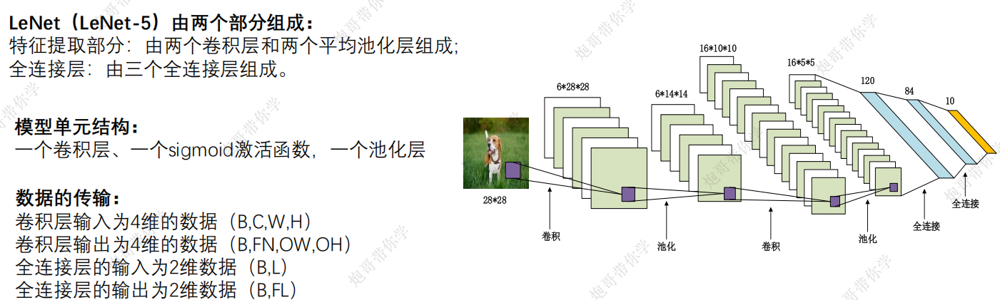

B是batch批次；C是channel通道

2.  网络参数详细
    

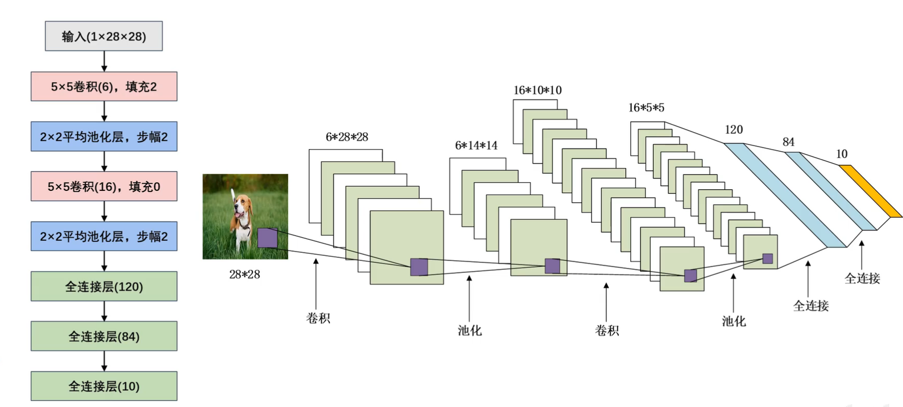

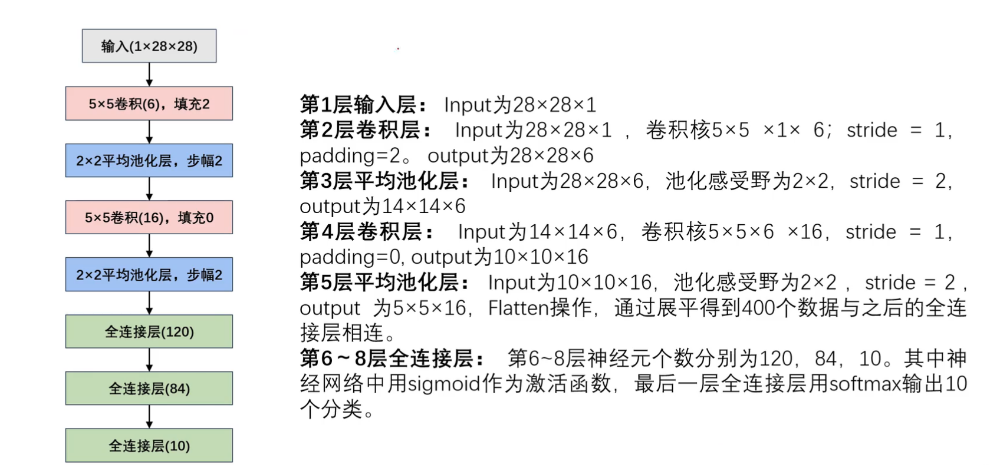

AlexNet

1.  原理
    

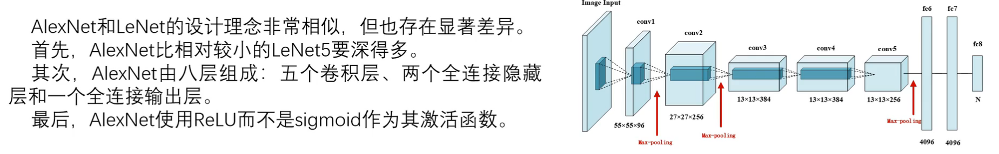

2.  网络参数详细
    

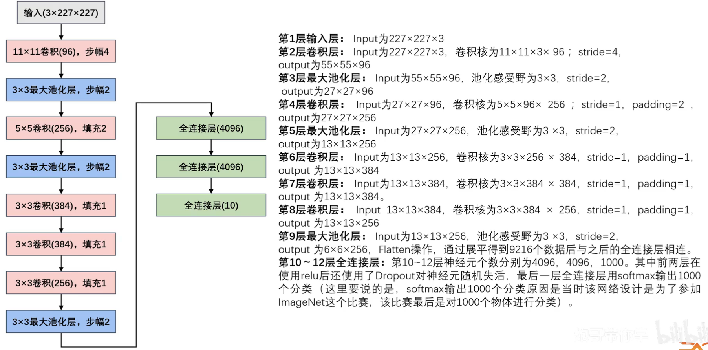

使用dropout使一部分神经元失活，这样可以避免数据量太大导致的过拟合发生，操作如下：

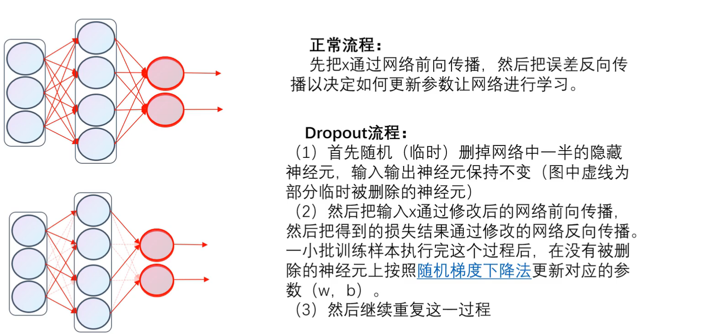

数据处理中的图像增强操作:

在深度学习中最重要的就是对数据的采集和处理，数据不够的情况下，需要对数据进行扩增，有两个好处：

①增加数据量，保证训练数据充足；②防止过拟合

操作方式：①水平翻转；②随机裁剪；③PCA

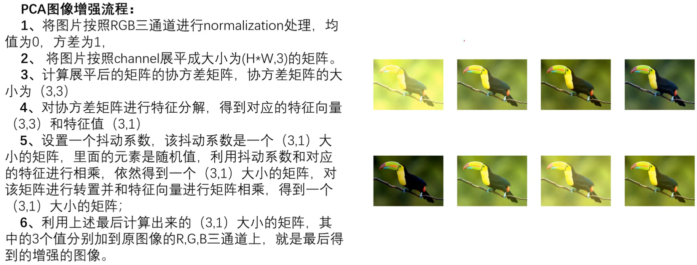

提升网络精确度的方法：LRN正则化

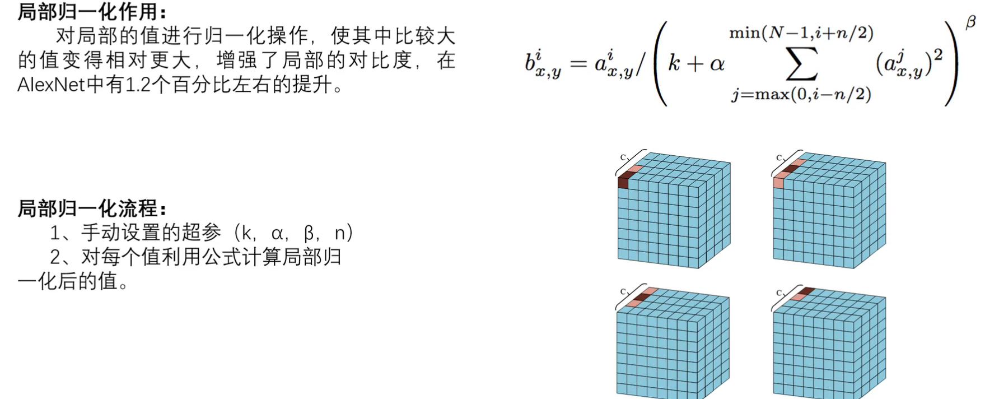

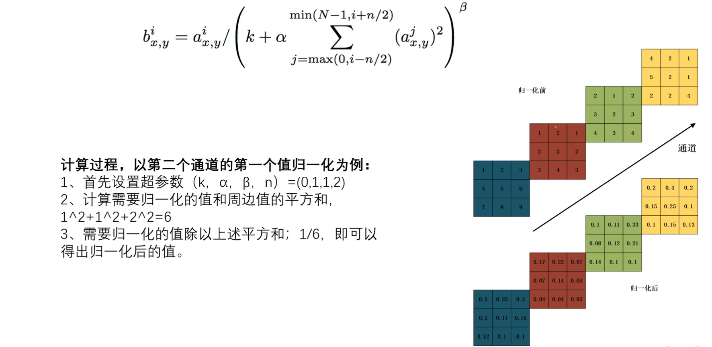

3.  AlexNet的总结
    

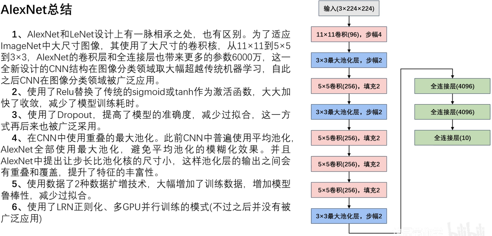

比LeNet模型要深一丢丢

#### 2.1.2.代码实现

（1）LeNet

1.  模型搭建
    

```python
# 导入库
import torch
# 导入神经网络层
from torch import nn
# 导入展示神经网络参数的包
from torchsummary import summary

class LeNet(nn.Module):
    # 模型初始化:
    # 定义一些网络层和激活函数
    def __init__(self):
        # 当时使用继承的时候,如果要进行初始化,必须也要将父类进行初始化一下
        super(LeNet,self).__init__()

        # 定义网络层
        self.c1=nn.Conv2d(in_channels=1,out_channels=6,kernel_size=5,padding=2)
        self.sig=nn.Sigmoid()
        # 定义池化
        self.s2=nn.AvgPool2d(kernel_size=2,stride=2)
        self.c3=nn.Conv2d(in_channels=6,out_channels=16,kernel_size=5)
        self.s4=nn.AvgPool2d(kernel_size=2,stride=2)
        # 定义平展层
        self.flatten=nn.Flatten()
        # 定义全连接层
        self.f5=nn.Linear(400,120)
        self.f6=nn.Linear(120,84)
        self.f7=nn.Linear(84,10)

    # 写工具->写前向传播
    def forward(self,x):
        x=self.sig(self.c1(x))
        x=self.s2(x)
        x=self.sig(self.c3(x))
        x=self.s4(x)
        x=self.flatten(x)
        x=self.sig(self.f5(x))
        x=self.sig(self.f6(x))
        x=self.f7(x)
        return x

if __name__=="__main__":
    # 判断是否有cuda是否激活,有GPU会返回cuda
    device=torch.device("cuda" if torch.cuda.is_available() else "cpu")
    # 如果就是想指定用cpu用下方代码:
    # device="cpu"
    # print(device)

    # 实例化模型
    # 将模型放到设备中去运行
    model=LeNet().to(device)
    print(summary(model,(1,28,28)))
```

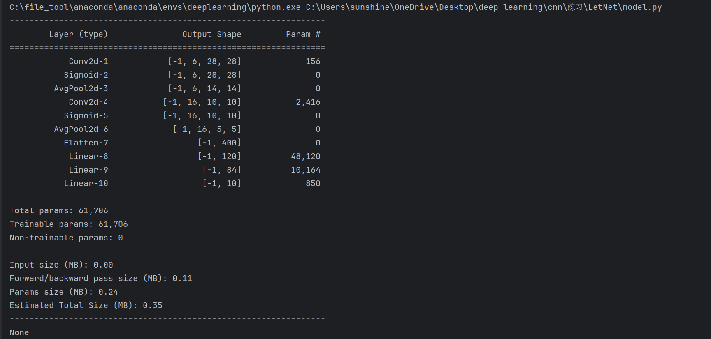

summary这个包就是用来展示神经网络的计算过程，展示参数的变化

2.  训练
    

训练和测试部分的代码作为模板，可以移植到其他模型使用

在训练之前可以将数据展示看一下

```python
# 建立画图的函数，用于展示数据
# torchvision中包含很多内置的数据集
from sklearn.externals.array_api_compat.torch import squeeze
from torchvision.datasets import FashionMNIST
import numpy as np
# 引入处理数据集的包
from torchvision import transforms
# 从torch库中引入数据处理的包
import torch.utils.data as Data
# 导入画图的库
import matplotlib.pyplot as plt


train_data=FashionMNIST(root='./data',
                        train=True,
                        # 将数据大小变为224大小,并转换为张量的形式,方便模型的应用
                        transform=transforms.Compose([transforms.Resize(size=224),transforms.ToTensor()]),
                        download=True)

# 处理数据--->将数据引入进来,将数据进行打乱,成捆,然后规定进程
train_loader=Data.DataLoader(dataset=train_data,
                             batch_size=64,
                             # 数据是否打乱
                             shuffle=True,
                             # 规定加载数据的进程
                             num_workers=0)

# 获得一个batch的数据
for step,(b_x,b_y) in enumerate(train_loader):
    if step > 0:
        break
# squeeze()这个函数是去除张量中所有大小为1的维度
batch_x=b_x.squeeze().numpy()  #将四维张量移除所有维度为1的维度,并转换成numpy数组
batch_y=b_y.numpy()   #将张量转换成功numpy数组
class_label=train_data.classes  #训练集标签
# print(class_label)

# 可视化一个batch的图像
plt.figure(figsize=(12,5))
for ii in np.arange(len(batch_y)):
    plt.subplot(4,16,ii + 1)
    plt.imshow(batch_x[ii,:,:],cmap=plt.cm.gray)
    plt.title(class_label[batch_y[ii]],size=10)
    plt.axis("off")
    plt.subplots_adjust(wspace=0.05)
plt.show()
```

用matplotlib进行展示的过程可以后续再补

关于损失函数的使用：分类用交叉熵损失函数；回归用均方差损失函数

训练次数就是按照批次过整个训练集数据的次数

模型训练：

```python
import copy
import time

import pandas as pd
import torch
from torch.utils.data import Dataset
from torchvision.datasets import FashionMNIST
from torchvision import transforms
import torch.utils.data as Data
import matplotlib.pyplot as plt
# 导入模型
from model import LeNet
from torch import nn


# 处理训练集与验证集函数--->划分数据集
def train_val_data_process():
    train_data=FashionMNIST('./data',
                            train=True,
                            transform=transforms.Compose([transforms.Resize(size=28),transforms.ToTensor()]),
                            download=True)
    train_data,val_data=Data.random_split(train_data,[round(0.8*len(train_data)),round(0.2*len(train_data))])
    train_dataloader = Data.DataLoader(dataset=train_data,
                                       batch_size=128,
                                       shuffle=True,
                                       # 规定8个进程
                                       num_workers=8)
    val_dataloader=Data.DataLoader(dataset=val_data,
                                   batch_size=128,
                                   shuffle=True,
                                   num_workers=8)
    return train_dataloader,val_dataloader

# 验证是否出错
# train_val_data_process()

# 定义模型训练函数
def train_model_process(model,train_dataloader,val_dataloader,num_epochs):
    device=torch.device("cuda" if torch.cuda.is_available() else 'cpu')


    # 定义优化器
    # model.parameters()表示把模型里所有可训练的参数（权重、偏置）传给优化器
    # lr为学习率
    optimizer=torch.optim.Adam(model.parameters(),lr=0.001)

    # 定义损失函数使用交叉熵损失函数
    criterion=nn.CrossEntropyLoss()

    # 将模型放到GPU中进行训练
    model=model.to(device)
    # 复制当前模型的参数
    # 把model（PyTorch的神经网络）的当前参数（权重 / 偏置等）完整复制一份，放到best_model_wts变量里
    # ，保证这份拷贝不会随着后续训练改变 —— 常用于保存“到目前为止表现最好的模型参数”
    best_model_wts=copy.deepcopy(model.state_dict())


    # 初始化参数
    # 最高准确度
    best_acc=0.0
    # 训练集损失列表
    train_loss_all=[]
    # 验证集函数列表
    val_loss_all=[]
    # 训练集准确度列表
    train_acc_all=[]
    # 验证集准确度列表
    val_acc_all=[]

    # 保存当前时间--->方便看每轮训练的时间
    since=time.time()


    # 准备工作完成--->开始训练模型
    for epoch in range(num_epochs):
        print("Epoch {}/{}".format(epoch,num_epochs-1))
        print("-"*10)

        # 初始化参数
        # 训练集损失函数
        train_loss=0.0
        # 训练集准确度
        train_corrects=0
        # 验证集损失函数
        val_loss=0.0
        # 验证集准确度
        val_corrects=0
        # 训练集样本数量
        train_num=0
        # 验证集样本数量
        val_num=0
        # 将数据放到设备,并开始训练
        for step,(b_x,b_y) in enumerate(train_dataloader):
            # 将特征放入到训练设备
            b_x=b_x.to(device)
            # 将标签放入到训练设备当中
            b_y=b_y.to(device)
            # 设置模型为训练模式
            model.train()
            # 将数据放到模型当中,开始前向传播
            # 前向传播过程,输入一个batch,输出为一个batch中对应的预测
            output=model(b_x)
            # 从网络输出 output 的每一行里，找出数值最大的下标（类别），作为模型预测的标签
            pre_lab=torch.argmax(output,dim=1)
            # 计算每一个batch的损失函数
            loss=criterion(output,b_y)
            # 将梯度初始化为0
            optimizer.zero_grad()
            # 梯度置为0后再进行反向传播
            loss.backward()
            # 根据网络反向传播的梯度信息来更新网络的参数，以起到降低loss函数计算的作用
            optimizer.step()
            # loss.item()指的是batch的平均损失
            train_loss+=loss.item()*b_x.size(0)
            # 计算每个批次中正确预测的数量
            train_corrects+=torch.sum(pre_lab==b_y.data)
            # 计算目前为止一共处理了多少样本
            train_num+=b_x.size(0)
        # 验证数据
        for step ,(b_x,b_y) in enumerate(val_dataloader):
            # 将特征放到验证设备当中
            b_x=b_x.to(device)
            # 将标签放到放到训练设备当中
            b_y=b_y.to(device)
            # 开启验证模式，设置模型为评估模式
            model.eval()
            with torch.no_grad():
                # 前向传播过程，输入一个batch,输出为一个batch中对应的预测
                output = model(b_x)
                # 查找每一行中最大值对应的下标
                pre_lab = torch.argmax(output, dim=1)
                # 计算验证集上的当前 batch 损失
                val_batch_loss = criterion(output, b_y)
                # 对损失函数进行累加（按样本数加权）
                val_loss += val_batch_loss.item() * b_x.size(0)
                val_corrects += torch.sum(pre_lab == b_y.data)
                # 当前用于验证的样本数量
            val_num += b_x.size(0)
        # 计算并保存每一次迭代的loss值和准确率
        # 计算并保存训练集的loss值
        train_loss_all.append(train_loss/train_num)
        # 取双精度
        # 计算并保存训练集的准确率
        train_acc_all.append(train_corrects.double().item()/train_num)
        # 计算并保存验证集的loss值
        val_loss_all.append(val_loss/val_num)
        # 计算并保存验证集的准确率
        val_acc_all.append(val_corrects.double().item()/val_num)

        # 打印训练一轮的loss值和准确率
        print('{}train loss:{:.4f} train acc:{:.4f}'.format(epoch,train_loss_all[-1],train_acc_all[-1]))
        print('{}val loss:{:.4f} val acc:{:.4f}'.format(epoch,val_loss_all[-1],val_acc_all[-1]))

        # 判断准确度--->保存最优模型
        if val_acc_all[-1]>best_acc:
            # 保存当前模型准确度
            best_acc:float=val_acc_all[-1]
            # 保存当前的准确度
            # model.state_dict()是当前模型的所有参数（权重和偏置）
            best_model_wts=copy.deepcopy(model.state_dict())

        # 计算耗时
        time_use=time.time()-since
        print('训练和验证耗费的时间{:.0f}m{:.0f}s'.format(time_use//60,time_use%60))
    # 选择最优参数
    # 加载最高准确率下的模型参数
    # model.load_state_dict(best_model_wts)
    torch.save(model.state_dict(best_model_wts), './best_model.pth')
    # 或者写成
    # torch.save(best_model_wts,'./best_model.pth')
    # 保存训练过程,可以使用pandas来进行保存,里边有个DataFrame()可以像列表一样保存数据
    train_process=pd.DataFrame(data={
        "epoch":range(num_epochs),
        "train_loss_all":train_loss_all,
        "val_loss_all":val_loss_all,
        "train_acc_all":train_acc_all,
        "val_acc_all":val_acc_all
    })
    # 返回训练保存的过程
    return train_process

# 将loss值和精度按照图片的形式展示出来
def matplot_acc_loss(train_process):
    # 设置图的大小
    plt.figure(figsize=(12,4))
    # 设置图中有几张图
    # 把当前画布分成1行2列的子图,当前位置是 第 1 个子图
    # ①loss图
    plt.subplot(1,2,1)
    # 补充:
    # plt.subplot(nrows, ncols, index)
    # nrows：行数
    # ncols：列数
    # index：目前选中第几个子图（从1开始）
    plt.plot(train_process["epoch"],train_process.train_loss_all,'ro-',label='train loss')
    plt.plot(train_process["epoch"],train_process.val_loss_all,'bs--',label='val loss')
    # 添加一个图例
    plt.legend()
    # 给轴添加标签
    plt.xlabel('epoch')
    plt.ylabel('loss')
    # ②准确度图
    plt.subplot(1,2,2)
    plt.plot(train_process["epoch"],train_process.train_acc_all,'ro-',label='train acc')
    plt.plot(train_process["epoch"],train_process.val_acc_all,'bs--',label='val acc')
    # 添加图例
    plt.legend()
    plt.xlabel("epoch")
    plt.ylabel("acc")
    plt.show()

# 正式开始训练:
if __name__=="__main__":
    # 将模型实例化
    LeNet=LeNet()
    train_dataloader,val_dataloader=train_val_data_process()
    train_process=train_model_process(LeNet,train_dataloader,val_dataloader,num_epochs=20)
    matplot_acc_loss(train_process)
```

画图的补充点学习：

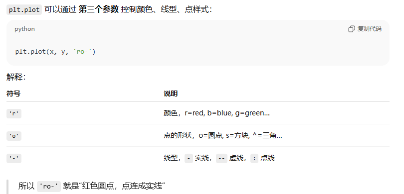

3.  测试
    

```python
import torch
import torch.utils.data as Data
from jupyter_client.consoleapp import classes
from torchvision import transforms
# 导入数据集
from torchvision.datasets import FashionMNIST
from model import LeNet

# 测试数据处理
def test_data_process():
    test_data=FashionMNIST(root='./data',
                           train=False,
                           transform=transforms.Compose([transforms.Resize(size=28),transforms.ToTensor()]),
                           download=True)
    test_dataloader=Data.DataLoader(dataset=test_data,
                                    # 这里是一张一张进行测试
                                    batch_size=1,
                                    shuffle=True,
                                    num_workers=0)
    return test_dataloader

# 定义模型测试函数
def test_model_process(model,test_dataloader):
    # 将模型放到设备当中，先进行判断
    device="cuda" if torch.cuda.is_available() else "cpu"
    model=model.to(device)

    # 设置初始化参数
    test_corrects=0.0
    test_num=0

    # 进行模型测试
    # 模型在推理的时候只进行前向传播，不再进行反向传播更新梯度了
    # 不进行梯度计算，可以节省内存，加快运行速度
    with torch.no_grad():
        # 从数据中进行
        for test_data_x,test_data_y in test_dataloader:
            test_data_x=test_data_x.to(device)
            test_data_y=test_data_y.to(device)
            # 设置为验证模式
            model.eval()
            # 前向传播过程，输入为测试数据集,输出为对每个样本的预测值
            output=model(test_data_x)
            # 查找每一行中最大值对应的下标
            pre_lab=torch.argmax(output,dim=1)
            # 计算正确率
            # .data表示是一个不带梯度信息的tensor
            # 如果预测正确，则准确度test_corrects加1
            test_corrects+=torch.sum(pre_lab==test_data_y.data)
            # 将所有的测试样本进行累计
            test_num+=test_data_x.size(0)

        # 计算准确度
        test_acc=test_corrects.double().item()/test_num
        # .item()的作用是：把只含1个数字的 Tensor 转成 Python 的数字
        print("测试的准确率：",test_acc)

# 实现模型的测试功能
if __name__=="__main__":
    # 加载模型
    model=LeNet()
    # 调用训练好的权重，把之前训练好、保存下来的模型参数重新装回模型里
    # 使用torch中的load函数加载权重，利用model.load_state_dict将参数加回到模型当中
    model.load_state_dict(torch.load('best_model.pth'))
    # 数据加载
    test_dataloader=test_data_process()
    # 加载模型测试的函数
    test_model_process(model,test_dataloader)

    # 验证集推理实现：
    # 加载数据加载的更详细一些
    device="cuda" if torch.cuda.is_available() else "cpu"
    model=model.to(device)
    # 设置类别，这样预测值就不展示数字，就直接展示这个种类了
    # 顺序不可改变
    classes=['T-shirt/top','Trouser','Pullover','Dress','Coat','Sandal','Shirt','Sneaker','Bag','Ankle boot']
    with torch.no_grad():
        # 将数据和标签都放到设备当中
        for b_x,b_y in test_dataloader:
            b_x=b_x.to(device)
            b_y=b_y.to(device)

            # 设置模型为验证模式
            model.eval()
            # 模型推理结果
            output=model(b_x)
            # 获取最大下标，最大下标就是类别号
            pre_lab=torch.argmax(output,dim=1)
            # 取出张量中的数值
            result=pre_lab.item()
            label=b_y.item()
            print("预测值：",classes[result],"------","真实值：",classes[label])
```

（2）AlexNet

1.  神经网络构建
    

```python
import torch
from torch import nn
from torchsummary import summary
import torch.nn.functional as F

class AlexNet(nn.Module):
    def __init__(self):
        super(AlexNet,self).__init__()
        self.ReLu=nn.ReLU()
        self.c1=nn.Conv2d(in_channels=1,out_channels=96,kernel_size=11,stride=4)
        self.s2=nn.MaxPool2d(kernel_size=3,stride=2)
        self.c3=nn.Conv2d(in_channels=96,out_channels=256,kernel_size=5,padding=2)
        self.s4=nn.MaxPool2d(kernel_size=3,stride=2)
        self.c5=nn.Conv2d(in_channels=256,out_channels=384,kernel_size=3,padding=1)
        self.c6=nn.Conv2d(in_channels=384,out_channels=384,kernel_size=3,padding=1)
        self.c7=nn.Conv2d(in_channels=384,out_channels=256,kernel_size=3,padding=1)
        self.s8=nn.MaxPool2d(kernel_size=3,stride=2)
        # 定义平展层
        self.flatten=nn.Flatten()
       # 定义全连接层
        self.f1=nn.Linear(6*6*256,4096)
        self.f2=nn.Linear(4096,4096)
        self.f3=nn.Linear(4096,10)

    # 定义前向传播
    def forward(self,x):
        x=self.ReLu(self.c1(x))
        x=self.s2(x)
        x=self.ReLu(self.c3(x))
        x=self.s4(x)
        x=self.ReLu(self.c5(x))
        x=self.ReLu(self.c6(x))
        x=self.ReLu(self.c7(x))
        x=self.s8(x)

        # 展平加线性全连接层
        x=self.flatten(x)
        x=self.ReLu(self.f1(x))
        # 还需要dropout对神经元随机进行失活
        x=F.dropout(x,0.5)
        x=self.ReLu(self.f2(x))
        x=F.dropout(x,0.5)
        # 直接输出
        x=self.f3(x)
        # 前向传播输出
        return x
# 定义主函数，用于测试神经网络是否可以正常工作
if __name__=="__main__":
    device=torch.device("cuda" if torch.cuda.is_available() else "cpu")
    # 模型实例化，然后将实例化的模型放到设备中
    model=AlexNet().to(device)
    print(summary(model,(1,227,227)))
```

2.  训练
    

```python
import copy
import time
import pandas as pd
import torch
from torch.utils.data import Dataset
from torchvision.datasets import FashionMNIST
from torchvision import transforms
import torch.utils.data as Data
import matplotlib.pyplot as plt
# 导入模型
from model import AlexNet
from torch import nn


# 处理训练集与验证集函数--->划分数据集
def train_val_data_process():
    train_data=FashionMNIST('./data',
                            train=True,
                            transform=transforms.Compose([transforms.Resize(size=227),transforms.ToTensor()]),
                            download=True)
    train_data,val_data=Data.random_split(train_data,[round(0.8*len(train_data)),round(0.2*len(train_data))])
    train_dataloader = Data.DataLoader(dataset=train_data,
                                       batch_size=128,
                                       shuffle=True,
                                       # 规定8个进程
                                       num_workers=8)
    val_dataloader=Data.DataLoader(dataset=val_data,
                                   batch_size=128,
                                   shuffle=True,
                                   num_workers=8)
    return train_dataloader,val_dataloader

# 验证是否出错
# train_val_data_process()

# 定义模型训练函数
def train_model_process(model,train_dataloader,val_dataloader,num_epochs):
    device=torch.device("cuda" if torch.cuda.is_available() else 'cpu')


    # 定义优化器
    # model.parameters()表示把模型里所有可训练的参数（权重、偏置）传给优化器
    # lr为学习率
    optimizer=torch.optim.Adam(model.parameters(),lr=0.001)

    # 定义损失函数使用交叉熵损失函数
    criterion=nn.CrossEntropyLoss()

    # 将模型放到GPU中进行训练
    model=model.to(device)
    # 复制当前模型的参数
    # 把model（PyTorch的神经网络）的当前参数（权重 / 偏置等）完整复制一份，放到best_model_wts变量里
    # ，保证这份拷贝不会随着后续训练改变 —— 常用于保存“到目前为止表现最好的模型参数”
    best_model_wts=copy.deepcopy(model.state_dict())


    # 初始化参数
    # 最高准确度
    best_acc=0.0
    # 训练集损失列表
    train_loss_all=[]
    # 验证集函数列表
    val_loss_all=[]
    # 训练集准确度列表
    train_acc_all=[]
    # 验证集准确度列表
    val_acc_all=[]

    # 保存当前时间--->方便看每轮训练的时间
    since=time.time()


    # 准备工作完成--->开始训练模型
    for epoch in range(num_epochs):
        print("Epoch {}/{}".format(epoch,num_epochs-1))
        print("-"*10)

        # 初始化参数
        # 训练集损失函数
        train_loss=0.0
        # 训练集准确度
        train_corrects=0
        # 验证集损失函数
        val_loss=0.0
        # 验证集准确度
        val_corrects=0
        # 训练集样本数量
        train_num=0
        # 验证集样本数量
        val_num=0
        # 将数据放到设备,并开始训练
        for step,(b_x,b_y) in enumerate(train_dataloader):
            # 将特征放入到训练设备
            b_x=b_x.to(device)
            # 将标签放入到训练设备当中
            b_y=b_y.to(device)
            # 设置模型为训练模式
            model.train()
            # 将数据放到模型当中,开始前向传播
            # 前向传播过程,输入一个batch,输出为一个batch中对应的预测
            output=model(b_x)
            # 从网络输出 output 的每一行里，找出数值最大的下标（类别），作为模型预测的标签
            pre_lab=torch.argmax(output,dim=1)
            # 计算每一个batch的损失函数
            loss=criterion(output,b_y)
            # 将梯度初始化为0
            optimizer.zero_grad()
            # 梯度置为0后再进行反向传播
            loss.backward()
            # 根据网络反向传播的梯度信息来更新网络的参数，以起到降低loss函数计算的作用
            optimizer.step()
            # loss.item()指的是batch的平均损失
            train_loss+=loss.item()*b_x.size(0)
            # 计算每个批次中正确预测的数量
            train_corrects+=torch.sum(pre_lab==b_y.data)
            # 计算目前为止一共处理了多少样本
            train_num+=b_x.size(0)
        # 验证数据
        for step ,(b_x,b_y) in enumerate(val_dataloader):
            # 将特征放到验证设备当中
            b_x=b_x.to(device)
            # 将标签放到放到训练设备当中
            b_y=b_y.to(device)
            # 开启验证模式，设置模型为评估模式
            model.eval()
            # 验证时不计算梯度以节省内存/计算
            with torch.no_grad():
                # 前向传播过程，输入一个batch,输出为一个batch中对应的预测
                output=model(b_x)
                # 查找每一行中最大值对应的下标
                pre_lab=torch.argmax(output,dim=1)
                # 计算验证集上的当前 batch 损失
                val_batch_loss=criterion(output,b_y)
                # 对损失函数进行累加（按样本数加权）
                val_loss+=val_batch_loss.item()*b_x.size(0)
                val_corrects+=torch.sum(pre_lab==b_y.data)
            # 当前用于验证的样本数量
            val_num+=b_x.size(0)
        # 计算并保存每一次迭代的loss值和准确率
        # 计算并保存训练集的loss值
        train_loss_all.append(train_loss/train_num)
        # 取双精度
        # 计算并保存训练集的准确率
        train_acc_all.append(train_corrects.double().item()/train_num)
        # 计算并保存验证集的loss值
        val_loss_all.append(val_loss/val_num)
        # 计算并保存验证集的准确率
        val_acc_all.append(val_corrects.double().item()/val_num)

        # 打印训练一轮的loss值和准确率
        print('{}train loss:{:.4f} train acc:{:.4f}'.format(epoch,train_loss_all[-1],train_acc_all[-1]))
        print('{}val loss:{:.4f} val acc:{:.4f}'.format(epoch,val_loss_all[-1],val_acc_all[-1]))

        # 判断准确度--->保存最优模型
        if val_acc_all[-1]>best_acc:
            # 保存当前模型准确度
            best_acc:float=val_acc_all[-1]
            # 保存当前的准确度
            # model.state_dict()是当前模型的所有参数（权重和偏置）
            best_model_wts=copy.deepcopy(model.state_dict())

        # 计算耗时
        time_use=time.time()-since
        print('训练和验证耗费的时间{:.0f}m{:.0f}s'.format(time_use//60,time_use%60))
    # 选择最优参数并保存
    # 保存最佳模型权重字典
    torch.save(best_model_wts,'./best_model.pth')
    # 保存训练过程,可以使用pandas来进行保存,里边有个DataFrame()可以像列表一样保存数据
    train_process=pd.DataFrame(data={
        "epoch":range(num_epochs),
        "train_loss_all":train_loss_all,
        "val_loss_all":val_loss_all,
        "train_acc_all":train_acc_all,
        "val_acc_all":val_acc_all
    })
    # 返回训练保存的过程
    return train_process

# 将loss值和精度按照图片的形式展示出来
def matplot_acc_loss(train_process):
    # 设置图的大小
    plt.figure(figsize=(12,4))
    # 设置图中有几张图
    # 把当前画布分成1行2列的子图,当前位置是 第 1 个子图
    # ①loss图
    plt.subplot(1,2,1)
    # 补充:
    # plt.subplot(nrows, ncols, index)
    # nrows：行数
    # ncols：列数
    # index：目前选中第几个子图（从1开始）
    plt.plot(train_process["epoch"],train_process.train_loss_all,'ro-',label='train loss')
    plt.plot(train_process["epoch"],train_process.val_loss_all,'bs--',label='val loss')
    # 添加一个图例
    plt.legend()
    # 给轴添加标签
    plt.xlabel('epoch')
    plt.ylabel('loss')
    # ②准确度图
    plt.subplot(1,2,2)
    plt.plot(train_process["epoch"],train_process.train_acc_all,'ro-',label='train acc')
    plt.plot(train_process["epoch"],train_process.val_acc_all,'bs--',label='val acc')
    # 添加图例
    plt.legend()
    plt.xlabel("epoch")
    plt.ylabel("acc")
    plt.show()

# 正式开始训练:
if __name__=="__main__":
    # 将模型实例化
    AlexNet=AlexNet()
    train_dataloader,val_dataloader=train_val_data_process()
    train_process=train_model_process(AlexNet,train_dataloader,val_dataloader,num_epochs=20)
    matplot_acc_loss(train_process)
```

3.  测试
    

```python
import torch
import torch.utils.data as Data
from jupyter_client.consoleapp import classes
from torchvision import transforms
# 导入数据集
from torchvision.datasets import FashionMNIST
from model import AlexNet
from 练习.AlexNet.model import AlexNet


# 测试数据处理
def test_data_process():
    test_data=FashionMNIST(root='./data',
                           train=False,
                           transform=transforms.Compose([transforms.Resize(size=227),transforms.ToTensor()]),
                           download=True)
    test_dataloader=Data.DataLoader(dataset=test_data,
                                    # 这里是一张一张进行测试
                                    batch_size=1,
                                    shuffle=True,
                                    num_workers=0)
    return test_dataloader

# 定义模型测试函数
def test_model_process(model,test_dataloader):
    # 将模型放到设备当中，先进行判断
    device="cuda" if torch.cuda.is_available() else "cpu"
    model=model.to(device)

    # 设置初始化参数
    test_corrects=0.0
    test_num=0

    # 进行模型测试
    # 模型在推理的时候只进行前向传播，不再进行反向传播更新梯度了
    # 不进行梯度计算，可以节省内存，加快运行速度
    with torch.no_grad():
        # 从数据中进行
        for test_data_x,test_data_y in test_dataloader:
            test_data_x=test_data_x.to(device)
            test_data_y=test_data_y.to(device)
            # 设置为验证模式
            model.eval()
            # 前向传播过程，输入为测试数据集,输出为对每个样本的预测值
            output=model(test_data_x)
            # 查找每一行中最大值对应的下标
            pre_lab=torch.argmax(output,dim=1)
            # 计算正确率
            # .data表示是一个不带梯度信息的tensor
            # 如果预测正确，则准确度test_corrects加1
            test_corrects+=torch.sum(pre_lab==test_data_y.data)
            # 将所有的测试样本进行累计
            test_num+=test_data_x.size(0)

        # 计算准确度
        test_acc=test_corrects.double().item()/test_num
        # .item()的作用是：把只含1个数字的 Tensor 转成 Python 的数字
        print("测试的准确率：",test_acc)

# 实现模型的测试功能
if __name__=="__main__":
    # 加载模型
    model=AlexNet()
    # 调用训练好的权重，把之前训练好、保存下来的模型参数重新装回模型里
    # 使用torch中的load函数加载权重，利用model.load_state_dict将参数加回到模型当中
    model.load_state_dict(torch.load('best_model.pth'))
    # 数据加载
    test_dataloader=test_data_process()
    # 加载模型测试的函数
    test_model_process(model,test_dataloader)

    # 验证集推理实现：
    # 加载数据加载的更详细一些
    device="cuda" if torch.cuda.is_available() else "cpu"
    model=model.to(device)
    # 设置类别，这样预测值就不展示数字，就直接展示这个种类了
    # 顺序不可改变
    classes=['T-shirt/top','Trouser','Pullover','Dress','Coat','Sandal','Shirt','Sneaker','Bag','Ankle boot']
    with torch.no_grad():
        # 将数据和标签都放到设备当中
        for b_x,b_y in test_dataloader:
            b_x=b_x.to(device)
            b_y=b_y.to(device)

            # 设置模型为验证模式
            model.eval()
            # 模型推理结果
            output=model(b_x)
            # 获取最大下标，最大下标就是类别号
            pre_lab=torch.argmax(output,dim=1)
            # 取出张量中的数值
            result=pre_lab.item()
            label=b_y.item()
            print("预测值：",classes[result],"------","真实值：",classes[label])
```

### 2.2.VGG

#### 2.2.1.原理

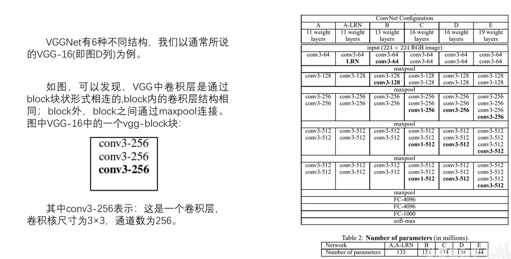

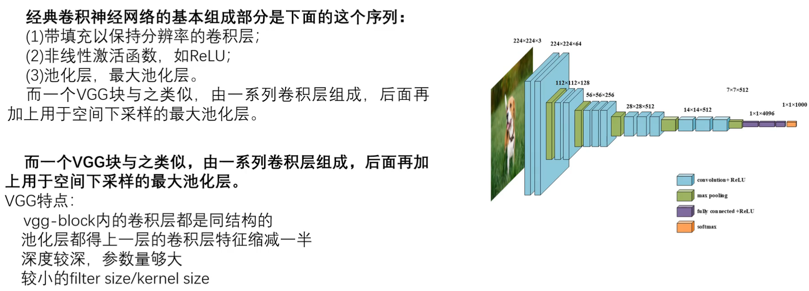

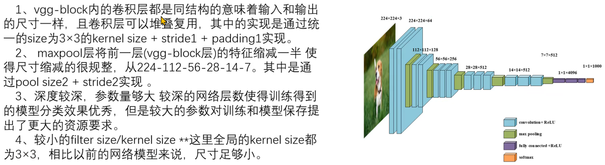

参数详细描述：

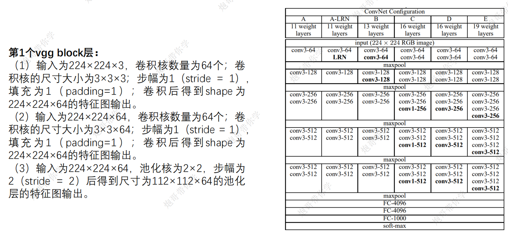

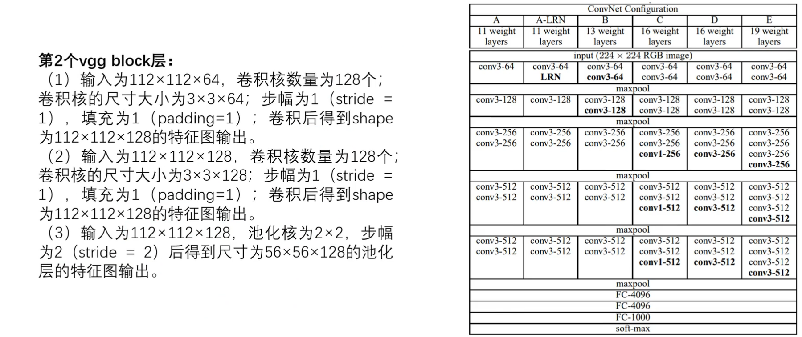

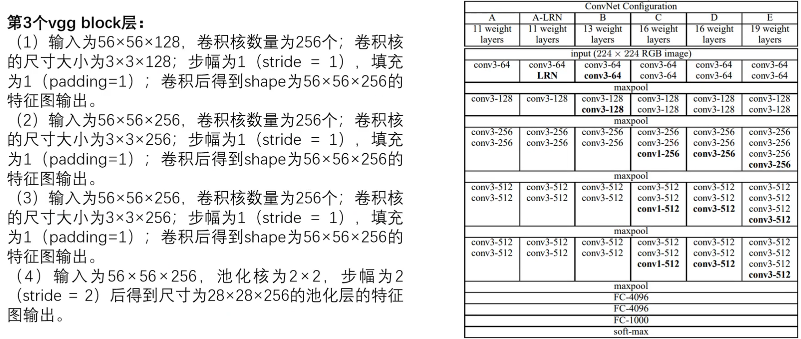

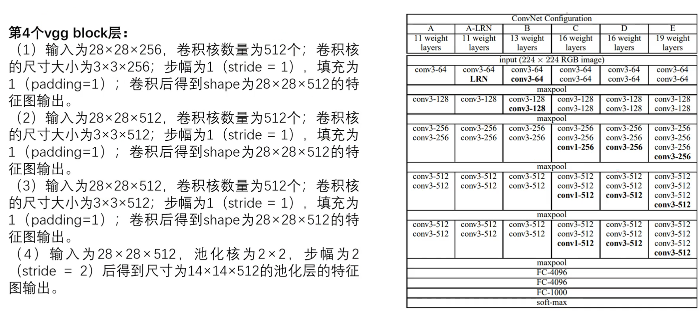

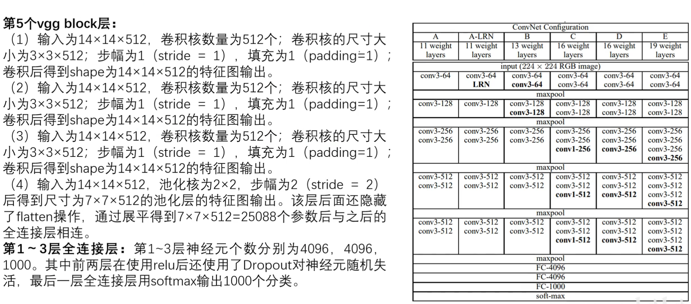

#### 2.2.2.代码实现

1.  网络搭建
    

```python
import torch
from sympy.core.sympify import kernS
from torch import nn
from torchsummary import summary

class VGG16(nn.Module):
    def __init__(self):
        super(VGG16, self).__init__()
        # 按照块来进行搭建神经网络层,按照序列来写
        # 这里用的是灰度图
        self.block1=nn.Sequential(
            nn.Conv2d(in_channels=1,out_channels=64,kernel_size=3,padding=1),
            nn.ReLU(),
            nn.Conv2d(in_channels=64,out_channels=64,kernel_size=3,padding=1),
            nn.ReLU(),
            nn.MaxPool2d(kernel_size=2,stride=2,padding=0)
        )
        # 第二层
        self.block2=nn.Sequential(
            nn.Conv2d(in_channels=64,out_channels=128,kernel_size=3,padding=1),
            nn.ReLU(),
            nn.Conv2d(in_channels=128,out_channels=128,kernel_size=3,padding=1),
            nn.ReLU(),
            nn.MaxPool2d(kernel_size=2,stride=2,padding=0)
        )
        # 第三层
        self.block3=nn.Sequential(
            nn.Conv2d(in_channels=128,out_channels=256,kernel_size=3,padding=1),
            nn.ReLU(),
            nn.Conv2d(in_channels=256,out_channels=256,kernel_size=3,padding=1),
            nn.ReLU(),
            nn.Conv2d(in_channels=256,out_channels=256,kernel_size=3,padding=1),
            nn.ReLU(),
            nn.MaxPool2d(kernel_size=2,stride=2,padding=0)
        )
        # 第四层
        self.block4=nn.Sequential(
            nn.Conv2d(in_channels=256,out_channels=512,kernel_size=3,padding=1),
            nn.ReLU(),
            nn.Conv2d(in_channels=512,out_channels=512,kernel_size=3,padding=1),
            nn.ReLU(),
            nn.Conv2d(in_channels=512,out_channels=512,kernel_size=3,padding=1),
            nn.ReLU(),
            nn.MaxPool2d(kernel_size=2,stride=2,padding=0)
        )
        # 第五层
        self.block5=nn.Sequential(
            nn.Conv2d(in_channels=512,out_channels=512,kernel_size=3,padding=1),
            nn.ReLU(),
            nn.Conv2d(in_channels=512,out_channels=512,kernel_size=3,padding=1),
            nn.ReLU(),
            nn.Conv2d(in_channels=512,out_channels=512,kernel_size=3,padding=1),
            nn.ReLU(),
            nn.MaxPool2d(kernel_size=2,stride=2,padding=0)
        )
        # 全连接层
        self.block6=nn.Sequential(
            # 平展操作
            # 这里为了适应笔记本显存过低4g，然后不进行1000分类，而是进行10分类，将全连接层进行修改
            nn.Flatten(),
            nn.Linear(7*7*512,256),
            nn.ReLU(),
            nn.Linear(256,128),
            nn.ReLU(),
            nn.Linear(128,10)
        )

        # 权重初始化,保证w不会过大过小导致在训练的时候不收敛
        # 循环遍历模型
        for m in self.modules():
            # print(m)
            if isinstance(m,nn.Conv2d):
                # 凯明初始化,初始化w,对应的激活函数是relu
                nn.init.kaiming_normal_(m.weight,nonlinearity='relu')
                # 判断b参数是否存在
                if m.bias is not None:
                    # 如果参数不存在的化初始化b=0
                    nn.init.constant_(m.bias,0)
            # 全连接层初始化
            elif isinstance(m,nn.Linear):
                # 这个初始化方法是利用的是正太分布的方式
                # 均值为0，方差为0.01
                nn.init.normal_(m.weight,0,0.01)
                # 初始化b参数
                if m.bias is not None:
                    nn.init.constant_(m.bias,0)

    # 定义前向传播
    def forward(self,x):
        x=self.block1(x)
        x=self.block2(x)
        x=self.block3(x)
        x=self.block4(x)
        x=self.block5(x)
        x=self.block6(x)
        return x

# 验证模型
if __name__=='__main__':
    device=torch.device("cuda" if torch.cuda.is_available() else "cpu")
    print(device)
    model=VGG16().to(device)
    print(summary(model,(1,224,224)))
```

2.  训练代码
    

模型不收敛的原因:①批次过低；②w权重的初始值过大或过小

解决方式:

①权重初始化

```python
# 权重初始化,保证w不会过大过小导致在训练的时候不收敛
# 循环遍历模型
for m in self.modules():
    # print(m)
    if isinstance(m,nn.Conv2d):
        # 凯明初始化,初始化w,对应的激活函数是relu
        nn.init.kaiming_normal_(m.weight,nonlinearity='relu')
        # 判断b参数是否存在
        if m.bias is not None:
            # 如果参数不存在的化初始化b=0
            nn.init.constant_(m.bias,0)
    # 全连接层初始化
    elif isinstance(m,nn.Linear):
        # 这个初始化方法是利用的是正太分布的方式
        # 均值为0，方差为0.01
        nn.init.normal_(m.weight,0,0.01)
        # 初始化b参数
        if m.bias is not None:
            nn.init.constant_(m.bias,0)
```

②尽可能地增加批次

训练完整代码：

```python
import torch
from sympy.core.sympify import kernS
from torch import nn
from torchsummary import summary

class VGG16(nn.Module):
    def __init__(self):
        super(VGG16, self).__init__()
        # 按照块来进行搭建神经网络层,按照序列来写
        # 这里用的是灰度图
        self.block1=nn.Sequential(
            nn.Conv2d(in_channels=1,out_channels=64,kernel_size=3,padding=1),
            nn.ReLU(),
            nn.Conv2d(in_channels=64,out_channels=64,kernel_size=3,padding=1),
            nn.ReLU(),
            nn.MaxPool2d(kernel_size=2,stride=2,padding=0)
        )
        # 第二层
        self.block2=nn.Sequential(
            nn.Conv2d(in_channels=64,out_channels=128,kernel_size=3,padding=1),
            nn.ReLU(),
            nn.Conv2d(in_channels=128,out_channels=128,kernel_size=3,padding=1),
            nn.ReLU(),
            nn.MaxPool2d(kernel_size=2,stride=2,padding=0)
        )
        # 第三层
        self.block3=nn.Sequential(
            nn.Conv2d(in_channels=128,out_channels=256,kernel_size=3,padding=1),
            nn.ReLU(),
            nn.Conv2d(in_channels=256,out_channels=256,kernel_size=3,padding=1),
            nn.ReLU(),
            nn.Conv2d(in_channels=256,out_channels=256,kernel_size=3,padding=1),
            nn.ReLU(),
            nn.MaxPool2d(kernel_size=2,stride=2,padding=0)
        )
        # 第四层
        self.block4=nn.Sequential(
            nn.Conv2d(in_channels=256,out_channels=512,kernel_size=3,padding=1),
            nn.ReLU(),
            nn.Conv2d(in_channels=512,out_channels=512,kernel_size=3,padding=1),
            nn.ReLU(),
            nn.Conv2d(in_channels=512,out_channels=512,kernel_size=3,padding=1),
            nn.ReLU(),
            nn.MaxPool2d(kernel_size=2,stride=2,padding=0)
        )
        # 第五层
        self.block5=nn.Sequential(
            nn.Conv2d(in_channels=512,out_channels=512,kernel_size=3,padding=1),
            nn.ReLU(),
            nn.Conv2d(in_channels=512,out_channels=512,kernel_size=3,padding=1),
            nn.ReLU(),
            nn.Conv2d(in_channels=512,out_channels=512,kernel_size=3,padding=1),
            nn.ReLU(),
            nn.MaxPool2d(kernel_size=2,stride=2,padding=0)
        )
        # 全连接层
        self.block6=nn.Sequential(
            # 平展操作
            # 这里为了适应笔记本显存过低4g，然后不进行1000分类，而是进行10分类，将全连接层进行修改
            nn.Flatten(),
            nn.Linear(7*7*512,256),
            nn.ReLU(),
            nn.Linear(256,128),
            nn.ReLU(),
            nn.Linear(128,10)
        )

        # 权重初始化,保证w不会过大过小导致在训练的时候不收敛
        # 循环遍历模型
        for m in self.modules():
            # print(m)
            if isinstance(m,nn.Conv2d):
                # 凯明初始化,初始化w,对应的激活函数是relu
                nn.init.kaiming_normal_(m.weight,nonlinearity='relu')
                # 判断b参数是否存在
                if m.bias is not None:
                    # 如果参数不存在的化初始化b=0
                    nn.init.constant_(m.bias,0)
            # 全连接层初始化
            elif isinstance(m,nn.Linear):
                # 这个初始化方法是利用的是正太分布的方式
                # 均值为0，方差为0.01
                nn.init.normal_(m.weight,0,0.01)
                # 初始化b参数
                if m.bias is not None:
                    nn.init.constant_(m.bias,0)

    # 定义前向传播
    def forward(self,x):
        x=self.block1(x)
        x=self.block2(x)
        x=self.block3(x)
        x=self.block4(x)
        x=self.block5(x)
        x=self.block6(x)
        return x

# 验证模型
if __name__=='__main__':
    device=torch.device("cuda" if torch.cuda.is_available() else "cpu")
    print(device)
    model=VGG16().to(device)
    print(summary(model,(1,224,224)))
```

3.  测试代码
    

```python
import torch
import torch.utils.data as Data
from torchvision import transforms
# 导入数据集
from torchvision.datasets import FashionMNIST
from model import VGG16


# 测试数据处理
def test_data_process():
    test_data=FashionMNIST(root='./data',
                           train=False,
                           transform=transforms.Compose([transforms.Resize(size=224),transforms.ToTensor()]),
                           download=True)
    test_dataloader=Data.DataLoader(dataset=test_data,
                                    # 这里是一张一张进行测试
                                    batch_size=1,
                                    shuffle=True,
                                    num_workers=0)
    return test_dataloader

# 定义模型测试函数
def test_model_process(model,test_dataloader):
    # 将模型放到设备当中，先进行判断
    device="cuda" if torch.cuda.is_available() else "cpu"
    model=model.to(device)

    # 设置初始化参数
    test_corrects=0.0
    test_num=0

    # 进行模型测试
    # 模型在推理的时候只进行前向传播，不再进行反向传播更新梯度了
    # 不进行梯度计算，可以节省内存，加快运行速度
    with torch.no_grad():
        # 从数据中进行
        for test_data_x,test_data_y in test_dataloader:
            test_data_x=test_data_x.to(device)
            test_data_y=test_data_y.to(device)
            # 设置为验证模式
            model.eval()
            # 前向传播过程，输入为测试数据集,输出为对每个样本的预测值
            output=model(test_data_x)
            # 查找每一行中最大值对应的下标
            pre_lab=torch.argmax(output,dim=1)
            # 计算正确率
            # .data表示是一个不带梯度信息的tensor
            # 如果预测正确，则准确度test_corrects加1
            test_corrects+=torch.sum(pre_lab==test_data_y.data)
            # 将所有的测试样本进行累计
            test_num+=test_data_x.size(0)

        # 计算准确度
        test_acc=test_corrects.double().item()/test_num
        # .item()的作用是：把只含1个数字的 Tensor 转成 Python 的数字
        print("测试的准确率：",test_acc)

# 实现模型的测试功能
if __name__=="__main__":
    # 加载模型
    model=VGG16()
    # 调用训练好的权重，把之前训练好、保存下来的模型参数重新装回模型里
    # 使用torch中的load函数加载权重，利用model.load_state_dict将参数加回到模型当中
    model.load_state_dict(torch.load('best_model.pth'))
    # 数据加载
    test_dataloader=test_data_process()
    # 加载模型测试的函数
    test_model_process(model,test_dataloader)

    # 验证集推理实现：
    # 加载数据加载的更详细一些
    device="cuda" if torch.cuda.is_available() else "cpu"
    model=model.to(device)
    # 设置类别，这样预测值就不展示数字，就直接展示这个种类了
    # 顺序不可改变
    classes=['T-shirt/top','Trouser','Pullover','Dress','Coat','Sandal','Shirt','Sneaker','Bag','Ankle boot']
    with torch.no_grad():
        # 将数据和标签都放到设备当中
        for b_x,b_y in test_dataloader:
            b_x=b_x.to(device)
            b_y=b_y.to(device)

            # 设置模型为验证模式
            model.eval()
            # 模型推理结果
            output=model(b_x)
            # 获取最大下标，最大下标就是类别号
            pre_lab=torch.argmax(output,dim=1)
            # 取出张量中的数值
            result=pre_lab.item()
            label=b_y.item()
            print("预测值：",classes[result],"------","真实值：",classes[label])
```

### 2.3.GoogLeNet

#### 2.3.1.原理

1.  网络结构
    

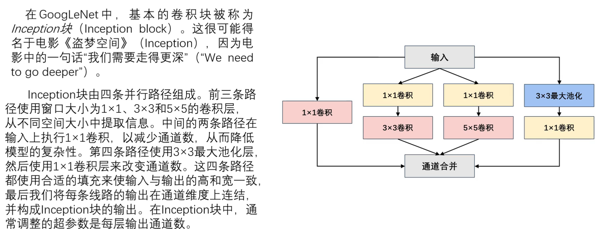

1x1卷积是为了减少通道数（通过填充和步幅来实现的）

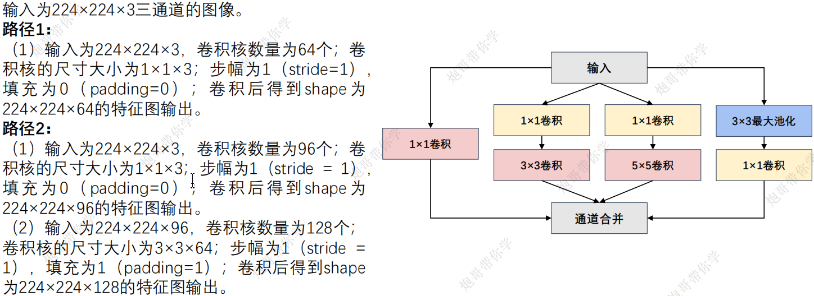

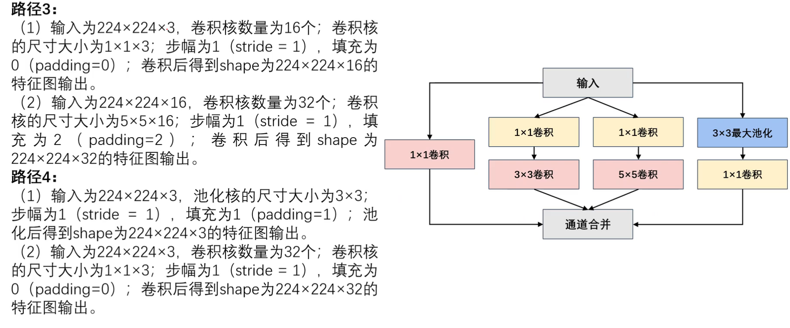

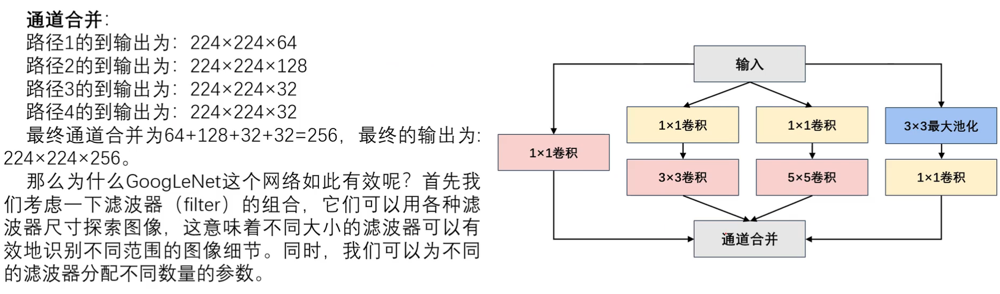

2.  1x1卷积的优点
    

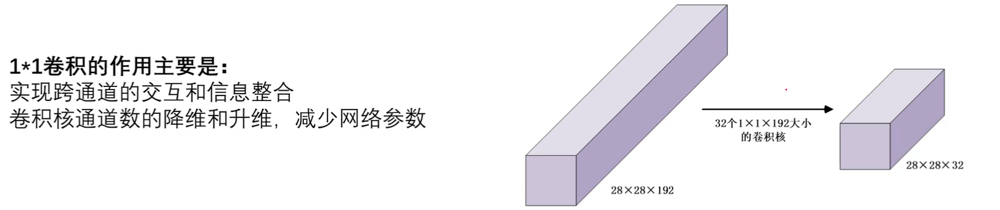

3.  全局平均池化层优点
    

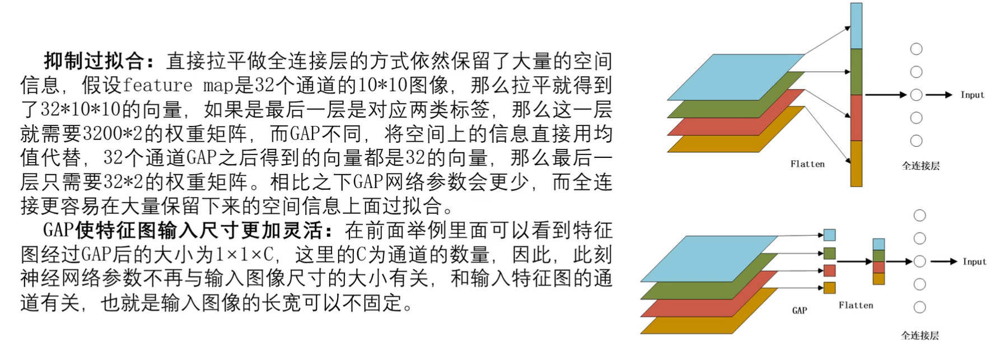

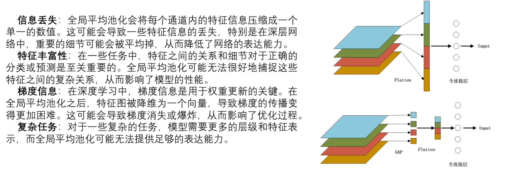

4.  参数详细描述
    

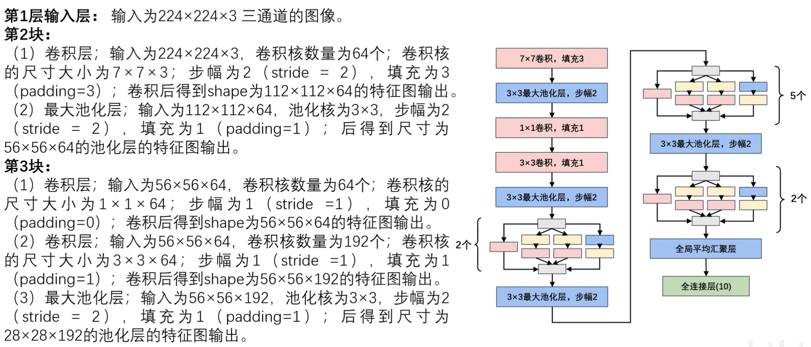


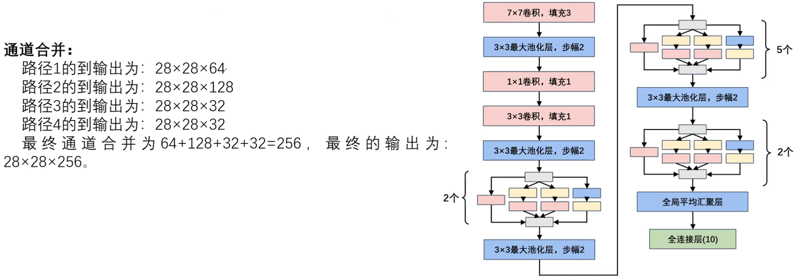

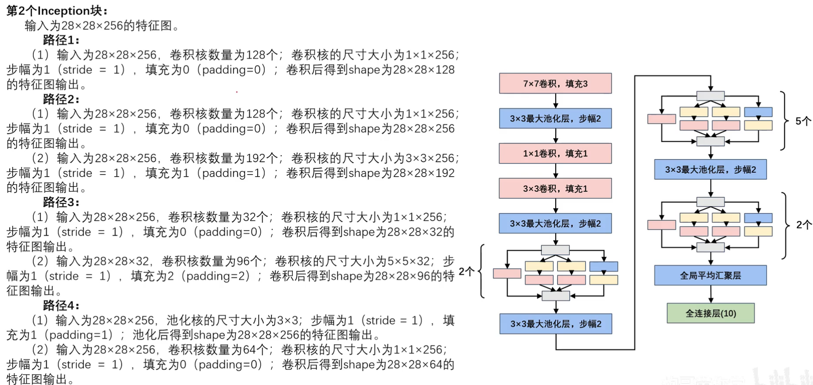

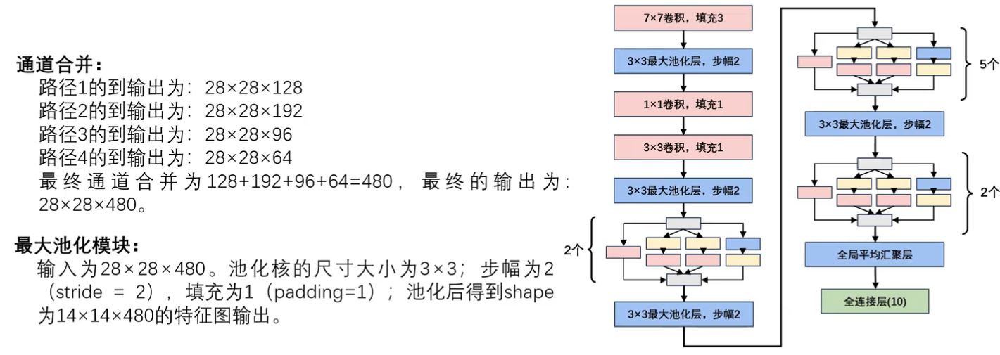

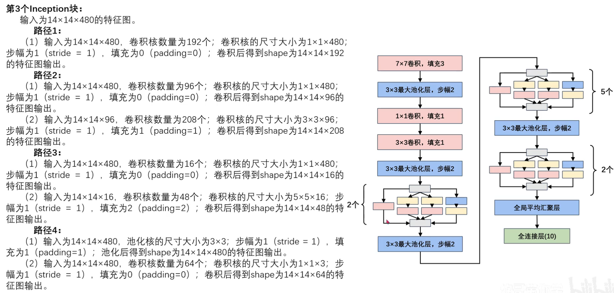

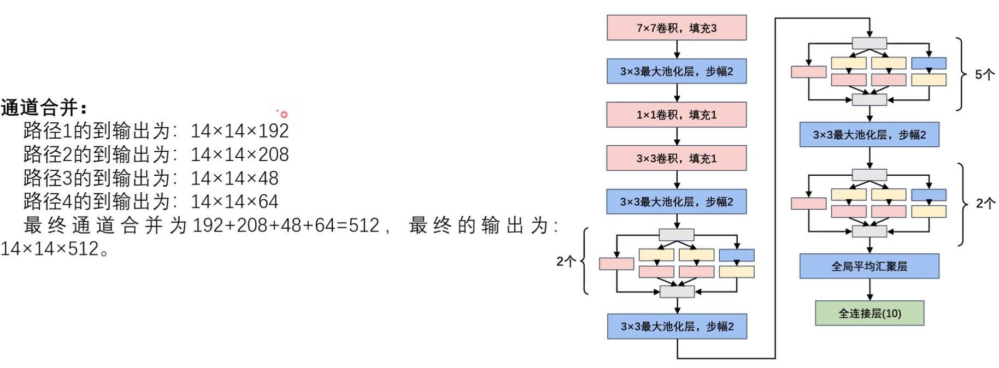

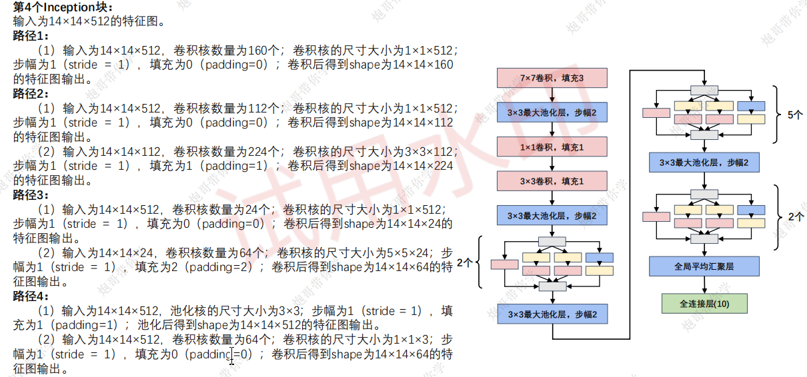


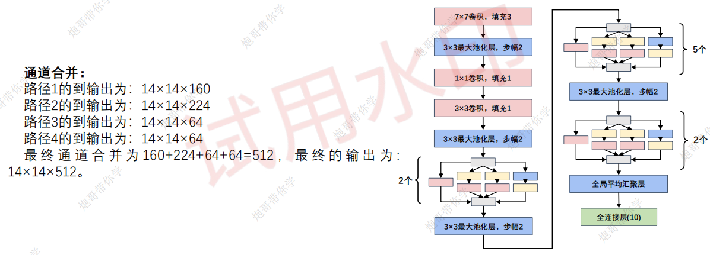

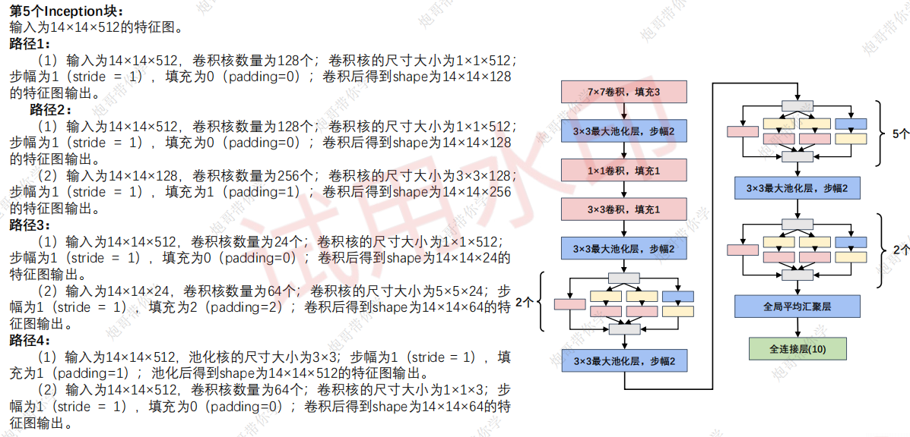

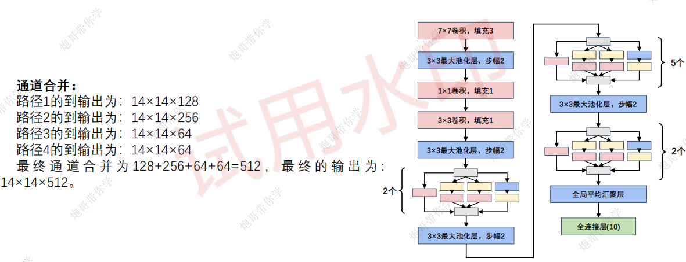

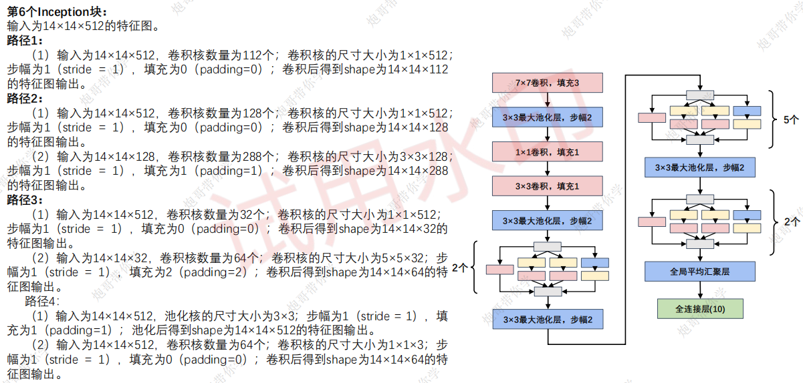

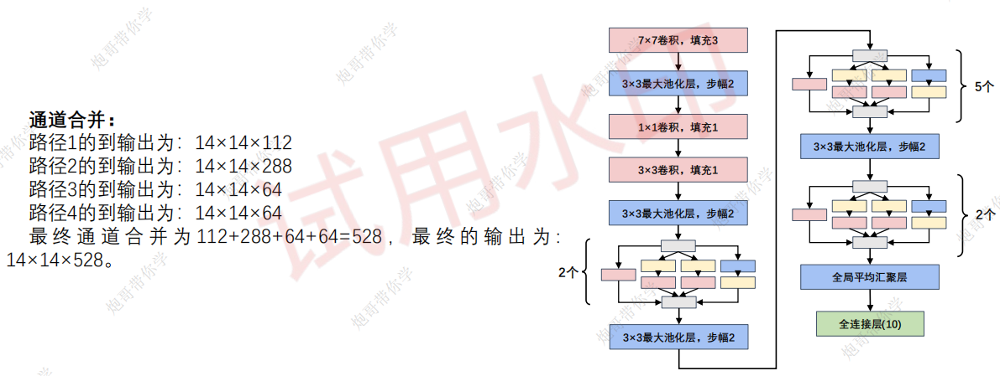

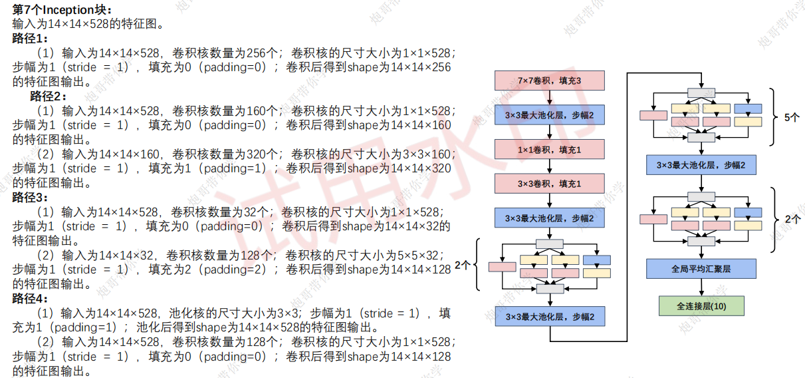

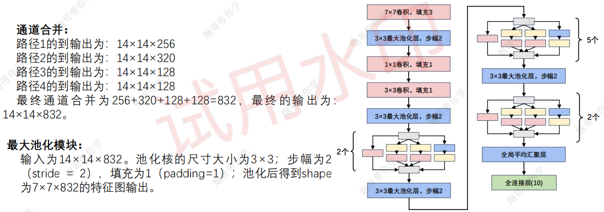

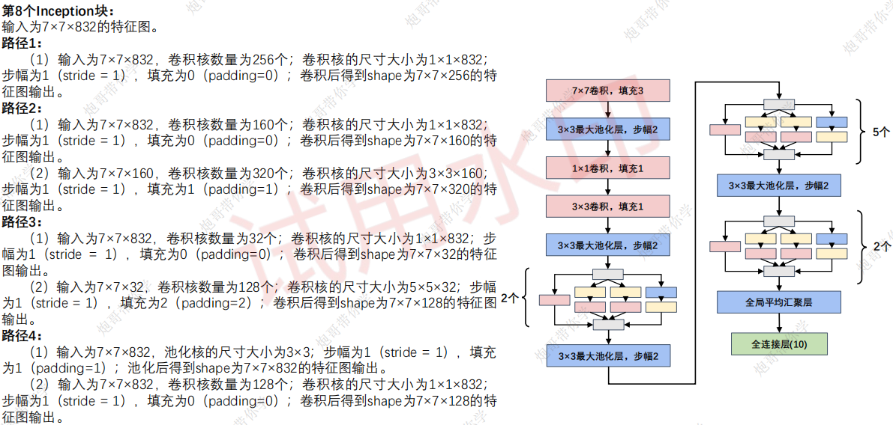

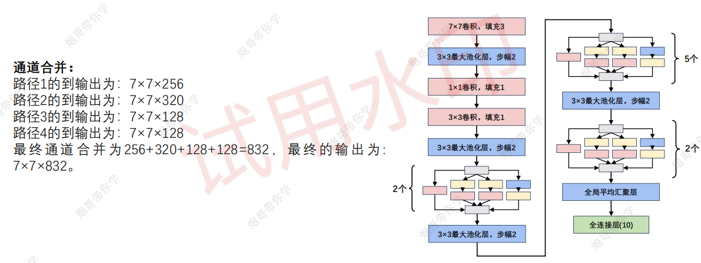


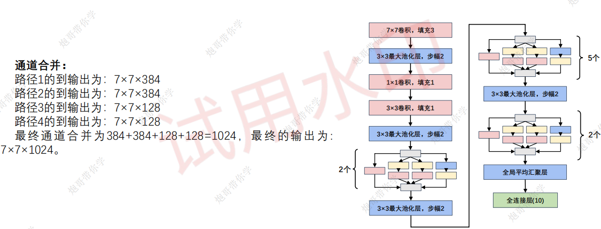

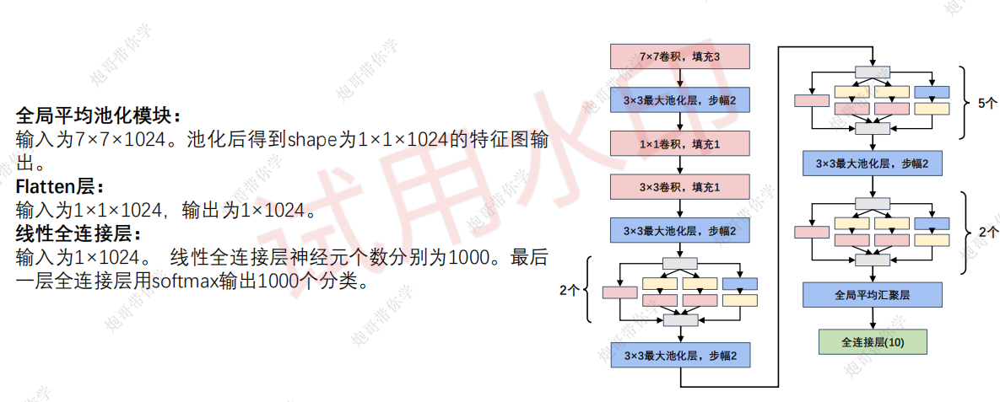

#### 2.3.2.代码实现

1.  模型搭建
    

根据原理一步一步搭建即可

```python
import torch
from torch import nn
from torchsummary import summary

class Inception(nn.Module):
    def __init__(self,in_channels,c1,c2,c3,c4):
        super(Inception,self).__init__()
        self.ReLu=nn.ReLU()
        # 路线1：定义1*1卷积
        self.p1_1=nn.Conv2d(in_channels=in_channels,out_channels=c1,kernel_size=1)
        # 路线2：定义1*1卷积和3*3
        self.p2_1=nn.Conv2d(in_channels=in_channels,out_channels=c2[0],kernel_size=1)
        self.p2_2=nn.Conv2d(in_channels=c2[0],out_channels=c2[1],kernel_size=3,padding=1)
        # 路线3：定义1*1卷积和5*5
        self.p3_1=nn.Conv2d(in_channels=in_channels,out_channels=c3[0],kernel_size=1)
        self.p3_2=nn.Conv2d(in_channels=c3[0],out_channels=c3[1],kernel_size=5,padding=2)
        # 路线4：定义3*3最大池化和1*1卷积
        # 最大池化如果不写步幅的话，默认步幅等于卷积核大小
        self.p4_1=nn.MaxPool2d(kernel_size=3,stride=1,padding=1)
        self.p4_2=nn.Conv2d(in_channels=in_channels,out_channels=c4,kernel_size=1)

    def forward(self,x):
        p1=self.ReLu(self.p1_1(x))
        p2=self.ReLu(self.p2_2(self.ReLu(self.p2_1(x))))
        p3=self.ReLu(self.p3_2(self.ReLu(self.p3_1(x))))
        p4=self.ReLu(self.p4_2(self.p4_1(x)))
        # 在通道维度上连结输出    .cat()函数用于将多个张量在指定维度上进行连接
        return torch.cat((p1,p2,p3,p4),dim=1)


# 搭建GoogLeNet网络
class GoogLeNet(nn.Module):
    # 必须把Inception导入到里边
    def __init__(self,Inception):
        super(GoogLeNet,self).__init__()
        self.b1=nn.Sequential(
            nn.Conv2d(in_channels=1,out_channels=64,kernel_size=7,stride=2,padding=3),
            nn.ReLU(),
            nn.MaxPool2d(kernel_size=3,stride=2,padding=1)
        )
        self.b2=nn.Sequential(
            nn.Conv2d(in_channels=64,out_channels=64,kernel_size=1),
            nn.ReLU(),
            nn.Conv2d(in_channels=64,out_channels=192,kernel_size=3,padding=1),
            nn.ReLU(),
            nn.MaxPool2d(kernel_size=3,stride=2,padding=1)
        )
        self.b3=nn.Sequential(
            Inception(192,64,(96,128),(16,32),32),
            Inception(256,128,(128,192),(32,96),64),
            nn.MaxPool2d(kernel_size=3,stride=2,padding=1)
        )
        self.b4=nn.Sequential(
            Inception(480,192,(96,208),(16,48),64),
            Inception(512,160,(112,224),(24,64),64),
            Inception(512,128,(128,256),(24,64),64),
            Inception(512,112,(128,288),(32,64),64),
            Inception(528,256,(160,320),(32,128),128),
            nn.MaxPool2d(kernel_size=3,stride=2,padding=1)
        )
        self.b5=nn.Sequential(
            Inception(832,256,(160,320),(32,128),128),
            Inception(832,384,(192,384),(48,128),128),
            nn.AdaptiveAvgPool2d((1,1)),
            nn.Flatten(),
            nn.Linear(1024,10)
        )
        # 对模型参数初始化
        for m in self.modules():
            if isinstance(m,nn.Conv2d):
                nn.init.kaiming_normal_(m.weight,mode='fan_out',nonlinearity='relu')
                # ① m.weight要初始化的权重（比如Conv2d或Linear的权重矩阵）。
                # ② mode = 'fan_out'决定使用的fan值：
                # fan_in：输入通道数 × kernel大小（用于保持前向传播稳定）
                # fan_out：输出通道数 × kernel大小（用于保持反向传播稳定）
                # fan_out常用于残差网络ResNet，因为让反向传播更平稳。
                # ③ nonlinearity = 'relu'告诉PyTorch你后面用的是ReLU，它会自动使用ReLU对应的gain系数
                if m.bias is not None:
                    nn.init.constant_(m.bias,0)
                elif isinstance(m,nn.Linear):
                    nn.init.normal_(m.weight,0,0.01)
                    if m.bias is not None:
                        nn.init.constant_(m.bias,0)
    # 定义前向传播
    def forward(self,x):
        x=self.b1(x)
        x=self.b2(x)
        x=self.b3(x)
        x=self.b4(x)
        x=self.b5(x)
        return x

# 模型展示
if __name__=="__main__":
    device=torch.device("cuda" if torch.cuda.is_available() else "cpu")
    model=GoogLeNet(Inception).to(device)
    print(summary(model,(1,224,224)))
```

2.  训练代码
    

```python
import copy
import time
import pandas as pd
import torch
from torch.utils.data import Dataset
from torchvision.datasets import FashionMNIST
from torchvision import transforms
import torch.utils.data as Data
import matplotlib.pyplot as plt
# 导入模型
from model import GoogLeNet, Inception
from torch import nn


# 处理训练集与验证集函数--->划分数据集
def train_val_data_process():
    train_data=FashionMNIST('./data',
                            train=True,
                            transform=transforms.Compose([transforms.Resize(size=227),transforms.ToTensor()]),
                            download=True)
    train_data,val_data=Data.random_split(train_data,[round(0.8*len(train_data)),round(0.2*len(train_data))])
    train_dataloader = Data.DataLoader(dataset=train_data,
                                       batch_size=32,
                                       shuffle=True,
                                       # 规定8个进程
                                       num_workers=8)
    val_dataloader=Data.DataLoader(dataset=val_data,
                                   batch_size=32,
                                   shuffle=True,
                                   num_workers=8)
    return train_dataloader,val_dataloader

# 验证是否出错
# train_val_data_process()

# 定义模型训练函数
def train_model_process(model,train_dataloader,val_dataloader,num_epochs):
    device=torch.device("cuda" if torch.cuda.is_available() else 'cpu')


    # 定义优化器
    # model.parameters()表示把模型里所有可训练的参数（权重、偏置）传给优化器
    # lr为学习率
    optimizer=torch.optim.Adam(model.parameters(),lr=0.001)

    # 定义损失函数使用交叉熵损失函数
    criterion=nn.CrossEntropyLoss()

    # 将模型放到GPU中进行训练
    model=model.to(device)
    # 复制当前模型的参数
    # 把model（PyTorch的神经网络）的当前参数（权重 / 偏置等）完整复制一份，放到best_model_wts变量里
    # ，保证这份拷贝不会随着后续训练改变 —— 常用于保存“到目前为止表现最好的模型参数”
    best_model_wts=copy.deepcopy(model.state_dict())


    # 初始化参数
    # 最高准确度
    best_acc=0.0
    # 训练集损失列表
    train_loss_all=[]
    # 验证集函数列表
    val_loss_all=[]
    # 训练集准确度列表
    train_acc_all=[]
    # 验证集准确度列表
    val_acc_all=[]

    # 保存当前时间--->方便看每轮训练的时间
    since=time.time()


    # 准备工作完成--->开始训练模型
    for epoch in range(num_epochs):
        print("Epoch {}/{}".format(epoch,num_epochs-1))
        print("-"*10)

        # 初始化参数
        # 训练集损失函数
        train_loss=0.0
        # 训练集准确度
        train_corrects=0
        # 验证集损失函数
        val_loss=0.0
        # 验证集准确度
        val_corrects=0
        # 训练集样本数量
        train_num=0
        # 验证集样本数量
        val_num=0
        # 将数据放到设备,并开始训练
        for step,(b_x,b_y) in enumerate(train_dataloader):
            # 将特征放入到训练设备
            b_x=b_x.to(device)
            # 将标签放入到训练设备当中
            b_y=b_y.to(device)
            # 设置模型为训练模式
            model.train()
            # 将数据放到模型当中,开始前向传播
            # 前向传播过程,输入一个batch,输出为一个batch中对应的预测
            output=model(b_x)
            # 从网络输出 output 的每一行里，找出数值最大的下标（类别），作为模型预测的标签
            pre_lab=torch.argmax(output,dim=1)
            # 计算每一个batch的损失函数
            loss=criterion(output,b_y)
            # 将梯度初始化为0
            optimizer.zero_grad()
            # 梯度置为0后再进行反向传播
            loss.backward()
            # 根据网络反向传播的梯度信息来更新网络的参数，以起到降低loss函数计算的作用
            optimizer.step()
            # loss.item()指的是batch的平均损失
            train_loss+=loss.item()*b_x.size(0)
            # 计算每个批次中正确预测的数量
            train_corrects+=torch.sum(pre_lab==b_y.data)
            # 计算目前为止一共处理了多少样本
            train_num+=b_x.size(0)
        # 验证数据
        for step ,(b_x,b_y) in enumerate(val_dataloader):
            # 将特征放到验证设备当中
            b_x=b_x.to(device)
            # 将标签放到放到训练设备当中
            b_y=b_y.to(device)
            # 开启验证模式，设置模型为评估模式
            model.eval()
            # 验证时不计算梯度以节省内存/计算
            with torch.no_grad():
                # 前向传播过程，输入一个batch,输出为一个batch中对应的预测
                output=model(b_x)
                # 查找每一行中最大值对应的下标
                pre_lab=torch.argmax(output,dim=1)
                # 计算验证集上的当前 batch 损失
                val_batch_loss=criterion(output,b_y)
                # 对损失函数进行累加（按样本数加权）
                val_loss+=val_batch_loss.item()*b_x.size(0)
                val_corrects+=torch.sum(pre_lab==b_y.data)
            # 当前用于验证的样本数量
            val_num+=b_x.size(0)
        # 计算并保存每一次迭代的loss值和准确率
        # 计算并保存训练集的loss值
        train_loss_all.append(train_loss/train_num)
        # 取双精度
        # 计算并保存训练集的准确率
        train_acc_all.append(train_corrects.double().item()/train_num)
        # 计算并保存验证集的loss值
        val_loss_all.append(val_loss/val_num)
        # 计算并保存验证集的准确率
        val_acc_all.append(val_corrects.double().item()/val_num)

        # 打印训练一轮的loss值和准确率
        print('{}train loss:{:.4f} train acc:{:.4f}'.format(epoch,train_loss_all[-1],train_acc_all[-1]))
        print('{}val loss:{:.4f} val acc:{:.4f}'.format(epoch,val_loss_all[-1],val_acc_all[-1]))

        # 判断准确度--->保存最优模型
        if val_acc_all[-1]>best_acc:
            # 保存当前模型准确度
            best_acc:float=val_acc_all[-1]
            # 保存当前的准确度
            # model.state_dict()是当前模型的所有参数（权重和偏置）
            best_model_wts=copy.deepcopy(model.state_dict())

        # 计算耗时
        time_use=time.time()-since
        print('训练和验证耗费的时间{:.0f}m{:.0f}s'.format(time_use//60,time_use%60))
    # 选择最优参数并保存
    # 保存最佳模型权重字典
    torch.save(best_model_wts,'./best_model.pth')
    # 保存训练过程,可以使用pandas来进行保存,里边有个DataFrame()可以像列表一样保存数据
    train_process=pd.DataFrame(data={
        "epoch":range(num_epochs),
        "train_loss_all":train_loss_all,
        "val_loss_all":val_loss_all,
        "train_acc_all":train_acc_all,
        "val_acc_all":val_acc_all
    })
    # 返回训练保存的过程
    return train_process

# 将loss值和精度按照图片的形式展示出来
def matplot_acc_loss(train_process):
    # 设置图的大小
    plt.figure(figsize=(12,4))
    # 设置图中有几张图
    # 把当前画布分成1行2列的子图,当前位置是 第 1 个子图
    # ①loss图
    plt.subplot(1,2,1)
    # 补充:
    # plt.subplot(nrows, ncols, index)
    # nrows：行数
    # ncols：列数
    # index：目前选中第几个子图（从1开始）
    plt.plot(train_process["epoch"],train_process.train_loss_all,'ro-',label='train loss')
    plt.plot(train_process["epoch"],train_process.val_loss_all,'bs--',label='val loss')
    # 添加一个图例
    plt.legend()
    # 给轴添加标签
    plt.xlabel('epoch')
    plt.ylabel('loss')
    # ②准确度图
    plt.subplot(1,2,2)
    plt.plot(train_process["epoch"],train_process.train_acc_all,'ro-',label='train acc')
    plt.plot(train_process["epoch"],train_process.val_acc_all,'bs--',label='val acc')
    # 添加图例
    plt.legend()
    plt.xlabel("epoch")
    plt.ylabel("acc")
    plt.show()

# 正式开始训练:
if __name__=="__main__":
    # 将模型实例化
    GoogLeNet=GoogLeNet(Inception)
    train_dataloader,val_dataloader=train_val_data_process()
    train_process=train_model_process(GoogLeNet,train_dataloader,val_dataloader,num_epochs=30)
    matplot_acc_loss(train_process)
```

3.  测试代码
    

```python
import torch
import torch.utils.data as Data
from torchvision import transforms
# 导入数据集
from torchvision.datasets import FashionMNIST
from model import GoogLeNet,Inception


# 测试数据处理
def test_data_process():
    test_data=FashionMNIST(root='./data',
                           train=False,
                           transform=transforms.Compose([transforms.Resize(size=227),transforms.ToTensor()]),
                           download=True)
    test_dataloader=Data.DataLoader(dataset=test_data,
                                    # 这里是一张一张进行测试
                                    batch_size=1,
                                    shuffle=True,
                                    num_workers=0)
    return test_dataloader

# 定义模型测试函数
def test_model_process(model,test_dataloader):
    # 将模型放到设备当中，先进行判断
    device="cuda" if torch.cuda.is_available() else "cpu"
    model=model.to(device)

    # 设置初始化参数
    test_corrects=0.0
    test_num=0

    # 进行模型测试
    # 模型在推理的时候只进行前向传播，不再进行反向传播更新梯度了
    # 不进行梯度计算，可以节省内存，加快运行速度
    with torch.no_grad():
        # 从数据中进行
        for test_data_x,test_data_y in test_dataloader:
            test_data_x=test_data_x.to(device)
            test_data_y=test_data_y.to(device)
            # 设置为验证模式
            model.eval()
            # 前向传播过程，输入为测试数据集,输出为对每个样本的预测值
            output=model(test_data_x)
            # 查找每一行中最大值对应的下标
            pre_lab=torch.argmax(output,dim=1)
            # 计算正确率
            # .data表示是一个不带梯度信息的tensor
            # 如果预测正确，则准确度test_corrects加1
            test_corrects+=torch.sum(pre_lab==test_data_y.data)
            # 将所有的测试样本进行累计
            test_num+=test_data_x.size(0)

        # 计算准确度
        test_acc=test_corrects.double().item()/test_num
        # .item()的作用是：把只含1个数字的 Tensor 转成 Python 的数字
        print("测试的准确率：",test_acc)

# 实现模型的测试功能
if __name__=="__main__":
    # 加载模型
    model=GoogLeNet(Inception)
    # 调用训练好的权重，把之前训练好、保存下来的模型参数重新装回模型里
    # 使用torch中的load函数加载权重，利用model.load_state_dict将参数加回到模型当中
    model.load_state_dict(torch.load('best_model.pth'))
    # 数据加载
    test_dataloader=test_data_process()
    # 加载模型测试的函数
    test_model_process(model,test_dataloader)

    # 验证集推理实现：
    # 加载数据加载的更详细一些
    device="cuda" if torch.cuda.is_available() else "cpu"
    model=model.to(device)
    # 设置类别，这样预测值就不展示数字，就直接展示这个种类了
    # 顺序不可改变
    classes=['T-shirt/top','Trouser','Pullover','Dress','Coat','Sandal','Shirt','Sneaker','Bag','Ankle boot']
    with torch.no_grad():
        # 将数据和标签都放到设备当中
        for b_x,b_y in test_dataloader:
            b_x=b_x.to(device)
            b_y=b_y.to(device)

            # 设置模型为验证模式
            model.eval()
            # 模型推理结果
            output=model(b_x)
            # 获取最大下标，最大下标就是类别号
            pre_lab=torch.argmax(output,dim=1)
            # 取出张量中的数值
            result=pre_lab.item()
            label=b_y.item()
            print("预测值：",classes[result],"------","真实值：",classes[label])
```

### 2.4.训练自己的数据集

猫狗分类任务

划分数据集和验证集

```python
# 创建脚本，用于划分数据集和验证集
import os
# shutil 是 Python 标准库里的一个模块，主要用于高级文件操作，比如复制文件、移动文件、删除目录等
from shutil import copy
import random

def mkfile(file):
    if not os.path.exists(file):
        os.makedirs(file)

# 获取data文件夹下所有文件夹名（即需要分类的类名）
file_path='data_cat_dog'
flower_class=[cla for cla in os.listdir(file_path)]

# 创建训练集train文件夹
mkfile('data/train')
for cla in flower_class:
    mkfile('data/train/'+cla)

# 创建验证集val文件夹
mkfile('data/test')
for cla in flower_class:
    mkfile('data/test/'+cla)

# 划分比例，训练集：测试集=9：1
split_rate=0.1

# 遍历所有类别的全部图像并按比例分成训练集和验证集
# cla_path：当前类别的原始图片路径
# images：当前类别下所有图片的文件名列表
# num：该类别图片总数
# eval_index：从 images 随机抽取 10% 的图片作为验证集

for cla in flower_class:
    cla_path = file_path + '/' + cla + '/'  # 某一类别的子目录
    images = os.listdir(cla_path)  # iamges 列表存储了该目录下所有图像的名称
    num = len(images)
    eval_index = random.sample(images, k=int(num * split_rate))  # 从images列表中随机抽取 k 个图像名称
    # 遍历该类别下的所有图片
    # 如果图片在eval_index中，则复制到验证集对应目录，否则复制到训练集对应目录
    for index, image in enumerate(images):
        # eval_index 中保存验证集val的图像名称
        if image in eval_index:
            image_path = cla_path + image
            new_path = 'data/test/' + cla
            copy(image_path, new_path)  # 将选中的图像复制到新路径

        # 其余的图像保存在训练集train中
        else:
            image_path = cla_path + image
            new_path = 'data/train/' + cla
            copy(image_path, new_path)
            # 打印进度条信息
            # \r用于在同一行刷新。end = ""避免换行，每次刷新同一行显示进度
        print("\r[{}] processing [{}/{}]".format(cla, index + 1, num), end="")  # processing bar
    print()

print("processing done!")
```

这里使用的是GoogLeNet模型来实现猫狗分类的

#### 2.4.2.模型代码

这里数据集中彩色图片，是三通道的数据，所以将模型中的输入通道改为3

```python
import torch
from torch import nn
from torchsummary import summary

class Inception(nn.Module):
    def __init__(self,in_channels,c1,c2,c3,c4):
        super(Inception,self).__init__()
        self.ReLu=nn.ReLU()
        # 路线1：定义1*1卷积
        self.p1_1=nn.Conv2d(in_channels=in_channels,out_channels=c1,kernel_size=1)
        # 路线2：定义1*1卷积和3*3
        self.p2_1=nn.Conv2d(in_channels=in_channels,out_channels=c2[0],kernel_size=1)
        self.p2_2=nn.Conv2d(in_channels=c2[0],out_channels=c2[1],kernel_size=3,padding=1)
        # 路线3：定义1*1卷积和5*5
        self.p3_1=nn.Conv2d(in_channels=in_channels,out_channels=c3[0],kernel_size=1)
        self.p3_2=nn.Conv2d(in_channels=c3[0],out_channels=c3[1],kernel_size=5,padding=2)
        # 路线4：定义3*3最大池化和1*1卷积
        # 最大池化如果不写步幅的话，默认步幅等于卷积核大小
        self.p4_1=nn.MaxPool2d(kernel_size=3,stride=1,padding=1)
        self.p4_2=nn.Conv2d(in_channels=in_channels,out_channels=c4,kernel_size=1)

    def forward(self,x):
        p1=self.ReLu(self.p1_1(x))
        p2=self.ReLu(self.p2_2(self.ReLu(self.p2_1(x))))
        p3=self.ReLu(self.p3_2(self.ReLu(self.p3_1(x))))
        p4=self.ReLu(self.p4_2(self.p4_1(x)))
        # 在通道维度上连结输出    .cat()函数用于将多个张量在指定维度上进行连接
        return torch.cat((p1,p2,p3,p4),dim=1)

# 搭建GoogLeNet网络
class GoogLeNet(nn.Module):
    # 必须把Inception导入到里边
    def __init__(self,Inception):
        super(GoogLeNet,self).__init__()
        self.b1=nn.Sequential(
            nn.Conv2d(in_channels=3,out_channels=64,kernel_size=7,stride=2,padding=3),
            nn.ReLU(),
            nn.MaxPool2d(kernel_size=3,stride=2,padding=1)
        )
        self.b2=nn.Sequential(
            nn.Conv2d(in_channels=64,out_channels=64,kernel_size=1),
            nn.ReLU(),
            nn.Conv2d(in_channels=64,out_channels=192,kernel_size=3,padding=1),
            nn.ReLU(),
            nn.MaxPool2d(kernel_size=3,stride=2,padding=1)
        )
        self.b3=nn.Sequential(
            Inception(192,64,(96,128),(16,32),32),
            Inception(256,128,(128,192),(32,96),64),
            nn.MaxPool2d(kernel_size=3,stride=2,padding=1)
        )
        self.b4=nn.Sequential(
            Inception(480,192,(96,208),(16,48),64),
            Inception(512,160,(112,224),(24,64),64),
            Inception(512,128,(128,256),(24,64),64),
            Inception(512,112,(128,288),(32,64),64),
            Inception(528,256,(160,320),(32,128),128),
            nn.MaxPool2d(kernel_size=3,stride=2,padding=1)
        )
        self.b5=nn.Sequential(
            Inception(832,256,(160,320),(32,128),128),
            Inception(832,384,(192,384),(48,128),128),
            nn.AdaptiveAvgPool2d((1,1)),
            nn.Flatten(),
            nn.Linear(1024,2)
        )
        # 对模型参数初始化
        for m in self.modules():
            if isinstance(m,nn.Conv2d):
                nn.init.kaiming_normal_(m.weight,mode='fan_out',nonlinearity='relu')
                # ① m.weight要初始化的权重（比如Conv2d或Linear的权重矩阵）。
                # ② mode = 'fan_out'决定使用的fan值：
                # fan_in：输入通道数 × kernel大小（用于保持前向传播稳定）
                # fan_out：输出通道数 × kernel大小（用于保持反向传播稳定）
                # fan_out常用于残差网络ResNet，因为让反向传播更平稳。
                # ③ nonlinearity = 'relu'告诉PyTorch你后面用的是ReLU，它会自动使用ReLU对应的gain系数
                if m.bias is not None:
                    nn.init.constant_(m.bias,0)
                elif isinstance(m,nn.Linear):
                    nn.init.normal_(m.weight,0,0.01)
                    if m.bias is not None:
                        nn.init.constant_(m.bias,0)
    # 定义前向传播
    def forward(self,x):
        x=self.b1(x)
        x=self.b2(x)
        x=self.b3(x)
        x=self.b4(x)
        x=self.b5(x)
        return x

# 模型展示
if __name__=="__main__":
    device=torch.device("cuda" if torch.cuda.is_available() else "cpu")
    model=GoogLeNet(Inception).to(device)
    print(summary(model,(1,224,224)))
```

#### 2.4.2.训练代码（包含预处理）

计算图片的均值与方差，用于训练中归一化处理操作

```python
# PIL（Python Imaging Library）里的 Image 用来读取图片
from PIL import Image
# os 用来处理文件夹和文件路径
import os
# numpy 是科学计算库，用于做矩阵运算（这里用来处理图片像素）
import numpy as np

# 文件夹路径，包含所有图片文件
folder_path = 'data_cat_dog'

# 初始化累积变量
total_pixels = 0
sum_normalized_pixel_values = np.zeros(3)  # 如果是RGB图像，需要三个通道的均值和方差

# 遍历文件夹中的图片文件
for root, dirs, files in os.walk(folder_path):
    for filename in files:
        if filename.endswith(('.jpg', '.jpeg', '.png', '.bmp')):  # 可根据实际情况添加其他格式
            image_path = os.path.join(root, filename)
            image = Image.open(image_path)
            image_array = np.array(image)

            # 归一化像素值到0-1之间
            normalized_image_array = image_array / 255.0

            # print(image_path)
            # print(normalized_image_array.shape)
            # 累积归一化后的像素值和像素数量
            total_pixels += normalized_image_array.size
            # 是把图片在高度和宽度方向求和，得到每个通道的总和（RGB 三个通道分别求）
            sum_normalized_pixel_values += np.sum(normalized_image_array, axis=(0, 1))

# 用像素总和/像素总数 就得到每个通道的均值
mean = sum_normalized_pixel_values / total_pixels

sum_squared_diff = np.zeros(3)

# os.walk(folder_path)：遍历文件夹里所有文件和子文件夹
# filename.endswith(...)：只选择图片文件（jpg/png/bmp）
# os.path.join(root, filename)：得到每张图片的完整路径
# Image.open(image_path)：打开图片
# np.array(image)：把图片转成 numpy 数组，形状一般是 (高度, 宽度, 3)
for root, dirs, files in os.walk(folder_path):
    for filename in files:
        if filename.endswith(('.jpg', '.jpeg', '.png', '.bmp')):
            image_path = os.path.join(root, filename)
            image = Image.open(image_path)
            image_array = np.array(image)
            # 归一化像素值到0-1之间
            normalized_image_array = image_array / 255.0
            # print(normalized_image_array.shape)
            # print(mean.shape)
            # print(image_path)

            try:
                diff = (normalized_image_array - mean) ** 2
                sum_squared_diff += np.sum(diff, axis=(0, 1))
            except:
                print(f"捕获到自定义异常")
            # diff = (normalized_image_array - mean) ** 2
            # sum_squared_diff += np.sum(diff, axis=(0, 1))

variance = sum_squared_diff / total_pixels

print("Mean:", mean)
print("Variance:", variance)

```
```python
import copy
import time
import pandas as pd
import torch
from torch.utils.data import Dataset
from torchvision.datasets import ImageFolder # 导入图像数据集,可以直接读取文件夹中的数据,并划分标签 
from torchvision import transforms
import torch.utils.data as Data
import matplotlib.pyplot as plt
# 导入模型
from model import GoogLeNet, Inception
from torch import nn

# 处理训练集与验证集函数--->划分数据集
def train_val_data_process():
    # 导入自己的数据集，并进行数据处理
    # 定义数据集的路径
    ROOT_PATH=r"./data/train"

    # 定义归一化方法
    # 这里需要先计算一下数据集的均值和方差
    #  mean_std.py 文件可以计算出均值和方差,然后把结果填入下面的 Normalize() 中
    # 第一个参数是均值，第二个参数是方差
    normalize=transforms.Normalize([0.162,0.151,0.138],[0.058,0.052,0.048])
    # 定义数据集处理方法变量
    train_transform=transforms.Compose([
        # 调整图像大小为224*224
        transforms.Resize((224,224)),
        # 将图像转换为张量
        transforms.ToTensor(),
        normalize])
    # 在进行转换tensor时,会将像素值归一化到[0,1]之间
    # 但是没有进行均值方差归一化处理,需要进行均值方差归一化处理，使归一化后的数据符合标准正态分布

    # 加载数据集
    # 传入数据集路径与处理方法
    train_data=ImageFolder(ROOT_PATH,transform=train_transform)

    train_data,val_data=Data.random_split(train_data,[round(0.8*len(train_data)),round(0.2*len(train_data))])
    train_dataloader = Data.DataLoader(dataset=train_data,
                                       batch_size=32,
                                       shuffle=True,
                                       # 规定8个进程
                                       num_workers=8)
    val_dataloader=Data.DataLoader(dataset=val_data,
                                   batch_size=32,
                                   shuffle=True,
                                   num_workers=8)
    return train_dataloader,val_dataloader

# 验证是否出错
# train_val_data_process()

# 定义模型训练函数
def train_model_process(model,train_dataloader,val_dataloader,num_epochs):
    device=torch.device("cuda" if torch.cuda.is_available() else 'cpu')

    # 定义优化器
    # model.parameters()表示把模型里所有可训练的参数（权重、偏置）传给优化器
    # lr为学习率
    optimizer=torch.optim.Adam(model.parameters(),lr=0.001)

    # 定义损失函数使用交叉熵损失函数
    criterion=nn.CrossEntropyLoss()

    # 将模型放到GPU中进行训练
    model=model.to(device)
    # 复制当前模型的参数
    # 把model（PyTorch的神经网络）的当前参数（权重 / 偏置等）完整复制一份，放到best_model_wts变量里
    # ，保证这份拷贝不会随着后续训练改变 —— 常用于保存“到目前为止表现最好的模型参数”
    best_model_wts=copy.deepcopy(model.state_dict())

    # 初始化参数
    # 最高准确度
    best_acc=0.0
    # 训练集损失列表
    train_loss_all=[]
    # 验证集函数列表
    val_loss_all=[]
    # 训练集准确度列表
    train_acc_all=[]
    # 验证集准确度列表
    val_acc_all=[]

    # 保存当前时间--->方便看每轮训练的时间
    since=time.time()

    # 准备工作完成--->开始训练模型
    for epoch in range(num_epochs):
        print("Epoch {}/{}".format(epoch,num_epochs-1))
        print("-"*10)

        # 初始化参数
        # 训练集损失函数
        train_loss=0.0
        # 训练集准确度
        train_corrects=0
        # 验证集损失函数
        val_loss=0.0
        # 验证集准确度
        val_corrects=0
        # 训练集样本数量
        train_num=0
        # 验证集样本数量
        val_num=0
        # 将数据放到设备,并开始训练
        for step,(b_x,b_y) in enumerate(train_dataloader):
            # 将特征放入到训练设备
            b_x=b_x.to(device)
            # 将标签放入到训练设备当中
            b_y=b_y.to(device)
            # 设置模型为训练模式
            model.train()
            # 将数据放到模型当中,开始前向传播
            # 前向传播过程,输入一个batch,输出为一个batch中对应的预测
            output=model(b_x)
            # 从网络输出 output 的每一行里，找出数值最大的下标（类别），作为模型预测的标签
            pre_lab=torch.argmax(output,dim=1)
            # 计算每一个batch的损失函数
            loss=criterion(output,b_y)
            # 将梯度初始化为0
            optimizer.zero_grad()
            # 梯度置为0后再进行反向传播
            loss.backward()
            # 根据网络反向传播的梯度信息来更新网络的参数，以起到降低loss函数计算的作用
            optimizer.step()
            # loss.item()指的是batch的平均损失
            train_loss+=loss.item()*b_x.size(0)
            # 计算每个批次中正确预测的数量
            train_corrects+=torch.sum(pre_lab==b_y.data)
            # 计算目前为止一共处理了多少样本
            train_num+=b_x.size(0)
        # 验证数据
        for step ,(b_x,b_y) in enumerate(val_dataloader):
            # 将特征放到验证设备当中
            b_x=b_x.to(device)
            # 将标签放到放到训练设备当中
            b_y=b_y.to(device)
            # 开启验证模式，设置模型为评估模式
            model.eval()
            # 验证时不计算梯度以节省内存/计算
            with torch.no_grad():
                # 前向传播过程，输入一个batch,输出为一个batch中对应的预测
                output=model(b_x)
                # 查找每一行中最大值对应的下标
                pre_lab=torch.argmax(output,dim=1)
                # 计算验证集上的当前 batch 损失
                val_batch_loss=criterion(output,b_y)
                # 对损失函数进行累加（按样本数加权）
                val_loss+=val_batch_loss.item()*b_x.size(0)
                val_corrects+=torch.sum(pre_lab==b_y.data)
            # 当前用于验证的样本数量
            val_num+=b_x.size(0)
        # 计算并保存每一次迭代的loss值和准确率
        # 计算并保存训练集的loss值
        train_loss_all.append(train_loss/train_num)
        # 取双精度
        # 计算并保存训练集的准确率
        train_acc_all.append(train_corrects.double().item()/train_num)
        # 计算并保存验证集的loss值
        val_loss_all.append(val_loss/val_num)
        # 计算并保存验证集的准确率
        val_acc_all.append(val_corrects.double().item()/val_num)

        # 打印训练一轮的loss值和准确率
        print('{}train loss:{:.4f} train acc:{:.4f}'.format(epoch,train_loss_all[-1],train_acc_all[-1]))
        print('{}val loss:{:.4f} val acc:{:.4f}'.format(epoch,val_loss_all[-1],val_acc_all[-1]))

        # 判断准确度--->保存最优模型
        if val_acc_all[-1]>best_acc:
            # 保存当前模型准确度
            best_acc:float=val_acc_all[-1]
            # 保存当前的准确度
            # model.state_dict()是当前模型的所有参数（权重和偏置）
            best_model_wts=copy.deepcopy(model.state_dict())

        # 计算耗时
        time_use=time.time()-since
        print('训练和验证耗费的时间{:.0f}m{:.0f}s'.format(time_use//60,time_use%60))
    # 选择最优参数并保存
    # 保存最佳模型权重字典
    torch.save(best_model_wts,'./best_model.pth')
    # 保存训练过程,可以使用pandas来进行保存,里边有个DataFrame()可以像列表一样保存数据
    train_process=pd.DataFrame(data={
        "epoch":range(num_epochs),
        "train_loss_all":train_loss_all,
        "val_loss_all":val_loss_all,
        "train_acc_all":train_acc_all,
        "val_acc_all":val_acc_all
    })
    # 返回训练保存的过程
    return train_process

# 将loss值和精度按照图片的形式展示出来
def matplot_acc_loss(train_process):
    # 设置图的大小
    plt.figure(figsize=(12,4))
    # 设置图中有几张图
    # 把当前画布分成1行2列的子图,当前位置是 第 1 个子图
    # ①loss图
    plt.subplot(1,2,1)
    # 补充:
    # plt.subplot(nrows, ncols, index)
    # nrows：行数
    # ncols：列数
    # index：目前选中第几个子图（从1开始）
    plt.plot(train_process["epoch"],train_process.train_loss_all,'ro-',label='train loss')
    plt.plot(train_process["epoch"],train_process.val_loss_all,'bs--',label='val loss')
    # 添加一个图例
    plt.legend()
    # 给轴添加标签
    plt.xlabel('epoch')
    plt.ylabel('loss')
    # ②准确度图
    plt.subplot(1,2,2)
    plt.plot(train_process["epoch"],train_process.train_acc_all,'ro-',label='train acc')
    plt.plot(train_process["epoch"],train_process.val_acc_all,'bs--',label='val acc')
    # 添加图例
    plt.legend()
    plt.xlabel("epoch")
    plt.ylabel("acc")
    plt.show()

# 正式开始训练:
if __name__=="__main__":
    # 将模型实例化
    GoogLeNet=GoogLeNet(Inception)
    train_dataloader,val_dataloader=train_val_data_process()
    train_process=train_model_process(GoogLeNet,train_dataloader,val_dataloader,num_epochs=60)
    matplot_acc_loss(train_process)
```

#### 2.4.2.测试代码

使用测试集进行测试与推理

```python
import torch
import torch.utils.data as Data
from torchvision import transforms
from torchvision.datasets import ImageFolder
from model import GoogLeNet,Inception

# 测试数据处理
def test_data_process():
   # 导入自己的数据集，并进行数据处理
    # 定义数据集的路径
    ROOT_PATH=r"./data/test"

    # 定义归一化方法
    # 这里需要先计算一下数据集的均值和方差
    #  mean_std.py 文件可以计算出均值和方差,然后把结果填入下面的 Normalize() 中
    # 第一个参数是均值，第二个参数是方差
    normalize=transforms.Normalize([0.162,0.151,0.138],[0.058,0.052,0.048])
    # 定义数据集处理方法变量
    train_transform=transforms.Compose([
        # 调整图像大小为224*224
        transforms.Resize((224,224)),
        # 将图像转换为张量
        transforms.ToTensor(),
        normalize])
    # 在进行转换tensor时,会将像素值归一化到[0,1]之间
    # 但是没有进行均值方差归一化处理,需要进行均值方差归一化处理，使归一化后的数据符合标准正态分布

    # 加载数据集
    # 传入数据集路径与处理方法
    test_data=ImageFolder(ROOT_PATH,transform=train_transform)
    test_dataloader=Data.DataLoader(dataset=test_data,
                                    # 这里是一张一张进行测试
                                    batch_size=1,
                                    shuffle=True,
                                    num_workers=0)
    return test_dataloader

# 定义模型测试函数
def test_model_process(model,test_dataloader):
    # 将模型放到设备当中，先进行判断
    device="cuda" if torch.cuda.is_available() else "cpu"
    model=model.to(device)

    # 设置初始化参数
    test_corrects=0.0
    test_num=0

    # 进行模型测试
    # 模型在推理的时候只进行前向传播，不再进行反向传播更新梯度了
    # 不进行梯度计算，可以节省内存，加快运行速度
    with torch.no_grad():
        # 从数据中进行
        for test_data_x,test_data_y in test_dataloader:
            test_data_x=test_data_x.to(device)
            test_data_y=test_data_y.to(device)
            # 设置为验证模式
            model.eval()
            # 前向传播过程，输入为测试数据集,输出为对每个样本的预测值
            output=model(test_data_x)
            # 查找每一行中最大值对应的下标
            pre_lab=torch.argmax(output,dim=1)
            # 计算正确率
            # .data表示是一个不带梯度信息的tensor
            # 如果预测正确，则准确度test_corrects加1
            test_corrects+=torch.sum(pre_lab==test_data_y.data)
            # 将所有的测试样本进行累计
            test_num+=test_data_x.size(0)

        # 计算准确度
        test_acc=test_corrects.double().item()/test_num
        # .item()的作用是：把只含1个数字的 Tensor 转成 Python 的数字
        print("测试的准确率：",test_acc)

# 实现模型的测试功能
if __name__=="__main__":
    # 加载模型
    model=GoogLeNet(Inception)
    # 调用训练好的权重，把之前训练好、保存下来的模型参数重新装回模型里
    # 使用torch中的load函数加载权重，利用model.load_state_dict将参数加回到模型当中
    model.load_state_dict(torch.load('best_model.pth'))
    # 数据加载
    test_dataloader=test_data_process()
    # 加载模型测试的函数
    test_model_process(model,test_dataloader)

    # 验证集推理实现：
    # 加载数据加载的更详细一些
    device="cuda" if torch.cuda.is_available() else "cpu"
    model=model.to(device)
    # 设置类别，这样预测值就不展示数字，就直接展示这个种类了
    # 顺序不可改变
    classes=['猫','狗']
    with torch.no_grad():
        # 将数据和标签都放到设备当中
        for b_x,b_y in test_dataloader:
            b_x=b_x.to(device)
            b_y=b_y.to(device)

            # 设置模型为验证模式
            model.eval()
            # 模型推理结果
            output=model(b_x)
            # 获取最大下标，最大下标就是类别号
            pre_lab=torch.argmax(output,dim=1)
            # 取出张量中的数值
            result=pre_lab.item()
            label=b_y.item()
            print("预测值：",classes[result],"------","真实值：",classes[label])
```

# 3.yolo模型学习