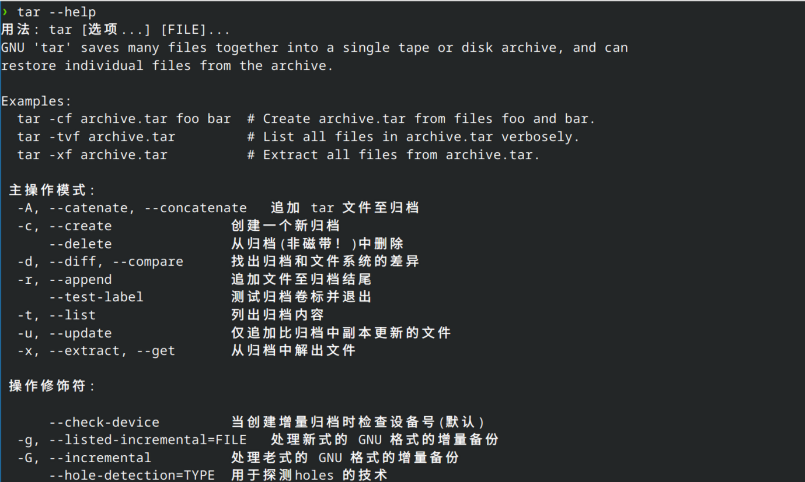
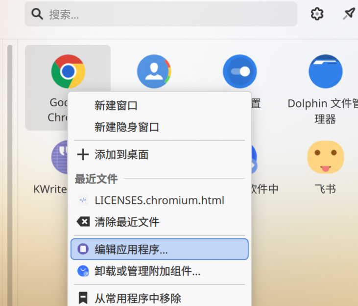
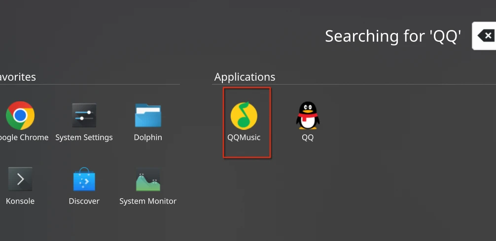
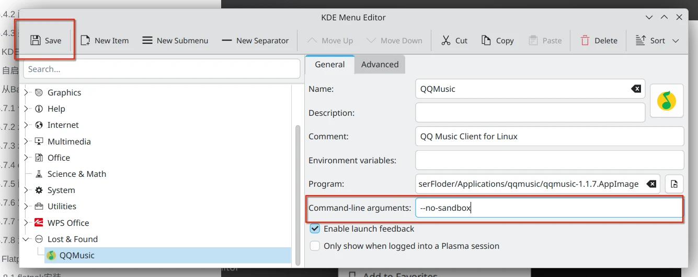
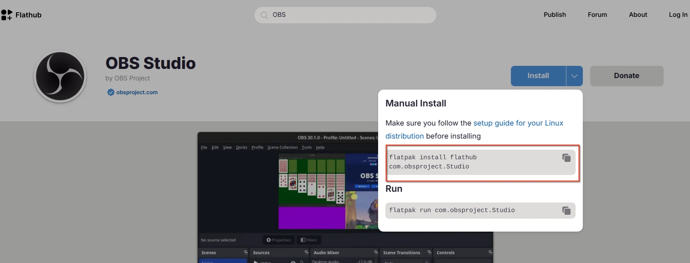
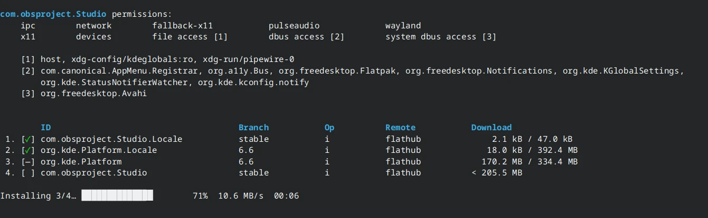
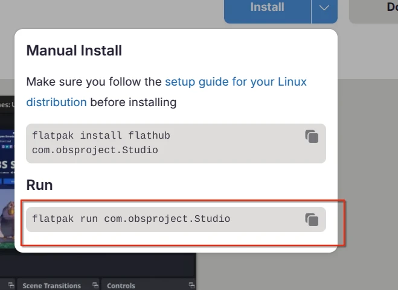
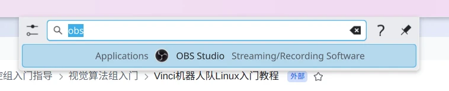
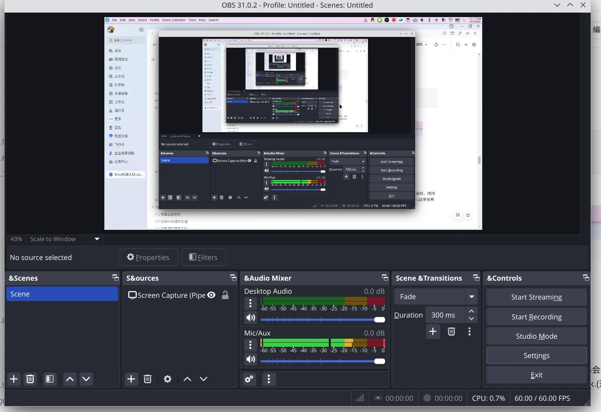

1.  下载安装包+指令的形式进行安装 以fedora系统为例子： sudo dnf install 安装包
    
2.  下载程序压缩包并进行解压，配置图标启动文件，以安装pycharm为例进行说明：： 1️⃣解压压缩包：可以手动解压；也可以通过终端进行解压tar (tar -help看有啥选项)
    



解压后的文件放到自己存放的位置 2️⃣查找启动文件，判断程序压缩包是正常的，在解压文件下的bin目录进行查看，在终端输入pycharm.sh或者pycharm来判断是否启动


```text
cd /home/cherish/UserFloder/Applications/pycharm-2025.2.4/bin
./pycharm.sh
```

3️⃣创建.desktop文件

**原理：**

*   Linux 桌面环境（GNOME、KDE、XFCE 等）通过 **`.desktop` 文件** 来识别应用。
    
*   `.desktop` 文件相当于一个“应用注册表”，告诉系统：
    
    *   应用名字（Name）
        
    *   图标（Icon）
        
    *   执行命令（Exec）
        
    *   分类（Categories）
        
    *   是否需要终端（Terminal）
        

```text
cd ~/.local/share/applications
nano pycharm.desktop
```

nano是一个命令行下的编辑器，也可以使用vim

```text
[Desktop Entry]
Version=1.0
Type=Application
Name=PyCharm
Icon=/home/cherish/UserFloder/Applications/pycharm-2025.2.4/bin/pycharm.svg
Exec="/home/cherish/UserFloder/Applications/pycharm-2025.2.4/bin/pycharm.sh" %f
Comment=JetBrains PyCharm IDE
Categories=Development;IDE;
Terminal=false
StartupWMClass=jetbrains-pycharm
```

*   `Exec` → 点击图标时执行的命令
    
*   `Icon` → 显示在菜单和桌面上的图标
    
*   `Terminal=false` → 不打开终端
    
*   `StartupWMClass` → GNOME 用它区分窗口实例，如果桌面环境是kde的话可以不用设置
    

> 可以理解成 `.desktop` 文件是 Linux 的 **快捷方式配置文件**

4️⃣设置可执行权限

```text
chmod +x ~/.local/share/applications/pycharm.desktop
```

5️⃣桌面图标启动的话如下：

```text
cp ~/.local/share/applications/pycharm.desktop ~/Desktop/
chmod +x ~/Desktop/pycharm.desktop
```

3.  下载Appimage文件实现软件的安装
    

1️⃣先下载appimage

https://y.qq.com/download/download.html


2️⃣下载图标，可以去google下载qq音乐图标，.svg透明的图标


当然.png格式的也没问题，或者都可以在linux系统上更换使用图标




3️⃣给他们放在`/home/用户名`的某个文件夹中（可以自己定）

4️⃣给软件执行权限

```text
cd ~/UserFloder/Applications/qqmusic
sudo chmod +x ./qqmusic-1.1.7.AppImag
```

5️⃣配置图标启动文件并添加执行权限（也可以继续使用nano）

```bash
cd ~/.local/share/applications/
touch ./qqmusic.desktop
vim ./qqmusic.desktop
sudo chmod +x ./qqmusic.desktop
```

`touch`：一个 Linux 命令，主要功能是：

*   如果文件不存在，就创建一个新的空文件
    
*   如果文件已存在，就更新该文件的最后修改时间
    

```text
[Desktop Entry]
Name=QQ音乐
Exec=/home/tungchiahui/UserFloder/Applications/qqmusic/qqmusic-1.1.7.AppImage
Icon=/home/tungchiahui/UserFloder/Applications/qqmusic/QQ_Music2023.svg
Type=Application
Categories=Audio;Music;Player;
Comment=QQ Music Client for Linux
```

将文件复制进去

6️⃣此时找到软件就可以打开了，如果找不到，请重启，部分不先进的发行版刷新图标列表不会很快



6️⃣如果点击图标打不开就禁用沙盒-->如果QQ音乐闪退，这个只是QQ音乐自己软件的问题，按下图这样做



如果你用的不是KDE，那么也可以直接修改`qqmuic.desktop`：在exec的末尾加上`--no-sandbox`（通过禁用安全沙盒机制，赋予应用程序更高的系统权限，从而解决因权限限制导致的运行问题）

```text
[Desktop Entry]
Name=QQ音乐
Exec=/home/tungchiahui/UserFloder/Applications/qqmusic/qqmusic-1.1.7.AppImage --no-sandbox
Icon=/home/tungchiahui/UserFloder/Applications/qqmusic/QQ_Music2023.svg
Type=Application
Categories=Audio;Music;Player;
Comment=QQ Music Client for Linux
```


在qq音乐中如果缺字体,那么请安装字体(这个字体是多种语言合一的字体)

```text
sudo dnf install google-noto-sans-cjk-fonts google-noto-serif-cjk-fonts
```

4.  去Flathub上安装软件
    

https://flathub.org/

1️⃣去上面的官网搜索软件+下载软件



```text
flatpak install flathub com.obsproject.Studio
```



2️⃣运行软件

a.官方方式：



```text
flatpak install flathub com.obsproject.Studio
```

b.当普通软件运行：



