# 一、Docker篇

## 1.简介

### 1.1什么是 Docker？

Docker 是一个开源的 **应用容器引擎** ，可以让开发者将应用和其所有依赖打包成一个“容器”， **一次构建，到处运行。**

“ **一次构建，到处运行** ”也就是说：

1.  **之前：**
    

之前想跑ROS2+OpenCV+CUDA+CuDNN，我需要在一台电脑上一个一个环境的安装配置，如果我还要在另一台电脑上跑这个，也需要把第二台电脑也这样配置一遍。如果我的系统环境崩了，需要重装系统了，重装完后又双叒叕要再来一遍配置过程，很麻烦。

1.  **使用docker后：**
    

（docker镜像和docker容器的概念在下下下面，下面这段话里看到镜像和容器的概念先接受就行。）

我只需要在电脑上用docker配置一遍这个ROS2+OpenCV+CUDA+CuDNN环境，然后用docker生成一个镜像，把这个镜像打包好。以后在任何一台电脑上，我都可以直接用这个镜像生成一个容器，而这个容器内就包含了我所需要的ROS2+OpenCV+CUDA+CuDNN环境，如果我的容器环境崩了，我只需要把坏掉的容器删掉，重新由镜像再生成一个新的容器即可。只需要配置一次，以后都可以一键安装这个环境。

### 1.2.它是怎么工作的？

*   传统方式：软件运行需要在不同系统上安装各种库、配置环境，很麻烦。
    
*   Docker方式：打包成“容器”，环境和应用一起封装， **无论在哪运行都一样稳定** 。
    

### 1.3.Docker 的几个基本概念

<!--br {mso-data-placement:same-cell;}--> td {white-space:nowrap;border:0.5pt solid #dee0e3;font-size:10pt;font-style:normal;font-weight:normal;vertical-align:middle;word-break:normal;word-wrap:normal;}
| 概念 | 解释 |
|:---|:---|
| 镜像 | Image，运行容器的模板，像是一个应用快照 |
| 容器 | Container，运行中的镜像实例，有自己的文件系统、网络等 |
| Dockerfile | 构建镜像的脚本，写明安装哪些包、设置哪些环境变量等 |
| 仓库 | Registry，存放镜像的地方，比如 Docker Hub |

抽象化理解:

Docker镜像≈C++类

Docker容器≈C++类实例(即对象)

形象化理解: 镜像可以类似于给电脑装系统的iso镜像文件。 容器可以类似于已经被装到电脑上的可以运行的系统。

把镜像变为容器时，需要用docker run命令添加很多参数，这个可以理解你这个电脑到底有啥硬件配置。

### 1.4.类比理解

<!--br {mso-data-placement:same-cell;}--> td {white-space:nowrap;border:0.5pt solid #dee0e3;font-size:10pt;font-style:normal;font-weight:normal;vertical-align:middle;word-break:normal;word-wrap:normal;}
| 传统部署 | Docker部署 |
|:---|:---|
| 手动安装依赖、调试版本不一致问题 | 一次打包环境和代码 |
| 程序“裸奔”跑在系统上 | 程序“穿着容器”隔离运行 |
| 容易“在我电脑上能跑” | 保证“无论在哪都能跑” |

就像快递包裹： **你不再关心内容怎么运送，因为包装已经帮你做好了一切隔离。**

### 1.5.Docker 的核心优势

<!--br {mso-data-placement:same-cell;}--> td {white-space:nowrap;border:0.5pt solid #dee0e3;font-size:10pt;font-style:normal;font-weight:normal;vertical-align:middle;word-break:normal;word-wrap:normal;}
| 优势 | 说明 |
|:---|:---|
| 轻量级 | 基于系统内核共享，启动速度快，占资源少 |
| 跨平台 | 一次构建，到处运行（Windows、Linux、macOS 上都一致） |
| 易于迁移部署 | 应用和环境一起封装，不怕依赖不一致 |
| 易于版本控制 | 镜像版本可控，支持回滚 |
| 生态丰富 | Docker Hub 上有成千上万的现成镜像可用 |

1.  在Linux上可以几乎实现无性能损失。
    

docker里的发行版和本机共用Linux内核。

CPU损耗不到1%。 内存接近原生没损耗。 硬盘损耗不到2%。 网络性能接近原生没有损耗。 显卡损耗小于1%。

1.  可以快速部署在绝大多数Linux发行版
    

你想跑ROS2，之前是仅在Ubuntu上是比较好部署的，但是现在你可以使用任意发行版，比如Fedora，ArchLinux等发行版上也能通过docker跑ROS2。

1.  配置环境简单
    

之前你需要在Ubuntu上按照教程安装ROS2，CUDA，CuDNN，OpenCV4等等，但是只要你用了Docker，可以直接用docker pull命令拉取别人配置好的开发环境，只需要一条命令直通罗马。

你仅仅只需要把一个发行版最基础的东西配置好，比如那些仓库换源，输入法，显卡驱动（只用让显卡工作起来，不用在本机配置CUDA和CuDNN）等。

1.  生态丰富
    

生态极其丰富，有很多东西即便自己不构建，也能在dockerhub上找到别人构建好的镜像，自己连编译都省去了。

比如之前配置cuda和cudnn的话，需要在本机先安装英伟达驱动，再安装CUDA和CuDNN。而现在，我们只需要本机安装英伟达驱动，英伟达官方在DockerHub上提供了CUDA和CUDNN的镜像，他们已经编译好了，我们可以直接拿来用。

### 1.6.常见 Docker 应用场景

*   本地开发：快速搭建各种开发环境（如 Python + Jupyter、ROS + Gazebo）
    
*   测试部署：CI/CD 中自动测试、构建、部署
    
*   微服务架构：每个服务一个容器，灵活组合
    
*   科研工具封装：复现别人论文环境，或封装自己的项目发给他人使用
    

## 2.安装Docker

### 2.1.Linux安装Docker Engine(推荐)

Linux只需要安装Docker Engine就可以，不要安装docker desktop，那玩意是专门给Mac和Windows用的。

Linux跑docker性能损失很低，而Windows和MacOS跑docker损失相对于大一些。

https://docs.docker.com/engine/install/

https://mirrors.bfsu.edu.cn/help/docker-ce/

#### 2.1.1.Ubuntu（APT）

以下内容根据 [官方文档](https://docs.docker.com/engine/install/ubuntu/) 修改而来。

如果你过去安装过 docker，先删掉：

```bash
for pkg in docker.io docker-doc docker-compose docker-compose-v2 podman-docker containerd runc; do sudo apt-get remove $pkg; done
```

首先安装依赖和GPG：

```markdown
# Add Docker's official GPG key:
sudo apt-get update
sudo apt-get install ca-certificates curl
sudo install -m 0755 -d /etc/apt/keyrings
sudo curl -fsSL https://download.docker.com/linux/ubuntu/gpg | sudo gpg --dearmor -o /etc/apt/keyrings/docker.gpg
sudo chmod a+r /etc/apt/keyrings/docker.asc

# 如果上面这行报错就弄下面这行
sudo chmod a+r /etc/apt/keyrings/docker.gpg
```

信任 Docker 的 GPG 公钥并添加仓库：

```bash
# Add the repository to Apt sources:
echo \
  "deb [arch=$(dpkg --print-architecture) signed-by=/etc/apt/keyrings/docker.gpg] https://mirrors.bfsu.edu.cn/docker-ce/linux/ubuntu \
  "$(. /etc/os-release && echo "$VERSION_CODENAME")" stable" | \
  sudo tee /etc/apt/sources.list.d/docker.list > /dev/null
```

最后安装

```bash
sudo apt-get update
sudo apt-get install docker-ce docker-ce-cli containerd.io docker-buildx-plugin docker-compose-plugin
```

#### 2.1.2.Fedora（DNF5）

查看自己自己包管理工具版本（dnf是 **Fedora / RHEL / CentOS** 系列 Linux 系统中的 **包管理器（包管理工具）** ，用来安装、卸载、更新和管理软件包）

```bash
dnf --version
```

以下内容根据 [官方文档](https://docs.docker.com/engine/install/fedora/) 修改而来。(官方教程还是DNF4,太老了，请看下方的教程)

如果你之前安装过 docker，请先删掉

```bash
sudo dnf remove docker \
                  docker-client \
                  docker-client-latest \
                  docker-common \
                  docker-latest \
                  docker-latest-logrotate \
                  docker-logrotate \
                  docker-selinux \
                  docker-engine-selinux \
                  docker-engine
```

安装依赖，下载 repo 文件，并把软件仓库地址替换为镜像站：

```bash
sudo dnf -y install dnf-plugins-core
sudo dnf config-manager addrepo --from-repofile=https://download.docker.com/linux/fedora/docker-ce.repo
sudo sed -i 's+https://download.docker.com+https://mirrors.bfsu.edu.cn/docker-ce+' /etc/yum.repos.d/docker-ce.repo
```

最后安装：

```bash
sudo dnf install docker-ce docker-ce-cli containerd.io docker-buildx-plugin docker-compose-plugin
```

### 2.2.配置环境

#### **2.2.1.检查 Docker 服务状态** ：

在 Linux 上，你可以通过以下命令检查 Docker 服务的状态：

```bash
systemctl status docker
```

#### **2.2.2.启动 Docker 服务** ：

如果服务没有运行，可以使用以下命令启动 Docker 服务：

```bash
sudo systemctl start docker
```

#### **2.2.3.设置 Docker 开机自启** ：

如果你希望 Docker 在每次启动时自动运行，可以启用开机自启：

```bash
sudo systemctl enable docker
```

#### **2.2.4.将用户添加到** **`docker`** **组** ：

使用以下命令将当前用户添加到 `docker` 组：

```bash
sudo usermod -aG docker $USER
```

#### **2.2.5.退出并重新登录** ：

执行完上述命令后，你需要退出当前会话并重新登录，或者运行以下命令使更改生效：

```bash
newgrp docker
```

#### **2.2.6.重新启动 Docker 服务（如果需要）** ：

确保 Docker 服务正在运行，可以使用以下命令：

```bash
sudo systemctl start docker
```

#### **2.2.7.重启电脑后检查 Docker 服务状态** ：

先重启电脑，接着你可以通过以下命令检查 Docker 服务的状态，看看是否正常：

```bash
sudo reboot
systemctl status docker
```


第三行显示enabled说明开机自启动成功

按q退出

### 2.3.安装Docker Desktop（Win，Mac）

优先使用linux来使用docker是比较好的

(Docker Desktop在Windows和MacOS使用的是虚拟机，性能有损失，在这俩系统上可以用，但是你需要接受这些性能损失。在Windows上性能损失和WSL2的损失几乎一样，因为Windows的docker desktop基于wsl2)

(Docker Desktop在Linux上只是Docker Engine的一个GUI管理工具，依然默认使用Docker Engine开启容器，所以依然几乎没有损耗，讨厌用命令行的可以考虑使用)

官方下载安装:https://www.docker.com/

Windows的Docker显卡直通与USB直通:

在Windows上想Nvidia显卡直通的话，需要先去DockerDesktop设置里开启WSL2支持并勾选一个wsl2的发行版，比如Ubuntu22.04，紧接着，需要进入wsl2的Ubuntu22.04中安装NVIDIA Container Toolkit，教程在下方。

在Windows的Docker上想要USB直通需要先让wsl2直通该usb，再在docker run命令将该设备添加到docker。(如果把wsl2所有设备全挂载到docker了，那么只需要让usb直通wsl2)

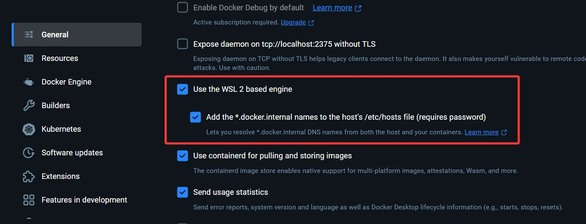


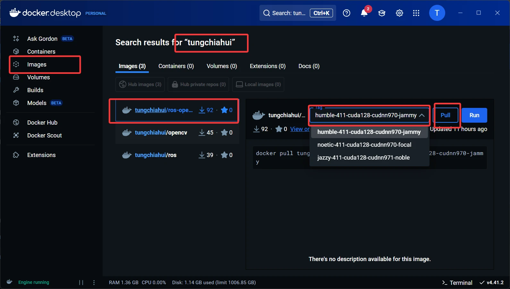

## 3.Docker直通

将宿主机的硬件设备或特定资源直接传递给Docker容器使用的技术

### 3.1.USB直通

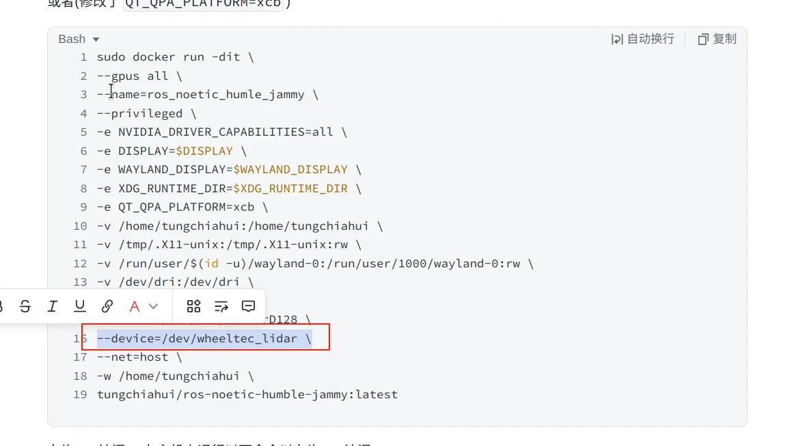

1.  方法一(不是很推荐新手)：
    

创建容器的时候把需要的设备加在红色部分这里即可。可以通过下面的命令查看想要的设备的名字。

```bash
ls /dev
#例如
--device=/dev/tty_USB0
```

2.  方法二(个人更加推荐，不用重新再挂载了，虽然安全性会降低，但是别人利用安全权限能够攻击你的概率很低很低，企业服务器才需要提防)：
    

```bash
--privileged
```

直接添加一行绿色部分，然后所有设备都会被挂载到docker了。(红色部分就不用写了）

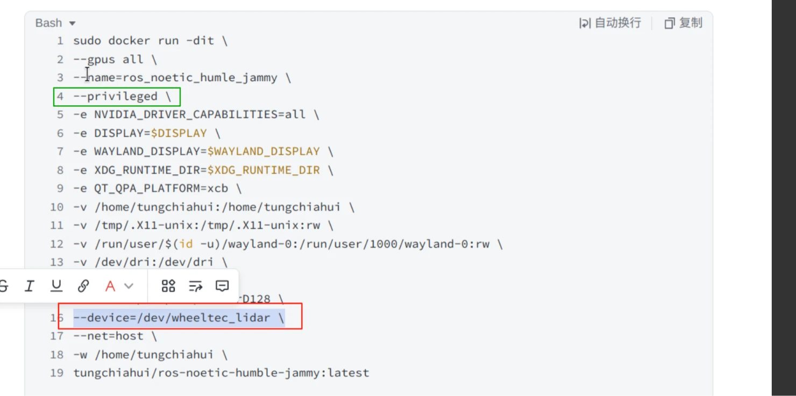

### 3.2.NVIDIA显卡直通

NVIDIA Container Toolkit使用户 **能够构建和运行GPU加速的容器** 。该工具包包括一个容器运行库和实用程序，用于自动配置容器以利用NVIDIA GPU。

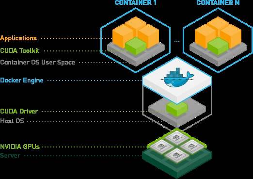

https://docs.nvidia.com/datacenter/cloud-native/container-toolkit/latest/install-guide.html

#### 3.2.1.安装

（尽量能看官方就看官方的，安装方式可能会更新）

##### 3.2.1.1.Ubuntu

1.  配置存储库 并更新
    

```bash
curl -fsSL https://nvidia.github.io/libnvidia-container/gpgkey | sudo gpg --dearmor -o /usr/share/keyrings/nvidia-container-toolkit-keyring.gpg \
  && curl -s -L https://nvidia.github.io/libnvidia-container/stable/deb/nvidia-container-toolkit.list | \
    sed 's#deb https://#deb [signed-by=/usr/share/keyrings/nvidia-container-toolkit-keyring.gpg] https://#g' | \
    sudo tee /etc/apt/sources.list.d/nvidia-container-toolkit.list \
  && \
    sudo apt-get update
```

2.  安装nvidia-docker2
    

```bash
sudo apt-get install -y nvidia-docker2
```

3.  使用nvidia-ctk命令配置container runtime
    

```bash
sudo nvidia-ctk runtime configure --runtime=docker
```

4.  重启docker服务:
    

```bash
sudo systemctl restart docker
```

##### 3.2.1.2.Fedora

1.  配置存储库
    

```bash
curl -s -L https://nvidia.github.io/libnvidia-container/stable/rpm/nvidia-container-toolkit.repo | \
sudo tee /etc/yum.repos.d/nvidia-container-toolkit.repo
```

2.  配置NVIDIA容器工具库的官方软件源，使用实验包，可选
    

```bash
# 如果是RHEL或者Rocky（DNF4）
sudo dnf config-manager --add-repo https://nvidia.github.io/libnvidia-container/stable/rpm/libnvidia-container.repo

# 如果是Feodra41+（DNF5）
sudo dnf config-manager addrepo --from-repofile=https://nvidia.github.io/libnvidia-container/stable/rpm/libnvidia-container.repo
```

3.  安装NVIDIA Container Toolki包
    

```bash
# 如果是RHEL或者Rocky
sudo dnf install -y nvidia-container-toolkit

# 如果是Fedora
sudo dnf install -y nvidia-container-toolkit
```

4.  安装nvidia-docker2 ： 在Fedora上使用`dnf`进行安装
    

```bash
sudo dnf install -y nvidia-docker2
```

5.  使用nvidia-ctk命令配置容器运行时 ： 这个命令用于配置NVIDIA Container Toolkit与Docker集成。命令如下：
    

```bash
sudo nvidia-ctk runtime configure --runtime=docker
```

6.  重启Docker服务 ： 完成配置后，必须重启Docker服务以使更改生效：
    

```bash
sudo systemctl restart docker
```

这些步骤执行后，Docker将使用NVIDIA Container Runtime，并支持GPU加速的容器运行。你可以使用nvidia-smi命令来验证容器中的NVIDIA GPU是否可用

方法：

1️⃣nvidia-smi

2️⃣运行nvidia cuda 容器进行测试

```bash
sudo docker run --rm --gpus all nvidia/cuda:11.0.3-base-ubuntu20.04 nvidia-smi
```

docker会自动从nvidia/cuda拉取11.0.3-base-ubuntu20.04镜像，并创建一个运行一次即删除的容器

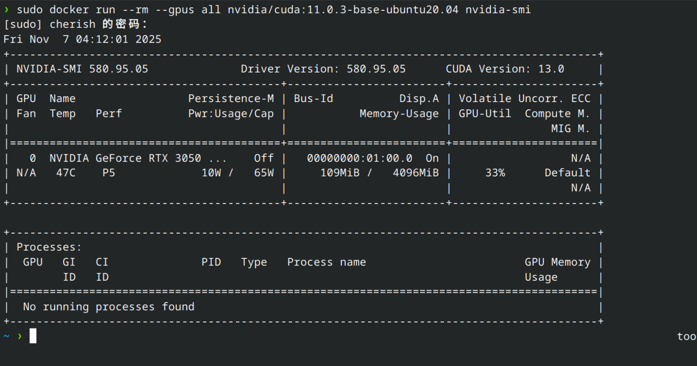

### 3.3.Docker配置CUDA和CuDNN

如果你不需要自己创建Docker镜像，直接使用学长或者其他人创建好的镜像，则不用看该章节，容器的CUDA和CuDNN是和本地完全隔离的环境，你本地有没有CUDA都无所谓，但英伟达驱动版本必须满足CUDA的最低版本要求。

下面是如果你想自己创建镜像，则可以在学会如何创建容器的镜像后再回来看本节：

https://hub.docker.com/r/nvidia/cuda

在上方这个网站中，英伟达都帮我们配置好了CUDA和CuDNN了，我们根本不需要自己去配置了，比传统方式要简单太多太多了。

我们只需要找到对应的Docker镜像当底包即可。

CUDA镜像有三个类型，如下，如果我们需要编译OpenCV4,那么需要使用devel版的CUDA。

<!--br {mso-data-placement:same-cell;}--> td {white-space:nowrap;border:0.5pt solid #dee0e3;font-size:10pt;font-style:normal;font-weight:normal;vertical-align:middle;word-break:normal;word-wrap:normal;}
| 镜像类型 | 适用场景 | 示例标签 | 大小 |
|:---|:---|:---|:---|
| base | 仅需 CUDA 运行时库 | 12.4.0-base-ubuntu22.04 | ~240MB |
| runtime | 部署编译后的应用（含数学库） | 12.4.0-runtime-ubuntu22.04 | ~2GB |
| devel | 开发环境（含编译工具） | 12.4.0-devel-ubuntu22.04 | ~3GB |

我示例一个，比如我想用在Ubuntu24.04上用CUDA12.6和CuDNN，那么就选择`nvidia/cuda:12.6.0-cudnn-devel-ubuntu24.04`。这个镜像既有CUDA-devel也有CuDNN，而且还是基于Ubuntu24.04的。

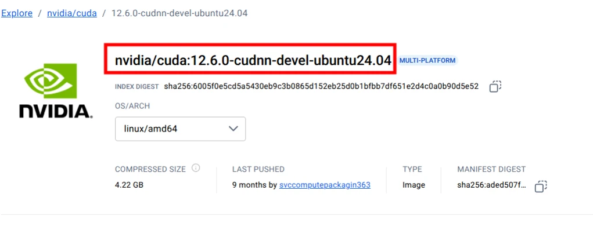

在dockerfile里就可以开头这么写：

```bash
# 基于NVIDIA官方CUDA 12.6和CuDNN基础镜像
FROM nvidia/cuda:12.6.0-cudnn-devel-ubuntu24.04
```

### 3.4.配置以太网

指定网络模式

```bash
--net=host \
```

启动参数里加上这行即可。具体在下方

\--net选项：指定网络模式，该选项有以下参数可选：

*   \--net=bridge:默认选项，表示连接到默认的网桥
    
*   \--net=host:容器使用宿主机的网络
    
*   \--net=container:Name-or-ID:告诉Docker让新建的容器使用已有容器的网络配置
    
*   \--net=none：不配置该容器的网络，用户自定义网络配置
    

## 4.DockerHub换源

（DockerHub已于2024年5月被🇨🇳封杀，各大国内镜像源均已下架DockerHub镜像源，直接挂梯用官方源吧）

各大镜像源只有Docker-Ce的镜像库，这个是用来安装docker的，而不是dockerhub的镜像源。

## 5.Docker命令学习

### 5.1.参考文档

https://www.runoob.com/docker/docker-tutorial.html

### 5.2.常用命令

常用的标红了，偶尔用的标绿了，其他了解就行。

<!--br {mso-data-placement:same-cell;}--> td {white-space:nowrap;border:0.5pt solid #dee0e3;font-size:10pt;font-style:normal;font-weight:normal;vertical-align:middle;word-break:normal;word-wrap:normal;}
| 命令 | 描述 | 示例 |
|:---|:---|:---|
| docker run | 创建并启动一个新的容器。 | docker run -it ubuntu bash |
| docker build | 通过指定的 Dockerfile 创建一个新的镜像。 | docker build -t myimage . |
| docker pull | 从 Docker 仓库拉取镜像。 | docker pull ubuntu |
| docker push | 将本地镜像推送到 Docker 仓库。 | docker push myimage |
| docker stop | 停止一个正在运行的容器。 | docker stop container_id |
| docker start | 启动一个已经存在的容器。 | docker start container_id |
| docker restart | 重新启动容器。 | docker restart container_id |
| docker ps | 列出当前正在运行的容器。 | docker ps |
| docker rm | 删除一个或多个停止的容器。 | docker rm container_id |
| docker exec | 在一个正在运行的容器中执行命令。 | docker exec -it container_id bash |
| docker logs | 查看容器的日志输出。 | docker logs container_id |
| docker images | 列出本地所有镜像。 | docker images |
| docker rmi | 删除一个或多个镜像。 | docker rmi myimage |
| docker network | 管理 Docker 网络。 | docker network ls |
| docker volume | 管理 Docker 数据卷。 | docker volume ls |
| docker-compose up | 启动 docker-compose.yml 中定义的所有服务。 | docker-compose up |
| docker-compose down | 停止并移除 docker-compose.yml 中定义的所有服务及其相关资源。 | docker-compose down |
| docker info | 显示 Docker 系统的详细信息。 | docker info |
| docker stats | 查看正在运行的容器的实时资源使用情况（CPU、内存等）。 | docker stats |
| docker inspect | 查看容器或镜像的详细信息（JSON 格式）。 | docker inspect container_id |
| docker save | 将一个镜像保存为 tar 文件。 | docker save -o myimage.tar myimage |
| docker load | 从 tar 文件中加载镜像。 | docker load -i myimage.tar |
| docker tag | 为镜像添加标签（tag）。 | docker tag myimage myimage:v1 |
| docker buildx build | 使用 Buildx 构建多架构镜像。 | docker buildx build -t myimage . |
| docker buildx create | 创建一个新的 Buildx 构建实例。 | docker buildx create –use |
| docker buildx ls | 列出所有可用的 Buildx 构建实例。 | docker buildx ls |
| docker buildx use | 设置当前的 Buildx 构建实例。 | docker buildx use mybuilder |
| docker buildx bake | 使用 Bake 文件批量构建镜像。 | docker buildx bake -f bake.hcl |
| docker buildx build –push | 构建镜像并推送到镜像仓库。 | docker buildx build –push -t myimage . |
| docker buildx build –platform | 构建镜像并为多个平台生成支持。 | docker buildx build –platform linux/amd64,linux/arm64 -t myimage . |

docker exec -it 进入容器并给予i输入和t终端 （docker exec -it 4f6c8cd45b58 /bin/bash）

docker search 可以查看Docker Hub上关键字的镜像仓库

docker images 可以查看已经下载的镜像

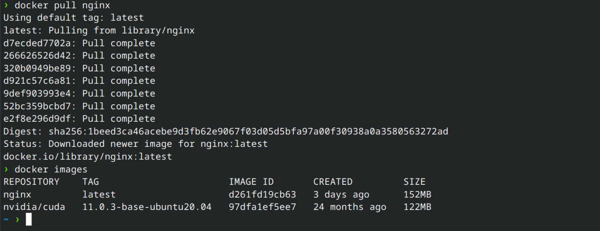

**Nginx 是一个高性能的 HTTP 和反向代理 Web 服务器**

docker rmi $(docker images -q) 删除所有的镜像

docker container logs 查看容器日志

docker top 查看容器里的进程

docker cp 容器id:要拷贝的文件在容器里面的路径 宿主机的相应路径

```bash
如：docker cp 7aa5dc458f9d:/etc/nginx/nginx.conf /mydata/nginx
```

  

docker run时在启动容器的时候会有几个常用的选项：

*   \-d选项：表示后台运行
    
*   \-P选项：随机端口映射
    
*   \-p选项：指定端口映射，有以下四种方式： --ip:hostPort:containerPort --ip::containerPort --hostPort::containerPort --containerPort
    

  

### **5.3.run命令的参数（非常重要）**

<!--br {mso-data-placement:same-cell;}--> td {white-space:nowrap;border:0.5pt solid #dee0e3;font-size:10pt;font-style:normal;font-weight:normal;vertical-align:middle;word-break:normal;word-wrap:normal;}
| 参数/配置 | 功能说明 | 重要性与参考依据 |
|:---|:---|:---|
| -name=ros_jazzy_opencv411_cuda128_cudnn971_noble | 指定容器名称，便于后续管理 | 替代随机生成的容器名。 |
| –gpus all | 允许容器访问宿主机所有GPU资源，需NVIDIA驱动支持 | 用于CUDA加速等GPU依赖任务。 |
| -e NVIDIA_DRIVER_CAPABILITIES=all | 启用NVIDIA驱动的全部功能（如CUDA、图形渲染） | 确保容器内GPU功能完整67。 |
| -dit | 组合参数：- -d：后台运行容器（Detached模式）- -i：保持标准输入（STDIN）开放- -t：分配伪终端（TTY） | 允许容器在后台运行并支持交互操作。 |
| –privileged | 赋予容器完全主机权限（可访问设备、内核模块等） | 用于需要直接操作硬件的场景（如访问USB设备），但存在安全风险。 |
| –net=host | 共享宿主机网络命名空间（容器使用宿主机IP和端口） | 简化网络配置，无NAT，这样的话，网络效率更高，局域网设备更容易发现。 |
| –group-add audio–group-add video–group-add dialout | 将容器用户加入宿主机用户组：- audio：音频设备访问- video：视频设备访问- dialout：串口设备访问 | 避免权限问题（如避免无法调用摄像头、麦克风）。 |
| -e DISPLAY=$DISPLAY-e XAUTHORITY=/home/tungchiahui/.Xauthority-e WAYLAND_DISPLAY-e XDG_RUNTIME_DIR-e QT_QPA_PLATFORM=xcb | 配置图形显示环境：- 绑定宿主机显示接口（X11或Wayland）- 设置GUI应用渲染后端 | 支持容器内运行图形界面应用（如OpenCV可视化）。 |
| -v /tmp/.X11-unix:/tmp/.X11-unix:rw-v /dev/dri:/dev/dri | 挂载宿主机图形设备：- X11套接字目录- 直接渲染管理器（DRI）设备 | 实现容器内图形显示。 |
| -v $HOME/.Xauthority:/home/tungchiahui/.Xauthority:ro | 挂载X11认证文件（只读） | 确保容器有权连接宿主机显示服务。 |
| -v /run/user/1000/wayland-0-v /run/user/1000 | 挂载Wayland显示协议相关目录 | 支持Wayland协议的图形显示。 |
| –ulimit nofile=1024:524288 | 设置进程最大可打开文件数（nofile）的方式，用于控制容器或进程运行时的文件句柄数量限制。–ulimit <限制类型>=<软限制>:<硬限制> | 如果默认限制太小，可能会出现 “too many open files” 的错误。所以在容器运行或系统服务启动时，需要调大这个值。–ulimit nofile=4096:65536 |
| -v /home/tungchiahui:/home/tungchiahui | 挂载宿主机用户目录到容器内同名路径 | 实现宿主机与容器间文件共享（如代码、数据持久化）。 |
| -w /home/tungchiahui | 设置容器启动后的默认工作目录 | 直接进入项目路径，方便执行命令2324。 |
| tungchiahui/ros-opencv:jazzy-411-cuda128-cudnn971-noble | 镜像名称指定镜像及标签，包含：- ROS 2 Jazzy- OpenCV 4.11- CUDA 12.8- cuDNN 9.7.1 | 提供预配置的深度学习与机器人开发环境。 |

下方这条命令一定要在普通用户下运行，不要在root用户下运行，其实加不加`sudo`加不加`sudo -E`都无所谓。

用户已经被加到docker组了，不用`sudo`也行跑，其次，`sudo`运行的话，你的`$HOME`变量也不会变，更何况加上-E的话，这样你的`$HOME`更不可能变了。

```bash
sudo docker run --name=ros_opencv_cuda \
--gpus all \
-e NVIDIA_DRIVER_CAPABILITIES=all \
-e DISPLAY=$DISPLAY \
-dit \
--privileged \
--net=host \
--group-add audio \
--group-add video \
--group-add dialout \
-e XAUTHORITY=$HOME/.Xauthority \
-e WAYLAND_DISPLAY=$WAYLAND_DISPLAY \
-e XDG_RUNTIME_DIR=$XDG_RUNTIME_DIR \
-e QT_QPA_PLATFORM=xcb \
-v /tmp/.X11-unix:/tmp/.X11-unix:rw \
-v /dev/dri:/dev/dri \
-v $HOME/.Xauthority:$HOME/.Xauthority:ro \
-v /run/user/$(id -u)/wayland-0:/run/user/$(id -u)/wayland-0 \
-v /run/user/$(id -u):/run/user/$(id -u) \
-v $HOME:$HOME \
-w $HOME \
tungchiahui/ros-opencv:humble-411-cuda128-cudnn970-jammy
```

注意：

1.  `NVIDIA_DRIVER_CAPABILITIES=all` `--gpus all`没有英伟达显卡请注释。
    
2.  \--name后面请自己为容器起名。
    
3.  最后一行仓库名称请你自己找对应的镜像填上。
    
4.  ROS1在Fedora发行版下会爆内存，需要添加上下面这个参数，如果你不是Fedora和ROS1,***请不要加***。
    

```bash
--ulimit nofile=1024:524288 \
```

如果想用当前用户登陆容器,可以加上下面这几条,但非常非常***不建议*****.**

```bash
--user $(id -u):$(id -g) \
-v /etc/passwd:/etc/passwd:ro \
-v /etc/group:/etc/group:ro \
```

## 6.手动创建Docker镜像

### 6.1.DockerFile

常用命令：

<!--br {mso-data-placement:same-cell;}--> td {white-space:nowrap;border:0.5pt solid #dee0e3;font-size:10pt;font-style:normal;font-weight:normal;vertical-align:middle;word-break:normal;word-wrap:normal;}
| 指令 | 说明 | 示例 |
|:---|:---|:---|
| FROM | 指定基础镜像，是 Dockerfile 的起点 | FROM ubuntu:22.04 |
| LABEL | 添加元数据（如作者、版本等） | LABEL maintainer=”you@example.com” |
| ENV | 设置环境变量 | ENV PORT=8080 |
| ARG | 构建参数，只在构建期间可用 | ARG VERSION=1.0 |
| RUN | 构建镜像时运行命令 | RUN apt-get update && apt-get install -y curl |
| COPY | 复制文件到镜像中 | COPY . /app |
| ADD | 类似 COPY，额外支持解压 .tar 文件或远程 URL（不推荐用于 URL） | ADD archive.tar.gz /data/ |
| WORKDIR | 设置工作目录 | WORKDIR /opt |
| CMD | 设置容器启动时默认命令（可被 docker run 覆盖） | CMD [“node”, “index.js”] |
| ENTRYPOINT | 设置容器启动时固定命令（通常用于 CLI 工具等） | ENTRYPOINT [“python3”] |
| EXPOSE | 声明镜像内服务监听的端口（不会自动映射） | EXPOSE 80 |
| VOLUME | 声明数据卷挂载点 | VOLUME [“/data”] |
| USER | 设置后续命令执行的用户 | USER appuser |
| ONBUILD | 当镜像作为其他镜像基础镜像时触发的构建指令 | ONBUILD COPY . /src |
| SHELL | 更改默认 shell，比如将 sh -c 改为 bash -c | SHELL [“/bin/bash”, “-c”] |
| HEALTHCHECK | 定义容器运行时的健康检查命令 | `HEALTHCHECK CMD curl –fail http://localhost:8080 |
| STOPSIGNAL | 容器停止时发送的信号 | STOPSIGNAL SIGKILL |

### 6.2.自己创建容器

#### 6.2.1.手动创建

在x86电脑上编译x86的：

```bash
docker build -t ros-melodic-cuda118-cudnn8-bionic:latest .

docker build -t ros-noetic-focal:latest .

docker build -t ros-humble-jammy:latest .

docker build -t ros-jazzy-noble:latest .

docker build -t ros-humble-opencv411-cuda128-cudnn970-jammy:latest .

docker build -t ros-jazzy-opencv411-cuda128-cudnn970-noble:latest .
```

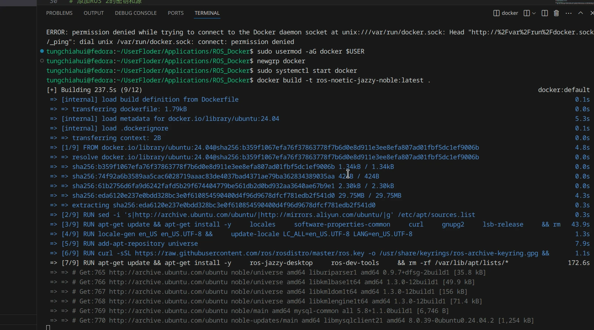

镜像大小5GB(压缩后的大小详见DockerHub)

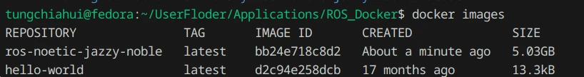

将 Docker 镜像推送到 Docker Hub 的步骤如下：

1.  创建 Docker Hub 账户
    

如果你还没有 Docker Hub 账户，请前往 Docker Hub 注册一个免费账户。

2.  登录 Docker Hub
    

在终端中使用以下命令登录到你的 Docker Hub 账户：

```bash
docker login
```

输入你的 Docker Hub 用户名和密码进行验证。

1.  为你的镜像打标签
    

Docker Hub 使用 `<用户名>/<镜像名>:<标签>` 的格式来标识镜像。你需要为你的镜像打上标签，以便能够推送到 Docker Hub。使用以下命令：

```bash
docker tag ros-jazzy-noble:latest <你的用户名>/ros-jazzy-noble:latest
```

例如，如果你的 Docker Hub 用户名是 `tungchiahui`，你应该执行：

```bash
docker tag ros-noetic-focal:latest tungchiahui/ros-noetic-focal:latest

docker tag ros-humble-jammy:latest tungchiahui/ros-humble-jammy:latest

docker tag ros-jazzy-noble:latest tungchiahui/ros-jazzy-noble:latest

docker tag ros-humble-opencv411-cuda128-cudnn970-jammy:latest /ros-humble-opencv411-cuda128-cudnn970-jammy:latest

docker tag ros-jazzy-opencv411-cuda128-cudnn970-noble:latest tungchiahui/ros-jazzy-opencv411-cuda128-cudnn970-noble:latest
```

2.  推送镜像到 Docker Hub
    

使用以下命令将镜像推送到 Docker Hub：

```bash
docker push <你的用户名>/ros-noetic-jazzy-noble:latest
```

例如：

```bash
docker push tungchiahui/ros-noetic-focal:latest

docker push tungchiahui/ros-humble-jammy:latest

docker push tungchiahui/ros-jazzy-noble:latest

docker push tungchiahui/ros-humble-opencv411-cuda128-cudnn970-jammy:latest

docker push tungchiahui/ros-jazzy-opencv411-cuda128-cudnn970-noble:latest

docker push tungchiahui/ros-noetic-focal-arm64:latest
```

3.  验证推送成功
    

你可以通过访问 Docker Hub 的个人页面来验证你的镜像是否已成功推送

**注意事项**

*   确保你的镜像大小在 Docker Hub 的限制范围内（一般为 10GB）
    
*   如果你打算将镜像公开，可以设置为公共仓库；如果希望只有你自己可以访问，可以设置为私有仓库
    

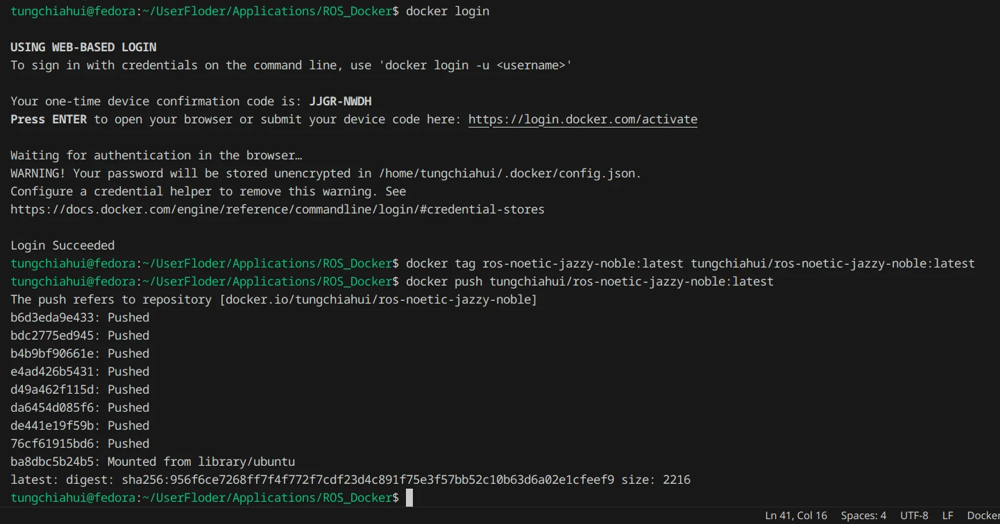

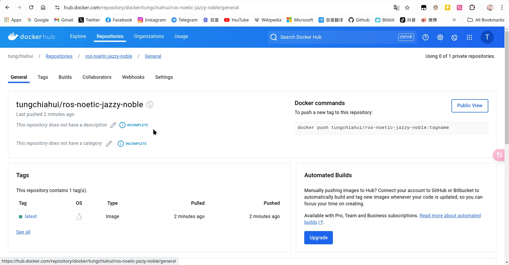

#### 6.2.2.手动创建(跨平台多架构构建)

如果您想在 **x86/x64 电脑上即为本机x86设备构建镜像，又想为树莓派、Jetson等ARM64 设备构建 Docker 镜像** ，需要使用 **Docker 的跨平台构建功能** 。以下是完整解决方案：

1\. **启用 Docker 跨平台构建**

在 x86 主机上模拟 ARM64 环境需要以下工具：

第一步：启用 buildx（只需执行一次）

```bash
docker buildx create --name multiarch_builder --use
```

这会创建并启用一个支持多架构构建的 builder，电脑重启后也依然存在，所以只用运行一次。

第二步：安装 QEMU 支持（一般新版 Docker Desktop 已自带，但是Linux必须要安装） 如果你用的是服务器或Linux发行版，确保有 qemu 模拟器：

```bash
docker run --rm --privileged multiarch/qemu-user-static --reset -p yes
```

电脑重启后，就会消失，所以需要你每次电脑重启后，在buildx命令前，运行一次该命令即可。

第三步：构建多架构镜像 用下面的命令构建 amd64 和 arm64：

```bash
docker buildx build --platform linux/amd64,linux/arm64 -t <你的镜像名>:<标签> --push .

# 例子：
docker buildx build \
--platform linux/amd64,linux/arm64 \
 -t tungchiahui/ros:noetic-focal \
 --push \
 .

docker buildx build \
--platform linux/amd64,linux/arm64 \
 -t tungchiahui/ros:humble-jammy \
 --push \
 .

docker buildx build \
--platform linux/amd64,linux/arm64 \
 -t tungchiahui/ros:jazzy-noble \
 --push \
 .

 docker buildx build \
--platform linux/amd64,linux/arm64 \
 -t tungchiahui/opencv:411-cuda128-cudnn970-focal \
 --push \
 .

docker buildx build \
--platform linux/amd64,linux/arm64 \
 -t tungchiahui/opencv:411-cuda128-cudnn971-jammy \
 --push \
 .

 docker buildx build \
--platform linux/amd64,linux/arm64 \
 -t tungchiahui/opencv:411-cuda128-cudnn971-noble \
 --push \
 .

docker buildx build \
--platform linux/amd64,linux/arm64 \
 -t tungchiahui/ros-opencv:noetic-411-cuda128-cudnn970-focal \
 --push \
 .

docker buildx build \
--platform linux/amd64,linux/arm64 \
 -t cherish/ros-opencv:humble-411-cuda128-cudnn970-jammy \
 --push \
 .

 docker buildx build \
--platform linux/amd64,linux/arm64 \
 -t tungchiahui/ros-opencv:jazzy-411-cuda128-cudnn970-noble \
 --push \
 .

  docker buildx build \
--platform linux/amd64,linux/arm64 \
 -t sdutvincirobot/ros-opencv:humble-411-cuda128-cudnn970-jammy \
 --push \
 .
```

说明： –platform 指定多架构。 –push 是必须的，因为 buildx 的多平台构建默认是不能本地加载的（除非加 –load，但那只能支持单一架构）

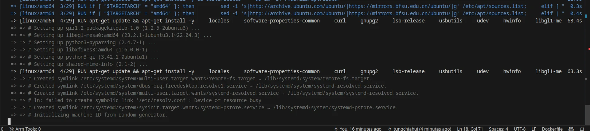

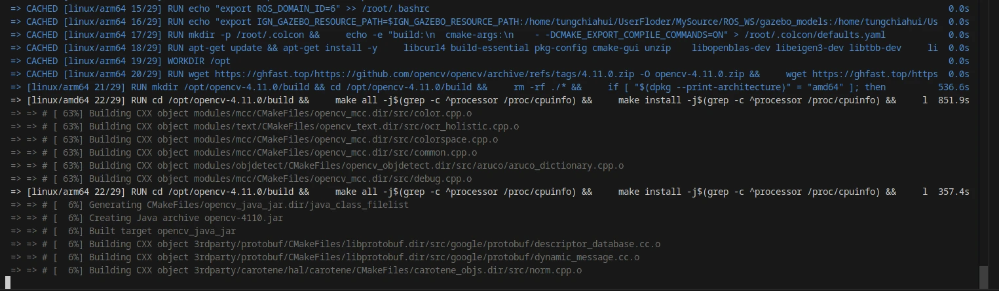

#### 6.2.3.清除构建缓存

```bash
# 清理BuildKit构建缓存
docker builder prune -f  
```

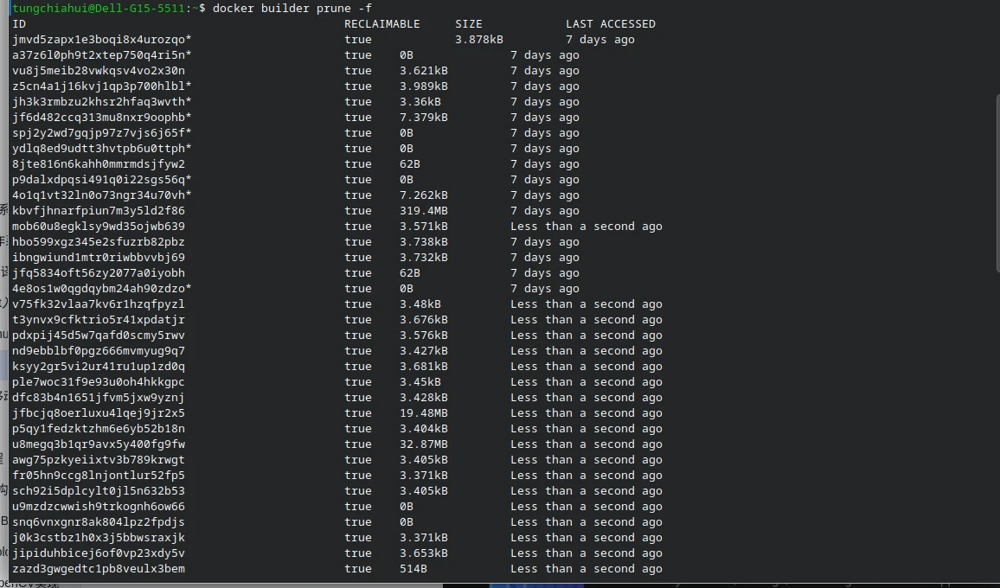

### 6.3.补充

#### 6.3.1.使用Dockfile构建Docker镜像

Dockerfile是一个文本文件，其中包含了若干条指令，指令描述了构建镜像的细节

先来编写一个最简单的Dockerfile，以前文下载的Nginx镜像为例，来编写一个Dockerfile修改该Nginx镜像的首页

1、新建一个空文件夹docker-demo，在里面再新建文件夹app，在app目录下新建一个名为Dockerfile的文件，在里面增加如下内容（vim Dockerfile）：

```bash
FROM nginx
RUN echo '<h1>This is Tuling Nginx!!!</h1>' > /usr/share/nginx/html/index.html
```

该Dockerfile非常简单，其中的 FROM、 RUN都是 Dockerfile的指令。 FROM指令用于指定基础镜像， RUN指令用于执行命令

2、在Dockerfile所在路径执行以下命令构建镜像：

```bash
docker build -t nginx:tuling .
```

其中，-t指定镜像名字，命令最后的点（.）表示Dockerfile文件所在路径

3、执行以下命令，即可使用该镜像启动一个 Docker容器

```bash
docker run -d -p 92:80 nginx:tuling
```

4、访问 http://Docker宿主机IP:92/，可看到下图所示界面


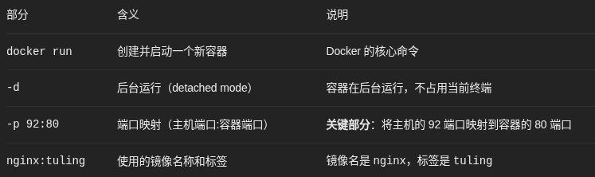

#### 6.3.2.使用Dockerfile构建微服务镜像

只需要知道大体流程即可

以项目tulingmall-member为例，将该微服务的可运行jar包构建成docker镜像

1、将jar包上传linux服务器/root/tulingmall/tulingmall-member目录，在jar包所在目录创建名为Dockerfile的文件

2、在Dockerfile中添加以下内容

```markdown
# 基于哪个镜像
From java:8
# 复制文件到容器
ADD tulingmall-member-0.0.5.jar /tulingmall-member-0.0.5.jar
# 声明需要暴露的端口
EXPOSE 8877
# 配置容器启动后执行的命令
ENTRYPOINT java ${JAVA_OPTS} -jar /tulingmall-member-0.0.5.jar
```

3、使用docker build命令构建镜像

```bash
docker build -t tulingmall-member:0.0.5 .
```

格式： docker build -t 镜像名称:标签 Dockerfile的相对位置

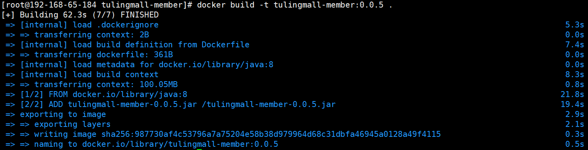

4、启动镜像，加-d可在后台启动

```bash
docker run -d -p 8877:8877 tulingmall-member:0.0.5
```

加上JVM参数：

```bash
# --cap-add=SYS_PTRACE 这个参数是让docker能支持在容器里能执行jdk自带类似jinfo，jmap这些命令，如果不需要在容器里执行这些命令可以不加
docker run  -d -p 8877:8877 \
-e SPRING_CLOUD_NACOS_CONFIG_SERVER_ADDR=192.168.65.174:8848  \
-e JAVA_OPTS='-Xmx1g -Xms1g -XX:MaxMetaspaceSize=512m'  \
--cap-add=SYS_PTRACE  \
tulingmall-member:0.0.5
```

5、访问会员服务接口

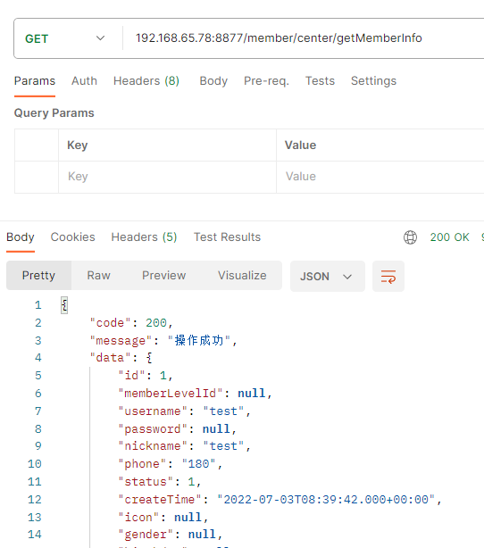

#### 6.3.3.将微服务镜像发布到阿里云

我们制作好了微服务镜像，一般需要发布到镜像仓库供别人使用，我们可以选择自建镜像仓库，也可以直接使用官方镜像仓库，这里我们选择

阿里云docker镜像仓库：[https://cr.console.aliyun.com/cn-hangzhou/instance/repositories](https://cr.console.aliyun.com/cn-hangzhou/instance/repositories)

首先，我们需要注册一个阿里云账号，创建容器镜像服务

然后，在linux服务器上用docker login命令登录镜像仓库

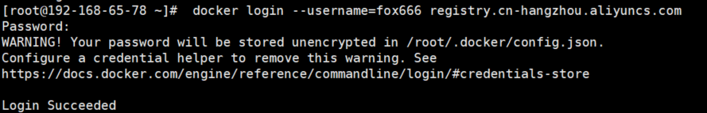

要把镜像推送到镜像仓库

```bash
docker tag tulingmall-member:0.0.5 registry.cn-hangzhou.aliyuncs.com/fox666/tulingmall-member:0.0.5
```

最后将镜像推送到远程仓库

```bash
docker push registry.cn-hangzhou.aliyuncs.com/fox666/tulingmall-member:0.0.5
```

## 7.VScode远程开发

1.  插件1：微软Docker工具
    

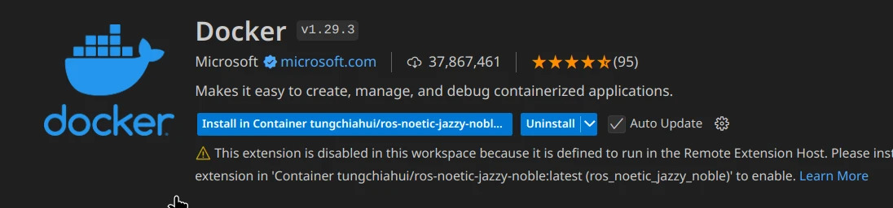

docker扩展插件已经进化为container tools了，请安装container tools

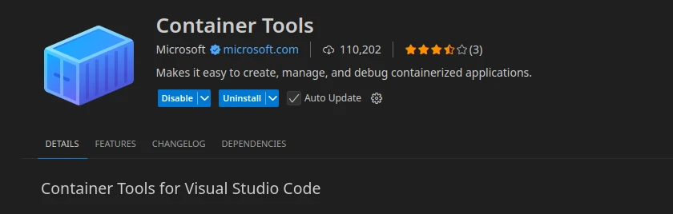

2.  插件2：微软Docker远程开发工具
    

下面这是远程开发的插件。

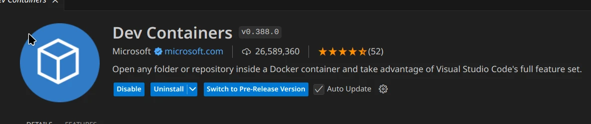

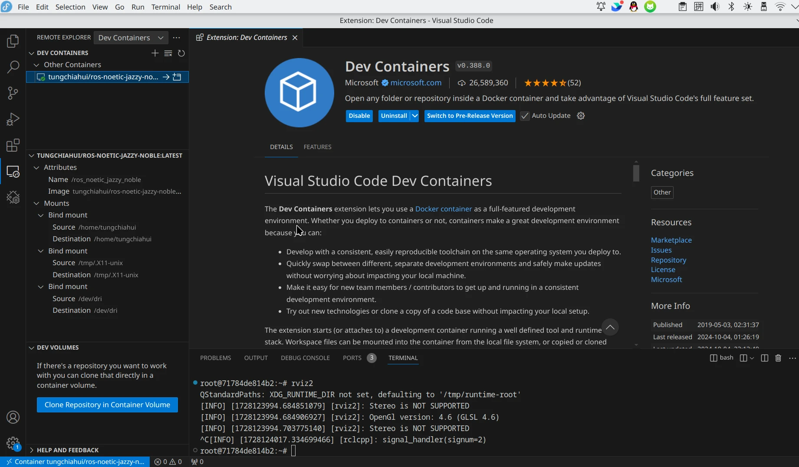

上述教程已经挂载了本地磁盘了，所以在Docker容器中可以轻松访问本地的工程

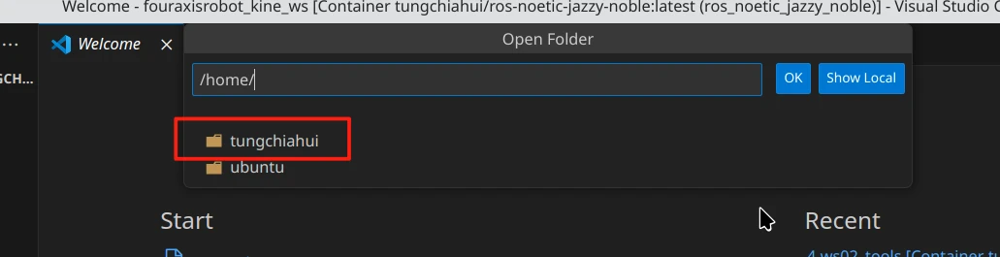

安装完拓展之后，vscode进行链接：

1.按ctrl+shift+p

2.输入 "Dev Containers: Attach to Running Container"

3.选择目前运行的容器

4.VS Code 会在新窗口中打开并连接到容器

5.补充一点：在开发时候最好不要将项目所需要的文件夹放到容器中，可以将本地目录挂载到容器内，这样就可以实现项目文件在本地，环境仍然在容器当中 挂载实现方式：

```bash
docker run -v 主机目录:容器目录 image-name
```
```bash
docker run -it -v /home/cherish/project/pi0.5/:/home/cherish/project/pi0.5/ cherish6/ros-humble-opencv411-cuda128-cudnn970-jammy:latest
```

在运行的时候进行挂载，挂载自己的这个项目目录就可以，不会对其他目录产生影响的 需要补充一点非常重要：不要把系统文件给挂载进去，在容器中如果误删除后，本地就崩了！

查看挂载情况：

```bash
mount | grep -i project
```

也可以通过ls来进行查看
