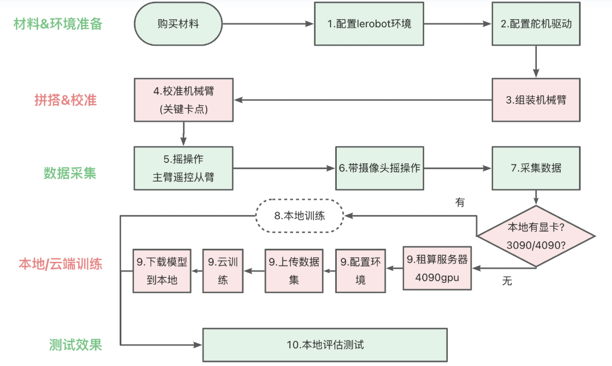

## 1.项目官方地址

https://huggingface.co/docs/lerobot/so101

https://github.com/huggingface/lerobo

复现大体流程：



## 2.项目步骤

1.  项目系统环境：linux系统/windows下的wsl2/mac都可以
    
2.  创建虚拟环境，使用conda创建虚拟环境，依据官方网站配置环境
    
3.  查找与机械臂关联的usb端口，并给予端口权限
    

需要用到拓展坞，将usb和电源将MotorBus连接到电脑，运行下方代码，当提示断开MotoBus的连接时，拔掉usb线并按回车，得到对应端口号，相机不需要这一步操作

```bash
lerobot-find-out
```

授权端口

```bash
sudo chmod 666 /dev/ttyACM0
sudo chmod 666 /dev/ttyACM1
```

*   sudo：以root权限去执行
    
*   chmod：用于改变文件或设备节点的权限位
    
*   666：是八进制表示，等价于rw-rw-rw-(没有执行权限)，或者可以写成a+rw,所有用户都可读写 每位对应owner、group、others的权限，数字与权限的对应关系：4=read,2=write,1=execute
    
*   /dev/ttyACM0、/dev/ttyACM1是端口号，一定要替换成自己的
    

4.  给舵机写id号， 每个电机都由总线上的唯一 ID 标识。当是全新的时，电机的默认 ID 通常为 `1`。为了使电机和控制器之间的通信正常工作，我们首先需要为每个电机设置一个唯一的、不同的 ID。此外，数据在总线上传输的速度由波特率决定。为了相互通信，控制器和所有电机需要配置相同的波特率。有两种方式： 1️⃣使用控制器单独连接到每个电机，执行下边程序，将id号写入舵机中的寄存器，id号从末端执行器开始，即从6开始标定（补充一点：在设置id号时只需要保证这个机械臂的usb连接到电脑就可以）
    

```bash
//主臂舵机配置ID
lerobot-setup-motors \
    --teleop.type=so101_leader \
    --teleop.port=/dev/ttyACM0

//从臂配置舵机ID
lerobot-setup-motors \
    --robot.type=so101_follower \
    --robot.port=/dev/ttyACM1  
```

2️⃣查看自己的的舵机厂家，下载对应的调试软件，在里边设置(不一定查找到每个舵机，用于修改舵机id和检查舵机比较好用)

5.  机械臂校准 校准要保证将机器人移动到所有关节都位于其范围中间的位置，然后，按回车键后，您必须在其整个运动范围内移动每个关节
    

```bash
// 主臂校准
lerobot-calibrate \
    --teleop.type=so101_leader \
    --teleop.port=/dev/ttyACM0 \
    --teleop.id=my_awesome_leader_arm

// 从臂校准
lerobot-calibrate \
    --robot.type=so101_follower \
    --robot.port=/dev/ttyACM1 \
    --robot.id=my_awesome_follower_arm
```

6.  遥操运动
    

```bash
lerobot-teleoperate \
    --robot.type=so101_follower \
    --robot.port=/dev/ttyACM1 \
    --robot.id=my_awesome_follower_arm \
    --teleop.type=so101_leader \
    --teleop.port=/dev/ttyACM0 \
    --teleop.id=my_awesome_leader_arm
```

7.  查找相机并带相机遥操运动
    

```bash
lerobot-find- cameras opencv
```
```bash
lerobot-teleoperate \
    --robot.type=so101_follower \
    --robot.port=/dev/ttyACM1 \
    --robot.id=my_awesome_follower_arm \
    --robot.cameras="{ front: {type: opencv, index_or_path: /dev/video4, width: 640, height: 480, fps: 30}}" \
    --teleop.type=so101_leader \
    --teleop.port=/dev/ttyACM0 \
    --teleop.id=my_awesome_leader_arm \
    --display_data=true
```

摄像机的设置：

*   front:为摄像头名字
    
*   type:opencv为摄像头驱动类型，这里用 OpenCV 读取视频流（通用USB摄像头接口）
    
*   index\_or\_path:/dev/video4表示摄像头设备路径（Linux下的设备节点），说明该摄像头挂载在/dev/video4
    
*   width:640图像宽度
    
*   height:480图像高度
    
*   fps:30帧率，每秒采集30帧图像
    

\--display\_data=true表示开启实时数据显示/可视化功能

8.  注册huggingface账号，生成一个访问令牌
    


复制好访问令牌后建议通过环境变量使用，不要把真实 token 写入笔记、脚本或提交记录中。

```bash
export HF_TOKEN="your_huggingface_token"
hf auth login --token "$HF_TOKEN" --add-to-git-credential
```

\--add-to-git-credential表示把token注册进git凭据系统，免密推送/拉取模型-->你可以直接用 Git 操作 Hugging Face 仓库而无需再输入密码

查看是否登陆成功

```bash
HF_USER=$(hf auth whoami | head -n 1)
echo $HF_USER
```

解释一下：通过hf auth whoami查看当前登录的 Hugging Face 用户信息;| head -n 1为linux系统的管道操作符，只取出输出的第一行，然后通过bash命令替换语法$()，将括号中的内容保存为变量值给HF\_USER


9.  录制模式，可以实现从动臂去复现某个录制过程，复现再下一步说明
    

```bash
lerobot-record \
    --robot.type=so101_follower \
    --robot.port=/dev/ttyACM1 \
    --robot.id=my_awesome_follower_arm \
    --robot.cameras="{ front: {type: opencv, index_or_path: 4, width: 640, height: 480, fps: 30}}" \
    --teleop.type=so101_leader \
    --teleop.port=/dev/ttyACM0 \
    --teleop.id=my_awesome_leader_arm \
    --display_data=true\
    --dataset.repo_id="Embodied-AI-6/so101_test" \
    --dataset.num_episodes=10 \
    --dataset.single_task="Grab the green cube" \
    --resume=true # 在现有数据集中添加数据时使用
```


Hugging Face Hub创建数据集和仓库的流程（仓库在模型训练中会用到，必须上传远程才可以实现录制复现和训练操作）：

1️⃣数据集创建


2️⃣仓库创建


创建后：


10.  重新录制的话需要先删除本地保存的文件
    

```bash
rm -rf /home/cherish/.cache/huggingface/lerobot/Embodied-AI-6/so101_test
```

注意：改成自己存放的地址1,不要把系统文件给删除了

11.  复现录制流程
    

```bash
lerobot-replay \
    --robot.type=so101_follower \
    --robot.port=/dev/ttyACM1\
    --robot.id=my_awesome_follower_arm \
    --dataset.repo_id="Embodied-AI-6/so101_test" \
    --dataset.episode=0 # choose the episode you want to replay
```

12.  把之前录制的远程操作数据训练成模型
    

```bash
lerobot-train \
  --dataset.repo_id="Embodied-AI-6/so101_test" \
  --policy.type=act \
  --output_dir=outputs/train/act_so101_test \
  --job_name=act_so101_test \
  --policy.device=cuda \
  --wandb.enable=false \
  --policy.repo_id="Embodied-AI-6/lerobot_new"
```

*   \--dataset.repo\_id:数据集参数，指向自己的远程的数据仓库
    
*   \--policy.type：训练策略类型，act模型
    
*   output\_dir：输出目录
    
*   \--job\_name：训练作业名称
    
*   \--policy.device：指定训练时使用的硬件设备，这里用GPU训练的
    
*   \--wandb.enable：训练可视化工具，如果你实时查看loss曲率和指标的话，就用true,需要配置WandB账号
    
*   \--policy.repo\_id：将训练好的本地模型传到远程仓库，没有这个仓库的话就给你自动创建；存在的话就给这个仓库传最新的
    


13.  利用训练好的act模型去控制从动机械臂，并在执行过程中实现录制与数据保存
    

```bash
lerobot-record  \
  --robot.type=so101_follower \
  --robot.port=/dev/ttyACM1 \
  --robot.cameras="{ front: {type: opencv, index_or_path: 4, width: 640, height: 480, fps: 30}}" \
  --robot.id=my_awesome_follower_arm \
  --display_data=false \
  --dataset.repo_id="Embodied-AI-6/so101_test" \
  --dataset.single_task="Grab the green cube" \
  --policy.path="Embodied-AI-6/lerobot_new"
```

\--policy.path="Embodied-AI-6/lerobot\_new":指定已经训练好的act模型路径

## 3.拓展-->isaaclab+so101仿真

项目地址：https://github.com/LightwheelAI/leisaac

大致教程：https://cloud.tencent.com/developer/article/2578981

任务：仿真机械臂在厨房抓橘子
