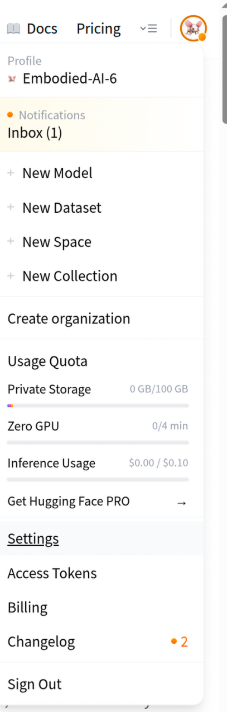
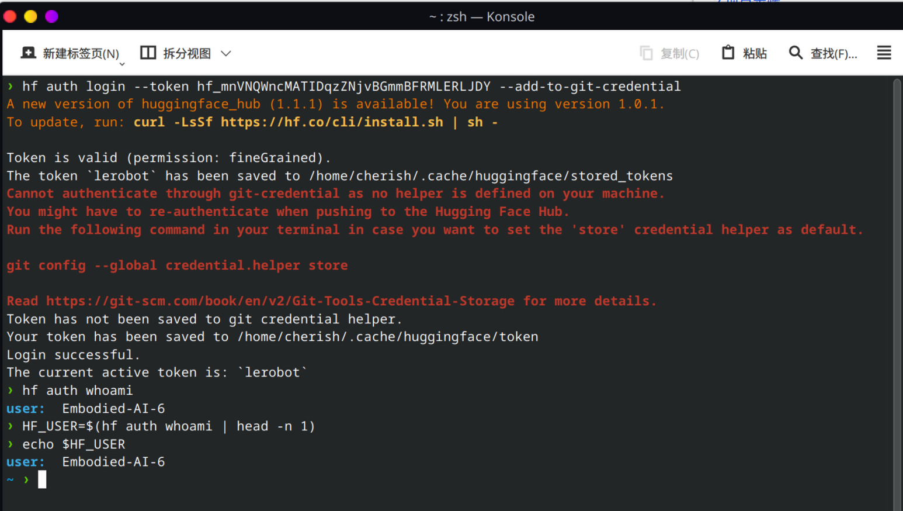
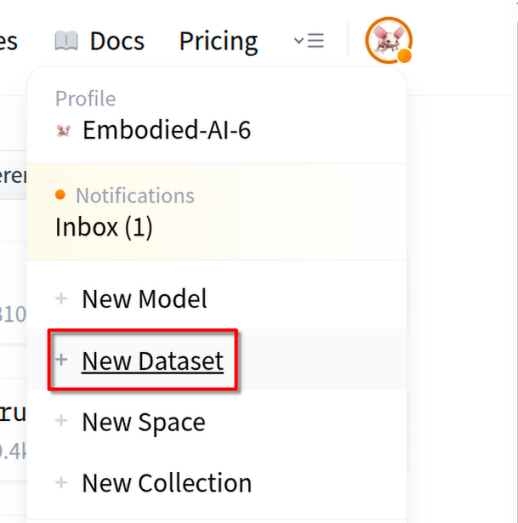
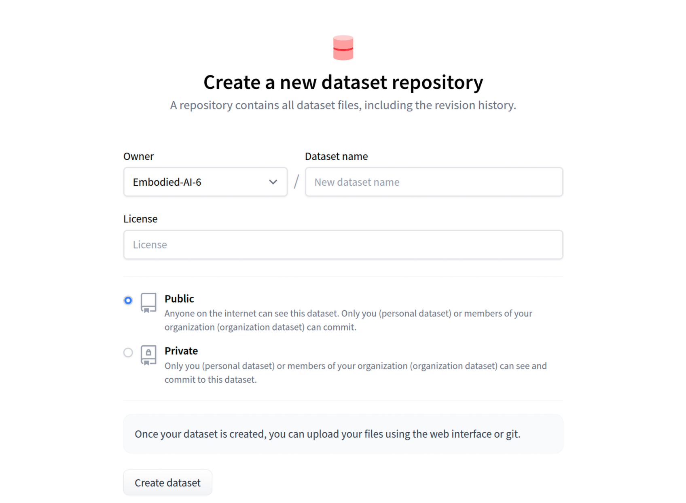
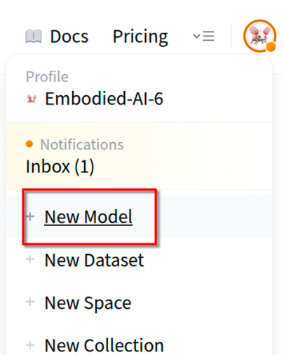
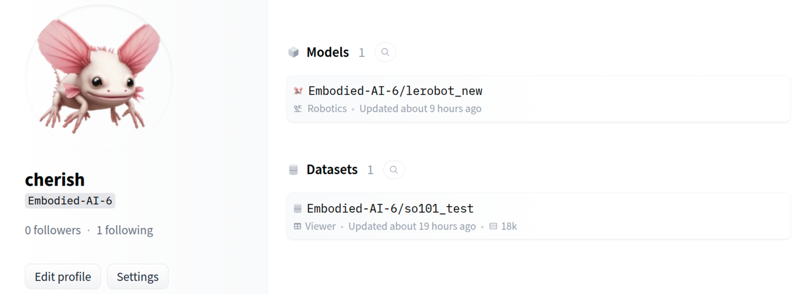

# 5. Hugging Face 认证与仓库准备

## 5.1 生成访问令牌




建议使用环境变量保存 token，不要把真实 token 写进脚本和仓库。

```bash
export HF_TOKEN="your_huggingface_token"
hf auth login --token "$HF_TOKEN" --add-to-git-credential
```

`--add-to-git-credential` 会把 token 写入 git 凭据系统，后续推拉 Hugging Face 仓库可免重复登录。

## 5.2 验证登录

```bash
HF_USER=$(hf auth whoami | head -n 1)
echo "$HF_USER"
```



## 5.3 创建数据集仓库与模型仓库

训练和回放都依赖远程仓库，需提前在 Hugging Face Hub 创建：

- Dataset Repo（用于上传演示数据）
- Model Repo（用于上传训练后的 ACT 权重）








