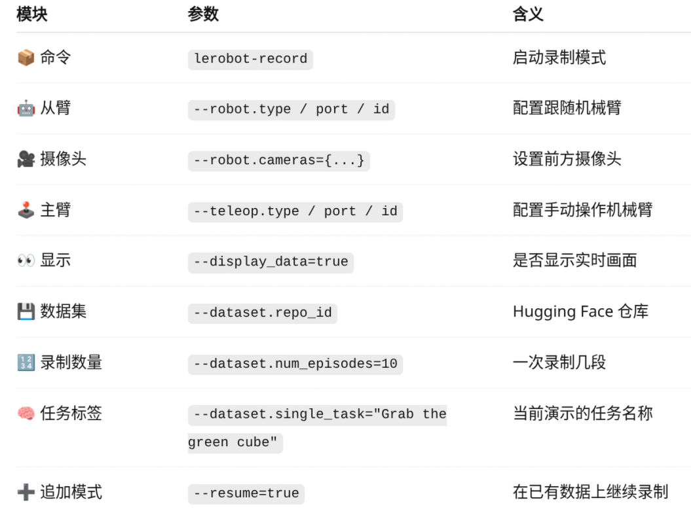

# 6. 数据录制、重录与回放

## 6.1 录制示教数据

```bash
lerobot-record \
  --robot.type=so101_follower \
  --robot.port=/dev/ttyACM1 \
  --robot.id=my_awesome_follower_arm \
  --robot.cameras="{ front: {type: opencv, index_or_path: 4, width: 640, height: 480, fps: 30}}" \
  --teleop.type=so101_leader \
  --teleop.port=/dev/ttyACM0 \
  --teleop.id=my_awesome_leader_arm \
  --display_data=true \
  --dataset.repo_id="Embodied-AI-6/so101_test" \
  --dataset.num_episodes=10 \
  --dataset.single_task="Grab the green cube" \
  --resume=true
```

- `--resume=true`：已有同一数据集时继续追加 episode。



## 6.2 重录前清理本地缓存

```bash
rm -rf /home/cherish/.cache/huggingface/lerobot/Embodied-AI-6/so101_test
```

注意：务必替换为自己的缓存路径，避免误删系统文件。

## 6.3 回放指定 episode

```bash
lerobot-replay \
  --robot.type=so101_follower \
  --robot.port=/dev/ttyACM1 \
  --robot.id=my_awesome_follower_arm \
  --dataset.repo_id="Embodied-AI-6/so101_test" \
  --dataset.episode=0
```
