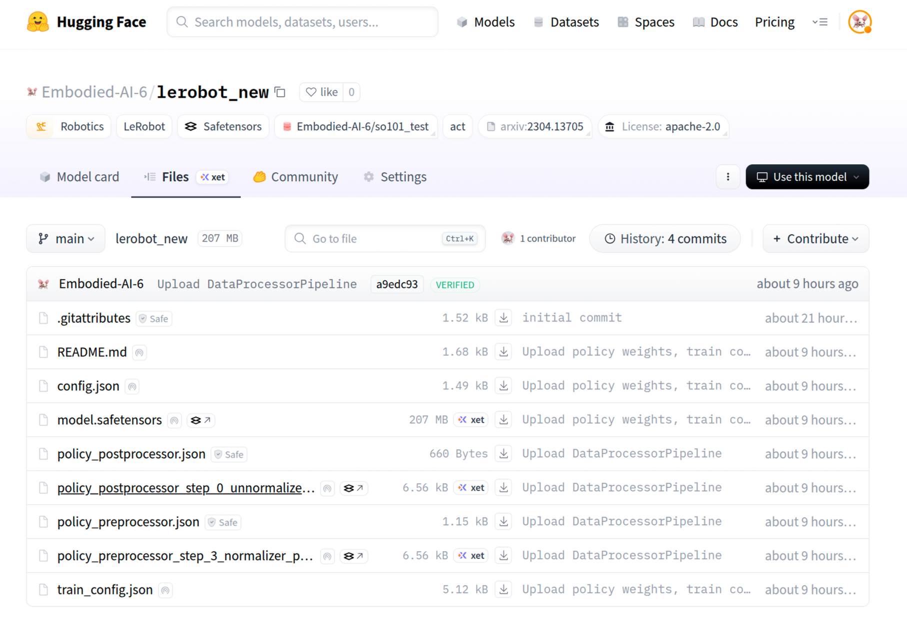

# 7. ACT 模型训练

```bash
lerobot-train \
  --dataset.repo_id="Embodied-AI-6/so101_test" \
  --policy.type=act \
  --output_dir=outputs/train/act_so101_test \
  --job_name=act_so101_test \
  --policy.device=cuda \
  --wandb.enable=false \
  --policy.repo_id="Embodied-AI-6/lerobot_new"
```

参数说明：

- `--dataset.repo_id`：训练数据集仓库。
- `--policy.type=act`：策略模型类型为 ACT。
- `--output_dir`：本地训练输出目录。
- `--job_name`：训练任务名称。
- `--policy.device`：训练设备（如 `cuda`）。
- `--wandb.enable`：是否启用 WandB 可视化。
- `--policy.repo_id`：训练后模型推送目标仓库。


