# 1.强化学习基本认识

## 1.1.什么是强化学习

强化学习有两部分组成：智能体和环境；

监督学习：①输入的数据（标注的数据）都应是没有关联的；②需要我们告诉学习器正确的标签是什么，学习器会根据正确标签来修正自己的预测

强化学习与监督学习的区别:

1.  强化学习输入的样本是序列数据(是时间序列数据)，而不像监督学习里面样本都是独立的
    
2.  学习器并没有告诉我们每一步正确的动作应该是什么，学习器需要自己去发现哪些动作可以带来最多的奖励，只能通过不停地尝试来发现最有利的动作
    
3.  智能体获得自己能力的过程，其实是不断地试错探索（trial-and-error exploration）的过程。探索（exploration）和利用（exploitation）是强化学习里面非常核心的问题。其中，探索指尝试一些新的动作,这些新的动作有可能会使我们得到更多的奖励，也有可能使我们“一无所有”；利用指采取已知的可以获得最多奖励的动作，重复执行这个动作，因为我们知道这样做可以获得一定的奖励。因此，我们需要在探索和利用之间进行权衡，这也是在监督学习里面没有的情况
    
4.  在强化学习过程中，没有非常强的监督者（supervisor），只有 **奖励信号（reward signal）** ，并且奖励信号是延迟的，即环境会在很久以后告诉我们之前我们采取的动作到底是不是有效的。因为我们没有得到即时反馈，所以智能体使用强化学习来学习就非常困难。当我们采取一个动作后，如果我们使用监督学习，我们就可以立刻获得一个指导，比如，我们现在采取了一个错误的动作，正确的动作应该是什么。而在强化学习里面，环境可能会告诉我们这个动作是错误的，但是它并没有告诉我们正确的动作是什么。而且更困难的是，它可能是在一两分钟过后告诉我们这个动作是错误的。所以这也是强化学习和监督学习不同的地方
    

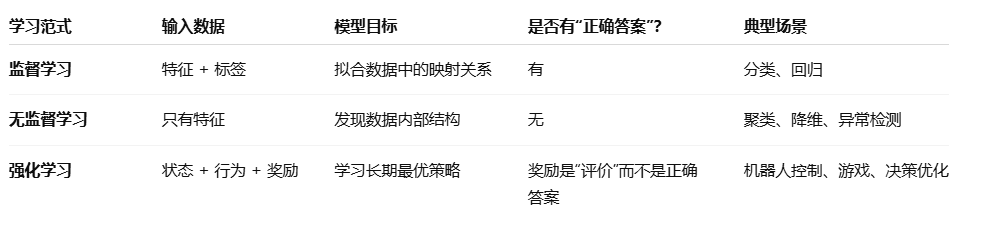

在强化学习过程中，智能体与环境一直在交互。智能体在环境里面获取某个状态后，它会利用该状态输出

一个动作（action），这个动作也称为决策（decision）。然后这个动作会在环境之中被执行，环境会根据智

能体采取的动作，输出下一个状态以及当前这个动作带来的奖励。智能体的目的就是尽可能多地从环境中

获取奖励

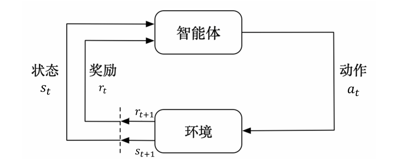

强化学习可以分成标准强化学习和深度强化学习

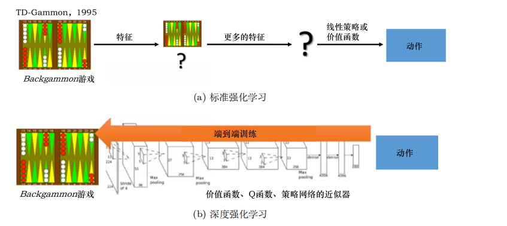

  

标准强化学习需要先设计很多特征，这些特征可以描述现在整个状态。得到这些特征后，我们就可以通过训练一个分类网络或者分别训练一个价值估计函数来采取动作

深度强化学习是一个端到端训练过程，省去了设计特征，直接输入状态就可以输出动作

## 1.2.强化学习应用场景

具身智能、isaaclab中机械臂的仿真任务、无人驾驶等

具身智能中的应用

**Sim2Real（仿真到现实）：** 由于在现实中训练机器人太慢且危险，RL通常在物理仿真环境中让机器人疯狂试错，获得高奖励的策略，然后迁移到现实

RL与VLA结合可以对VLA模型进行微调和自我修正任务

机器人是**躯体**，深度学习是**神经元****网络**，VLA是**通用的行为逻辑**，而强化学习是**教练**

## 1.3.序列决策

### 1.3.1.智能体与环境

强化学习研究的问题是智能体agent与环境交互的问题


agent把动作输出给环境，环境根据agent的动作会把下一步的观测与这个动作带来的奖励还给agent，交互可以产生非常多的观测，agent的目的就是从这些观测中学到最大化奖励的策略

### 1.3.2.奖励

奖励是由环境给的一种标量的反馈信号（scalar feedback signal），这种信号可显示智能体在某一步采

取某个策略的表现如何。强化学习的目的就是**最大化****智能体****可以获得的奖励**，智能体在环境里面存在的目

的就是最大化它的期望的累积奖励（expected cumulative reward）。不同的环境中，奖励也是不同的。

### 1.3.3.序列决策

强化学习里一个重要的课题就是近期奖励和远期奖励的权衡 （trade-off），研究怎么让agent取得更多的远期奖励

在与环境的交互过程中，智能体会获得很多观测。针对每一个观测，智能体会采取一个动作，也会得

到一个奖励。所以历史是观测、动作、奖励的序列：

*Ht* \= *o*1*, a*1*, r*1*, . . . ,* *ot* *, at ,* *rt*

智能体在采取当前动作的时候会依赖于它之前得到的历史，所以我们可以把整个游戏的状态看成关于这个历史的函数：

*st* \= *f* (*Ht*)

环境有自己的函数来更新状态，在智能体的内部也有一个函数来更新状态。当智能体的状态与环境的状态等价的时候，即当智能体能够观察到环境的所有状态时，我们称这个环境是 **完全可观测的（fully observed）** 。在这种情况下面，强化学习通常被建模成一个 **马尔可夫决策过程（Markov decision process，MDP）** 的问题。

当智能体只能看到部分的观测，我们就称这个环境是 **部分可观测的（partially observed）。** 在这种情况下，强化学习通常被建模成 **部分可观测马尔可夫决策过程（partially observable Markov decision process, POMDP）** 的问题。部分可观测马尔可夫决策过程是马尔可夫决策过程的一种泛化。部分可观测马尔可夫决策过程依然具有马尔可夫性质，但是假设智能体无法感知环境的状态，只能知道部分观测值。比如在自动驾驶中，智能体只能感知传感器采集的有限的环境信息。部分可观测马尔可夫决策过程可以用一个七元组描述：(*S, A, T, R, Ω, O, γ*)。

其中 *S* 表示状态空间，为隐变量，*A* 为动作空间，*T*(*s ′ |s, a*) 为状态转移概率，*R* 为奖励函数，*Ω*(*o|s, a*) 为观测概率，*O* 为观测空间，*γ* 为折扣因子。

## 1.4.动作空间

不同的环境允许不同种类的动作。在给定的环境中，有效动作的集合经常被称为 **动作空间** ，动作空间分为:

1.  离散动作空间:在该空间中，智能体的动作数量是有限的
    
2.  连续动作空间：在其他环境，比如在物理世界中控制一个智能体，在这个环境中就有连续动作空间，在连续动作空间中，动作是实值的向量
    

## 1.5.强化学习智能体的组成成分和类型

由策略、价值函数、模型三部分组成

这三者组成马尔可夫决策过程

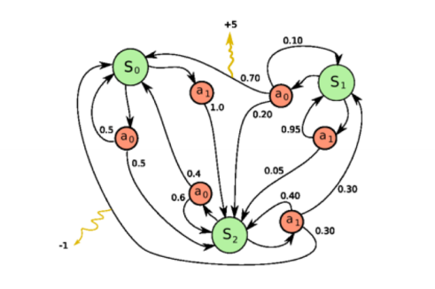

### 1.5.1.策略

策略是智能体的动作模型，它决定了智能体的动作。它其实是一个函数，用于把输入的状态变成动作。

策略可分为两种：

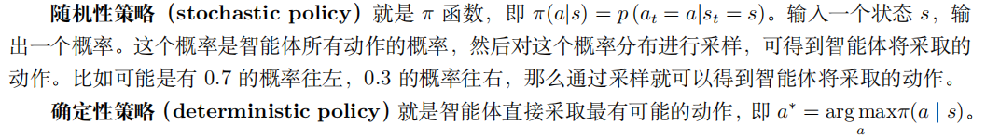

强化学习一般使用的是随机性策略，相比于确定性策略使得agent对同样的状态采用相同的动作，随机性策略动作具有多样性，在智能体博弈时非常重要

### 1.5.2.价值函数

这个函数是对未来奖励的预测-->评估状态的好坏

价值函数中有一个折扣因子，类似于存款利息

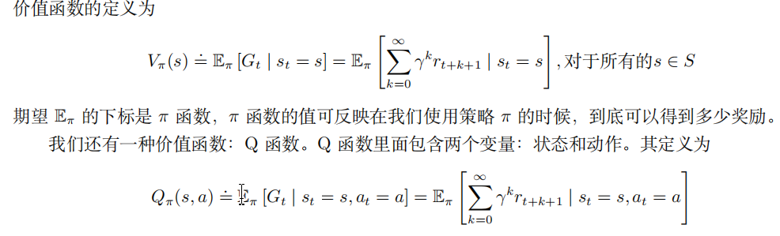

进入某个状态采取的最优动作可以通过Q函数得到

### 1.5.3.模型

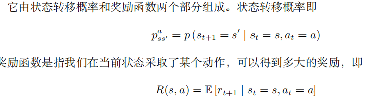

## 1.6.强化学习智能体的类型

| 类型 | 特点 |
|:---|:---|
| **基于价值的智能体** | 显式地学习价值函数，隐式地学习它的策略。 策略是其从学到的价值函数里面推算出来的。 |
| **基于策略的智能体** | 直接学习策略，没有学习价值函数 |
| **演员-评论员智能体** | 基于策略的智能体和基于价值智能体的结合版，将策略和价值都学习了，通过两者的交互得到最佳动作 |
| **有模型强化学习智能体** | 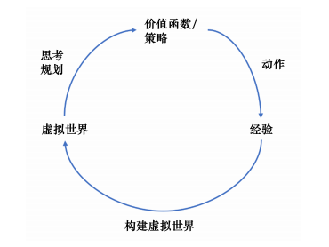 |
| **免模型强化学习智能体** | 没有去直接估计状态的转移，也没有得到环境的具体转移量，它通过学习价值函数和策略函数进行决策，没有环境转移的模型 不对环境建模，直接与真实环境交互学习得到最优策略 |

## 1.7.剩余强化学习概念知识

学习和规划是序列决策的两个基本问题

一个常用的强化学习问题解决思路：先学习环境如何工作，也就是了解环境工作的方式，即学习得到一个模型，然后利用这个模型进行规划

在强化学习里面，探索和利用是两个很核心的问题。探索即我们去探索环境，通过尝试不同的动作来得到最佳的策略（带来最大奖励的策略）。利用即我们不去尝试新的动作，而是采取已知的可以带来很大奖励的动作

强化学习用到的库：Gym

Gym可以检验强化学习算法的优劣

**Gym 库** 是一个环境仿真库，里面包含很多现有的环境。针对不同的场景，我们可以选择不同的环境。离散控制场景一般使用雅达利环境评估；连续控制场景一 般使用 MuJoCo 环境评估

```bash
pip install gym==0.25.2
```

显示图形界面需要

```bash
pip install pygame
```

有关Gym库的相关文档介绍：https://gymnasium.org.cn/introduction/basic\_usage/

## 1.8.一些补充基础概念

强化学习的过程:强化学习中会使用概率密度函数来表示智能体根据当前的状态所作的动作的概率情况，智能体在执行动作之后，此时会得到一个奖励函数，此时会更新智能体的状态

St时刻的奖励函数肯定要比St+1时刻的奖励函数要值钱一些的，因为St时刻的奖励获得后，St+1时刻的奖励不一定就会获得，所以要给未来的奖励打折扣，所以折扣回报如下:

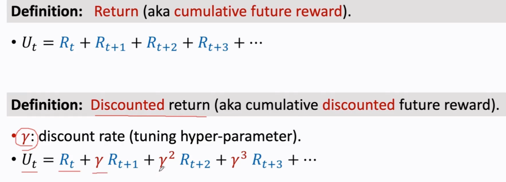

折扣率需要自己来设定

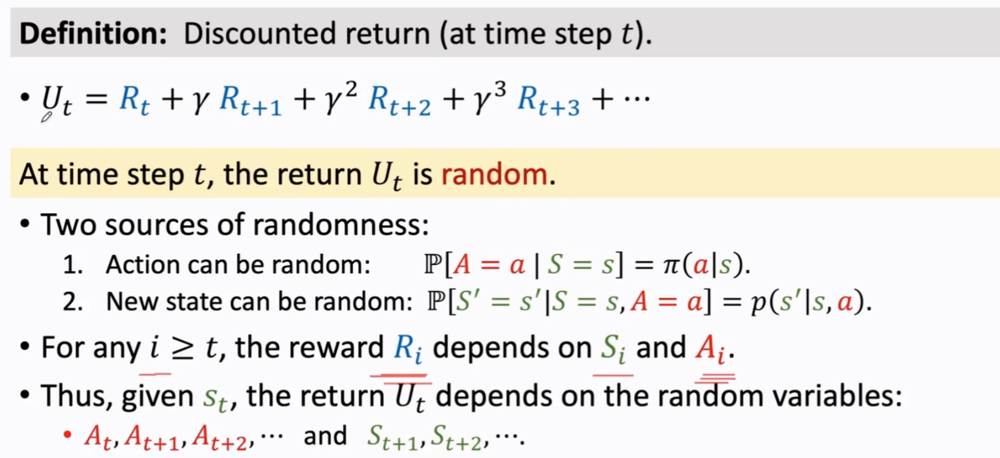

1.  状态转移函数：
    

指的是在状态 s下执行动作a后，环境有多大可能会进入每一个可能的下一个状态s'

例如角色在坐标中运动，得到的信息会是下方这种情况

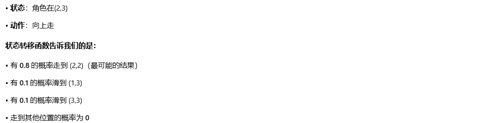

2.  动作价值函数：
    

在t时刻并不知道这个折扣函数Ut是啥，所以可以对Ut求期望，QΠ只依赖于当前的状态St和动作at，动作价值可以反映当前状态St下，智能体做动作at的好坏程度

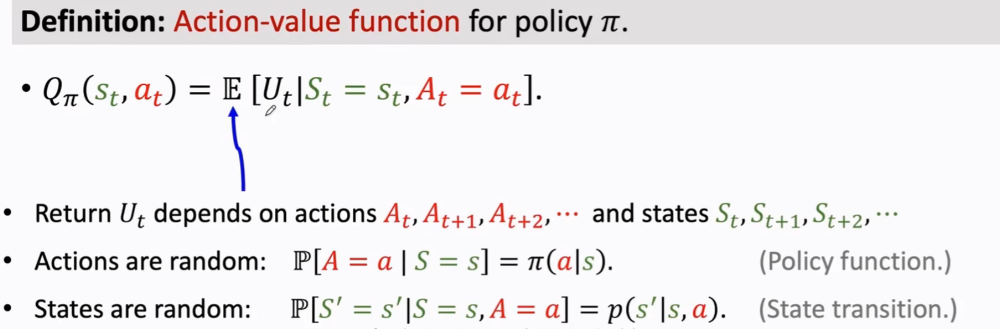

3.  最优动作价值函数：
    

这个函数是对QΠ关于策略Π求最大化，表示不管用什么样的策略函数Π，要使agent在当前状态St下做动作at，回报Ut的期望顶多为Q\*，而且Q\*函数跟策略函数中的Π是无关的，只要agent现在做了动作a，那么Q\*(St,at)就是最好的结果，即使现在你将策略函数Π改进的再好，获得的期望汇报Ut也不可能比Q\*(St,at)更好；Q\*反映了基于当前状态St做出at的好坏程度，也就是说Q\*函数可以指导agent做决策：agent观测当前的状态st，Q\*函数会给所有的动作打分，agent会基于这个分数来做决策，这样期望回报会最大化

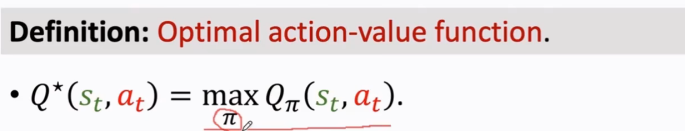

4.  状态价值函数:
    

在遵循某个特定策略 π 的情况下，从状态 s 开始，所能获得的期望折扣回报（平均长期总收益）

它衡量的是“一个具体动作”的长期价值

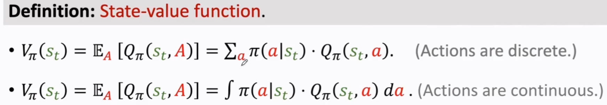

几个价值函数之间的比较：

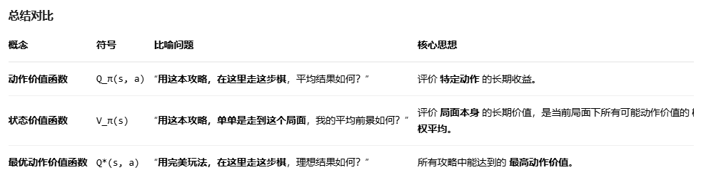