# 4.策略学习

## 4.1.概念描述

用神经网络（策略网络）近似策略函数

策略函数是一个概率密度函数，可以用它来自动控制agent运动，输入是状态s，输出是一个概率分布

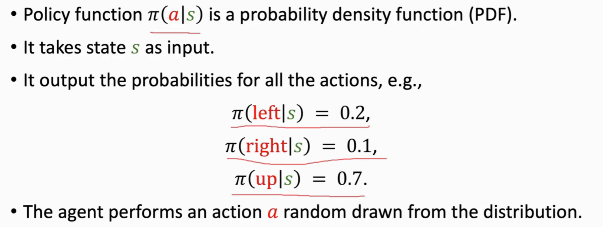

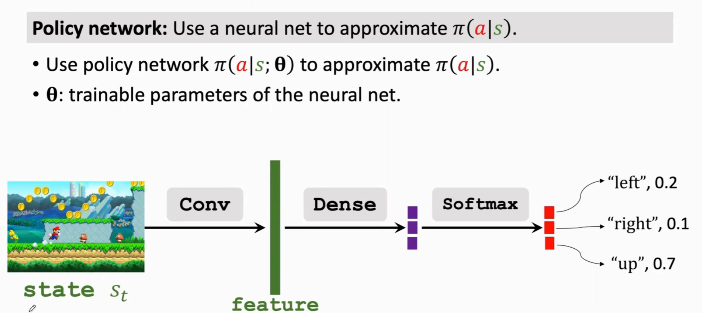

softmax函数这个激活函数可以让输出都为正数，且加和为1，策略函数必须满足如下性质：对于所有可能的动作A，把Π函数的输出全部加起来必须要等于1

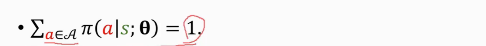

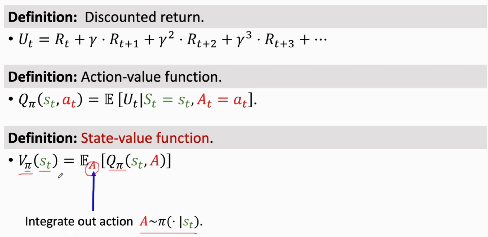

使用神经网络来近似策略函数，这样的话VΠ(St)就变为了VΠ(St,theta)，theta是神经网络中的参数 实现策略网络近似策略函数，V可以评价状态S和策略网络的好坏，给定状态S和策略网络越好，则V值越大

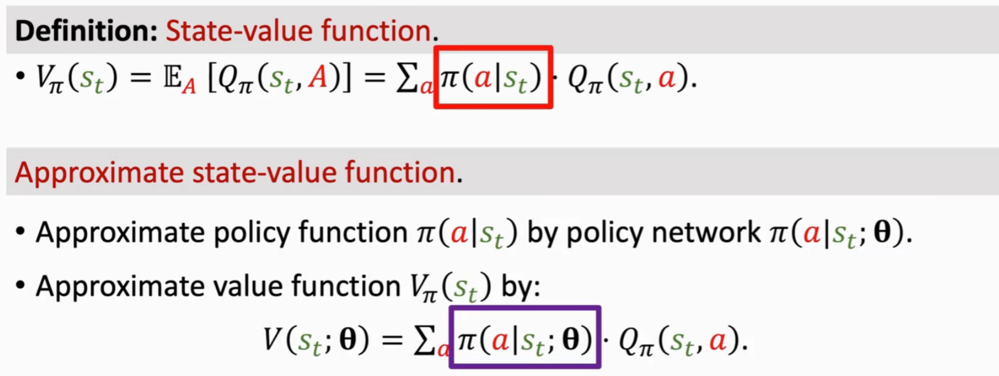

所以关键在于让策略网络变得越来越好：改变模型参数theta，让V(St,theta)变大，基于此我们可以把目标函数定义为V(St,theta)的期望J(theta)，这个期望是关于状态s来求解的，将状态S作为随机变量用期望的形式将其去掉，这样就只剩theta--->J(theta)就是对策略网络的评价（策略网络i越好，J(theta)就越大）

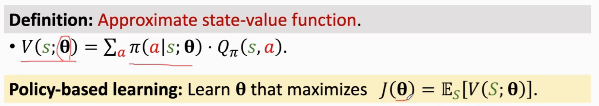

改进theta要用到策略梯度算法

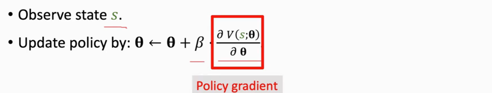

这里采用梯度上升的形式实现theta更新(我们希望theta变大以提高J值)

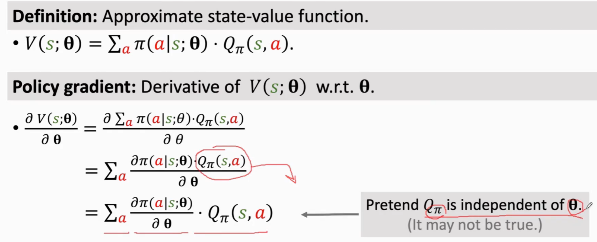

假设QΠ(s,a)不依赖于theta，不影响最后结果的，即使QΠ是theta的导数最终结果也依然是如下的结果

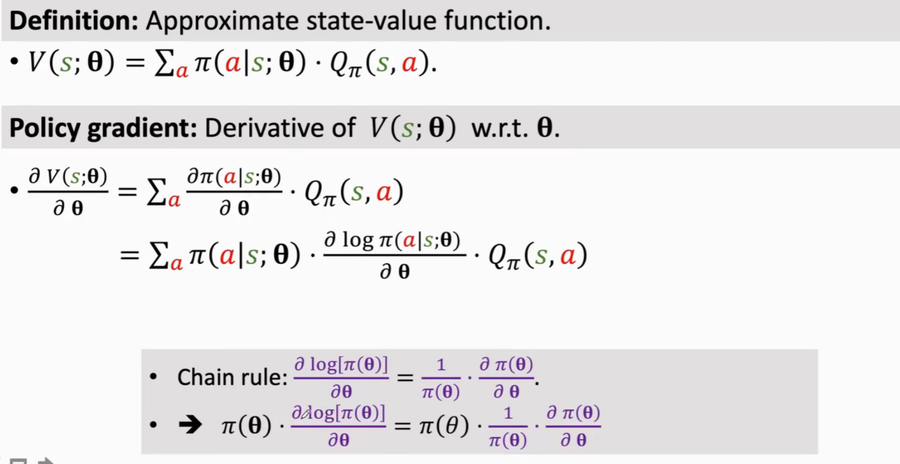

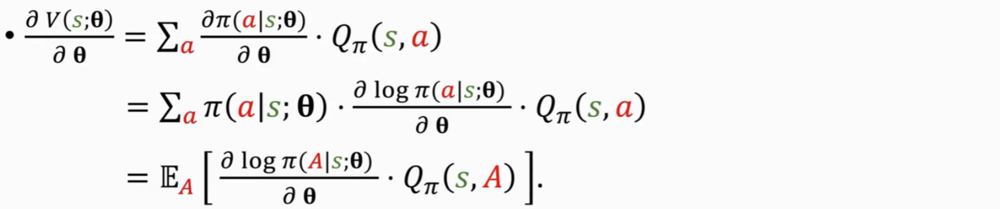

梯度公式总结：

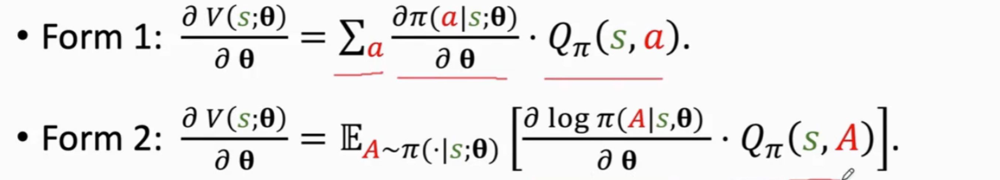

两个公式的分别应用场景：

对于离散的动作：

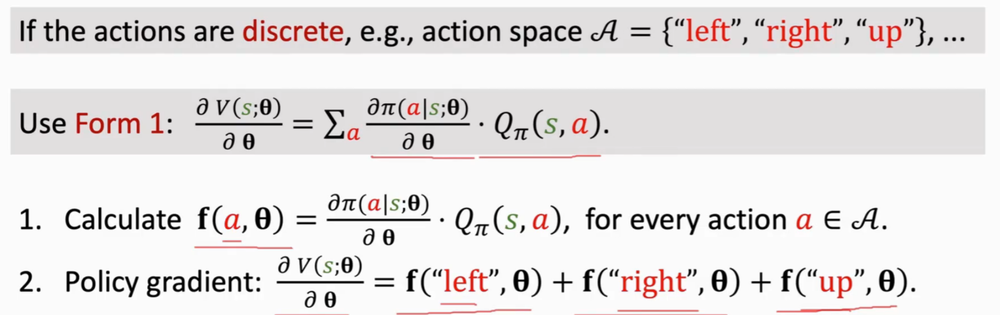

对于连续的动作：

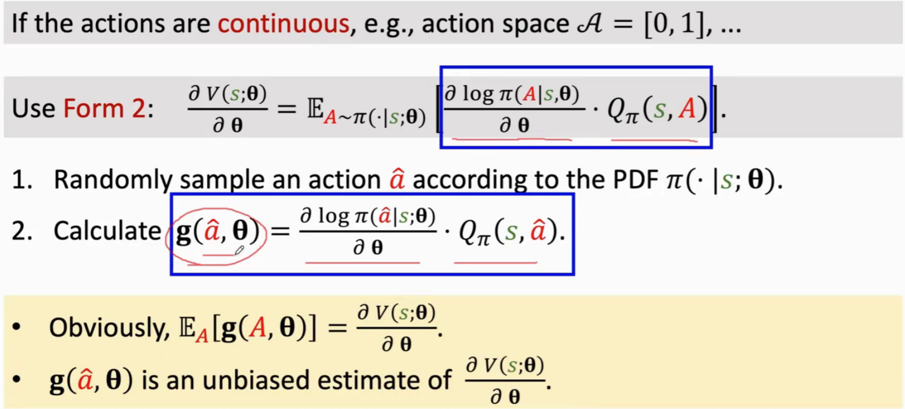

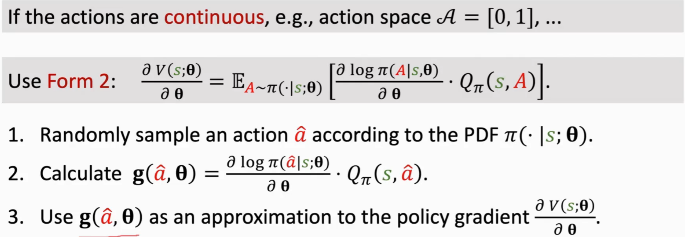

## 4.2.概率梯度算法总结

使用蒙特卡洛来近似计算策略梯度

蒙特卡洛法的解释如下：

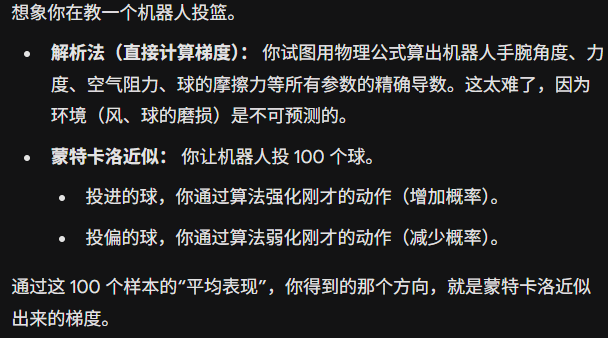

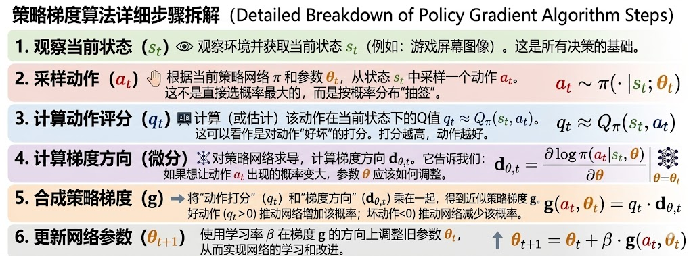

但是现在存在一个问题，并不知道动作价值函数的值(QΠ(St,at))，可以通过如下两个办法来近似qt

1.  方法一：reinforce算法
    

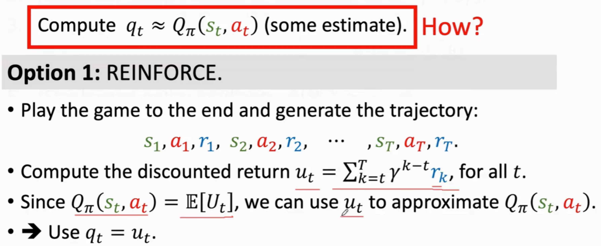

用策略网络来控制agent的运动，从一开始到玩到游戏结束，把整个游戏的轨迹都记录下来了，观测到所有的奖励R，我们可以算出折扣汇报Ut，由于价值函数QΠ(St,at)是大于Ut的期望，所以可以用Ut的观测值ut来近似QΠ，这个REINFORCE算法就是用观测到的ut来代替QΠ函数，这个算法需要玩完一局游戏，观测到所有的奖励，然后才可以更新策略网络

2.  方法二：actor-critic算法
    

这一方法是用一个神经网络来做函数近似QΠ，这样加上之前用神经网络近似的策略函数Π，总共有两个神经网络，一个被称为actor，一个被称为critic，这个方法就是actor-critic方法，这个方法将策略学习与价值学习结合起来（策略网络用来控制agent的运动，可以将策略网络理解为体操运动员，要做一连串的动作；价值网络用来评价动作的好坏，可以将价值网络理解为裁判或评委，给运动员动作打分；终极目标是训练这个策略函数Π，也就是这个运动员，价值网络作为裁判起辅助作用，最后训好就不再用了）

两个网络的构建：

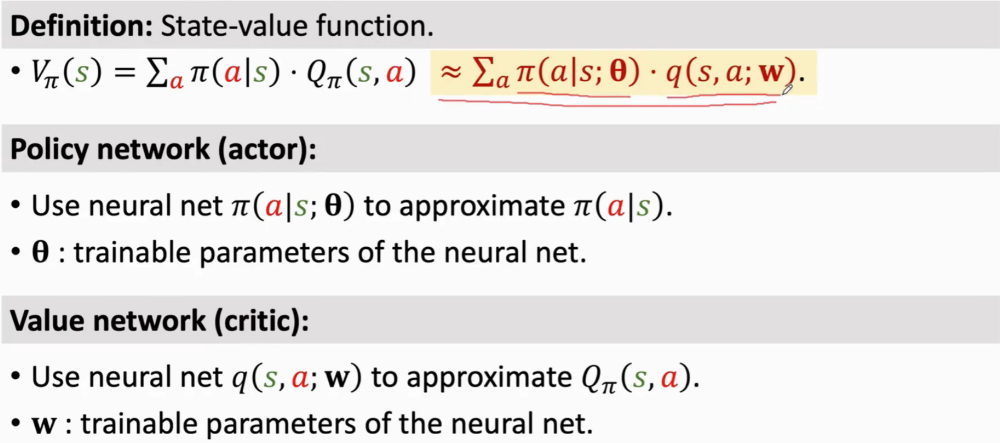

actor网路：

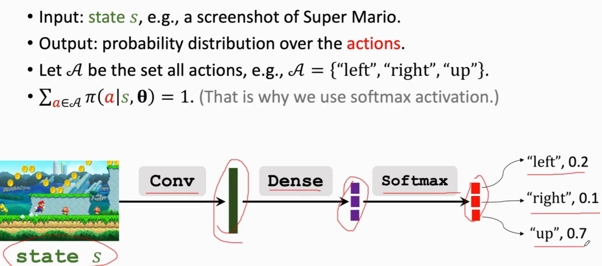

critic网络

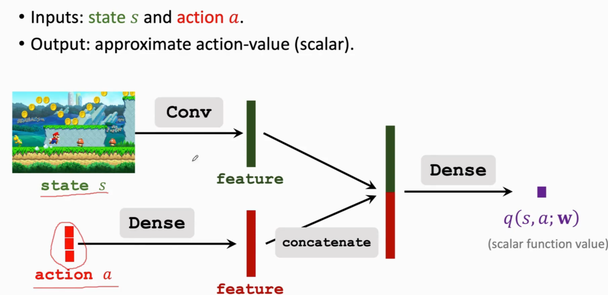

3.  网络的训练
    

网络描述

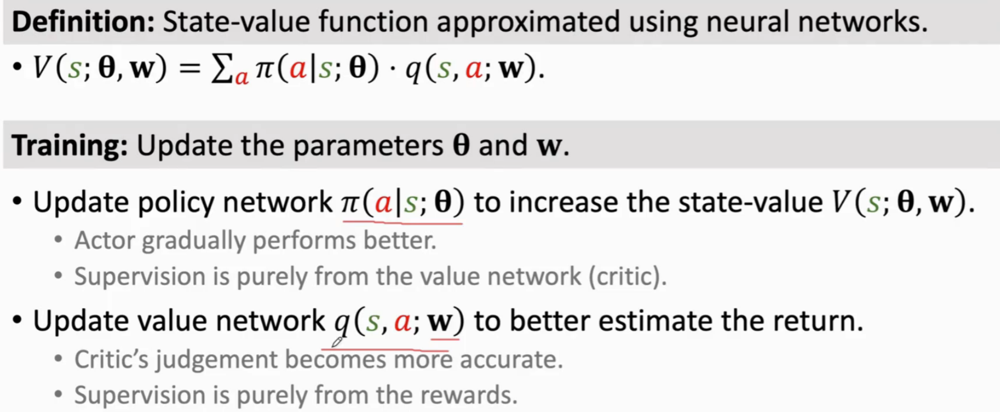

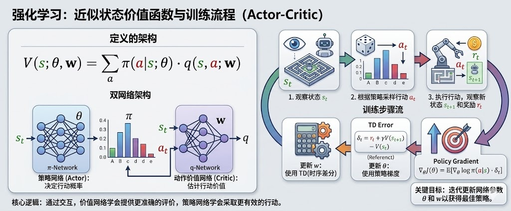

TD算法更新梯度：

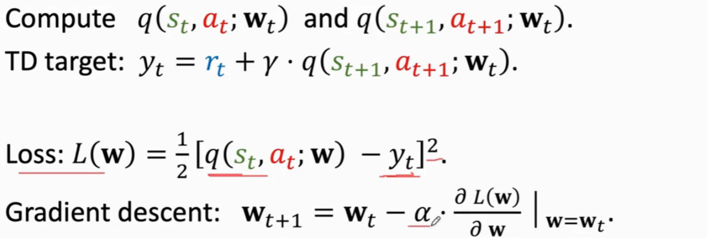

策略网络更新梯度：

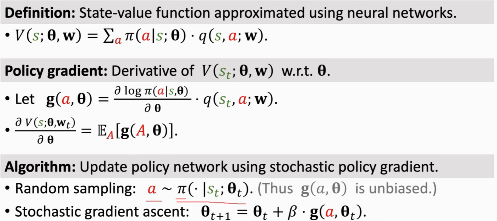

训练整个流程的具体描述：

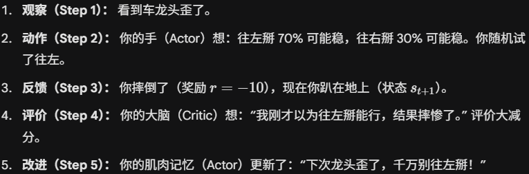
4.  算法步骤总结：
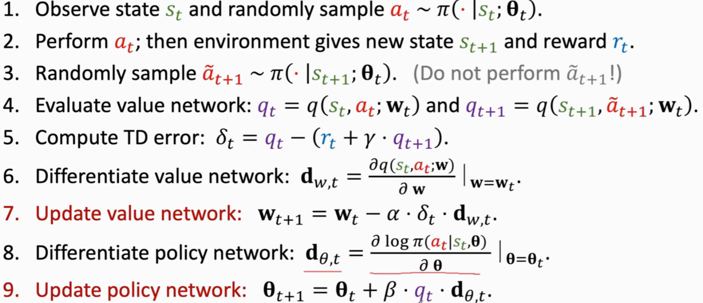